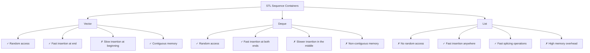

# C++ Deque

## Introduction

A deque (pronounced "deck") is a dynamic array-like container in the C++ Standard Template Library (STL) that stands for **Double-Ended Queue**. Unlike a vector which allows efficient insertion and deletion only at the end, a deque supports efficient insertion and deletion at both the beginning and the end of the container.

Think of a deque as a sequence container that combines the best features of arrays (random access) and linked lists (efficient insertion/deletion at both ends). It provides a more flexible alternative to vectors when you need to frequently add or remove elements from either end of the sequence.

## Basic Properties of Deque

- **Dynamic size**: Automatically expands or contracts as needed
- **Random access**: Elements can be accessed directly using the `[]` operator, similar to arrays and vectors
- **Efficient insertions/deletions**: O(1) time complexity at both ends
- **Non-contiguous memory**: Unlike vectors, deque elements may not be stored in contiguous memory

## Including the Deque Header

To use a deque in your C++ program, you need to include the `<deque>` header:

```cpp
#include <deque>
```

## Declaring a Deque

Here are common ways to declare and initialize a deque:

```cpp
// Empty deque of integers
std::deque<int> dq1;

// Deque with 5 elements, each initialized to 10
std::deque<int> dq2(5, 10);

// Initialization using an initializer list
std::deque<int> dq3 = {1, 2, 3, 4, 5};

// Copy constructor
std::deque<int> dq4(dq3);
```

## Basic Operations on Deque

### Adding Elements

Deques support insertion at both ends efficiently:

```cpp
#include <iostream>
#include <deque>

int main() {
    std::deque<int> dq;
    
    // Add elements at the end (similar to vector)
    dq.push_back(10);
    dq.push_back(20);
    
    // Add elements at the beginning (not efficient with vector)
    dq.push_front(5);
    dq.push_front(1);
    
    // Current deque: [1, 5, 10, 20]
    
    // Using emplace operations for in-place construction
    dq.emplace_back(30);   // More efficient than push_back
    dq.emplace_front(0);   // More efficient than push_front
    
    // Current deque: [0, 1, 5, 10, 20, 30]
    
    std::cout << "Deque contents: ";
    for (const auto& element : dq) {
        std::cout << element << " ";
    }
    std::cout << std::endl;
    
    return 0;
}
```

**Output:**
```
Deque contents: 0 1 5 10 20 30 
```

### Removing Elements

```cpp
#include <iostream>
#include <deque>

int main() {
    std::deque<int> dq = {1, 2, 3, 4, 5};
    
    // Remove from the front
    dq.pop_front();
    
    // Remove from the back
    dq.pop_back();
    
    std::cout << "After removing first and last elements: ";
    for (const auto& element : dq) {
        std::cout << element << " ";
    }
    std::cout << std::endl;
    
    return 0;
}
```

**Output:**
```
After removing first and last elements: 2 3 4 
```

### Accessing Elements

```cpp
#include <iostream>
#include <deque>

int main() {
    std::deque<int> dq = {10, 20, 30, 40, 50};
    
    // Accessing elements using index (similar to vector and array)
    std::cout << "Element at index 2: " << dq[2] << std::endl;
    
    // Using at() with bounds checking
    std::cout << "Element at index 3: " << dq.at(3) << std::endl;
    
    // Accessing first and last elements
    std::cout << "First element: " << dq.front() << std::endl;
    std::cout << "Last element: " << dq.back() << std::endl;
    
    return 0;
}
```

**Output:**
```
Element at index 2: 30
Element at index 3: 40
First element: 10
Last element: 50
```

### Size and Capacity

```cpp
#include <iostream>
#include <deque>

int main() {
    std::deque<int> dq = {1, 2, 3, 4, 5};
    
    std::cout << "Size: " << dq.size() << std::endl;
    std::cout << "Is empty? " << (dq.empty() ? "Yes" : "No") << std::endl;
    
    // Clear all elements
    dq.clear();
    std::cout << "After clear, size: " << dq.size() << std::endl;
    std::cout << "Is empty? " << (dq.empty() ? "Yes" : "No") << std::endl;
    
    return 0;
}
```

**Output:**
```
Size: 5
Is empty? No
After clear, size: 0
Is empty? Yes
```

## Iterator Operations

Deques support iterators similar to other STL containers:

```cpp
#include <iostream>
#include <deque>
#include <algorithm>

int main() {
    std::deque<int> dq = {3, 1, 4, 1, 5, 9};
    
    // Sorting the deque
    std::sort(dq.begin(), dq.end());
    
    std::cout << "Sorted deque: ";
    for (auto it = dq.begin(); it != dq.end(); ++it) {
        std::cout << *it << " ";
    }
    std::cout << std::endl;
    
    // Reverse iteration
    std::cout << "Reverse order: ";
    for (auto it = dq.rbegin(); it != dq.rend(); ++it) {
        std::cout << *it << " ";
    }
    std::cout << std::endl;
    
    return 0;
}
```

**Output:**
```
Sorted deque: 1 1 3 4 5 9 
Reverse order: 9 5 4 3 1 1 
```

## Inserting and Erasing Elements

Deques allow insertion and deletion at any position, though these operations are most efficient at the ends:

```cpp
#include <iostream>
#include <deque>

int main() {
    std::deque<int> dq = {10, 20, 40, 50};
    
    // Insert 30 at the position before 40
    auto it = dq.begin() + 2;  // Points to 40
    dq.insert(it, 30);
    
    std::cout << "After inserting 30: ";
    for (const auto& element : dq) {
        std::cout << element << " ";
    }
    std::cout << std::endl;
    
    // Erase 20 from the deque
    it = dq.begin() + 1;  // Points to 20
    dq.erase(it);
    
    std::cout << "After erasing 20: ";
    for (const auto& element : dq) {
        std::cout << element << " ";
    }
    std::cout << std::endl;
    
    return 0;
}
```

**Output:**
```
After inserting 30: 10 20 30 40 50 
After erasing 20: 10 30 40 50 
```

## Deque vs. Vector vs. List

Here's how deque compares to other common STL containers:



| Feature | Deque | Vector | List |
|---------|-------|--------|------|
| Random access | O(1) | O(1) | O(n) |
| Insert/delete at beginning | O(1) | O(n) | O(1) |
| Insert/delete at end | O(1) | O(1) | O(1) |
| Insert/delete in middle | O(n) | O(n) | O(1) + traversal |
| Memory layout | Blocks | Contiguous | Non-contiguous |
| Memory overhead | Moderate | Low | High |

## Practical Applications of Deque

### 1. Sliding Window Problems

Deques are excellent for implementing sliding window algorithms in problems where you need to maintain a window of elements as you process data.

```cpp
#include <iostream>
#include <deque>
#include <vector>

// Function to find maximum element in all sliding windows of size k
std::vector<int> maxSlidingWindow(const std::vector<int>& nums, int k) {
    std::vector<int> result;
    std::deque<int> dq;  // Will store indices of elements
    
    for (int i = 0; i < nums.size(); i++) {
        // Remove elements outside the current window
        while (!dq.empty() && dq.front() < i - k + 1) {
            dq.pop_front();
        }
        
        // Remove smaller elements as they won't be the maximum
        while (!dq.empty() && nums[dq.back()] < nums[i]) {
            dq.pop_back();
        }
        
        // Add current element's index
        dq.push_back(i);
        
        // Add to result if we've reached window size
        if (i >= k - 1) {
            result.push_back(nums[dq.front()]);
        }
    }
    
    return result;
}

int main() {
    std::vector<int> nums = {1, 3, -1, -3, 5, 3, 6, 7};
    int k = 3;
    
    std::vector<int> maxValues = maxSlidingWindow(nums, k);
    
    std::cout << "Maximum values in sliding windows of size " << k << ":" << std::endl;
    for (int val : maxValues) {
        std::cout << val << " ";
    }
    std::cout << std::endl;
    
    return 0;
}
```

**Output:**
```
Maximum values in sliding windows of size 3:
3 3 5 5 6 7 
```

### 2. Browser History Implementation

A deque can be used to implement a browser's history functionality, where you can navigate backward and forward:

```cpp
#include <iostream>
#include <deque>
#include <string>

class BrowserHistory {
private:
    std::deque<std::string> history;
    int currentPosition;
    
public:
    BrowserHistory(const std::string& homepage) {
        history.push_back(homepage);
        currentPosition = 0;
    }
    
    void visit(const std::string& url) {
        // Remove all forward history
        while (history.size() > currentPosition + 1) {
            history.pop_back();
        }
        
        history.push_back(url);
        currentPosition++;
    }
    
    std::string back(int steps) {
        int actualSteps = std::min(steps, currentPosition);
        currentPosition -= actualSteps;
        return history[currentPosition];
    }
    
    std::string forward(int steps) {
        int actualSteps = std::min(steps, (int)history.size() - currentPosition - 1);
        currentPosition += actualSteps;
        return history[currentPosition];
    }
    
    void printHistory() {
        std::cout << "Browser History: ";
        for (size_t i = 0; i < history.size(); i++) {
            if (i == currentPosition) {
                std::cout << "[" << history[i] << "] ";
            } else {
                std::cout << history[i] << " ";
            }
        }
        std::cout << std::endl;
    }
};

int main() {
    BrowserHistory browser("google.com");
    browser.printHistory();
    
    browser.visit("youtube.com");
    browser.visit("facebook.com");
    browser.visit("instagram.com");
    browser.printHistory();
    
    std::cout << "Going back 1: " << browser.back(1) << std::endl;
    browser.printHistory();
    
    std::cout << "Going back 1 more: " << browser.back(1) << std::endl;
    browser.printHistory();
    
    std::cout << "Going forward 1: " << browser.forward(1) << std::endl;
    browser.printHistory();
    
    browser.visit("twitter.com");
    browser.printHistory();
    
    std::cout << "Going back 2: " << browser.back(2) << std::endl;
    browser.printHistory();
    
    return 0;
}
```

**Output:**
```
Browser History: [google.com] 
Browser History: google.com youtube.com facebook.com [instagram.com] 
Going back 1: facebook.com
Browser History: google.com youtube.com [facebook.com] instagram.com 
Going back 1 more: youtube.com
Browser History: google.com [youtube.com] facebook.com instagram.com 
Going forward 1: facebook.com
Browser History: google.com youtube.com [facebook.com] instagram.com 
Browser History: google.com youtube.com [twitter.com] 
Going back 2: google.com
Browser History: [google.com] youtube.com twitter.com 
```

### 3. Task Scheduler with Priorities

Deques can be used to implement a task scheduler where tasks can be added both at the beginning (high priority) and end (low priority):

```cpp
#include <iostream>
#include <deque>
#include <string>

class TaskScheduler {
private:
    std::deque<std::string> tasks;
    
public:
    // Add a high priority task (at the front)
    void addHighPriorityTask(const std::string& task) {
        tasks.push_front(task);
        std::cout << "Added high priority task: " << task << std::endl;
    }
    
    // Add a normal priority task (at the back)
    void addNormalPriorityTask(const std::string& task) {
        tasks.push_back(task);
        std::cout << "Added normal priority task: " << task << std::endl;
    }
    
    // Execute the next task
    void executeNextTask() {
        if (tasks.empty()) {
            std::cout << "No tasks to execute!" << std::endl;
            return;
        }
        
        std::string task = tasks.front();
        tasks.pop_front();
        std::cout << "Executing task: " << task << std::endl;
    }
    
    // List all pending tasks
    void listTasks() {
        if (tasks.empty()) {
            std::cout << "No pending tasks." << std::endl;
            return;
        }
        
        std::cout << "Pending tasks (in order of execution):" << std::endl;
        for (size_t i = 0; i < tasks.size(); i++) {
            std::cout << i + 1 << ". " << tasks[i] << std::endl;
        }
    }
    
    // Get number of pending tasks
    size_t pendingTaskCount() {
        return tasks.size();
    }
};

int main() {
    TaskScheduler scheduler;
    
    // Add some normal priority tasks
    scheduler.addNormalPriorityTask("Check emails");
    scheduler.addNormalPriorityTask("Update documentation");
    scheduler.addNormalPriorityTask("Weekly report");
    
    std::cout << "\nCurrent tasks:\n";
    scheduler.listTasks();
    
    // Add an urgent task
    std::cout << "\nUrgent issue came up!\n";
    scheduler.addHighPriorityTask("Fix server crash");
    
    std::cout << "\nUpdated tasks:\n";
    scheduler.listTasks();
    
    // Execute tasks
    std::cout << "\nExecuting tasks:\n";
    while (scheduler.pendingTaskCount() > 0) {
        scheduler.executeNextTask();
    }
    
    return 0;
}
```

**Output:**
```
Added normal priority task: Check emails
Added normal priority task: Update documentation
Added normal priority task: Weekly report

Current tasks:
Pending tasks (in order of execution):
1. Check emails
2. Update documentation
3. Weekly report

Urgent issue came up!
Added high priority task: Fix server crash

Updated tasks:
Pending tasks (in order of execution):
1. Fix server crash
2. Check emails
3. Update documentation
4. Weekly report

Executing tasks:
Executing task: Fix server crash
Executing task: Check emails
Executing task: Update documentation
Executing task: Weekly report
```

## Performance Considerations

When deciding whether to use a deque, keep these performance aspects in mind:

1. **Memory allocation**: Deques typically use multiple chunks of memory rather than a single contiguous block like vectors. This makes them more efficient for growth but can introduce some overhead.

2. **Cache coherence**: Because elements are not stored contiguously, deques may have worse cache performance than vectors for operations that iterate through elements.

3. **Insertion/deletion complexity**:
   - At both ends: O(1)
   - In the middle: O(n)

4. **Use deque when**:
   - You need efficient insertions/deletions at both ends
   - You need random access
   - Memory reallocation would be too expensive with a vector

5. **Use vector instead when**:
   - You primarily need insertions at the end only
   - Memory locality is important (e.g., for performance-critical loops)
   - You need to guarantee contiguous memory

## Summary

The C++ STL deque (double-ended queue) is a versatile container that provides:

- Fast O(1) insertion and deletion at both ends
- Random access to elements with O(1) complexity
- Dynamic resizing without the need to relocate all elements
- A good balance between random access and efficient insertion/deletion

Deques are ideal when you need the flexibility of adding and removing elements from both ends efficiently, making them suitable for implementing algorithms like sliding windows, browser history, or task schedulers.

## Exercises

1. **Basic Deque Operations**: Implement a program that reads a list of integers and allows the user to perform basic deque operations (push_front, push_back, pop_front, pop_back).

2. **Palindrome Checker**: Use a deque to check if a given string is a palindrome (reads the same forwards and backwards).

3. **Queue Implementation**: Implement a queue data structure using a deque as the underlying container.

4. **Undo/Redo Functionality**: Implement a simple text editor that allows adding text and supports undo/redo operations using two deques.

5. **Circular Buffer**: Implement a circular buffer with a fixed capacity using a deque that automatically removes the oldest element when the buffer is full.

## Additional Resources

- [C++ Reference: std::deque](https://en.cppreference.com/w/cpp/container/deque)
- [C++ Standard Library: A Tutorial and Reference](https://www.amazon.com/Standard-Library-Tutorial-Reference-2nd/dp/0321623215) by Nicolai M. Josuttis
- [Effective STL](https://www.amazon.com/Effective-STL-Specific-Standard-Template/dp/0201749629) by Scott Meyers