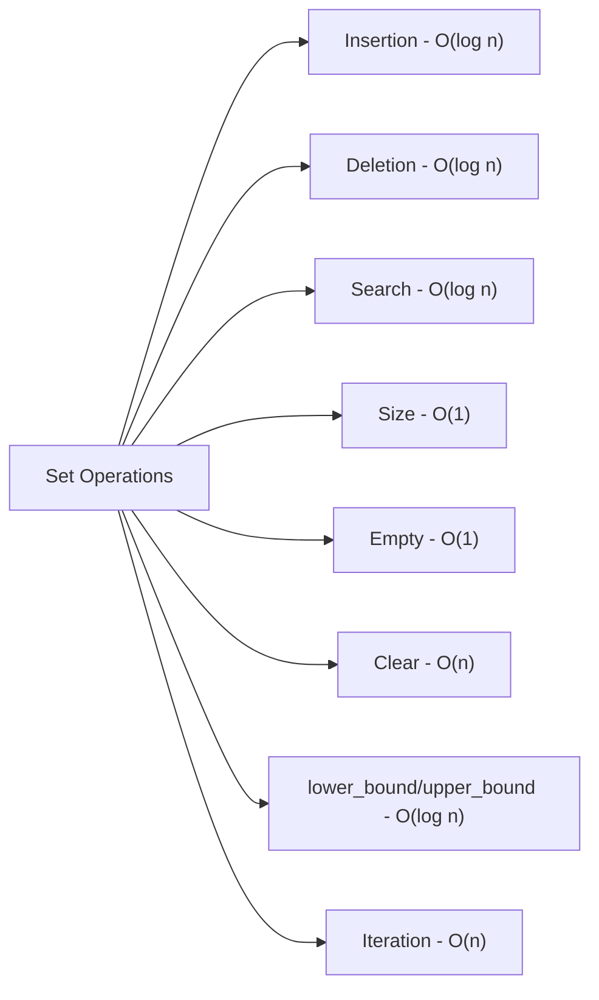

# C++ Set

## Introduction

A `set` is a container provided by the C++ Standard Template Library (STL) that stores unique elements in a specific order. Unlike other containers like vectors or arrays, sets automatically handle uniqueness - they automatically eliminate duplicate values and maintain their elements in a sorted order.

Sets in C++ are typically implemented as balanced binary search trees (usually red-black trees), which provides several advantages:

- Elements are always stored in sorted order
- Operations like insertion, deletion, and search have logarithmic time complexity (O(log n))
- Each element can appear only once (uniqueness is guaranteed)

Let's dive into how to use sets in your C++ programs!

## Including the Set Library

To use sets in your C++ program, you need to include the `<set>` header file:

```cpp
#include <set>
```

## Creating and Initializing Sets

Here are various ways to create and initialize a set:

```cpp
#include <iostream>
#include <set>

int main() {
    // Empty set of integers
    std::set<int> numbers;
    
    // Initialize with values
    std::set<int> primeNumbers = {2, 3, 5, 7, 11, 13};
    
    // Duplicate values are automatically eliminated
    std::set<char> letters = {'a', 'b', 'c', 'a', 'b'};
    
    // Output: a b c (each letter appears only once)
    for(char c : letters) {
        std::cout << c << " ";
    }
    std::cout << std::endl;
    
    return 0;
}
```

**Output:**
```
a b c
```

## Basic Set Operations

Let's explore the basic operations you can perform with sets.

### Inserting Elements

You can add elements to a set using the `insert()` method:

```cpp
#include <iostream>
#include <set>

int main() {
    std::set<int> numbers;
    
    // Insert elements
    numbers.insert(30);
    numbers.insert(10);
    numbers.insert(20);
    numbers.insert(10); // Duplicate won't be inserted
    
    // Print the set (will be sorted: 10, 20, 30)
    for(int num : numbers) {
        std::cout << num << " ";
    }
    std::cout << std::endl;
    
    // Insert returns a pair: the iterator to the element and a boolean
    // indicating whether insertion took place
    auto result = numbers.insert(40);
    std::cout << "Element inserted: " << *(result.first) << std::endl;
    std::cout << "Insertion successful: " << (result.second ? "Yes" : "No") << std::endl;
    
    // Try inserting a duplicate
    result = numbers.insert(20);
    std::cout << "Element inserted: " << *(result.first) << std::endl;
    std::cout << "Insertion successful: " << (result.second ? "Yes" : "No") << std::endl;
    
    return 0;
}
```

**Output:**
```
10 20 30
Element inserted: 40
Insertion successful: Yes
Element inserted: 20
Insertion successful: No
```

### Finding Elements

To search for an element in a set, use the `find()` method:

```cpp
#include <iostream>
#include <set>

int main() {
    std::set<int> numbers = {10, 20, 30, 40, 50};
    
    // Find an element
    auto it = numbers.find(30);
    
    if(it != numbers.end()) {
        std::cout << "Element " << *it << " found in the set" << std::endl;
    } else {
        std::cout << "Element not found in the set" << std::endl;
    }
    
    // Try to find an element that doesn't exist
    it = numbers.find(60);
    
    if(it != numbers.end()) {
        std::cout << "Element " << *it << " found in the set" << std::endl;
    } else {
        std::cout << "Element 60 not found in the set" << std::endl;
    }
    
    return 0;
}
```

**Output:**
```
Element 30 found in the set
Element 60 not found in the set
```

### Erasing Elements

You can remove elements from a set using the `erase()` method:

```cpp
#include <iostream>
#include <set>

int main() {
    std::set<int> numbers = {10, 20, 30, 40, 50};
    
    // Erase by value
    int count = numbers.erase(30);
    std::cout << "Erased " << count << " element(s)" << std::endl;
    
    // Try to erase a non-existent element
    count = numbers.erase(100);
    std::cout << "Erased " << count << " element(s)" << std::endl;
    
    // Erase by iterator
    auto it = numbers.find(40);
    if(it != numbers.end()) {
        numbers.erase(it);
        std::cout << "Erased element using iterator" << std::endl;
    }
    
    // Print the set after erasing elements
    std::cout << "Set after erasures: ";
    for(int num : numbers) {
        std::cout << num << " ";
    }
    std::cout << std::endl;
    
    return 0;
}
```

**Output:**
```
Erased 1 element(s)
Erased 0 element(s)
Erased element using iterator
Set after erasures: 10 20 50
```

## Other Useful Set Operations

### Size and Empty Check

```cpp
#include <iostream>
#include <set>

int main() {
    std::set<int> numbers = {10, 20, 30, 40};
    
    // Check if set is empty
    if(numbers.empty()) {
        std::cout << "Set is empty" << std::endl;
    } else {
        std::cout << "Set has " << numbers.size() << " elements" << std::endl;
    }
    
    // Clear the set
    numbers.clear();
    std::cout << "After clearing, set has " << numbers.size() << " elements" << std::endl;
    
    return 0;
}
```

**Output:**
```
Set has 4 elements
After clearing, set has 0 elements
```

### Range-based Operations

```cpp
#include <iostream>
#include <set>

int main() {
    std::set<int> numbers = {10, 20, 30, 40, 50, 60, 70};
    
    // Find lower_bound and upper_bound
    auto lower = numbers.lower_bound(30); // Points to 30
    auto upper = numbers.upper_bound(50); // Points to 60
    
    std::cout << "lower_bound(30): " << *lower << std::endl;
    std::cout << "upper_bound(50): " << *upper << std::endl;
    
    // Equal range returns a pair of iterators (same as lower_bound and upper_bound)
    auto range = numbers.equal_range(40);
    std::cout << "equal_range(40) - first: " << *(range.first) << ", second: " << *(range.second) << std::endl;
    
    // We can use these bounds to erase a range
    numbers.erase(lower, upper); // Erases 30, 40, 50
    
    std::cout << "After erasing range: ";
    for(int num : numbers) {
        std::cout << num << " ";
    }
    std::cout << std::endl;
    
    return 0;
}
```

**Output:**
```
lower_bound(30): 30
upper_bound(50): 60
equal_range(40) - first: 40, second: 50
After erasing range: 10 20 60 70
```

## Custom Comparators

By default, sets order elements using the `<` operator (std::less). You can provide your own comparator to change this behavior:

```cpp
#include <iostream>
#include <set>
#include <string>

// Custom comparator for descending order
struct DescendingOrder {
    bool operator()(int a, int b) const {
        return a > b; // Notice the > instead of <
    }
};

// Custom comparator for case-insensitive string comparison
struct CaseInsensitiveCompare {
    bool operator()(const std::string& a, const std::string& b) const {
        std::string a_lower = a, b_lower = b;
        
        // Convert to lowercase
        for(char &c : a_lower) c = std::tolower(c);
        for(char &c : b_lower) c = std::tolower(c);
        
        return a_lower < b_lower;
    }
};

int main() {
    // Set with custom comparator for descending order
    std::set<int, DescendingOrder> descendingSet = {10, 30, 20, 50, 40};
    
    std::cout << "Descending order set: ";
    for(int num : descendingSet) {
        std::cout << num << " ";
    }
    std::cout << std::endl;
    
    // Set with case-insensitive comparison
    std::set<std::string, CaseInsensitiveCompare> caseInsensitiveSet = {
        "Apple", "banana", "Cherry", "date", "APPLE"
    };
    
    std::cout << "Case-insensitive set: ";
    for(const auto& fruit : caseInsensitiveSet) {
        std::cout << fruit << " ";
    }
    std::cout << std::endl;
    
    return 0;
}
```

**Output:**
```
Descending order set: 50 40 30 20 10
Case-insensitive set: Apple banana Cherry date
```

Notice in the case-insensitive set, "APPLE" wasn't included because it's considered the same as "Apple" when ignoring case.

## Set Operations on Sets

We can perform mathematical set operations like union, intersection, and difference:

```cpp
#include <iostream>
#include <set>
#include <algorithm>

void printSet(const std::set<int>& s, const std::string& name) {
    std::cout << name << ": ";
    for(int num : s) {
        std::cout << num << " ";
    }
    std::cout << std::endl;
}

int main() {
    std::set<int> set1 = {1, 2, 3, 4, 5};
    std::set<int> set2 = {4, 5, 6, 7, 8};
    std::set<int> result;
    
    printSet(set1, "Set1");
    printSet(set2, "Set2");
    
    // Union (all elements from both sets)
    std::set_union(set1.begin(), set1.end(), 
                   set2.begin(), set2.end(),
                   std::inserter(result, result.begin()));
    printSet(result, "Union");
    
    // Intersection (common elements)
    result.clear();
    std::set_intersection(set1.begin(), set1.end(),
                          set2.begin(), set2.end(),
                          std::inserter(result, result.begin()));
    printSet(result, "Intersection");
    
    // Difference (elements in set1 but not in set2)
    result.clear();
    std::set_difference(set1.begin(), set1.end(),
                        set2.begin(), set2.end(),
                        std::inserter(result, result.begin()));
    printSet(result, "Difference (set1 - set2)");
    
    // Symmetric difference (elements in either set but not in both)
    result.clear();
    std::set_symmetric_difference(set1.begin(), set1.end(),
                                 set2.begin(), set2.end(),
                                 std::inserter(result, result.begin()));
    printSet(result, "Symmetric difference");
    
    return 0;
}
```

**Output:**
```
Set1: 1 2 3 4 5
Set2: 4 5 6 7 8
Union: 1 2 3 4 5 6 7 8
Intersection: 4 5
Difference (set1 - set2): 1 2 3
Symmetric difference: 1 2 3 6 7 8
```

## Real-World Applications

Sets have numerous practical applications in programming:

### Removing Duplicates

One of the most common uses of sets is to remove duplicates from a collection:

```cpp
#include <iostream>
#include <set>
#include <vector>

int main() {
    // Vector with duplicate elements
    std::vector<int> numbersWithDuplicates = {10, 20, 30, 10, 20, 40, 50, 30};
    
    // Use a set to remove duplicates
    std::set<int> uniqueNumbers(numbersWithDuplicates.begin(), numbersWithDuplicates.end());
    
    std::cout << "Original vector with duplicates: ";
    for(int num : numbersWithDuplicates) {
        std::cout << num << " ";
    }
    std::cout << std::endl;
    
    std::cout << "Unique elements (via set): ";
    for(int num : uniqueNumbers) {
        std::cout << num << " ";
    }
    std::cout << std::endl;
    
    // Copy back to vector if needed
    std::vector<int> uniqueVector(uniqueNumbers.begin(), uniqueNumbers.end());
    
    return 0;
}
```

**Output:**
```
Original vector with duplicates: 10 20 30 10 20 40 50 30
Unique elements (via set): 10 20 30 40 50
```

### Word Frequency Counter

Sets can be combined with other containers like maps for more complex tasks:

```cpp
#include <iostream>
#include <set>
#include <map>
#include <sstream>
#include <string>

int main() {
    std::string text = "the quick brown fox jumps over the lazy dog";
    std::stringstream ss(text);
    std::string word;
    
    // Count word frequencies
    std::map<std::string, int> wordFrequency;
    
    while(ss >> word) {
        wordFrequency[word]++;
    }
    
    // Use a set to store unique words
    std::set<std::string> uniqueWords;
    for(const auto& pair : wordFrequency) {
        uniqueWords.insert(pair.first);
    }
    
    // Print unique words (in alphabetical order)
    std::cout << "Unique words in alphabetical order:" << std::endl;
    for(const auto& word : uniqueWords) {
        std::cout << word << " - frequency: " << wordFrequency[word] << std::endl;
    }
    
    return 0;
}
```

**Output:**
```
Unique words in alphabetical order:
brown - frequency: 1
dog - frequency: 1
fox - frequency: 1
jumps - frequency: 1
lazy - frequency: 1
over - frequency: 1
quick - frequency: 1
the - frequency: 2
```

### Dictionary Implementation

Sets are an excellent choice for implementing a simple dictionary or spell checker:

```cpp
#include <iostream>
#include <set>
#include <string>
#include <fstream>
#include <algorithm>

class SimpleDictionary {
private:
    std::set<std::string> words;
    
public:
    // Load dictionary from file (one word per line)
    void loadFromFile(const std::string& filename) {
        std::ifstream file(filename);
        std::string word;
        
        while (file >> word) {
            // Convert to lowercase
            std::transform(word.begin(), word.end(), word.begin(),
                          [](unsigned char c){ return std::tolower(c); });
            words.insert(word);
        }
        
        std::cout << "Dictionary loaded with " << words.size() << " words" << std::endl;
    }
    
    // Add a word to the dictionary
    void addWord(const std::string& word) {
        std::string lowercase = word;
        std::transform(lowercase.begin(), lowercase.end(), lowercase.begin(),
                      [](unsigned char c){ return std::tolower(c); });
        words.insert(lowercase);
    }
    
    // Check if a word exists in the dictionary
    bool contains(const std::string& word) const {
        std::string lowercase = word;
        std::transform(lowercase.begin(), lowercase.end(), lowercase.begin(),
                      [](unsigned char c){ return std::tolower(c); });
        return words.find(lowercase) != words.end();
    }
    
    // Suggest similar words (simplified version - just words that start with the same letter)
    std::set<std::string> suggestCorrections(const std::string& misspelled) const {
        std::set<std::string> suggestions;
        
        if (misspelled.empty()) return suggestions;
        
        char firstChar = std::tolower(misspelled[0]);
        
        for (const auto& word : words) {
            if (word[0] == firstChar && word.length() <= misspelled.length() + 2 && 
                word.length() >= misspelled.length() - 2) {
                suggestions.insert(word);
            }
            
            // Limit suggestions to 5
            if (suggestions.size() >= 5) break;
        }
        
        return suggestions;
    }
};

int main() {
    SimpleDictionary dictionary;
    
    // Manually add some words
    dictionary.addWord("apple");
    dictionary.addWord("banana");
    dictionary.addWord("cherry");
    dictionary.addWord("date");
    dictionary.addWord("elderberry");
    dictionary.addWord("fig");
    dictionary.addWord("grape");
    dictionary.addWord("honeydew");
    
    // Check spelling
    std::string testWord = "banana";
    std::cout << "Checking word: " << testWord << std::endl;
    
    if (dictionary.contains(testWord)) {
        std::cout << "\"" << testWord << "\" is correctly spelled!" << std::endl;
    } else {
        std::cout << "\"" << testWord << "\" is not in the dictionary." << std::endl;
        std::cout << "Suggestions: ";
        auto suggestions = dictionary.suggestCorrections(testWord);
        for (const auto& word : suggestions) {
            std::cout << word << " ";
        }
        std::cout << std::endl;
    }
    
    // Try a misspelled word
    testWord = "appel";
    std::cout << "\nChecking word: " << testWord << std::endl;
    
    if (dictionary.contains(testWord)) {
        std::cout << "\"" << testWord << "\" is correctly spelled!" << std::endl;
    } else {
        std::cout << "\"" << testWord << "\" is not in the dictionary." << std::endl;
        std::cout << "Suggestions: ";
        auto suggestions = dictionary.suggestCorrections(testWord);
        for (const auto& word : suggestions) {
            std::cout << word << " ";
        }
        std::cout << std::endl;
    }
    
    return 0;
}
```

**Output:**
```
Checking word: banana
"banana" is correctly spelled!

Checking word: appel
"appel" is not in the dictionary.
Suggestions: apple
```

## Time Complexity

Understanding the time complexity of set operations is crucial for efficient coding:



## MultiSet

If you need to store duplicate elements in a sorted container, you can use `std::multiset` which allows duplicates:

```cpp
#include <iostream>
#include <set>

int main() {
    std::multiset<int> numbers = {10, 20, 10, 30, 20, 10};
    
    std::cout << "Multiset elements: ";
    for(int num : numbers) {
        std::cout << num << " ";
    }
    std::cout << std::endl;
    
    // Count occurrences of a value
    std::cout << "Count of 10: " << numbers.count(10) << std::endl;
    
    // Erasing all occurrences of a value
    std::cout << "Erasing all 10s: " << numbers.erase(10) << " elements removed" << std::endl;
    
    std::cout << "Multiset after erasing: ";
    for(int num : numbers) {
        std::cout << num << " ";
    }
    std::cout << std::endl;
    
    return 0;
}
```

**Output:**
```
Multiset elements: 10 10 10 20 20 30
Count of 10: 3
Erasing all 10s: 3 elements removed
Multiset after erasing: 20 20 30
```

## Summary

Sets in C++ STL are powerful containers that maintain a collection of unique elements in a sorted order. Key points to remember:

- Sets automatically maintain elements in sorted order
- They guarantee uniqueness of elements (no duplicates)
- Provide efficient O(log n) operations for insertion, deletion, and search
- Can be customized with user-defined comparators
- Useful for tasks like removing duplicates, tracking unique values, and implementing dictionaries

With sets, you can elegantly solve many programming problems that require maintaining unique, ordered elements.

## Exercises

To strengthen your understanding of sets, try these exercises:

1. **Unique Characters**: Write a program that counts the number of unique characters in a string.

2. **Set Operations**: Implement a function that computes the union, intersection, and difference of two sets without using the built-in algorithms.

3. **Word Filter**: Build a program that reads a text file and outputs all words that appear exactly once, in alphabetical order.

4. **Custom Set**: Create a set of custom objects (like students with IDs and names) and implement a custom comparator to sort them by one of their attributes.

5. **Multiset Challenge**: Use a multiset to find the k most frequent elements in an array.

## Additional Resources

- [C++ Reference: std::set](https://en.cppreference.com/w/cpp/container/set)
- [C++ Reference: std::multiset](https://en.cppreference.com/w/cpp/container/multiset)
- [Set algorithms in C++ STL](https://en.cppreference.com/w/cpp/algorithm/set_union)
- [Balanced Binary Search Trees](https://en.wikipedia.org/wiki/Self-balancing_binary_search_tree)

Happy coding with C++ sets!