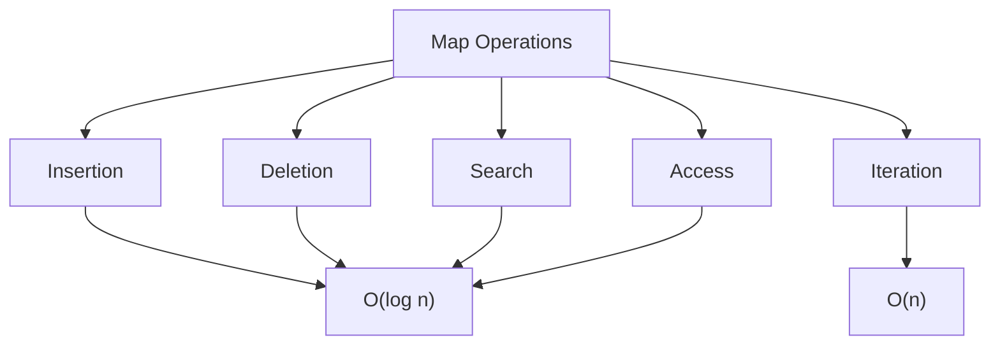

import Tabs from '@theme/Tabs';
import TabItem from '@theme/TabItem';

# C++ Map

## Introduction

In the C++ Standard Template Library (STL), a `map` is an associative container that stores elements in key-value pairs. Unlike sequential containers like vectors or arrays where elements are accessed by their position, maps allow you to access elements by their keys.

Maps in C++ have several important characteristics:

- **Ordered storage**: Elements are always sorted according to the key
- **Unique keys**: Each key can appear only once in the map
- **Associative access**: Elements are accessed by their keys, not by position
- **Self-balancing**: Maps are typically implemented as red-black trees, providing logarithmic complexity for operations

Maps are incredibly useful when you need to:
- Look up values based on a specific key
- Store data that naturally comes in key-value pairs (like dictionaries)
- Maintain a sorted collection of key-value pairs

## Basic Map Operations

### Creating a Map

To use maps in C++, you need to include the `<map>` header:

```cpp
#include <map>
#include <iostream>
#include <string>

int main() {
    // Create an empty map with string keys and int values
    std::map<std::string, int> ages;
    
    // Create a map with initialization
    std::map<std::string, std::string> capitals = {
        {"USA", "Washington D.C."},
        {"France", "Paris"},
        {"Japan", "Tokyo"}
    };
    
    return 0;
}
```

### Inserting Elements

There are several ways to insert elements into a map:

```cpp
#include <map>
#include <iostream>
#include <string>

int main() {
    std::map<std::string, int> ages;
    
    // Method 1: Using the insert() function with std::pair
    ages.insert(std::pair<std::string, int>("Alice", 25));
    
    // Method 2: Using the insert() function with std::make_pair
    ages.insert(std::make_pair("Bob", 30));
    
    // Method 3: Using array-like syntax (most common)
    ages["Charlie"] = 22;
    
    // Method 4: Using emplace() (most efficient in C++11 and later)
    ages.emplace("David", 28);
    
    // Display the map content
    for (const auto& pair : ages) {
        std::cout << pair.first << ": " << pair.second << std::endl;
    }
    
    return 0;
}
```

**Output:**
```
Alice: 25
Bob: 30
Charlie: 22
David: 28
```

Notice that the elements are automatically sorted alphabetically by key.

### Accessing Elements

Maps provide multiple ways to access elements:

```cpp
#include <map>
#include <iostream>
#include <string>

int main() {
    std::map<std::string, int> scores = {
        {"Alice", 95},
        {"Bob", 87},
        {"Charlie", 92}
    };
    
    // Method 1: Using the [] operator
    std::cout << "Bob's score: " << scores["Bob"] << std::endl;
    
    // Be careful: using [] creates a new element if the key doesn't exist
    std::cout << "David's score (before): " << scores["David"] << std::endl;
    
    // Method 2: Using at() - safer but throws exception if key doesn't exist
    try {
        std::cout << "Alice's score: " << scores.at("Alice") << std::endl;
        std::cout << "Eve's score: " << scores.at("Eve") << std::endl; // This will throw an exception
    } catch (const std::out_of_range& e) {
        std::cout << "Exception: " << e.what() << std::endl;
    }
    
    // Method 3: Using find() - safest approach
    auto it = scores.find("Charlie");
    if (it != scores.end()) {
        std::cout << "Charlie's score: " << it->second << std::endl;
    } else {
        std::cout << "Charlie not found!" << std::endl;
    }
    
    // Print the map after operations
    std::cout << "\nFinal map contents:" << std::endl;
    for (const auto& pair : scores) {
        std::cout << pair.first << ": " << pair.second << std::endl;
    }
    
    return 0;
}
```

**Output:**
```
Bob's score: 87
David's score (before): 0
Alice's score: 95
Exception: map::at
Charlie's score: 92

Final map contents:
Alice: 95
Bob: 87
Charlie: 92
David: 0
```

:::caution
Using the `[]` operator creates a new element with a default value if the key doesn't exist. This can lead to unexpected behavior. Use `at()` or `find()` when you only want to check if an element exists.
:::

### Checking If an Element Exists

Before accessing elements, it's often important to check if a key exists:

```cpp
#include <map>
#include <iostream>
#include <string>

int main() {
    std::map<std::string, int> ages = {
        {"Alice", 25},
        {"Bob", 30},
        {"Charlie", 22}
    };
    
    // Method 1: Using count() - returns 1 if key exists, 0 otherwise
    if (ages.count("Bob") > 0) {
        std::cout << "Bob exists in the map" << std::endl;
    }
    
    // Method 2: Using find() - returns iterator to element if found, or end() otherwise
    if (ages.find("David") != ages.end()) {
        std::cout << "David exists in the map" << std::endl;
    } else {
        std::cout << "David does not exist in the map" << std::endl;
    }
    
    // Method 3: Using contains() (C++20 and later)
    // if (ages.contains("Alice")) {
    //     std::cout << "Alice exists in the map" << std::endl;
    // }
    
    return 0;
}
```

**Output:**
```
Bob exists in the map
David does not exist in the map
```

### Removing Elements

You can remove elements from a map in several ways:

```cpp
#include <map>
#include <iostream>
#include <string>

int main() {
    std::map<std::string, int> scores = {
        {"Alice", 95},
        {"Bob", 87},
        {"Charlie", 92},
        {"David", 78},
        {"Eve", 85}
    };
    
    // Method 1: Using erase() with a key
    scores.erase("David");
    
    // Method 2: Using erase() with an iterator
    auto it = scores.find("Eve");
    if (it != scores.end()) {
        scores.erase(it);
    }
    
    // Method 3: Using erase() with a range of iterators
    auto start = scores.find("Alice");
    auto end = scores.find("Charlie");
    if (start != scores.end() && end != scores.end()) {
        // This will erase from start to end (not including end)
        scores.erase(start, end);
    }
    
    // Print the remaining elements
    std::cout << "Remaining scores:" << std::endl;
    for (const auto& pair : scores) {
        std::cout << pair.first << ": " << pair.second << std::endl;
    }
    
    // Clear the entire map
    scores.clear();
    std::cout << "Size after clear(): " << scores.size() << std::endl;
    
    return 0;
}
```

**Output:**
```
Remaining scores:
Charlie: 92
Size after clear(): 0
```

## Map Properties and Methods

Maps provide various methods to work with their contents:

```cpp
#include <map>
#include <iostream>
#include <string>

int main() {
    std::map<std::string, int> scores = {
        {"Alice", 95},
        {"Bob", 87},
        {"Charlie", 92},
        {"David", 78}
    };
    
    // Check if map is empty
    std::cout << "Is map empty? " << (scores.empty() ? "Yes" : "No") << std::endl;
    
    // Get the size of the map
    std::cout << "Map size: " << scores.size() << std::endl;
    
    // Get the maximum possible size
    std::cout << "Maximum size: " << scores.max_size() << std::endl;
    
    // Swap two maps
    std::map<std::string, int> other_scores = {{"Eve", 91}, {"Frank", 84}};
    scores.swap(other_scores);
    
    std::cout << "\nAfter swap:" << std::endl;
    std::cout << "scores map:" << std::endl;
    for (const auto& pair : scores) {
        std::cout << pair.first << ": " << pair.second << std::endl;
    }
    
    std::cout << "\nother_scores map:" << std::endl;
    for (const auto& pair : other_scores) {
        std::cout << pair.first << ": " << pair.second << std::endl;
    }
    
    return 0;
}
```

**Output:**
```
Is map empty? No
Map size: 4
Maximum size: 461168601842738790

After swap:
scores map:
Eve: 91
Frank: 84

other_scores map:
Alice: 95
Bob: 87
Charlie: 92
David: 78
```

## Working with Map Iterators

Maps provide iterators for traversing elements:

```cpp
#include <map>
#include <iostream>
#include <string>

int main() {
    std::map<std::string, int> scores = {
        {"Alice", 95},
        {"Bob", 87},
        {"Charlie", 92},
        {"David", 78}
    };
    
    // Forward iteration
    std::cout << "Forward iteration:" << std::endl;
    for (auto it = scores.begin(); it != scores.end(); ++it) {
        std::cout << it->first << ": " << it->second << std::endl;
    }
    
    // Reverse iteration
    std::cout << "\nReverse iteration:" << std::endl;
    for (auto it = scores.rbegin(); it != scores.rend(); ++it) {
        std::cout << it->first << ": " << it->second << std::endl;
    }
    
    // Modern range-based for loop (C++11 and later)
    std::cout << "\nRange-based for loop:" << std::endl;
    for (const auto& [key, value] : scores) {  // C++17 structured binding
        std::cout << key << ": " << value << std::endl;
    }
    
    return 0;
}
```

**Output:**
```
Forward iteration:
Alice: 95
Bob: 87
Charlie: 92
David: 78

Reverse iteration:
David: 78
Charlie: 92
Bob: 87
Alice: 95

Range-based for loop:
Alice: 95
Bob: 87
Charlie: 92
David: 78
```

## Custom Key Comparison

By default, maps use `std::less<Key>` for ordering elements. You can provide a custom comparison function:

```cpp
#include <map>
#include <iostream>
#include <string>
#include <functional>  // For std::greater

int main() {
    // A map with case-insensitive string comparison
    struct CaseInsensitiveCompare {
        bool operator()(const std::string& a, const std::string& b) const {
            std::string a_lower = a, b_lower = b;
            
            // Convert both strings to lowercase
            std::transform(a.begin(), a.end(), a_lower.begin(), 
                           [](unsigned char c) { return std::tolower(c); });
            std::transform(b.begin(), b.end(), b_lower.begin(), 
                           [](unsigned char c) { return std::tolower(c); });
            
            return a_lower < b_lower;
        }
    };
    
    // Map with custom comparison
    std::map<std::string, int, CaseInsensitiveCompare> scores;
    
    scores["Alice"] = 95;
    scores["bob"] = 87;    // Note lowercase "bob"
    scores["Charlie"] = 92;
    
    // This won't create a new entry, but update "bob"
    scores["BOB"] = 88;    // Note uppercase "BOB"
    
    std::cout << "Case-insensitive map:" << std::endl;
    for (const auto& pair : scores) {
        std::cout << pair.first << ": " << pair.second << std::endl;
    }
    
    // Map with reverse ordering (greater instead of less)
    std::map<int, std::string, std::greater<int>> scores_desc;
    
    scores_desc[95] = "Alice";
    scores_desc[87] = "Bob";
    scores_desc[92] = "Charlie";
    
    std::cout << "\nReverse-ordered map:" << std::endl;
    for (const auto& pair : scores_desc) {
        std::cout << pair.first << ": " << pair.second << std::endl;
    }
    
    return 0;
}
```

**Output:**
```
Case-insensitive map:
Alice: 95
bob: 88
Charlie: 92

Reverse-ordered map:
95: Alice
92: Charlie
87: Bob
```

## Map Performance Characteristics

The map container in C++ is typically implemented as a balanced binary search tree (usually a red-black tree), which offers the following performance characteristics:



## Practical Applications

Let's explore some practical applications of maps:

### Word Frequency Counter

```cpp
#include <map>
#include <iostream>
#include <string>
#include <sstream>
#include <algorithm>

int main() {
    // Sample text
    std::string text = "the quick brown fox jumps over the lazy dog the fox is quick";
    
    std::map<std::string, int> word_count;
    std::stringstream ss(text);
    std::string word;
    
    // Count word frequencies
    while (ss >> word) {
        // Convert to lowercase
        std::transform(word.begin(), word.end(), word.begin(),
                      [](unsigned char c) { return std::tolower(c); });
        
        // Increment count for this word
        word_count[word]++;
    }
    
    // Display word frequencies
    std::cout << "Word frequencies:" << std::endl;
    for (const auto& [word, count] : word_count) {
        std::cout << word << ": " << count << std::endl;
    }
    
    // Find the most frequent word
    auto max_element = std::max_element(
        word_count.begin(), word_count.end(),
        [](const auto& a, const auto& b) {
            return a.second < b.second;
        }
    );
    
    std::cout << "\nMost frequent word: " << max_element->first
              << " (" << max_element->second << " occurrences)" << std::endl;
    
    return 0;
}
```

**Output:**
```
Word frequencies:
brown: 1
dog: 1
fox: 2
is: 1
jumps: 1
lazy: 1
over: 1
quick: 2
the: 3

Most frequent word: the (3 occurrences)
```

### Student Record System

```cpp
#include <map>
#include <iostream>
#include <string>
#include <vector>
#include <iomanip>

struct Student {
    std::string name;
    int age;
    std::vector<std::pair<std::string, char>> courses; // course name, grade
    
    // Add a course with grade
    void addCourse(const std::string& course, char grade) {
        courses.push_back({course, grade});
    }
    
    // Calculate GPA (A=4, B=3, C=2, D=1, F=0)
    double getGPA() const {
        if (courses.empty()) return 0.0;
        
        double total = 0.0;
        for (const auto& course : courses) {
            switch (course.second) {
                case 'A': total += 4.0; break;
                case 'B': total += 3.0; break;
                case 'C': total += 2.0; break;
                case 'D': total += 1.0; break;
                case 'F': total += 0.0; break;
            }
        }
        return total / courses.size();
    }
};

int main() {
    // Create a map of students using ID as key
    std::map<std::string, Student> students;
    
    // Add some students
    students["S001"] = {"Alice Smith", 20, {}};
    students["S001"].addCourse("Math", 'A');
    students["S001"].addCourse("Physics", 'B');
    students["S001"].addCourse("Programming", 'A');
    
    students["S002"] = {"Bob Johnson", 22, {}};
    students["S002"].addCourse("History", 'B');
    students["S002"].addCourse("Literature", 'A');
    students["S002"].addCourse("Economics", 'C');
    
    students["S003"] = {"Charlie Brown", 19, {}};
    students["S003"].addCourse("Chemistry", 'B');
    students["S003"].addCourse("Biology", 'A');
    students["S003"].addCourse("Math", 'C');
    
    // Display student records
    std::cout << "Student Records:" << std::endl;
    std::cout << std::setfill('-') << std::setw(60) << "-" << std::endl;
    std::cout << std::setfill(' ');
    std::cout << std::left << std::setw(10) << "ID" 
              << std::setw(20) << "Name"
              << std::setw(10) << "Age"
              << std::setw(10) << "GPA"
              << "Courses" << std::endl;
    std::cout << std::setfill('-') << std::setw(60) << "-" << std::endl;
    std::cout << std::setfill(' ');
    
    for (const auto& [id, student] : students) {
        std::cout << std::left << std::setw(10) << id 
                  << std::setw(20) << student.name
                  << std::setw(10) << student.age
                  << std::setw(10) << std::fixed << std::setprecision(2) << student.getGPA();
        
        for (const auto& [course, grade] : student.courses) {
            std::cout << course << "(" << grade << ") ";
        }
        std::cout << std::endl;
    }
    
    // Look up a student by ID
    std::string lookup_id = "S002";
    auto it = students.find(lookup_id);
    
    if (it != students.end()) {
        std::cout << "\nFound student: " << it->second.name 
                  << " (GPA: " << it->second.getGPA() << ")" << std::endl;
    } else {
        std::cout << "\nStudent with ID " << lookup_id << " not found." << std::endl;
    }
    
    return 0;
}
```

**Output:**
```
Student Records:
------------------------------------------------------------
ID        Name                Age       GPA       Courses
------------------------------------------------------------
S001      Alice Smith         20        3.33      Math(A) Physics(B) Programming(A) 
S002      Bob Johnson         22        2.67      History(B) Literature(A) Economics(C) 
S003      Charlie Brown       19        2.67      Chemistry(B) Biology(A) Math(C) 

Found student: Bob Johnson (GPA: 2.67)
```

## Multimap: When You Need Duplicate Keys

The STL also provides `std::multimap`, which allows multiple elements with the same key:

```cpp
#include <map>
#include <iostream>
#include <string>

int main() {
    // Create a multimap
    std::multimap<std::string, std::string> phoneBook;
    
    // Insert multiple entries with the same key
    phoneBook.insert({"Smith", "555-1234"});
    phoneBook.insert({"Johnson", "555-5678"});
    phoneBook.insert({"Smith", "555-8765"});  // Another number for Smith
    phoneBook.insert({"Smith", "555-9999"});  // Yet another number for Smith
    
    // Display all entries
    std::cout << "Phone Book:" << std::endl;
    for (const auto& entry : phoneBook) {
        std::cout << entry.first << ": " << entry.second << std::endl;
    }
    
    // Count how many entries Smith has
    std::string name = "Smith";
    std::cout << "\n" << name << " has " << phoneBook.count(name) << " phone numbers" << std::endl;
    
    // Find all entries for Smith
    std::cout << "\nAll numbers for " << name << ":" << std::endl;
    auto range = phoneBook.equal_range(name);
    for (auto it = range.first; it != range.second; ++it) {
        std::cout << it->second << std::endl;
    }
    
    return 0;
}
```

**Output:**
```
Phone Book:
Johnson: 555-5678
Smith: 555-1234
Smith: 555-8765
Smith: 555-9999

Smith has 3 phone numbers

All numbers for Smith:
555-1234
555-8765
555-9999
```

## Unordered Maps: When Order Doesn't Matter

If you don't need ordered keys, consider using `std::unordered_map` for potentially better performance:

<Tabs>
  <TabItem value="map" label="std::map">

```cpp
#include <map>
#include <iostream>
#include <string>
#include <chrono>

int main() {
    // Using regular map (ordered)
    std::map<int, int> orderedMap;
    
    // Insert 100,000 elements
    auto start = std::chrono::high_resolution_clock::now();
    
    for (int i = 0; i < 100000; i++) {
        orderedMap[i] = i * 2;
    }
    
    auto end = std::chrono::high_resolution_clock::now();
    std::chrono::duration<double, std::milli> elapsed = end - start;
    
    std::cout << "Time to insert 100,000 elements in std::map: " 
              << elapsed.count() << " ms" << std::endl;
    
    // Lookup test
    start = std::chrono::high_resolution_clock::now();
    
    for (int i = 0; i < 100000; i++) {
        auto val = orderedMap[i];
    }
    
    end = std::chrono::high_resolution_clock::now();
    elapsed = end - start;
    
    std::cout << "Time to lookup 100,000 elements in std::map: " 
              << elapsed.count() << " ms" << std::endl;
    
    return 0;
}
```

  </TabItem>
  <TabItem value="unordered_map" label="std::unordered_map">

```cpp
#include <unordered_map>
#include <iostream>
#include <string>
#include <chrono>

int main() {
    // Using unordered_map (hash-based)
    std::unordered_map<int, int> unorderedMap;
    
    // Insert 100,000 elements
    auto start = std::chrono::high_resolution_clock::now();
    
    for (int i = 0; i < 100000; i++) {
        unorderedMap[i] = i * 2;
    }
    
    auto end = std::chrono::high_resolution_clock::now();
    std::chrono::duration<double, std::milli> elapsed = end - start;
    
    std::cout << "Time to insert 100,000 elements in std::unordered_map: " 
              << elapsed.count() << " ms" << std::endl;
    
    // Lookup test
    start = std::chrono::high_resolution_clock::now();
    
    for (int i = 0; i < 100000; i++) {
        auto val = unorderedMap[i];
    }
    
    end = std::chrono::high_resolution_clock::now();
    elapsed = end - start;
    
    std::cout << "Time to lookup 100,000 elements in std::unordered_map: " 
              << elapsed.count() << " ms" << std::endl;
    
    return 0;
}
```

  </TabItem>
</Tabs>

**Typical Output:**
```
Time to insert 100,000 elements in std::map: 82.3 ms
Time to lookup 100,000 elements in std::map: 74.5 ms

Time to insert 100,000 elements in std::unordered_map: 31.2 ms
Time to lookup 100,000 elements in std::unordered_map: 12.7 ms
```

:::tip
Use `std::map` when:
- You need keys to be sorted
- You need to find the next element greater/less than a value
- You need to iterate in a specific order

Use `std::unordered_map` when:
- You only need fast lookups
- Order doesn't matter
- Memory usage is less of a concern (unordered_map can use more memory)
:::

## Summary

The `std::map` container in C++ provides a powerful and flexible way to store key-value pairs with several important features:

- Keys are always maintained in sorted order
- Each key appears exactly once (unless you use `std::multimap`)
- Access, insertion, and deletion operations are logarithmic in complexity (O(log n))
- Maps are implemented as self-balancing binary search trees

Maps are exceptionally useful for:
- Dictionary-like data structures
- Frequency counting
- Index lookups
- Caching results
- Any problem requiring efficient key-value associations

## Additional Resources and Exercises

### Resources
- [C++ Reference - std::map](https://en.cppreference.com/w/cpp/container/map)
- [C++ Reference - std::multimap](https://en.cppreference.com/w/cpp/container/multimap)
- [C++ Reference - std::unordered_map](https://en.cppreference.com/w/cpp/container/unordered_map)

### Exercises

1. **Word Replacement**: Create a program that replaces specific words in a text with others based on a map of substitutions.

2. **Simple Database**: Implement a simple database system using maps that can:
   - Add records with a unique ID
   - Delete records by ID
   - Update existing records
   - Search for records by different fields

3. **Cache Implementation**: Create a simple caching system using a map that stores results of "expensive" operations and retrieves them when the same input is provided again.

4. **Map vs. Unordered Map**: Write a program that compares the performance of `std::map` and `std::unordered_map` for different operations (insertion, deletion, lookup) with various numbers of elements.

5. **Nested Maps**: Create a nested map structure to represent a directory system, where each directory can contain files (with their sizes) and other directories.