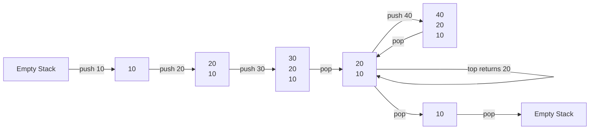

# C++ Stack

## Introduction

The stack is a container adapter in the C++ Standard Template Library (STL) that provides a Last-In-First-Out (LIFO) data structure. In a stack, elements are inserted and removed from the same end, called the "top" of the stack.

Think of a stack like a pile of plates - you can only add or remove plates from the top of the pile. The last plate you put on will be the first one you take off. This LIFO behavior makes stacks useful for certain types of problems, such as:

- Tracking function calls and returns in programming languages
- Reversing elements
- Checking balanced expressions (like parentheses, braces, and brackets)
- Implementing undo/redo functionality

The `std::stack` container in C++ STL is not a standalone container but an adapter that can be built on top of other containers like `vector`, `deque` (default), or `list`.

## Basic Stack Operations

### Stack Header File

To use the stack container, you need to include the following header file:

```cpp
#include <stack>
```

### Creating a Stack

Here's how to declare a stack:

```cpp
// Default stack (uses deque as the underlying container)
std::stack<int> myStack;

// Stack with a specific underlying container (vector, list, deque)
std::stack<int, std::vector<int>> stackWithVector;
std::stack<int, std::list<int>> stackWithList;
std::stack<int, std::deque<int>> stackWithDeque;
```

### Core Stack Operations

A stack has a few key operations:

1. **push()** - Adds an element to the top of the stack
2. **pop()** - Removes the top element from the stack
3. **top()** - Returns a reference to the top element without removing it
4. **empty()** - Checks if the stack is empty
5. **size()** - Returns the number of elements in the stack

Let's see these operations in action:

```cpp
#include <iostream>
#include <stack>

int main() {
    std::stack<int> myStack;
    
    // Pushing elements (adding to the top)
    myStack.push(10);
    myStack.push(20);
    myStack.push(30);
    
    std::cout << "Stack size: " << myStack.size() << std::endl;
    std::cout << "Top element: " << myStack.top() << std::endl;
    
    // Popping elements (removing from the top)
    myStack.pop();
    std::cout << "After pop, top element: " << myStack.top() << std::endl;
    
    // Checking if stack is empty
    std::cout << "Is stack empty? " << (myStack.empty() ? "Yes" : "No") << std::endl;
    
    // Popping all elements
    while (!myStack.empty()) {
        std::cout << "Popping: " << myStack.top() << std::endl;
        myStack.pop();
    }
    
    std::cout << "Is stack empty now? " << (myStack.empty() ? "Yes" : "No") << std::endl;
    
    return 0;
}
```

**Output:**
```
Stack size: 3
Top element: 30
After pop, top element: 20
Is stack empty? No
Popping: 20
Popping: 10
Is stack empty now? Yes
```

## How Stack Works

Here's a visualization of a stack's operations:



## Important Points to Remember

1. **No Random Access**: Unlike arrays or vectors, you cannot access elements in the middle of a stack directly. You can only access the top element.

2. **No Iterators**: The stack container does not provide iterators to traverse the elements.

3. **No clear() Function**: Unlike some other STL containers, stack does not have a clear() function. To empty a stack, you need to pop elements until the stack is empty.

4. **Underlying Container**: The default container for a stack is `std::deque`, but you can specify a different container like `std::vector` or `std::list`.

5. **No Element Removal by Value**: There's no direct way to remove a specific value from a stack. You can only remove the top element.

## Practical Examples

### Example 1: Reversing a String

Stacks are excellent for reversing elements:

```cpp
#include <iostream>
#include <stack>
#include <string>

std::string reverseString(const std::string& input) {
    std::stack<char> charStack;
    
    // Push all characters onto the stack
    for (char c : input) {
        charStack.push(c);
    }
    
    std::string reversed;
    
    // Pop characters from stack to get them in reverse order
    while (!charStack.empty()) {
        reversed += charStack.top();
        charStack.pop();
    }
    
    return reversed;
}

int main() {
    std::string original = "Hello, World!";
    std::string reversed = reverseString(original);
    
    std::cout << "Original string: " << original << std::endl;
    std::cout << "Reversed string: " << reversed << std::endl;
    
    return 0;
}
```

**Output:**
```
Original string: Hello, World!
Reversed string: !dlroW ,olleH
```

### Example 2: Balanced Parentheses Checker

Stacks are commonly used to check if an expression has balanced parentheses:

```cpp
#include <iostream>
#include <stack>
#include <string>

bool areParenthesesBalanced(const std::string& expr) {
    std::stack<char> charStack;
    
    for (char c : expr) {
        if (c == '(' || c == '[' || c == '{') {
            // Push opening brackets onto stack
            charStack.push(c);
        } else if (c == ')' || c == ']' || c == '}') {
            // For closing brackets, check if stack is empty
            if (charStack.empty()) {
                return false;
            }
            
            // Check if matching opening bracket is at the top
            char top = charStack.top();
            if ((c == ')' && top == '(') || 
                (c == ']' && top == '[') || 
                (c == '}' && top == '{')) {
                charStack.pop();
            } else {
                return false;  // Mismatched brackets
            }
        }
    }
    
    // If stack is empty, all brackets are matched
    return charStack.empty();
}

int main() {
    std::string expr1 = "{[()]}";
    std::string expr2 = "{[(])}";
    std::string expr3 = "((()";
    
    std::cout << expr1 << " is " << (areParenthesesBalanced(expr1) ? "balanced" : "not balanced") << std::endl;
    std::cout << expr2 << " is " << (areParenthesesBalanced(expr2) ? "balanced" : "not balanced") << std::endl;
    std::cout << expr3 << " is " << (areParenthesesBalanced(expr3) ? "balanced" : "not balanced") << std::endl;
    
    return 0;
}
```

**Output:**
```
{[()]} is balanced
{[(])} is not balanced
((() is not balanced
```

### Example 3: Implementing Undo Functionality

Stacks can be used to implement a simple text editor's undo functionality:

```cpp
#include <iostream>
#include <stack>
#include <string>

class SimpleTextEditor {
private:
    std::string currentText;
    std::stack<std::string> history;

public:
    SimpleTextEditor() : currentText("") {}
    
    void addText(const std::string& text) {
        // Save current state for undo
        history.push(currentText);
        // Update current text
        currentText += text;
        std::cout << "Added: \"" << text << "\"" << std::endl;
    }
    
    void deleteLastChar() {
        if (!currentText.empty()) {
            // Save current state for undo
            history.push(currentText);
            // Remove last character
            currentText.pop_back();
            std::cout << "Deleted last character" << std::endl;
        } else {
            std::cout << "Nothing to delete" << std::endl;
        }
    }
    
    void undo() {
        if (!history.empty()) {
            // Restore previous state
            currentText = history.top();
            history.pop();
            std::cout << "Undo operation performed" << std::endl;
        } else {
            std::cout << "Nothing to undo" << std::endl;
        }
    }
    
    void displayText() {
        std::cout << "Current text: \"" << currentText << "\"" << std::endl;
    }
};

int main() {
    SimpleTextEditor editor;
    
    editor.addText("Hello");
    editor.displayText();
    
    editor.addText(" World");
    editor.displayText();
    
    editor.deleteLastChar();
    editor.displayText();
    
    editor.undo();
    editor.displayText();
    
    editor.undo();
    editor.displayText();
    
    return 0;
}
```

**Output:**
```
Added: "Hello"
Current text: "Hello"
Added: " World"
Current text: "Hello World"
Deleted last character
Current text: "Hello Worl"
Undo operation performed
Current text: "Hello World"
Undo operation performed
Current text: "Hello"
```

## Time Complexity

The time complexity of the stack operations is as follows:

- **push()**: O(1) - Constant time
- **pop()**: O(1) - Constant time
- **top()**: O(1) - Constant time
- **empty()**: O(1) - Constant time
- **size()**: O(1) - Constant time

This makes stacks very efficient for their specific use cases.

## Common Errors When Using Stacks

1. **Calling top() or pop() on an Empty Stack**

This will lead to undefined behavior, likely causing your program to crash. Always check if the stack is empty before calling these functions:

```cpp
if (!myStack.empty()) {
    int topValue = myStack.top();
    myStack.pop();
} else {
    std::cout << "Stack is empty!" << std::endl;
}
```

2. **Forgetting That pop() Doesn't Return the Popped Value**

Unlike in some other languages, `pop()` in C++ does not return the value being removed. It only removes the top element. To get the value, you need to call `top()` before `pop()`.

3. **Attempting to Iterate Through a Stack**

Stacks don't provide iterators, so you can't directly iterate through them. If you need to examine all elements, you'll need to pop them all (which empties the stack).

## Summary

The `std::stack` container adapter in C++ STL provides an efficient implementation of the stack data structure with LIFO (Last-In-First-Out) behavior. It is built on top of other containers and provides a limited but powerful set of operations for its specific purpose.

Key points to remember:
- Stacks follow LIFO principle (Last-In-First-Out)
- Main operations are push(), pop(), top(), empty(), and size()
- Default underlying container is std::deque, but you can use vector or list
- Stacks are useful for problems involving function calls, expression evaluation, and undo/redo functionality
- All stack operations are O(1) time complexity, making them very efficient

## Exercises

1. **Basic Stack Operations**: Write a program that reads integers from the user and pushes them onto a stack. Then pop and print them to demonstrate the LIFO behavior.

2. **Postfix Expression Evaluation**: Implement a program to evaluate postfix expressions using a stack. For example, evaluate "23+4*" which equals 20.

3. **Stack-Based Calculator**: Create a basic calculator that uses stacks to evaluate infix expressions, handling parentheses correctly.

4. **String Reversal per Word**: Write a function that reverses each word in a sentence but keeps the order of words the same. For example, "Hello World" becomes "olleH dlroW".

5. **Function Call Simulator**: Create a simple program that simulates function calls and returns using a stack to demonstrate how a programming language's call stack works.

## Additional Resources

- [C++ Reference for Stack](https://en.cppreference.com/w/cpp/container/stack)
- [GeeksforGeeks - Stack in C++ STL](https://www.geeksforgeeks.org/stack-in-cpp-stl/)
- [Stack Applications in Real Life](https://www.geeksforgeeks.org/applications-of-stack-data-structure/)
- [Difference between push_back() and push() in C++](https://www.geeksforgeeks.org/difference-between-stack-push-and-vector-push_back-in-c-stl/)