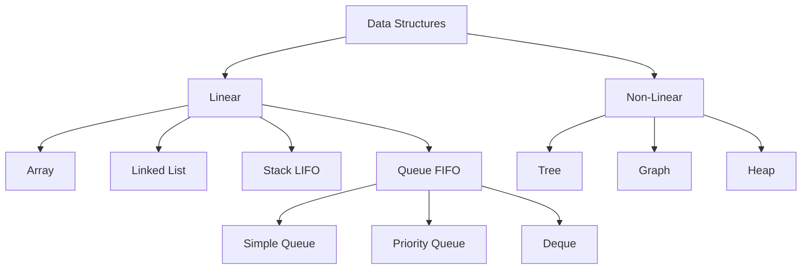

# C++ Queue

## Introduction

A queue is a fundamental data structure that follows the First-In-First-Out (FIFO) principle. This means that the first element added to the queue will be the first one to be removed. Think of it like a line of people waiting for a service - the person who arrives first gets served first.

The C++ Standard Template Library (STL) provides a ready-to-use implementation of a queue through the `<queue>` header. This implementation offers a convenient way to utilize queue operations without having to build the data structure from scratch.


## Queue Operations

The queue container adapter in C++ STL supports the following main operations:

- **push()**: Adds an element to the back of the queue
- **pop()**: Removes the element from the front of the queue
- **front()**: Returns a reference to the first element in the queue
- **back()**: Returns a reference to the last element in the queue
- **empty()**: Checks if the queue is empty
- **size()**: Returns the number of elements in the queue

## Basic Usage

Let's start with a simple example that demonstrates how to create and use a queue:

```cpp
#include <iostream>
#include <queue>

int main() {
    // Create a queue of integers
    std::queue<int> myQueue;
    
    // Add elements to the queue
    myQueue.push(10);
    myQueue.push(20);
    myQueue.push(30);
    
    // Display the front element
    std::cout << "Front element: " << myQueue.front() << std::endl;
    
    // Display the back element
    std::cout << "Back element: " << myQueue.back() << std::endl;
    
    // Display the size
    std::cout << "Queue size: " << myQueue.size() << std::endl;
    
    // Pop elements from the queue
    std::cout << "\nRemoving elements:" << std::endl;
    while (!myQueue.empty()) {
        std::cout << "Processing: " << myQueue.front() << std::endl;
        myQueue.pop();
    }
    
    std::cout << "Queue is now empty: " << (myQueue.empty() ? "Yes" : "No") << std::endl;
    
    return 0;
}
```

**Output:**
```
Front element: 10
Back element: 30
Queue size: 3

Removing elements:
Processing: 10
Processing: 20
Processing: 30
Queue is now empty: Yes
```

In this example:
1. We created a queue of integers
2. Added three elements (10, 20, 30)
3. Checked the front and back elements
4. Processed all elements in a FIFO manner

## Queue Implementation Details

The C++ STL queue is actually a container adapter, which means it's built on top of other containers. By default, the queue uses `std::deque` as its underlying container, but you can specify a different container as long as it supports the required operations.

Here's how to create a queue with a different underlying container:

```cpp
#include <iostream>
#include <queue>
#include <list>

int main() {
    // Create a queue that uses std::list as its underlying container
    std::queue<int, std::list<int>> myListQueue;
    
    // The usage remains the same
    myListQueue.push(100);
    myListQueue.push(200);
    
    std::cout << "Front element: " << myListQueue.front() << std::endl;
    std::cout << "Queue size: " << myListQueue.size() << std::endl;
    
    return 0;
}
```

**Output:**
```
Front element: 100
Queue size: 2
```

## Working with Custom Data Types

Queues can store any data type, including user-defined classes or structures. Here's an example using a custom `Task` structure:

```cpp
#include <iostream>
#include <queue>
#include <string>

// Define a custom data type
struct Task {
    int id;
    std::string description;
    int priority;
    
    // Constructor
    Task(int taskId, std::string desc, int prio) 
        : id(taskId), description(desc), priority(prio) {}
};

int main() {
    // Create a queue of tasks
    std::queue<Task> taskQueue;
    
    // Add tasks to the queue
    taskQueue.push(Task(1, "Complete homework", 2));
    taskQueue.push(Task(2, "Clean room", 3));
    taskQueue.push(Task(3, "Pay bills", 1));
    
    // Process tasks in FIFO order
    std::cout << "Processing tasks in order of submission:" << std::endl;
    while (!taskQueue.empty()) {
        Task currentTask = taskQueue.front();
        std::cout << "Task ID: " << currentTask.id 
                  << ", Description: " << currentTask.description 
                  << ", Priority: " << currentTask.priority << std::endl;
        taskQueue.pop();
    }
    
    return 0;
}
```

**Output:**
```
Processing tasks in order of submission:
Task ID: 1, Description: Complete homework, Priority: 2
Task ID: 2, Description: Clean room, Priority: 3
Task ID: 3, Description: Pay bills, Priority: 1
```

Notice that even though "Pay bills" has the highest priority (lowest number), it gets processed last because queues follow the FIFO principle. If you need to process items based on priority, you might want to use a priority queue instead (we'll cover this in a later section).

## Real-World Applications

Queues are extensively used in various programming scenarios:

### 1. Process Scheduling

Operating systems use queues to manage processes waiting for CPU time:

```cpp
#include <iostream>
#include <queue>
#include <string>
#include <thread>
#include <chrono>

struct Process {
    int id;
    std::string name;
    int burstTime; // execution time in milliseconds
    
    Process(int i, std::string n, int bt) : id(i), name(n), burstTime(bt) {}
};

int main() {
    std::queue<Process> processQueue;
    
    // Add processes to the queue
    processQueue.push(Process(1, "Word Processor", 500));
    processQueue.push(Process(2, "Web Browser", 300));
    processQueue.push(Process(3, "Music Player", 200));
    
    std::cout << "CPU scheduling simulation (Round Robin):" << std::endl;
    
    // Simulate CPU scheduling
    while (!processQueue.empty()) {
        Process currentProcess = processQueue.front();
        processQueue.pop();
        
        std::cout << "Executing process " << currentProcess.id << ": " 
                  << currentProcess.name << std::endl;
        
        // Simulate execution time
        std::this_thread::sleep_for(std::chrono::milliseconds(100));
        
        // If process needs more time, put it back in the queue
        if (currentProcess.burstTime > 100) {
            currentProcess.burstTime -= 100;
            processQueue.push(currentProcess);
        } else {
            std::cout << "Process " << currentProcess.id << " completed!" << std::endl;
        }
    }
    
    std::cout << "All processes completed." << std::endl;
    
    return 0;
}
```

### 2. BFS (Breadth-First Search) Algorithm

Queues are essential for implementing BFS in graph algorithms:

```cpp
#include <iostream>
#include <queue>
#include <vector>
#include <unordered_map>

// Simple graph representation using adjacency list
std::unordered_map<int, std::vector<int>> graph = {
    {0, {1, 2}},
    {1, {2}},
    {2, {0, 3}},
    {3, {3}}
};

void bfs(int startNode) {
    std::queue<int> q;
    std::vector<bool> visited(4, false);
    
    // Start BFS from the given node
    q.push(startNode);
    visited[startNode] = true;
    
    std::cout << "BFS traversal starting from node " << startNode << ": ";
    
    while (!q.empty()) {
        int currentNode = q.front();
        q.pop();
        
        std::cout << currentNode << " ";
        
        // Visit all adjacent nodes
        for (int neighbor : graph[currentNode]) {
            if (!visited[neighbor]) {
                q.push(neighbor);
                visited[neighbor] = true;
            }
        }
    }
    std::cout << std::endl;
}

int main() {
    bfs(2); // Start BFS from node 2
    return 0;
}
```

**Output:**
```
BFS traversal starting from node 2: 2 0 3 1 
```

### 3. Event Handling in Applications

Queues can be used to handle events in applications:

```cpp
#include <iostream>
#include <queue>
#include <string>
#include <chrono>
#include <thread>

struct Event {
    int id;
    std::string type;
    std::string data;
    
    Event(int i, std::string t, std::string d) : id(i), type(t), data(d) {}
};

class EventManager {
private:
    std::queue<Event> eventQueue;
    
public:
    void addEvent(const Event& event) {
        eventQueue.push(event);
        std::cout << "Event added: " << event.type << " (ID: " << event.id << ")" << std::endl;
    }
    
    void processEvents() {
        std::cout << "\nProcessing events:" << std::endl;
        while (!eventQueue.empty()) {
            Event event = eventQueue.front();
            eventQueue.pop();
            
            // Process the event based on its type
            std::cout << "Processing event ID " << event.id << ": " << event.type << std::endl;
            std::cout << "  Data: " << event.data << std::endl;
            
            // Simulate event processing time
            std::this_thread::sleep_for(std::chrono::milliseconds(500));
        }
        std::cout << "All events processed." << std::endl;
    }
};

int main() {
    EventManager manager;
    
    // Add various events to the queue
    manager.addEvent(Event(1, "CLICK", "Button: Submit"));
    manager.addEvent(Event(2, "KEYPRESS", "Key: Enter"));
    manager.addEvent(Event(3, "HOVER", "Element: Dropdown"));
    manager.addEvent(Event(4, "SUBMIT", "Form: Registration"));
    
    // Process all events in the order they were received
    manager.processEvents();
    
    return 0;
}
```

## Queue vs Other Data Structures

Let's understand where queues fit in comparison to other data structures:



## Common Errors and Pitfalls

### 1. Accessing an Empty Queue

Attempting to access the front or back of an empty queue leads to undefined behavior:

```cpp
std::queue<int> q;  // Empty queue
// Wrong - will cause undefined behavior
int value = q.front();  

// Correct approach
if (!q.empty()) {
    int value = q.front();
    // Use value
}
```

### 2. Misunderstanding pop()

The `pop()` function only removes the front element; it doesn't return it:

```cpp
std::queue<int> q;
q.push(10);

// Wrong - pop() doesn't return a value
int value = q.pop();  // Compilation error

// Correct approach
int value = q.front();  // Get the front value
q.pop();  // Remove the front element
```

### 3. Forgetting That Queue is FIFO

Remember that elements come out in the same order they went in:

```cpp
std::queue<int> q;
q.push(1);
q.push(2);
q.push(3);

// Elements will be removed in order: 1, 2, 3
```

## Time Complexity

The time complexity of queue operations in C++ STL:

| Operation | Time Complexity |
|-----------|-----------------|
| push()    | O(1)            |
| pop()     | O(1)            |
| front()   | O(1)            |
| back()    | O(1)            |
| empty()   | O(1)            |
| size()    | O(1)            |

This makes queues very efficient for FIFO operations.

## Summary

Queues are fundamental data structures that follow the First-In-First-Out (FIFO) principle. The C++ STL provides a robust implementation through the `<queue>` header with all the necessary operations like push, pop, front, and back.

Key points to remember:
- Queues follow the FIFO principle
- Elements are added at the back and removed from the front
- The STL queue is a container adapter built on top of other containers (by default, deque)
- Queues are useful in scenarios like process scheduling, breadth-first search, and event handling
- Most queue operations have O(1) time complexity

## Exercises

1. **Basic Queue Manipulation**: Write a program to reverse the order of elements in a queue using only queue operations and one additional stack.

2. **Simulation Exercise**: Implement a simple bank queue simulation where customers arrive and are served based on their arrival time. Track average wait time.

3. **Queue Implementation Challenge**: Implement a queue using two stacks.

4. **Round Robin Scheduler**: Enhance the process scheduling example to include priority levels that affect how long each process gets to run.

5. **Queue Application**: Design a print job spooler that manages print jobs using a queue.

## Additional Resources

- [C++ Reference: std::queue](https://en.cppreference.com/w/cpp/container/queue)
- [C++ Standard Library: A Tutorial and Reference](http://www.cppstdlib.com/)
- [Data Structures and Algorithms in C++](https://www.amazon.com/Data-Structures-Algorithms-C-Adam-Drozdek/dp/1133608426)

Happy coding with C++ queues!