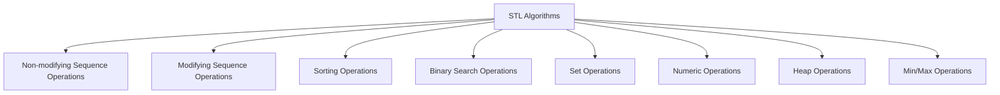

# C++ Algorithms

## Introduction

The C++ Standard Template Library (STL) provides a rich set of algorithms that work on containers, iterators, and elements. These algorithms are powerful, efficient, and save developers significant time by implementing common operations that would otherwise require custom implementations.

In this guide, we'll explore the STL algorithms library, which includes functions for searching, sorting, counting, manipulating, and performing various operations on data collections. Understanding these algorithms is essential for writing efficient and concise C++ code.

## What are STL Algorithms?

STL algorithms are template functions that operate on ranges of elements. They are independent of the container type and work with iterators, making them highly reusable. The algorithms are defined in the `<algorithm>` header, with some numerical algorithms in the `<numeric>` header.

Key characteristics of STL algorithms:

- They work with iterators, not directly with containers
- They are type-independent (template functions)
- They encapsulate common data manipulation patterns
- They are optimized for performance

## Categories of STL Algorithms

STL algorithms can be broadly categorized as follows:



Let's explore each category with examples.

## Non-modifying Sequence Operations

These algorithms perform operations on sequences without modifying the elements.

### Finding Elements

The `find()` function searches for a specified element in a range.

```cpp
#include <iostream>
#include <algorithm>
#include <vector>

int main() {
    std::vector<int> numbers = {10, 20, 30, 40, 50};
    
    // Find the element 30
    auto it = std::find(numbers.begin(), numbers.end(), 30);
    
    if (it != numbers.end()) {
        std::cout << "Element found at position: " 
                  << (it - numbers.begin()) << std::endl;
    } else {
        std::cout << "Element not found" << std::endl;
    }
    
    // Find an element that doesn't exist
    it = std::find(numbers.begin(), numbers.end(), 60);
    
    if (it != numbers.end()) {
        std::cout << "Element found at position: " 
                  << (it - numbers.begin()) << std::endl;
    } else {
        std::cout << "Element not found" << std::endl;
    }
    
    return 0;
}
```

**Output:**
```
Element found at position: 2
Element not found
```

### Counting Elements

The `count()` and `count_if()` functions count elements in a range.

```cpp
#include <iostream>
#include <algorithm>
#include <vector>

bool isEven(int n) {
    return n % 2 == 0;
}

int main() {
    std::vector<int> numbers = {1, 2, 3, 4, 2, 5, 2, 6};
    
    // Count occurrences of 2
    int count = std::count(numbers.begin(), numbers.end(), 2);
    std::cout << "Number 2 appears " << count << " times" << std::endl;
    
    // Count even numbers using count_if
    count = std::count_if(numbers.begin(), numbers.end(), isEven);
    std::cout << "There are " << count << " even numbers" << std::endl;
    
    // Using lambda instead of a named function
    count = std::count_if(numbers.begin(), numbers.end(), 
                          [](int n) { return n > 3; });
    std::cout << "There are " << count << " numbers greater than 3" << std::endl;
    
    return 0;
}
```

**Output:**
```
Number 2 appears 3 times
There are 4 even numbers
There are 3 numbers greater than 3
```

### Other Non-modifying Algorithms

- `all_of()`, `any_of()`, `none_of()`: Check if a condition is true for all, any, or none of the elements
- `for_each()`: Applies a function to each element
- `find_if()`, `find_if_not()`: Find elements that satisfy (or don't satisfy) a condition
- `adjacent_find()`: Finds two adjacent elements that are equal or satisfy a condition
- `mismatch()`: Finds the first position where two ranges differ

## Modifying Sequence Operations

These algorithms modify the elements in the sequence.

### Transforming Elements

The `transform()` function applies an operation to a range and stores the result.

```cpp
#include <iostream>
#include <algorithm>
#include <vector>

int main() {
    std::vector<int> numbers = {1, 2, 3, 4, 5};
    std::vector<int> squares(numbers.size());
    
    // Square each number and store in the squares vector
    std::transform(numbers.begin(), numbers.end(), squares.begin(),
                   [](int n) { return n * n; });
    
    std::cout << "Original numbers: ";
    for (int num : numbers) {
        std::cout << num << " ";
    }
    std::cout << std::endl;
    
    std::cout << "Squared numbers: ";
    for (int square : squares) {
        std::cout << square << " ";
    }
    std::cout << std::endl;
    
    return 0;
}
```

**Output:**
```
Original numbers: 1 2 3 4 5 
Squared numbers: 1 4 9 16 25 
```

### Copying Elements

The `copy()` function copies elements from one range to another.

```cpp
#include <iostream>
#include <algorithm>
#include <vector>

int main() {
    std::vector<int> source = {1, 2, 3, 4, 5};
    std::vector<int> destination(5);
    
    // Copy all elements from source to destination
    std::copy(source.begin(), source.end(), destination.begin());
    
    std::cout << "Destination after copy: ";
    for (int num : destination) {
        std::cout << num << " ";
    }
    std::cout << std::endl;
    
    // Using copy_if to copy only even numbers
    std::vector<int> evenNumbers(5, 0); // Initialize with zeros
    auto it = std::copy_if(source.begin(), source.end(), evenNumbers.begin(),
                          [](int n) { return n % 2 == 0; });
    
    // Resize the container to remove unused elements
    evenNumbers.resize(std::distance(evenNumbers.begin(), it));
    
    std::cout << "Even numbers: ";
    for (int num : evenNumbers) {
        std::cout << num << " ";
    }
    std::cout << std::endl;
    
    return 0;
}
```

**Output:**
```
Destination after copy: 1 2 3 4 5 
Even numbers: 2 4 
```

### Other Modifying Algorithms

- `fill()`, `fill_n()`: Fill a range with a specific value
- `generate()`, `generate_n()`: Fill a range with values generated by a function
- `remove()`, `remove_if()`: Remove elements from a range
- `replace()`, `replace_if()`: Replace elements in a range
- `swap_ranges()`: Swap elements between two ranges
- `reverse()`: Reverse the order of elements in a range
- `rotate()`: Rotate elements in a range
- `shuffle()`: Randomly reorder elements in a range

## Sorting Operations

Sorting is one of the most common operations in programming, and the STL provides several sorting algorithms.

### Basic Sorting

The `sort()` function sorts elements in a range.

```cpp
#include <iostream>
#include <algorithm>
#include <vector>
#include <string>

struct Person {
    std::string name;
    int age;
    
    Person(const std::string& n, int a) : name(n), age(a) {}
};

int main() {
    std::vector<int> numbers = {5, 2, 8, 1, 9, 3};
    
    // Sort in ascending order
    std::sort(numbers.begin(), numbers.end());
    
    std::cout << "Sorted numbers (ascending): ";
    for (int num : numbers) {
        std::cout << num << " ";
    }
    std::cout << std::endl;
    
    // Sort in descending order
    std::sort(numbers.begin(), numbers.end(), std::greater<int>());
    
    std::cout << "Sorted numbers (descending): ";
    for (int num : numbers) {
        std::cout << num << " ";
    }
    std::cout << std::endl;
    
    // Sort custom objects
    std::vector<Person> people = {
        Person("Alice", 30),
        Person("Bob", 25),
        Person("Charlie", 35),
        Person("David", 28)
    };
    
    // Sort by age
    std::sort(people.begin(), people.end(), 
              [](const Person& a, const Person& b) {
                  return a.age < b.age;
              });
    
    std::cout << "People sorted by age:" << std::endl;
    for (const Person& person : people) {
        std::cout << person.name << " - " << person.age << std::endl;
    }
    
    return 0;
}
```

**Output:**
```
Sorted numbers (ascending): 1 2 3 5 8 9 
Sorted numbers (descending): 9 8 5 3 2 1 
People sorted by age:
Bob - 25
David - 28
Alice - 30
Charlie - 35
```

### Partial Sorting

Sometimes, you don't need to sort the entire range. The `partial_sort()` function sorts only a portion of a range.

```cpp
#include <iostream>
#include <algorithm>
#include <vector>

int main() {
    std::vector<int> numbers = {9, 8, 7, 6, 5, 4, 3, 2, 1};
    
    // Sort only the first 4 elements
    std::partial_sort(numbers.begin(), numbers.begin() + 4, numbers.end());
    
    std::cout << "After partial_sort: ";
    for (int num : numbers) {
        std::cout << num << " ";
    }
    std::cout << std::endl;
    
    return 0;
}
```

**Output:**
```
After partial_sort: 1 2 3 4 9 8 7 6 5 
```

### Other Sorting-Related Algorithms

- `is_sorted()`: Checks if a range is sorted
- `nth_element()`: Partially sorts a range so that the element at the nth position is in its sorted position
- `partition()`: Rearranges elements such that elements satisfying a condition come before those that don't
- `stable_sort()`: Sorts while preserving the order of equal elements
- `stable_partition()`: Partitions while preserving the order of equal elements

## Binary Search Operations

These algorithms work on sorted ranges to efficiently find elements.

### Binary Search

The `binary_search()` function checks if an element exists in a sorted range.

```cpp
#include <iostream>
#include <algorithm>
#include <vector>

int main() {
    std::vector<int> numbers = {1, 2, 3, 4, 5, 6, 7, 8, 9, 10};
    
    // Check if 5 exists
    bool exists = std::binary_search(numbers.begin(), numbers.end(), 5);
    std::cout << "5 exists in the vector: " << (exists ? "Yes" : "No") << std::endl;
    
    // Check if 11 exists
    exists = std::binary_search(numbers.begin(), numbers.end(), 11);
    std::cout << "11 exists in the vector: " << (exists ? "Yes" : "No") << std::endl;
    
    return 0;
}
```

**Output:**
```
5 exists in the vector: Yes
11 exists in the vector: No
```

### Finding Bounds

The `lower_bound()` and `upper_bound()` functions find the position of elements in a sorted range.

```cpp
#include <iostream>
#include <algorithm>
#include <vector>

int main() {
    std::vector<int> numbers = {1, 2, 2, 3, 3, 3, 4, 5};
    
    // Find the first position where 3 could be inserted while maintaining order
    auto lower = std::lower_bound(numbers.begin(), numbers.end(), 3);
    std::cout << "Lower bound of 3 is at position: " 
              << (lower - numbers.begin()) << std::endl;
    
    // Find the last position where 3 could be inserted while maintaining order
    auto upper = std::upper_bound(numbers.begin(), numbers.end(), 3);
    std::cout << "Upper bound of 3 is at position: " 
              << (upper - numbers.begin()) << std::endl;
    
    // Count occurrences of 3 using bounds
    std::cout << "Number of occurrences of 3: " 
              << (upper - lower) << std::endl;
    
    return 0;
}
```

**Output:**
```
Lower bound of 3 is at position: 3
Upper bound of 3 is at position: 6
Number of occurrences of 3: 3
```

### Equal Range

The `equal_range()` function returns both the lower and upper bound in a pair.

```cpp
#include <iostream>
#include <algorithm>
#include <vector>

int main() {
    std::vector<int> numbers = {1, 2, 2, 3, 3, 3, 4, 5};
    
    // Get both bounds at once
    auto bounds = std::equal_range(numbers.begin(), numbers.end(), 3);
    
    std::cout << "Lower bound of 3 is at position: " 
              << (bounds.first - numbers.begin()) << std::endl;
    std::cout << "Upper bound of 3 is at position: " 
              << (bounds.second - numbers.begin()) << std::endl;
    
    return 0;
}
```

**Output:**
```
Lower bound of 3 is at position: 3
Upper bound of 3 is at position: 6
```

## Set Operations

These algorithms operate on sorted ranges as sets.

### Set Operations Example

```cpp
#include <iostream>
#include <algorithm>
#include <vector>

void printVector(const std::vector<int>& vec, const std::string& name) {
    std::cout << name << ": ";
    for (int num : vec) {
        std::cout << num << " ";
    }
    std::cout << std::endl;
}

int main() {
    std::vector<int> set1 = {1, 2, 3, 4, 5};
    std::vector<int> set2 = {3, 4, 5, 6, 7};
    std::vector<int> result(10); // Make sure this is large enough
    
    printVector(set1, "Set 1");
    printVector(set2, "Set 2");
    
    // Set union (all elements from both sets, no duplicates)
    auto it = std::set_union(set1.begin(), set1.end(), 
                          set2.begin(), set2.end(), 
                          result.begin());
    result.resize(it - result.begin());
    printVector(result, "Union");
    
    // Set intersection (elements present in both sets)
    result.resize(10); // Reset size
    it = std::set_intersection(set1.begin(), set1.end(), 
                            set2.begin(), set2.end(), 
                            result.begin());
    result.resize(it - result.begin());
    printVector(result, "Intersection");
    
    // Set difference (elements in set1 but not in set2)
    result.resize(10); // Reset size
    it = std::set_difference(set1.begin(), set1.end(), 
                          set2.begin(), set2.end(), 
                          result.begin());
    result.resize(it - result.begin());
    printVector(result, "Difference (set1 - set2)");
    
    // Symmetric difference (elements in either set but not in both)
    result.resize(10); // Reset size
    it = std::set_symmetric_difference(set1.begin(), set1.end(), 
                                    set2.begin(), set2.end(), 
                                    result.begin());
    result.resize(it - result.begin());
    printVector(result, "Symmetric Difference");
    
    return 0;
}
```

**Output:**
```
Set 1: 1 2 3 4 5 
Set 2: 3 4 5 6 7 
Union: 1 2 3 4 5 6 7 
Intersection: 3 4 5 
Difference (set1 - set2): 1 2 
Symmetric Difference: 1 2 6 7 
```

## Numeric Operations

The numeric algorithms are defined in the `<numeric>` header and perform operations like accumulation, inner products, and partial sums.

### Accumulate

The `accumulate()` function computes the sum of elements in a range.

```cpp
#include <iostream>
#include <numeric>
#include <vector>

int main() {
    std::vector<int> numbers = {1, 2, 3, 4, 5};
    
    // Compute sum of all elements
    int sum = std::accumulate(numbers.begin(), numbers.end(), 0);
    std::cout << "Sum: " << sum << std::endl;
    
    // Compute product of all elements
    int product = std::accumulate(numbers.begin(), numbers.end(), 1,
                                 std::multiplies<int>());
    std::cout << "Product: " << product << std::endl;
    
    // Custom accumulation (sum of squares)
    int sumOfSquares = std::accumulate(numbers.begin(), numbers.end(), 0,
                                      [](int total, int val) {
                                          return total + val * val;
                                      });
    std::cout << "Sum of squares: " << sumOfSquares << std::endl;
    
    return 0;
}
```

**Output:**
```
Sum: 15
Product: 120
Sum of squares: 55
```

### Partial Sum

The `partial_sum()` function computes partial sums of elements in a range.

```cpp
#include <iostream>
#include <numeric>
#include <vector>

int main() {
    std::vector<int> numbers = {1, 2, 3, 4, 5};
    std::vector<int> result(numbers.size());
    
    // Compute partial sums
    std::partial_sum(numbers.begin(), numbers.end(), result.begin());
    
    std::cout << "Original numbers: ";
    for (int num : numbers) {
        std::cout << num << " ";
    }
    std::cout << std::endl;
    
    std::cout << "Partial sums: ";
    for (int num : result) {
        std::cout << num << " ";
    }
    std::cout << std::endl;
    
    return 0;
}
```

**Output:**
```
Original numbers: 1 2 3 4 5 
Partial sums: 1 3 6 10 15 
```

### Other Numeric Algorithms

- `inner_product()`: Computes the inner product of two ranges
- `adjacent_difference()`: Computes the difference between adjacent elements
- `iota()`: Fills a range with incremental values

## Real-World Applications

Let's look at some practical examples of using STL algorithms.

### Example 1: Data Analysis

Analyzing a dataset of student scores:

```cpp
#include <iostream>
#include <algorithm>
#include <numeric>
#include <vector>
#include <string>
#include <iomanip>

struct Student {
    std::string name;
    int score;
    
    Student(const std::string& n, int s) : name(n), score(s) {}
};

int main() {
    std::vector<Student> students = {
        Student("Alice", 85),
        Student("Bob", 92),
        Student("Charlie", 78),
        Student("David", 95),
        Student("Eve", 88),
        Student("Frank", 70),
        Student("Grace", 91)
    };
    
    // Calculate average score
    double average = std::accumulate(students.begin(), students.end(), 0.0,
                                  [](double sum, const Student& student) {
                                      return sum + student.score;
                                  }) / students.size();
    
    std::cout << "Average score: " << std::fixed << std::setprecision(2) 
              << average << std::endl;
    
    // Find highest and lowest scores
    auto maxStudent = std::max_element(students.begin(), students.end(),
                                     [](const Student& a, const Student& b) {
                                         return a.score < b.score;
                                     });
    
    auto minStudent = std::min_element(students.begin(), students.end(),
                                     [](const Student& a, const Student& b) {
                                         return a.score < b.score;
                                     });
    
    std::cout << "Highest score: " << maxStudent->name << " with " 
              << maxStudent->score << std::endl;
    std::cout << "Lowest score: " << minStudent->name << " with " 
              << minStudent->score << std::endl;
    
    // Count students with scores above 90
    int countAbove90 = std::count_if(students.begin(), students.end(),
                                   [](const Student& student) {
                                       return student.score > 90;
                                   });
    
    std::cout << "Number of students with scores above 90: " 
              << countAbove90 << std::endl;
    
    // Sort students by score in descending order
    std::sort(students.begin(), students.end(),
              [](const Student& a, const Student& b) {
                  return a.score > b.score;
              });
    
    std::cout << "\nStudents ranked by score:" << std::endl;
    for (const Student& student : students) {
        std::cout << student.name << ": " << student.score << std::endl;
    }
    
    return 0;
}
```

**Output:**
```
Average score: 85.57
Highest score: David with 95
Lowest score: Frank with 70
Number of students with scores above 90: 3

Students ranked by score:
David: 95
Bob: 92
Grace: 91
Eve: 88
Alice: 85
Charlie: 78
Frank: 70
```

### Example 2: Text Processing

Analyzing word frequency in a text:

```cpp
#include <iostream>
#include <algorithm>
#include <vector>
#include <string>
#include <sstream>
#include <map>
#include <cctype>

// Helper function to convert a word to lowercase
std::string toLower(const std::string& word) {
    std::string result = word;
    std::transform(result.begin(), result.end(), result.begin(),
                  [](unsigned char c) { return std::tolower(c); });
    return result;
}

int main() {
    std::string text = "This is a sample text. This text is meant to demonstrate "
                      "the use of algorithms for text processing. Text analysis "
                      "is a common task in programming.";
    
    // Convert to lowercase and split into words
    std::istringstream iss(text);
    std::vector<std::string> words;
    std::string word;
    
    while (iss >> word) {
        // Remove punctuation from the end of the word
        if (!word.empty() && ispunct(word.back())) {
            word.pop_back();
        }
        words.push_back(toLower(word));
    }
    
    // Count word frequency
    std::map<std::string, int> wordFrequency;
    
    for (const std::string& w : words) {
        wordFrequency[w]++;
    }
    
    // Find the most frequent word
    auto mostFrequent = std::max_element(wordFrequency.begin(), wordFrequency.end(),
                                       [](const auto& a, const auto& b) {
                                           return a.second < b.second;
                                       });
    
    std::cout << "Total number of words: " << words.size() << std::endl;
    std::cout << "Number of unique words: " << wordFrequency.size() << std::endl;
    std::cout << "Most frequent word: \"" << mostFrequent->first << "\" appears " 
              << mostFrequent->second << " times" << std::endl;
    
    // Print all words and their frequencies
    std::cout << "\nWord frequencies:" << std::endl;
    
    // Convert map to vector for sorting
    std::vector<std::pair<std::string, int>> freqVec(
        wordFrequency.begin(), wordFrequency.end());
    
    // Sort by frequency (descending)
    std::sort(freqVec.begin(), freqVec.end(),
              [](const auto& a, const auto& b) {
                  return a.second > b.second;
              });
    
    for (const auto& pair : freqVec) {
        std::cout << pair.first << ": " << pair.second << std::endl;
    }
    
    return 0;
}
```

**Output:**
```
Total number of words: 23
Number of unique words: 19
Most frequent word: "text" appears 3 times

Word frequencies:
text: 3
is: 3
this: 2
a: 2
to: 1
sample: 1
meant: 1
demonstrate: 1
the: 1
use: 1
of: 1
algorithms: 1
for: 1
processing: 1
analysis: 1
common: 1
task: 1
in: 1
programming: 1
```

## Summary

The C++ STL algorithms library provides a powerful set of tools for data manipulation and analysis. Key points to remember:

1. STL algorithms work with iterators, making them container-independent
2. They offer efficient implementations of common operations, reducing the need for custom code
3. The algorithms are organized into categories based on their functionality
4. Using STL algorithms often results in more readable and maintainable code

By mastering these algorithms, you can write more concise, efficient, and expressive C++ code for a wide range of applications.

## Additional Resources

To deepen your understanding of C++ STL algorithms, consider exploring these resources:

1. [C++ Reference: Algorithm Library](https://en.cppreference.com/w/cpp/algorithm)
2. [C++ Reference: Numeric Library](https://en.cppreference.com/w/cpp/numeric)
3. "Effective STL" by Scott Meyers
4. "The C++ Standard Library" by Nicolai M. Josuttis

## Exercises

1. Write a program to filter out duplicates from a vector of integers while preserving the original order.
2. Implement a function that takes a vector of strings and returns a new vector with all strings sorted by length.
3. Create a program that finds the k-th smallest element in a vector of integers.
4. Write a function that rotates a vector by a specified number of positions.
5. Implement a text analyzer that counts the frequency of each letter in a string and outputs them in descending order of frequency.
6. Create a program that takes two vectors and produces their Cartesian product (all possible pairs of elements from both vectors).
7. Implement a simple search engine that finds all words containing a given substring in a collection of strings.

Good luck on your journey to mastering C++ STL algorithms!