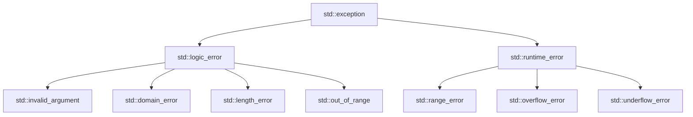

# C++ Try Catch

## Introduction

Exception handling is a crucial aspect of writing robust and reliable C++ programs. It provides a structured way to detect and respond to runtime errors or exceptional situations without disrupting the normal flow of the program. The primary mechanism for handling exceptions in C++ is the **try-catch** block.

In this tutorial, we'll explore how to use try-catch blocks in C++ to effectively handle exceptions, making your code more resilient and maintainable.

## What is a Try-Catch Block?

A try-catch block in C++ consists of two main components:

1. **Try Block**: A block of code that might throw an exception.
2. **Catch Block**: A block of code that handles the exception if one is thrown in the try block.

The basic syntax looks like this:

```cpp
try {
    // Code that might throw an exception
} catch (ExceptionType e) {
    // Code to handle the exception
}
```

## Basic Try-Catch Example

Let's start with a simple example to demonstrate how try-catch works:

```cpp
#include <iostream>
using namespace std;

int main() {
    try {
        // This will throw an int exception
        throw 20;
    } catch (int e) {
        cout << "Exception caught: " << e << endl;
    }
    
    cout << "Program continues after exception handling" << endl;
    
    return 0;
}
```

**Output:**
```
Exception caught: 20
Program continues after exception handling
```

**Explanation:**
1. Inside the try block, we explicitly throw an integer exception using the `throw` keyword.
2. The execution immediately jumps to the catch block that can handle an integer exception.
3. The catch block catches the exception, displays a message with the exception value (20).
4. After the catch block executes, the program continues normally.

## Multiple Catch Blocks

A try block can be followed by multiple catch blocks to handle different types of exceptions:

```cpp
#include <iostream>
#include <string>
using namespace std;

int main() {
    try {
        int choice;
        cout << "Enter 1 for int exception or 2 for string exception: ";
        cin >> choice;
        
        if (choice == 1) {
            throw 100;
        } else if (choice == 2) {
            throw string("String exception");
        } else {
            throw 3.14;
        }
    } 
    catch (int e) {
        cout << "Integer exception caught: " << e << endl;
    } 
    catch (string s) {
        cout << "String exception caught: " << s << endl;
    }
    catch (...) {
        cout << "Default exception handler: Unknown exception type caught" << endl;
    }
    
    cout << "Program continues after exception handling" << endl;
    
    return 0;
}
```

**Example Outputs:**

For input `1`:
```
Enter 1 for int exception or 2 for string exception: 1
Integer exception caught: 100
Program continues after exception handling
```

For input `2`:
```
Enter 1 for int exception or 2 for string exception: 2
String exception caught: String exception
Program continues after exception handling
```

For input `3`:
```
Enter 1 for int exception or 2 for string exception: 3
Default exception handler: Unknown exception type caught
Program continues after exception handling
```

**Key Points:**
1. The catch blocks are checked in order from top to bottom.
2. Only the first matching catch block is executed.
3. The `catch(...)` syntax is a catch-all handler that catches any type of exception.

## Exception Objects

In C++, you can throw and catch objects, not just basic types. This allows for more detailed exception information.

```cpp
#include <iostream>
#include <stdexcept>
using namespace std;

double divide(double a, double b) {
    if (b == 0) {
        throw runtime_error("Division by zero attempted!");
    }
    return a / b;
}

int main() {
    double a, b;
    cout << "Enter two numbers (a and b) for division (a/b): ";
    cin >> a >> b;
    
    try {
        double result = divide(a, b);
        cout << "Result of " << a << "/" << b << " = " << result << endl;
    } 
    catch (const runtime_error& e) {
        cout << "ERROR: " << e.what() << endl;
        cout << "Please try again with a non-zero denominator." << endl;
    }
    
    cout << "Program execution continues..." << endl;
    
    return 0;
}
```

**Example Outputs:**

For input `10 2`:
```
Enter two numbers (a and b) for division (a/b): 10 2
Result of 10/2 = 5
Program execution continues...
```

For input `10 0`:
```
Enter two numbers (a and b) for division (a/b): 10 0
ERROR: Division by zero attempted!
Please try again with a non-zero denominator.
Program execution continues...
```

**Important Notes:**
1. The C++ Standard Library provides several exception classes in the `<stdexcept>` header.
2. We use `const exception& e` to catch the exception by reference, which is more efficient.
3. The `what()` method returns the error message associated with the exception.

## Standard Exception Classes

C++ provides standard exception classes in the `<stdexcept>` header:

```cpp
#include <iostream>
#include <stdexcept>
#include <vector>
using namespace std;

int main() {
    try {
        // May throw out_of_range
        vector<int> vec(5);
        cout << "Accessing element at index 10" << endl;
        cout << vec.at(10) << endl;  // This will throw an exception
    } 
    catch (const out_of_range& e) {
        cout << "Out of Range exception: " << e.what() << endl;
    }
    catch (const exception& e) {
        cout << "Standard exception: " << e.what() << endl;
    }
    
    return 0;
}
```

**Output:**
```
Accessing element at index 10
Out of Range exception: vector::_M_range_check: __n (which is 10) >= this->size() (which is 5)
```

Here's a hierarchy of some common standard exception classes:



## Nested Try-Catch Blocks

You can nest try-catch blocks within each other:

```cpp
#include <iostream>
using namespace std;

int main() {
    try {
        cout << "Outer try block" << endl;
        try {
            cout << "Inner try block" << endl;
            throw 100;  // This will be caught by the inner catch
        }
        catch (int e) {
            cout << "Inner catch: " << e << endl;
            throw;  // Rethrow the exception to the outer block
        }
    }
    catch (int e) {
        cout << "Outer catch: " << e << endl;
    }
    
    cout << "Program continues" << endl;
    
    return 0;
}
```

**Output:**
```
Outer try block
Inner try block
Inner catch: 100
Outer catch: 100
Program continues
```

**Key Points:**
1. When an exception is thrown, the program looks for the nearest enclosing try-catch block.
2. The `throw;` statement without a value rethrows the current exception.

## Real-World Example: File Handling with Exceptions

Let's look at a practical example of using try-catch for file operations:

```cpp
#include <iostream>
#include <fstream>
#include <string>
using namespace std;

void readFile(const string& filename) {
    ifstream file;
    
    try {
        file.open(filename);
        
        if (!file.is_open()) {
            throw runtime_error("Could not open file: " + filename);
        }
        
        string line;
        cout << "File contents:" << endl;
        while (getline(file, line)) {
            cout << line << endl;
        }
        
        file.close();
    }
    catch (const exception& e) {
        cout << "ERROR: " << e.what() << endl;
        
        // Always close the file even if an exception occurs
        if (file.is_open()) {
            file.close();
        }
        
        // You might want to rethrow or handle differently depending on your application
    }
}

int main() {
    string filename;
    
    cout << "Enter a filename to read: ";
    cin >> filename;
    
    readFile(filename);
    
    cout << "Program execution completed." << endl;
    
    return 0;
}
```

**Example Output (when file doesn't exist):**
```
Enter a filename to read: nonexistent.txt
ERROR: Could not open file: nonexistent.txt
Program execution completed.
```

This example demonstrates how exception handling can be used to handle file operation failures gracefully.

## Best Practices for Using Try-Catch in C++

1. **Only Catch What You Can Handle**: Don't catch exceptions you don't know how to handle. Let them propagate to a higher level that can handle them.

2. **Use Specific Exception Types**: Catch the most specific exception type first, followed by more general types.

3. **Catch Exceptions by Reference**: Use `catch (const ExceptionType& e)` instead of `catch (ExceptionType e)` to avoid copying the exception object.

4. **Resource Management**: Use RAII (Resource Acquisition Is Initialization) with smart pointers and containers to automatically manage resources even when exceptions occur.

5. **Don't Use Exceptions for Normal Flow Control**: Exceptions should be for exceptional cases, not normal program flow.

6. **Document Exceptions**: Document which exceptions your functions might throw to inform other developers.

```cpp
// Good practice: documenting exceptions
/**
 * Divides two numbers.
 * @param a The numerator
 * @param b The denominator
 * @return The result of a/b
 * @throws std::runtime_error if b is zero
 */
double divide(double a, double b);
```

## Summary

Try-catch blocks are a powerful feature in C++ for handling exceptions:

1. We use `try` to enclose code that might throw exceptions.
2. We use `catch` to handle exceptions if they occur.
3. Multiple catch blocks can handle different types of exceptions.
4. C++ provides standard exception classes in the `<stdexcept>` header.
5. We can create custom exception classes by inheriting from `std::exception`.
6. Exception handling helps make programs more robust by providing structured ways to handle errors.

By learning to use try-catch blocks effectively, you can create more resilient C++ programs that handle errors gracefully and maintain program stability even when things go wrong.

## Exercises

1. Write a program that uses a try-catch block to handle division by zero.
2. Create a custom exception class that inherits from `std::exception` and use it in a try-catch block.
3. Write a program that demonstrates the use of nested try-catch blocks with rethrowing exceptions.
4. Create a program that reads integers from a file and handles both file opening exceptions and format exceptions (like when a non-integer is in the file).
5. Implement a function that validates user input for a range of values and throws appropriate exceptions when the input is invalid.

## Additional Resources

- [C++ Reference: Exception Handling](https://en.cppreference.com/w/cpp/language/exceptions)
- [C++ Standard Library Exceptions](https://en.cppreference.com/w/cpp/error/exception)
- [Best Practices for Exception Handling in C++](https://isocpp.github.io/CppCoreGuidelines/CppCoreGuidelines#e-error-handling)
- Book: "Effective C++" by Scott Meyers (Item 29: Strive for exception-safe code)