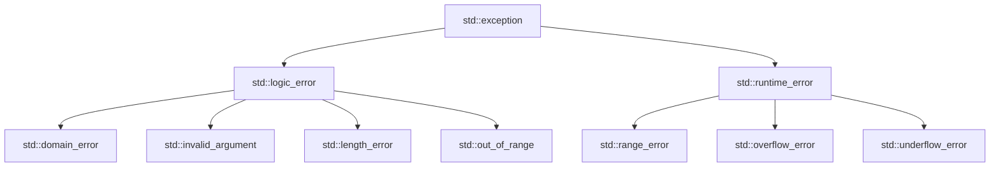

# C++ Custom Exceptions

## Introduction

In C++, exception handling provides a way to respond to runtime anomalies or errors that occur during program execution. While C++ provides several built-in exception classes (like `std::runtime_error`, `std::out_of_range`, etc.), there are many scenarios where these standard exceptions don't adequately describe your application-specific errors.

Custom exceptions allow you to define your own exception classes that:

- Provide more meaningful error messages
- Contain application-specific error data
- Enable more precise exception catching
- Improve code readability and maintainability

In this tutorial, we'll explore how to create and use custom exception classes in C++.

## Understanding the Basics

### Standard Exception Hierarchy

Before diving into custom exceptions, let's briefly review the standard exception hierarchy in C++:



All standard exceptions derive from the base class `std::exception`. When creating custom exceptions, you'll usually inherit from either `std::exception` directly or one of its derived classes.

## Creating Your First Custom Exception

The simplest way to create a custom exception is to derive from `std::exception` and override the `what()` method.

```cpp
#include <iostream>
#include <exception>
#include <string>

class MyCustomException : public std::exception {
private:
    std::string message;

public:
    // Constructor takes a string message
    MyCustomException(const std::string& msg) : message(msg) {}
    
    // Override the what() method from std::exception
    const char* what() const noexcept override {
        return message.c_str();
    }
};

// Example function that throws our custom exception
void checkValue(int value) {
    if (value < 0) {
        throw MyCustomException("Value cannot be negative");
    }
    std::cout << "Value is: " << value << std::endl;
}

int main() {
    try {
        checkValue(5);    // This will work fine
        checkValue(-10);  // This will throw our custom exception
    } catch (const MyCustomException& e) {
        std::cerr << "Custom Exception caught: " << e.what() << std::endl;
    }
    
    return 0;
}
```

**Output:**
```
Value is: 5
Custom Exception caught: Value cannot be negative
```

### How It Works

1. We define `MyCustomException` class that inherits from `std::exception`
2. We store the error message in a string member variable
3. We override the `what()` method to return our custom message
4. The `noexcept` specifier ensures that `what()` doesn't throw exceptions itself
5. In the `main()` function, we catch our custom exception and display the message

## Creating a Hierarchy of Custom Exceptions

In larger applications, it's often useful to create a hierarchy of custom exception classes to represent different types of errors.

```cpp
#include <iostream>
#include <exception>
#include <string>

// Base custom exception
class ApplicationException : public std::exception {
protected:
    std::string message;

public:
    ApplicationException(const std::string& msg) : message(msg) {}
    const char* what() const noexcept override {
        return message.c_str();
    }
};

// Derived exceptions for specific error types
class DatabaseException : public ApplicationException {
public:
    DatabaseException(const std::string& msg) 
        : ApplicationException("Database Error: " + msg) {}
};

class NetworkException : public ApplicationException {
public:
    NetworkException(const std::string& msg) 
        : ApplicationException("Network Error: " + msg) {}
};

class ValidationException : public ApplicationException {
public:
    ValidationException(const std::string& msg) 
        : ApplicationException("Validation Error: " + msg) {}
};

// Example functions that throw different exceptions
void validateUser(const std::string& username) {
    if (username.empty()) {
        throw ValidationException("Username cannot be empty");
    }
    // More validation...
}

void connectToDatabase() {
    // Simulating a database connection error
    throw DatabaseException("Connection refused");
}

int main() {
    try {
        validateUser("");
        connectToDatabase();
    } catch (const ValidationException& e) {
        std::cerr << e.what() << std::endl;
    } catch (const DatabaseException& e) {
        std::cerr << e.what() << std::endl;
    } catch (const ApplicationException& e) {
        // Catches any other application exceptions
        std::cerr << "General application error: " << e.what() << std::endl;
    } catch (const std::exception& e) {
        // Catches any standard exceptions
        std::cerr << "Standard exception: " << e.what() << std::endl;
    }
    
    return 0;
}
```

**Output:**
```
Validation Error: Username cannot be empty
```

### Benefits of Exception Hierarchies

1. **Precise error handling**: You can catch specific types of exceptions
2. **Code organization**: Grouping related exceptions makes code more maintainable
3. **Default handling**: Catch base class exceptions as a fallback

## Advanced Custom Exceptions

Let's create a more advanced custom exception that includes additional information about the error.

```cpp
#include <iostream>
#include <exception>
#include <string>
#include <sstream>

class FileException : public std::exception {
private:
    std::string message;
    std::string filename;
    int lineNumber;
    
public:
    // Constructor with detailed error information
    FileException(const std::string& msg, const std::string& fname, int line) 
        : message(msg), filename(fname), lineNumber(line) {
        
        std::stringstream ss;
        ss << "File Error (" << filename << ", line " << lineNumber << "): " << message;
        message = ss.str();
    }
    
    const char* what() const noexcept override {
        return message.c_str();
    }
    
    // Additional accessors for the extra error information
    const std::string& getFilename() const { return filename; }
    int getLineNumber() const { return lineNumber; }
};

void processFile(const std::string& filename, int lineNumber) {
    // Simulating a file processing error
    throw FileException("Could not read data", filename, lineNumber);
}

int main() {
    try {
        processFile("data.txt", 42);
    } catch (const FileException& e) {
        std::cerr << e.what() << std::endl;
        
        // We can also access the specific error details
        std::cerr << "Error occurred in file: " << e.getFilename() << std::endl;
        std::cerr << "At line: " << e.getLineNumber() << std::endl;
    }
    
    return 0;
}
```

**Output:**
```
File Error (data.txt, line 42): Could not read data
Error occurred in file: data.txt
At line: 42
```

### Key Features of Advanced Exceptions

1. **Additional context**: Store relevant error data beyond just a message
2. **Accessor methods**: Provide ways to access specific error details
3. **Formatted messages**: Create detailed error messages that include the context

## Real-World Example: Banking Application

Let's implement a more comprehensive example in the context of a simple banking application:

```cpp
#include <iostream>
#include <exception>
#include <string>
#include <vector>
#include <ctime>

// Base exception for banking operations
class BankException : public std::exception {
protected:
    std::string message;
    std::time_t timestamp;
    std::string transactionId;

public:
    BankException(const std::string& msg, const std::string& trxId = "unknown") 
        : message(msg), transactionId(trxId) {
        timestamp = std::time(nullptr);
    }
    
    const char* what() const noexcept override {
        return message.c_str();
    }
    
    std::time_t getTimestamp() const { return timestamp; }
    std::string getTransactionId() const { return transactionId; }
};

// Specific banking exceptions
class InsufficientFundsException : public BankException {
private:
    double requested;
    double available;
    
public:
    InsufficientFundsException(double req, double avail, const std::string& trxId) 
        : BankException("Insufficient funds", trxId), requested(req), available(avail) {
        
        char buffer[100];
        snprintf(buffer, sizeof(buffer), 
                 "Insufficient funds: Requested $%.2f but only $%.2f available [TrxID: %s]", 
                 requested, available, transactionId.c_str());
        message = buffer;
    }
    
    double getRequested() const { return requested; }
    double getAvailable() const { return available; }
};

class AccountNotFoundException : public BankException {
private:
    std::string accountId;
    
public:
    AccountNotFoundException(const std::string& accId, const std::string& trxId) 
        : BankException("Account not found", trxId), accountId(accId) {
        message = "Account not found: " + accountId + " [TrxID: " + transactionId + "]";
    }
    
    std::string getAccountId() const { return accountId; }
};

// Simple Bank Account class
class BankAccount {
private:
    std::string accountId;
    double balance;
    
public:
    BankAccount(const std::string& id, double initialBalance) 
        : accountId(id), balance(initialBalance) {}
    
    void withdraw(double amount, const std::string& trxId) {
        if (amount > balance) {
            throw InsufficientFundsException(amount, balance, trxId);
        }
        balance -= amount;
        std::cout << "Withdrew $" << amount << " from account " << accountId << std::endl;
        std::cout << "New balance: $" << balance << std::endl;
    }
    
    std::string getId() const { return accountId; }
};

// Bank class to manage accounts
class Bank {
private:
    std::vector<BankAccount> accounts;
    
public:
    void addAccount(const BankAccount& account) {
        accounts.push_back(account);
    }
    
    BankAccount& findAccount(const std::string& accountId, const std::string& trxId) {
        for (auto& account : accounts) {
            if (account.getId() == accountId) {
                return account;
            }
        }
        throw AccountNotFoundException(accountId, trxId);
    }
    
    void transferFunds(const std::string& fromAccountId, const std::string& toAccountId, 
                      double amount, const std::string& trxId) {
        // In a real application, we would make this atomic
        try {
            BankAccount& fromAccount = findAccount(fromAccountId, trxId);
            BankAccount& toAccount = findAccount(toAccountId, trxId);
            
            fromAccount.withdraw(amount, trxId);
            // Add deposit functionality...
            
            std::cout << "Transfer complete: $" << amount 
                      << " from " << fromAccountId << " to " << toAccountId << std::endl;
        } catch (BankException& e) {
            std::cerr << "Transaction " << trxId << " failed: " << e.what() << std::endl;
            throw; // rethrow for higher-level handling
        }
    }
};

// Helper to generate transaction IDs
std::string generateTransactionId() {
    static int counter = 1000;
    return "TRX" + std::to_string(++counter);
}

int main() {
    Bank bank;
    
    // Add some accounts
    bank.addAccount(BankAccount("ACC001", 1000.0));
    bank.addAccount(BankAccount("ACC002", 500.0));
    
    try {
        // Try a successful transfer
        std::string trxId1 = generateTransactionId();
        bank.transferFunds("ACC001", "ACC002", 200.0, trxId1);
        
        // Try a transfer with insufficient funds
        std::string trxId2 = generateTransactionId();
        bank.transferFunds("ACC002", "ACC001", 1000.0, trxId2);
        
    } catch (const InsufficientFundsException& e) {
        std::cerr << "Error: " << e.what() << std::endl;
        std::cerr << "  Requested amount: $" << e.getRequested() << std::endl;
        std::cerr << "  Available balance: $" << e.getAvailable() << std::endl;
        std::cerr << "  Transaction time: " << std::ctime(&e.getTimestamp());
    } catch (const AccountNotFoundException& e) {
        std::cerr << "Error: " << e.what() << std::endl;
        std::cerr << "  Missing account: " << e.getAccountId() << std::endl;
    } catch (const BankException& e) {
        std::cerr << "Bank error: " << e.what() << std::endl;
    } catch (const std::exception& e) {
        std::cerr << "Standard exception: " << e.what() << std::endl;
    }
    
    // Try to access a non-existent account
    try {
        std::string trxId3 = generateTransactionId();
        bank.findAccount("ACC999", trxId3);
    } catch (const BankException& e) {
        std::cerr << "Error: " << e.what() << std::endl;
    }
    
    return 0;
}
```

**Output:**
```
Withdrew $200 from account ACC001
New balance: $800
Transfer complete: $200 from ACC001 to ACC002
Transaction TRX1002 failed: Insufficient funds: Requested $1000.00 but only $500.00 available [TrxID: TRX1002]
Error: Insufficient funds: Requested $1000.00 but only $500.00 available [TrxID: TRX1002]
  Requested amount: $1000
  Available balance: $500
  Transaction time: Wed Sep 27 10:30:45 2023
Error: Account not found: ACC999 [TrxID: TRX1003]
```

### Key Concepts Demonstrated

1. **Exception hierarchy**: A base class with specific derived exception types
2. **Rich error context**: Storing detailed information about errors
3. **Transaction IDs**: Including identifiers to track errors across systems
4. **Specific exception handlers**: Catching different exception types to handle them differently
5. **Rethrowing exceptions**: After logging or partial handling

## Best Practices for Custom Exceptions

1. **Inherit from std::exception**: Always derive from `std::exception` or one of its subclasses
2. **Override what() method**: Provide clear, specific error messages
3. **Use const and noexcept**: Make `what()` const and noexcept for compatibility
4. **Create a hierarchy**: Design a logical exception hierarchy for your application
5. **Include context**: Store relevant information about the error
6. **Keep exceptions lightweight**: Avoid complex operations in constructors and destructors
7. **Document exceptions**: Clearly document which exceptions a function may throw

## When to Use Custom Exceptions

Custom exceptions are particularly useful when:

1. Standard exceptions don't adequately describe your error
2. You need to include application-specific error data
3. Your application needs to distinguish between different error types
4. You want to provide more detailed error information for debugging or logging
5. You're developing a library or framework that needs its own exception types

## Summary

Custom exceptions in C++ provide a powerful way to handle application-specific errors. By creating your own exception classes that inherit from `std::exception`, you can:

- Create a hierarchy of error types specific to your application
- Include detailed context about errors
- Handle different error types differently
- Improve the readability and maintainability of your code

Custom exceptions help you communicate error conditions more effectively and make your code more robust.

## Exercises

1. Create a custom exception hierarchy for a file processing application that includes exceptions for file not found, permission denied, and corrupt file errors.

2. Modify the banking example to add a `DailyLimitExceededException` that is thrown when a user tries to withdraw more than a daily limit.

3. Create a custom exception that includes a severity level (e.g., warning, error, critical) and implement a system that handles exceptions differently based on severity.

4. Implement a logging system that records all caught exceptions to a file, including timestamp, exception type, and message.

5. Extend the banking example to handle multiple currencies and create appropriate exceptions for currency conversion errors.

## Additional Resources

- [C++ Reference: std::exception](https://en.cppreference.com/w/cpp/error/exception)
- [C++ Exception Handling Best Practices](https://isocpp.github.io/CppCoreGuidelines/CppCoreGuidelines#e-error-handling)
- [Effective C++](https://www.amazon.com/Effective-Specific-Improve-Programs-Designs/dp/0321334876) by Scott Meyers (Chapter on Exception Safety)
- [Exceptional C++](https://www.amazon.com/Exceptional-Engineering-Programming-Problems-Solutions/dp/0201615622) by Herb Sutter