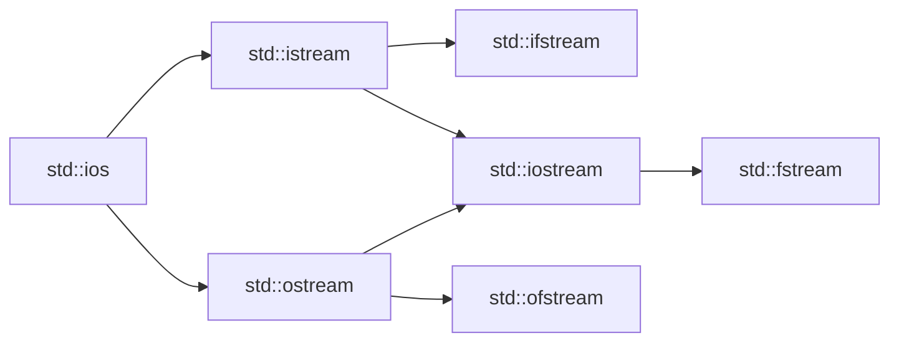

# C++ File Streams

## Introduction

File handling is a crucial aspect of programming that allows us to store and retrieve data persistently. In C++, file operations are performed using **file streams**, which provide a convenient way to read from and write to files. File streams extend the same principles you're already familiar with from console I/O (`cin` and `cout`), making them intuitive to learn.

In this tutorial, we'll explore how C++ file streams work, the different types available, and how to use them effectively in your programs.

## What Are File Streams?

File streams in C++ are objects that connect your program to external files on your storage device. They act as a bridge, allowing data to flow between your program and these files.

C++ provides three main classes for file operations, all defined in the `<fstream>` header:

1. **`ifstream` (Input File Stream)**: Used for reading data from files
2. **`ofstream` (Output File Stream)**: Used for writing data to files
3. **`fstream` (File Stream)**: Used for both reading from and writing to files

These classes are derived from the more general I/O stream classes, which is why they share similar functionality with `cin` and `cout`.



## Basic File Operations

Let's explore the fundamental operations you can perform with file streams.

### Opening a File

Before you can read from or write to a file, you need to open it. Here's how you can open a file:

```cpp
#include <iostream>
#include <fstream>
using namespace std;

int main() {
    // Opening a file for reading
    ifstream inputFile("input.txt");
    
    // Opening a file for writing
    ofstream outputFile("output.txt");
    
    // Opening a file for both reading and writing
    fstream dataFile("data.txt", ios::in | ios::out);
    
    // Check if files were opened successfully
    if (!inputFile) {
        cout << "Failed to open input.txt" << endl;
    }
    
    if (!outputFile) {
        cout << "Failed to open output.txt" << endl;
    }
    
    // Close files when done
    inputFile.close();
    outputFile.close();
    dataFile.close();
    
    return 0;
}
```

### File Opening Modes

When opening a file, you can specify a mode to determine how the file should be handled:

| Mode Flag | Description |
|-----------|-------------|
| `ios::in` | Open for reading (default for ifstream) |
| `ios::out` | Open for writing (default for ofstream) |
| `ios::app` | Append to the end of the file |
| `ios::ate` | Set initial position to the end of the file |
| `ios::trunc` | Truncate the file (delete existing content) |
| `ios::binary` | Open in binary mode |

You can combine these flags using the bitwise OR operator (`|`).

## Reading from Files

Let's look at how to read data from files using `ifstream`:

```cpp
#include <iostream>
#include <fstream>
#include <string>
using namespace std;

int main() {
    ifstream inputFile("sample.txt");
    
    if (!inputFile) {
        cout << "Unable to open file" << endl;
        return 1;
    }
    
    // Reading file line by line
    string line;
    cout << "File contents:" << endl;
    while (getline(inputFile, line)) {
        cout << line << endl;
    }
    
    inputFile.close();
    return 0;
}
```

**Input (sample.txt):**
```
Hello, World!
This is a sample text file.
We're learning C++ file streams.
```

**Output:**
```
File contents:
Hello, World!
This is a sample text file.
We're learning C++ file streams.
```

### Reading Word by Word or Character by Character

You can also read a file word by word or character by character:

```cpp
#include <iostream>
#include <fstream>
#include <string>
using namespace std;

int main() {
    ifstream inputFile("sample.txt");
    
    if (!inputFile) {
        cout << "Unable to open file" << endl;
        return 1;
    }
    
    // Reading word by word
    cout << "Reading word by word:" << endl;
    string word;
    while (inputFile >> word) {
        cout << word << " ";
    }
    cout << endl;
    
    // Reset file position to beginning
    inputFile.clear();  // Clear any error flags
    inputFile.seekg(0); // Go back to the beginning
    
    // Reading character by character
    cout << "Reading character by character:" << endl;
    char ch;
    while (inputFile.get(ch)) {
        cout << ch;
    }
    
    inputFile.close();
    return 0;
}
```

## Writing to Files

Writing to files with `ofstream` is similar to using `cout` for console output:

```cpp
#include <iostream>
#include <fstream>
using namespace std;

int main() {
    ofstream outputFile("output.txt");
    
    if (!outputFile) {
        cout << "Unable to open file for writing" << endl;
        return 1;
    }
    
    // Writing to the file
    outputFile << "Hello, File!" << endl;
    outputFile << "This text is being written to a file." << endl;
    outputFile << "C++ file streams make file handling easy." << endl;
    
    // Writing numbers and other data types
    outputFile << "Number: " << 42 << endl;
    outputFile << "Float: " << 3.14159 << endl;
    
    cout << "Data has been written to output.txt" << endl;
    
    outputFile.close();
    return 0;
}
```

**Output (output.txt):**
```
Hello, File!
This text is being written to a file.
C++ file streams make file handling easy.
Number: 42
Float: 3.14159
```

### Appending to Files

If you want to add data to the end of an existing file without overwriting its content, you can use the `ios::app` mode:

```cpp
#include <iostream>
#include <fstream>
using namespace std;

int main() {
    // Open file in append mode
    ofstream outputFile("output.txt", ios::app);
    
    if (!outputFile) {
        cout << "Unable to open file for appending" << endl;
        return 1;
    }
    
    // Append to the file
    outputFile << "\nThis line is appended to the file." << endl;
    outputFile << "The previous content remains intact." << endl;
    
    cout << "Data has been appended to output.txt" << endl;
    
    outputFile.close();
    return 0;
}
```

## Reading and Writing Binary Files

Text files are great for human-readable data, but sometimes you need to store data in its raw binary form. This is especially important for non-text data like images or when you want to preserve the exact memory representation of data.

```cpp
#include <iostream>
#include <fstream>
using namespace std;

struct Student {
    int id;
    char name[50];
    float gpa;
};

int main() {
    // Writing binary data
    Student student1 = {1001, "Alice Smith", 3.75f};
    
    ofstream outBinary("students.bin", ios::binary);
    if (!outBinary) {
        cout << "Failed to open file for binary writing" << endl;
        return 1;
    }
    
    outBinary.write(reinterpret_cast<char*>(&student1), sizeof(Student));
    outBinary.close();
    
    // Reading binary data
    Student student2;
    
    ifstream inBinary("students.bin", ios::binary);
    if (!inBinary) {
        cout << "Failed to open file for binary reading" << endl;
        return 1;
    }
    
    inBinary.read(reinterpret_cast<char*>(&student2), sizeof(Student));
    
    cout << "Student ID: " << student2.id << endl;
    cout << "Name: " << student2.name << endl;
    cout << "GPA: " << student2.gpa << endl;
    
    inBinary.close();
    return 0;
}
```

**Output:**
```
Student ID: 1001
Name: Alice Smith
GPA: 3.75
```

## File Position and Navigation

C++ file streams allow you to navigate within a file, check your position, and move to specific locations:

```cpp
#include <iostream>
#include <fstream>
using namespace std;

int main() {
    fstream file("position.txt", ios::in | ios::out | ios::trunc);
    
    if (!file) {
        cout << "Failed to open file" << endl;
        return 1;
    }
    
    // Write some data
    file << "ABCDEFGHIJKLMNOPQRSTUVWXYZ";
    
    // Get current position
    cout << "Current position after writing: " << file.tellp() << endl;
    
    // Move to the beginning
    file.seekg(0, ios::beg);
    cout << "Position after seekg(0): " << file.tellg() << endl;
    
    // Read 5 characters
    char buffer[6];
    file.read(buffer, 5);
    buffer[5] = '\0';
    cout << "Read 5 chars: " << buffer << endl;
    
    // Current position after reading
    cout << "Current position after reading: " << file.tellg() << endl;
    
    // Move 10 positions forward from current position
    file.seekg(10, ios::cur);
    
    // Read 5 more characters
    file.read(buffer, 5);
    buffer[5] = '\0';
    cout << "After seekg(10, cur), read 5 chars: " << buffer << endl;
    
    // Move to the 5th position from the beginning
    file.seekg(5, ios::beg);
    file.read(buffer, 5);
    buffer[5] = '\0';
    cout << "After seekg(5, beg), read 5 chars: " << buffer << endl;
    
    file.close();
    return 0;
}
```

**Output:**
```
Current position after writing: 26
Position after seekg(0): 0
Read 5 chars: ABCDE
Current position after reading: 5
After seekg(10, cur), read 5 chars: PQRST
After seekg(5, beg), read 5 chars: FGHIJ
```

## Error Handling in File Operations

Proper error handling is essential when working with files. Here's how to handle common file operation errors:

```cpp
#include <iostream>
#include <fstream>
using namespace std;

int main() {
    ifstream file("nonexistent.txt");
    
    // Method 1: Using the bool conversion operator
    if (!file) {
        cout << "Method 1: Failed to open file" << endl;
    }
    
    // Method 2: Using is_open()
    if (!file.is_open()) {
        cout << "Method 2: File is not open" << endl;
    }
    
    // Method 3: Using explicit error state functions
    if (file.fail()) {
        cout << "Method 3: Operation failed" << endl;
    }
    
    // Try to read from the file
    string line;
    getline(file, line);
    
    // Check for read errors
    if (file.bad()) {
        cout << "Fatal I/O error occurred" << endl;
    } else if (file.eof()) {
        cout << "End of file reached" << endl;
    } else if (file.fail()) {
        cout << "Non-fatal error occurred" << endl;
    }
    
    // Clear error flags
    file.clear();
    
    // Try to open a different file
    file.open("sample.txt");
    if (file) {
        cout << "Successfully opened sample.txt" << endl;
    }
    
    file.close();
    return 0;
}
```

## Practical Example: Student Record System

Let's create a practical example that demonstrates how to use file streams to implement a simple student record system:

```cpp
#include <iostream>
#include <fstream>
#include <string>
#include <vector>
#include <iomanip>
using namespace std;

struct Student {
    int id;
    string name;
    double gpa;
};

// Function to add a student record
void addStudent(const Student& student) {
    ofstream file("students.txt", ios::app);
    if (!file) {
        cout << "Error opening file for writing!" << endl;
        return;
    }
    
    file << student.id << "," << student.name << "," << student.gpa << endl;
    cout << "Student record added successfully!" << endl;
    file.close();
}

// Function to display all student records
void displayAllStudents() {
    ifstream file("students.txt");
    if (!file) {
        cout << "No student records found or error opening file." << endl;
        return;
    }
    
    vector<Student> students;
    string line;
    
    // Read all student records
    while (getline(file, line)) {
        Student student;
        size_t pos1 = line.find(',');
        size_t pos2 = line.find(',', pos1 + 1);
        
        if (pos1 != string::npos && pos2 != string::npos) {
            student.id = stoi(line.substr(0, pos1));
            student.name = line.substr(pos1 + 1, pos2 - pos1 - 1);
            student.gpa = stod(line.substr(pos2 + 1));
            students.push_back(student);
        }
    }
    
    file.close();
    
    // Display records in a formatted table
    if (students.empty()) {
        cout << "No student records found." << endl;
        return;
    }
    
    cout << "\n===== Student Records =====\n";
    cout << setw(5) << "ID" << setw(20) << "Name" << setw(10) << "GPA" << endl;
    cout << "------------------------------------" << endl;
    
    for (const auto& student : students) {
        cout << setw(5) << student.id 
             << setw(20) << student.name 
             << setw(10) << fixed << setprecision(2) << student.gpa << endl;
    }
    cout << "============================\n" << endl;
}

// Function to search for a student by ID
void searchStudent(int id) {
    ifstream file("students.txt");
    if (!file) {
        cout << "Error opening file!" << endl;
        return;
    }
    
    string line;
    bool found = false;
    
    while (getline(file, line)) {
        size_t pos1 = line.find(',');
        if (pos1 != string::npos) {
            int studentId = stoi(line.substr(0, pos1));
            if (studentId == id) {
                size_t pos2 = line.find(',', pos1 + 1);
                string name = line.substr(pos1 + 1, pos2 - pos1 - 1);
                double gpa = stod(line.substr(pos2 + 1));
                
                cout << "\nStudent found:\n";
                cout << "ID: " << id << endl;
                cout << "Name: " << name << endl;
                cout << "GPA: " << fixed << setprecision(2) << gpa << endl;
                
                found = true;
                break;
            }
        }
    }
    
    if (!found) {
        cout << "Student with ID " << id << " not found." << endl;
    }
    
    file.close();
}

int main() {
    int choice;
    
    do {
        cout << "\n===== Student Record System =====\n";
        cout << "1. Add Student\n";
        cout << "2. Display All Students\n";
        cout << "3. Search Student by ID\n";
        cout << "4. Exit\n";
        cout << "Enter your choice: ";
        cin >> choice;
        
        switch (choice) {
            case 1: {
                Student student;
                cout << "Enter student ID: ";
                cin >> student.id;
                cin.ignore(); // Clear newline from buffer
                cout << "Enter student name: ";
                getline(cin, student.name);
                cout << "Enter student GPA: ";
                cin >> student.gpa;
                addStudent(student);
                break;
            }
            case 2:
                displayAllStudents();
                break;
            case 3: {
                int id;
                cout << "Enter student ID to search: ";
                cin >> id;
                searchStudent(id);
                break;
            }
            case 4:
                cout << "Exiting program. Goodbye!" << endl;
                break;
            default:
                cout << "Invalid choice. Please try again." << endl;
        }
    } while (choice != 4);
    
    return 0;
}
```

This program demonstrates:
1. Writing data to a file in a structured format
2. Reading and parsing data from a file
3. Searching for specific records
4. Handling file operations with proper error checking

## Summary

In this tutorial, we've covered the fundamentals of C++ file streams:

- The three main file stream classes: `ifstream`, `ofstream`, and `fstream`
- Opening and closing files with different modes
- Reading from files line by line, word by word, and character by character
- Writing data to files and appending to existing files
- Working with binary files
- Navigating within files using position functions
- Handling errors during file operations
- A practical example showing how to build a simple record management system

File streams are an essential part of C++ programming, enabling you to work with persistent data storage. They follow the same principles as other I/O streams in C++, making them intuitive to use once you understand the basics.

## Exercises

To reinforce your understanding of C++ file streams, try these exercises:

1. Create a program that counts the number of words, characters, and lines in a text file.
2. Implement a simple text file encryption/decryption program using character substitution.
3. Write a program that merges two sorted text files into a third file, keeping the result sorted.
4. Create a phone book application that allows users to add, search, update, and delete contacts, storing all data in a file.
5. Implement a program that reads a CSV file containing student grades and calculates statistics like average, highest, and lowest grades for each subject.

## Additional Resources

- [C++ Reference: fstream](https://en.cppreference.com/w/cpp/header/fstream)
- [C++ Reference: basic_ifstream](https://en.cppreference.com/w/cpp/io/basic_ifstream)
- [C++ Reference: basic_ofstream](https://en.cppreference.com/w/cpp/io/basic_ofstream)
- [C++ Reference: basic_fstream](https://en.cppreference.com/w/cpp/io/basic_fstream)
- [C++ File Handling Standard Library](https://www.cplusplus.com/reference/fstream/)