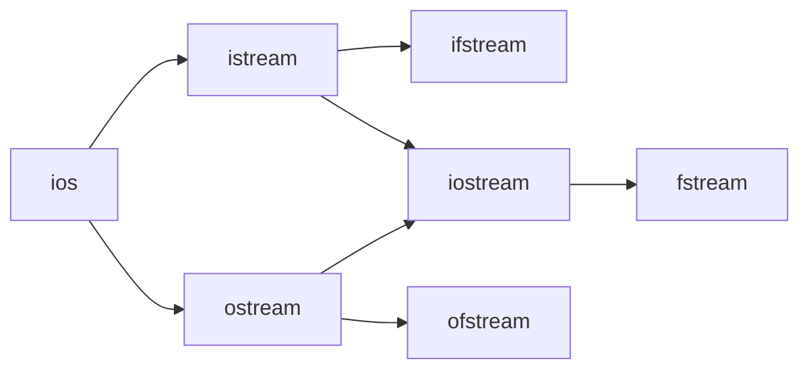

# C++ File Operations

## Introduction

File operations are an essential part of programming, allowing applications to store and retrieve data persistently. In C++, file handling is implemented through stream classes that provide a consistent interface for working with different types of data sources and destinations, including files.

In this tutorial, we'll explore various file operations in C++, from basic reading and writing to more advanced techniques. Understanding these concepts will enable you to create programs that can save user data, load configurations, process large datasets, and more.

## File Streams in C++

C++ provides three main classes for file operations:

1. `ifstream`: Input file stream for reading from files
2. `ofstream`: Output file stream for writing to files
3. `fstream`: File stream for both reading and writing

These classes are defined in the `<fstream>` header and inherit from more general stream classes that handle input and output operations.



## Basic File Operations

### Opening and Closing Files

Before performing any operations on a file, you need to open it. When you're done, you should close it to free up system resources.

```cpp
#include <iostream>
#include <fstream>
using namespace std;

int main() {
    // Opening a file for writing
    ofstream outFile("example.txt");
    
    // Check if file opened successfully
    if (!outFile) {
        cout << "Error opening file!" << endl;
        return 1;
    }
    
    // Write to the file
    outFile << "Hello, File Handling in C++!" << endl;
    
    // Close the file
    outFile.close();
    
    cout << "File written successfully!" << endl;
    return 0;
}
```

**Output:**
```
File written successfully!
```

After running this code, a file named `example.txt` will be created with the text "Hello, File Handling in C++!".

### File Opening Modes

When opening a file, you can specify different modes to control how the file is accessed:

| Mode | Description |
|------|-------------|
| `ios::in` | Open for reading (default for ifstream) |
| `ios::out` | Open for writing (default for ofstream) |
| `ios::app` | Append mode - all output to the end of file |
| `ios::ate` | Set initial position to the end of file |
| `ios::trunc` | Delete contents if file exists (default for ofstream) |
| `ios::binary` | Open in binary mode |

You can combine these modes using the bitwise OR operator (`|`):

```cpp
// Open file for both reading and writing in binary mode
fstream file("data.bin", ios::in | ios::out | ios::binary);
```

## Reading from Files

### Reading File Line by Line

The most common way to read text files is line by line using `getline()`:

```cpp
#include <iostream>
#include <fstream>
#include <string>
using namespace std;

int main() {
    ifstream inFile("example.txt");
    
    if (!inFile) {
        cout << "Error opening file for reading!" << endl;
        return 1;
    }
    
    string line;
    while (getline(inFile, line)) {
        cout << "Read: " << line << endl;
    }
    
    inFile.close();
    return 0;
}
```

**Input file (example.txt):**
```
Hello, File Handling in C++!
This is the second line.
And this is the third line.
```

**Output:**
```
Read: Hello, File Handling in C++!
Read: This is the second line.
Read: And this is the third line.
```

### Reading Word by Word

You can use the extraction operator (`>>`) to read word by word:

```cpp
#include <iostream>
#include <fstream>
#include <string>
using namespace std;

int main() {
    ifstream inFile("words.txt");
    
    if (!inFile) {
        cout << "Error opening file!" << endl;
        return 1;
    }
    
    string word;
    while (inFile >> word) {
        cout << "Word: " << word << endl;
    }
    
    inFile.close();
    return 0;
}
```

**Input file (words.txt):**
```
C++ File Handling is really useful!
```

**Output:**
```
Word: C++
Word: File
Word: Handling
Word: is
Word: really
Word: useful!
```

### Reading Character by Character

For more fine-grained control, you can read files character by character:

```cpp
#include <iostream>
#include <fstream>
using namespace std;

int main() {
    ifstream inFile("char.txt");
    
    if (!inFile) {
        cout << "Error opening file!" << endl;
        return 1;
    }
    
    char ch;
    int count = 0;
    
    while (inFile.get(ch)) {
        cout << ch;
        count++;
    }
    
    cout << "\nTotal characters read: " << count << endl;
    
    inFile.close();
    return 0;
}
```

**Input file (char.txt):**
```
ABC123
```

**Output:**
```
ABC123
Total characters read: 6
```

## Writing to Files

### Basic Text Writing

You can write to files using the insertion operator (`<<`):

```cpp
#include <iostream>
#include <fstream>
using namespace std;

int main() {
    ofstream outFile("output.txt");
    
    if (!outFile) {
        cout << "Error opening file for writing!" << endl;
        return 1;
    }
    
    // Writing strings
    outFile << "Learning C++ File Handling" << endl;
    
    // Writing numbers
    outFile << "The value of pi is approximately " << 3.14159 << endl;
    
    // Writing a formatted table
    outFile << "Number\tSquare\tCube" << endl;
    for (int i = 1; i <= 5; i++) {
        outFile << i << "\t" << i*i << "\t" << i*i*i << endl;
    }
    
    outFile.close();
    cout << "File written successfully!" << endl;
    return 0;
}
```

**Output:**
```
File written successfully!
```

**Generated file (output.txt):**
```
Learning C++ File Handling
The value of pi is approximately 3.14159
Number	Square	Cube
1	1	1
2	4	8
3	9	27
4	16	64
5	25	125
```

### Appending to Files

To add content to the end of an existing file without overwriting it:

```cpp
#include <iostream>
#include <fstream>
using namespace std;

int main() {
    // Open file in append mode
    ofstream outFile("log.txt", ios::app);
    
    if (!outFile) {
        cout << "Error opening log file!" << endl;
        return 1;
    }
    
    // Get current time
    time_t now = time(0);
    string dt = ctime(&now);
    
    // Append a log entry
    outFile << "[" << dt.substr(0, dt.length()-1) << "] Program executed successfully" << endl;
    
    outFile.close();
    cout << "Log entry added!" << endl;
    return 0;
}
```

**Output:**
```
Log entry added!
```

Each time you run this program, a new line will be added to `log.txt` with the current timestamp.

## Advanced File Operations

### File Position Indicators

C++ provides functions to move and determine the position within a file:

```cpp
#include <iostream>
#include <fstream>
using namespace std;

int main() {
    fstream file("random_access.txt", ios::in | ios::out | ios::trunc);
    
    if (!file) {
        cout << "Error opening file!" << endl;
        return 1;
    }
    
    // Write some data
    file << "ABCDEFGHIJKLMNOPQRSTUVWXYZ";
    
    // Move to a specific position (0-based)
    file.seekp(5, ios::beg);  // Position 5 from beginning
    file << "***";            // Overwrite characters at positions 5, 6, 7
    
    // Reset to beginning of file
    file.seekg(0, ios::beg);
    
    // Read the entire file
    string content;
    char ch;
    while (file.get(ch)) {
        content += ch;
    }
    
    cout << "File content: " << content << endl;
    
    file.close();
    return 0;
}
```

**Output:**
```
File content: ABCDE***IJKLMNOPQRSTUVWXYZ
```

The key position functions are:
- `seekg()`: Move the "get" position (for reading)
- `seekp()`: Move the "put" position (for writing)
- `tellg()`: Get the current "get" position
- `tellp()`: Get the current "put" position

### Binary File Operations

For working with non-text data, binary mode provides more control:

```cpp
#include <iostream>
#include <fstream>
#include <vector>
using namespace std;

struct Person {
    char name[50];
    int age;
    double salary;
};

int main() {
    // Writing binary data
    ofstream outFile("people.bin", ios::binary);
    
    if (!outFile) {
        cout << "Error opening file for writing!" << endl;
        return 1;
    }
    
    vector<Person> people = {
        {"Alice Smith", 28, 75000.50},
        {"Bob Johnson", 35, 82500.75},
        {"Carol Davis", 42, 95000.00}
    };
    
    // Write the number of records
    int numRecords = people.size();
    outFile.write(reinterpret_cast<char*>(&numRecords), sizeof(numRecords));
    
    // Write each record
    for (const auto& person : people) {
        outFile.write(reinterpret_cast<const char*>(&person), sizeof(Person));
    }
    
    outFile.close();
    
    // Reading binary data
    ifstream inFile("people.bin", ios::binary);
    
    if (!inFile) {
        cout << "Error opening file for reading!" << endl;
        return 1;
    }
    
    int readRecords;
    inFile.read(reinterpret_cast<char*>(&readRecords), sizeof(readRecords));
    
    cout << "Reading " << readRecords << " records:" << endl;
    
    for (int i = 0; i < readRecords; i++) {
        Person person;
        inFile.read(reinterpret_cast<char*>(&person), sizeof(Person));
        
        cout << "Name: " << person.name << ", Age: " << person.age 
             << ", Salary: $" << fixed << setprecision(2) << person.salary << endl;
    }
    
    inFile.close();
    return 0;
}
```

**Output:**
```
Reading 3 records:
Name: Alice Smith, Age: 28, Salary: $75000.50
Name: Bob Johnson, Age: 35, Salary: $82500.75
Name: Carol Davis, Age: 42, Salary: $95000.00
```

## Error Handling in File Operations

C++ provides several methods to check for file operation errors:

```cpp
#include <iostream>
#include <fstream>
using namespace std;

int main() {
    ifstream file("nonexistent.txt");
    
    // Method 1: Using the file object in a boolean context
    if (!file) {
        cout << "Method 1: File could not be opened!" << endl;
    }
    
    // Method 2: Using is_open()
    if (!file.is_open()) {
        cout << "Method 2: File is not open!" << endl;
    }
    
    // Method 3: Using fail()
    if (file.fail()) {
        cout << "Method 3: File operation failed!" << endl;
    }
    
    // Try to read from a file that doesn't exist
    int number;
    file >> number;
    
    // Check for read errors
    if (file.eof()) {
        cout << "Reached end of file" << endl;
    }
    
    if (file.bad()) {
        cout << "Fatal I/O error occurred!" << endl;
    }
    
    // Clear the error flags and try again
    file.clear();
    
    file.close();
    return 0;
}
```

**Output:**
```
Method 1: File could not be opened!
Method 2: File is not open!
Method 3: File operation failed!
Fatal I/O error occurred!
```

## Practical Examples

### Creating a Simple Text Editor

This simple text editor allows users to create, read, and append to text files:

```cpp
#include <iostream>
#include <fstream>
#include <string>
using namespace std;

void createFile(const string& filename) {
    ofstream file(filename);
    
    if (!file) {
        cout << "Error creating file!" << endl;
        return;
    }
    
    cout << "Enter text (type END on a new line to finish):" << endl;
    string line;
    
    while (getline(cin, line) && line != "END") {
        file << line << endl;
    }
    
    file.close();
    cout << "File saved successfully!" << endl;
}

void readFile(const string& filename) {
    ifstream file(filename);
    
    if (!file) {
        cout << "Error opening file or file does not exist!" << endl;
        return;
    }
    
    cout << "\n--- File Content ---\n" << endl;
    
    string line;
    while (getline(file, line)) {
        cout << line << endl;
    }
    
    cout << "\n--- End of File ---\n" << endl;
    file.close();
}

void appendToFile(const string& filename) {
    ifstream checkFile(filename);
    if (!checkFile) {
        cout << "File does not exist!" << endl;
        checkFile.close();
        return;
    }
    checkFile.close();
    
    ofstream file(filename, ios::app);
    
    cout << "Enter text to append (type END on a new line to finish):" << endl;
    string line;
    
    while (getline(cin, line) && line != "END") {
        file << line << endl;
    }
    
    file.close();
    cout << "Content appended successfully!" << endl;
}

int main() {
    int choice;
    string filename;
    
    do {
        cout << "\n--- Simple Text Editor ---" << endl;
        cout << "1. Create new file" << endl;
        cout << "2. Read file" << endl;
        cout << "3. Append to file" << endl;
        cout << "4. Exit" << endl;
        cout << "Enter your choice: ";
        cin >> choice;
        cin.ignore(); // Clear newline from input buffer
        
        if (choice >= 1 && choice <= 3) {
            cout << "Enter filename: ";
            getline(cin, filename);
        }
        
        switch (choice) {
            case 1:
                createFile(filename);
                break;
            case 2:
                readFile(filename);
                break;
            case 3:
                appendToFile(filename);
                break;
            case 4:
                cout << "Exiting program." << endl;
                break;
            default:
                cout << "Invalid choice. Please try again." << endl;
        }
    } while (choice != 4);
    
    return 0;
}
```

### CSV File Processing

This example demonstrates reading and writing CSV (Comma-Separated Values) files:

```cpp
#include <iostream>
#include <fstream>
#include <sstream>
#include <vector>
#include <string>
using namespace std;

// Function to split a string by delimiter
vector<string> split(const string& s, char delimiter) {
    vector<string> tokens;
    string token;
    istringstream tokenStream(s);
    
    while (getline(tokenStream, token, delimiter)) {
        tokens.push_back(token);
    }
    
    return tokens;
}

// Structure to represent a student
struct Student {
    string name;
    int id;
    double gpa;
};

// Function to write students to CSV file
void writeStudentsToCSV(const vector<Student>& students, const string& filename) {
    ofstream file(filename);
    
    if (!file) {
        cout << "Error opening file for writing!" << endl;
        return;
    }
    
    // Write header
    file << "Name,ID,GPA" << endl;
    
    // Write data
    for (const auto& student : students) {
        file << student.name << "," << student.id << "," << student.gpa << endl;
    }
    
    file.close();
    cout << "Students data saved to " << filename << endl;
}

// Function to read students from CSV file
vector<Student> readStudentsFromCSV(const string& filename) {
    vector<Student> students;
    ifstream file(filename);
    
    if (!file) {
        cout << "Error opening file for reading!" << endl;
        return students;
    }
    
    string line;
    
    // Skip header line
    getline(file, line);
    
    // Read data lines
    while (getline(file, line)) {
        vector<string> fields = split(line, ',');
        
        if (fields.size() == 3) {
            Student student;
            student.name = fields[0];
            student.id = stoi(fields[1]);
            student.gpa = stod(fields[2]);
            
            students.push_back(student);
        }
    }
    
    file.close();
    return students;
}

int main() {
    // Create some student data
    vector<Student> students = {
        {"John Smith", 101, 3.8},
        {"Emily Johnson", 102, 4.0},
        {"Michael Brown", 103, 3.6},
        {"Jessica Davis", 104, 3.9}
    };
    
    // Write to CSV file
    writeStudentsToCSV(students, "students.csv");
    
    // Read from CSV file
    vector<Student> loadedStudents = readStudentsFromCSV("students.csv");
    
    // Display the loaded data
    cout << "\nLoaded " << loadedStudents.size() << " students:" << endl;
    cout << "----------------------------------------" << endl;
    cout << "Name\t\tID\tGPA" << endl;
    cout << "----------------------------------------" << endl;
    
    for (const auto& student : loadedStudents) {
        cout << student.name;
        
        // Add tabs based on name length for better formatting
        if (student.name.length() < 8) {
            cout << "\t\t";
        } else if (student.name.length() < 16) {
            cout << "\t";
        }
        
        cout << student.id << "\t" << student.gpa << endl;
    }
    
    return 0;
}
```

**Output:**
```
Students data saved to students.csv

Loaded 4 students:
----------------------------------------
Name            ID      GPA
----------------------------------------
John Smith      101     3.8
Emily Johnson   102     4
Michael Brown   103     3.6
Jessica Davis   104     3.9
```

## Summary

In this tutorial, we've covered:

1. **Basic file operations:**
   - Opening and closing files
   - File modes (read, write, append, binary)
   
2. **Reading from files:**
   - Line by line
   - Word by word
   - Character by character
   
3. **Writing to files:**
   - Text writing
   - Appending
   
4. **Advanced file operations:**
   - File position manipulation
   - Binary file handling
   - Error handling
   
5. **Practical examples:**
   - A simple text editor
   - CSV file processing

File operations are essential for creating programs that can save and retrieve data. Whether you're building a simple text editor, processing data files, or creating a complex application that needs to store user settings, the file handling capabilities of C++ provide powerful tools for working with persistent data.

## Exercises

To practice what you've learned, try these exercises:

1. Create a program that counts the number of words, lines, and characters in a text file.
2. Implement a program that merges two sorted text files into a third file, maintaining the sorted order.
3. Build a simple address book application that stores contacts in a binary file and allows adding, searching, and deleting contacts.
4. Write a program that encrypts a text file using a simple substitution cipher and another program that decrypts it.
5. Create a log file analyzer that parses a log file and generates statistics about error occurrences.

## Additional Resources

- [C++ Reference - fstream](https://en.cppreference.com/w/cpp/io/basic_fstream)
- [C++ Standard Library: A Tutorial and Reference](https://www.goodreads.com/book/show/226589.The_C_Standard_Library)
- [File Processing with C++](https://www.cplusplus.com/doc/tutorial/files/)

Happy coding!