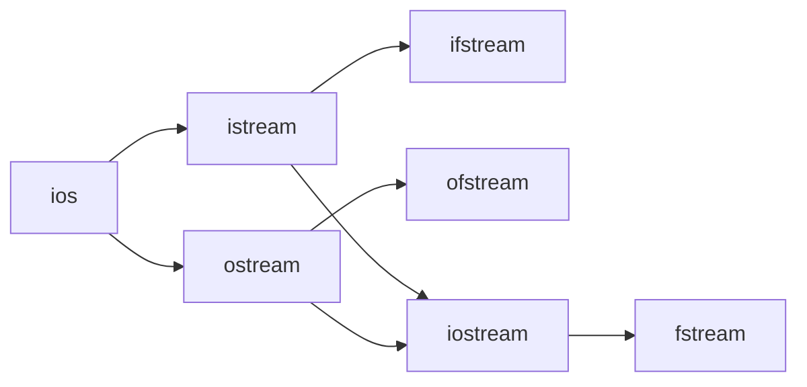

# C++ Reading Files

## Introduction

File handling is a crucial skill in programming that enables your C++ applications to interact with external data stored on disk. Being able to read files allows your programs to process information from configuration files, data logs, user-generated content, and much more.

In this tutorial, we'll explore how to read data from files in C++, covering the fundamental methods and techniques you need to know to effectively work with external data sources.

## Prerequisites

Before getting started, make sure you understand:
- Basic C++ syntax
- Variables and data types
- Control structures (if statements, loops)
- Basic input/output using `iostream`

## Understanding File Streams in C++

C++ implements file handling through **stream classes** defined in the `<fstream>` header. For reading files, we primarily use the `ifstream` (input file stream) class, which is specialized for input operations.

Here's how the main file stream classes relate to each other:



## Basic File Reading

### Opening a File

To read from a file, you need to:
1. Include the `<fstream>` header
2. Create an `ifstream` object
3. Open the file using the object
4. Check if the file opened successfully
5. Read the file contents
6. Close the file when done

Here's a simple example:

```cpp
#include <iostream>
#include <fstream>
#include <string>

int main() {
    // Create an ifstream object
    std::ifstream inputFile;
    
    // Open the file
    inputFile.open("example.txt");
    
    // Check if the file opened successfully
    if (!inputFile.is_open()) {
        std::cout << "Error opening file!" << std::endl;
        return 1;
    }
    
    // Read and display the first line
    std::string line;
    std::getline(inputFile, line);
    std::cout << "First line: " << line << std::endl;
    
    // Close the file
    inputFile.close();
    
    return 0;
}
```

### Alternative Syntax for Opening Files

You can also open a file directly when creating the `ifstream` object:

```cpp
std::ifstream inputFile("example.txt");

// Check if file is open
if (!inputFile) {
    std::cout << "Error opening file!" << std::endl;
    return 1;
}
```

## Reading Files Character by Character

You can read a file character by character using the `get()` method:

```cpp
#include <iostream>
#include <fstream>

int main() {
    std::ifstream inputFile("example.txt");
    
    if (!inputFile) {
        std::cout << "Error opening file!" << std::endl;
        return 1;
    }
    
    char ch;
    std::cout << "File contents:" << std::endl;
    
    // Read file character by character
    while (inputFile.get(ch)) {
        std::cout << ch;
    }
    
    inputFile.close();
    return 0;
}
```

## Reading Files Line by Line

The most common way to read text files is line by line using `getline()`:

```cpp
#include <iostream>
#include <fstream>
#include <string>

int main() {
    std::ifstream inputFile("example.txt");
    
    if (!inputFile) {
        std::cout << "Error opening file!" << std::endl;
        return 1;
    }
    
    std::string line;
    int lineNumber = 0;
    
    // Read file line by line
    while (std::getline(inputFile, line)) {
        lineNumber++;
        std::cout << "Line " << lineNumber << ": " << line << std::endl;
    }
    
    inputFile.close();
    return 0;
}
```

### Example Input (example.txt)
```
Hello, world!
This is a sample text file.
We're learning how to read files in C++.
This is the last line.
```

### Example Output
```
Line 1: Hello, world!
Line 2: This is a sample text file.
Line 3: We're learning how to read files in C++.
Line 4: This is the last line.
```

## Reading Files Word by Word

You can use the extraction operator (`>>`) to read a file word by word:

```cpp
#include <iostream>
#include <fstream>
#include <string>

int main() {
    std::ifstream inputFile("example.txt");
    
    if (!inputFile) {
        std::cout << "Error opening file!" << std::endl;
        return 1;
    }
    
    std::string word;
    int wordCount = 0;
    
    // Read file word by word
    while (inputFile >> word) {
        wordCount++;
        std::cout << "Word " << wordCount << ": " << word << std::endl;
    }
    
    std::cout << "Total words: " << wordCount << std::endl;
    
    inputFile.close();
    return 0;
}
```

### Sample Output (first few lines)
```
Word 1: Hello,
Word 2: world!
Word 3: This
Word 4: is
Word 5: a
...
Total words: 23
```

## Reading Formatted Data

You can read formatted data using the extraction operator, which is especially useful for parsing structured data:

```cpp
#include <iostream>
#include <fstream>
#include <string>

int main() {
    std::ifstream inputFile("students.txt");
    
    if (!inputFile) {
        std::cout << "Error opening file!" << std::endl;
        return 1;
    }
    
    std::string name;
    int age;
    double gpa;
    
    std::cout << "Student Information:" << std::endl;
    std::cout << "-------------------" << std::endl;
    
    // Read structured data
    while (inputFile >> name >> age >> gpa) {
        std::cout << "Name: " << name << ", Age: " << age << ", GPA: " << gpa << std::endl;
    }
    
    inputFile.close();
    return 0;
}
```

### Example Input (students.txt)
```
John 20 3.8
Sarah 19 4.0
Michael 21 3.5
Emily 20 3.9
```

### Example Output
```
Student Information:
-------------------
Name: John, Age: 20, GPA: 3.8
Name: Sarah, Age: 19, GPA: 4.0
Name: Michael, Age: 21, GPA: 3.5
Name: Emily, Age: 20, GPA: 3.9
```

## Reading Binary Files

Text mode is the default for file operations, but sometimes you need to read binary data (like images or custom data formats). For binary files, use the `binary` flag:

```cpp
#include <iostream>
#include <fstream>
#include <vector>

int main() {
    // Open file in binary mode
    std::ifstream inputFile("data.bin", std::ios::binary);
    
    if (!inputFile) {
        std::cout << "Error opening binary file!" << std::endl;
        return 1;
    }
    
    // Get file size
    inputFile.seekg(0, std::ios::end);
    std::streampos fileSize = inputFile.tellg();
    inputFile.seekg(0, std::ios::beg);
    
    // Create a buffer to hold the data
    std::vector<char> buffer(fileSize);
    
    // Read the data
    inputFile.read(buffer.data(), fileSize);
    
    std::cout << "Read " << fileSize << " bytes from binary file." << std::endl;
    
    // Display first 10 bytes (or fewer if file is smaller)
    std::cout << "First bytes: ";
    for (int i = 0; i < std::min(static_cast<std::streampos>(10), fileSize); i++) {
        std::cout << std::hex << (static_cast<int>(buffer[i]) & 0xFF) << " ";
    }
    std::cout << std::endl;
    
    inputFile.close();
    return 0;
}
```

## File Positioning

You can navigate through a file using positioning functions:

```cpp
#include <iostream>
#include <fstream>
#include <string>

int main() {
    std::ifstream inputFile("example.txt");
    
    if (!inputFile) {
        std::cout << "Error opening file!" << std::endl;
        return 1;
    }
    
    std::string line;
    
    // Read the first line
    std::getline(inputFile, line);
    std::cout << "First line: " << line << std::endl;
    
    // Get current position
    std::streampos position = inputFile.tellg();
    std::cout << "Current position: " << position << std::endl;
    
    // Read the next line
    std::getline(inputFile, line);
    std::cout << "Second line: " << line << std::endl;
    
    // Go back to the previous position
    inputFile.seekg(position);
    std::getline(inputFile, line);
    std::cout << "Second line again: " << line << std::endl;
    
    // Go to the beginning of the file
    inputFile.seekg(0, std::ios::beg);
    std::getline(inputFile, line);
    std::cout << "First line again: " << line << std::endl;
    
    inputFile.close();
    return 0;
}
```

## Error Handling

When working with files, it's important to handle potential errors:

```cpp
#include <iostream>
#include <fstream>
#include <string>

int main() {
    std::ifstream inputFile("nonexistent.txt");
    
    // Check if file opened successfully
    if (!inputFile) {
        std::cerr << "Error: Could not open file." << std::endl;
        return 1;
    }
    
    std::string line;
    
    // Try to read from the file
    while (std::getline(inputFile, line)) {
        std::cout << line << std::endl;
        
        // Check for reading errors
        if (inputFile.bad()) {
            std::cerr << "Error: I/O error while reading." << std::endl;
            break;
        } else if (inputFile.eof()) {
            std::cout << "Reached end of file." << std::endl;
        } else if (inputFile.fail()) {
            std::cerr << "Error: Non-fatal I/O error." << std::endl;
            inputFile.clear(); // Clear error flags
        }
    }
    
    inputFile.close();
    return 0;
}
```

## Practical Example: Reading a CSV File

CSV (Comma-Separated Values) files are commonly used for data exchange. Here's how to read and parse a CSV file:

```cpp
#include <iostream>
#include <fstream>
#include <sstream>
#include <string>
#include <vector>

int main() {
    std::ifstream inputFile("data.csv");
    
    if (!inputFile) {
        std::cout << "Error opening CSV file!" << std::endl;
        return 1;
    }
    
    std::string line;
    std::vector<std::vector<std::string>> data;
    
    // Read header line
    std::getline(inputFile, line);
    std::cout << "CSV Header: " << line << std::endl;
    std::cout << "Data:" << std::endl;
    
    // Read data rows
    while (std::getline(inputFile, line)) {
        std::vector<std::string> row;
        std::stringstream ss(line);
        std::string cell;
        
        // Parse each comma-separated value
        while (std::getline(ss, cell, ',')) {
            row.push_back(cell);
        }
        
        data.push_back(row);
        
        // Display the row
        for (const auto& cell : row) {
            std::cout << cell << "\t";
        }
        std::cout << std::endl;
    }
    
    std::cout << "Total rows: " << data.size() << std::endl;
    
    inputFile.close();
    return 0;
}
```

### Example Input (data.csv)
```
Name,Age,City,Occupation
John Smith,28,New York,Engineer
Sarah Johnson,35,Chicago,Doctor
Michael Brown,42,Los Angeles,Teacher
Emily Davis,31,Boston,Designer
```

### Example Output
```
CSV Header: Name,Age,City,Occupation
Data:
John Smith   28   New York   Engineer
Sarah Johnson   35   Chicago   Doctor
Michael Brown   42   Los Angeles   Teacher
Emily Davis   31   Boston   Designer
Total rows: 4
```

## Practical Example: Configuration File Reader

Here's a practical example of reading a configuration file:

```cpp
#include <iostream>
#include <fstream>
#include <sstream>
#include <string>
#include <map>

std::map<std::string, std::string> readConfigFile(const std::string& filename) {
    std::map<std::string, std::string> config;
    std::ifstream configFile(filename);
    
    if (!configFile) {
        std::cerr << "Error: Could not open config file " << filename << std::endl;
        return config;
    }
    
    std::string line;
    int lineNum = 0;
    
    while (std::getline(configFile, line)) {
        lineNum++;
        
        // Skip empty lines and comments
        if (line.empty() || line[0] == '#') {
            continue;
        }
        
        // Find the position of the equals sign
        size_t equalPos = line.find('=');
        if (equalPos == std::string::npos) {
            std::cerr << "Warning: Invalid format at line " << lineNum << ": " << line << std::endl;
            continue;
        }
        
        // Extract key and value
        std::string key = line.substr(0, equalPos);
        std::string value = line.substr(equalPos + 1);
        
        // Trim whitespace
        key.erase(0, key.find_first_not_of(" \t"));
        key.erase(key.find_last_not_of(" \t") + 1);
        value.erase(0, value.find_first_not_of(" \t"));
        value.erase(value.find_last_not_of(" \t") + 1);
        
        config[key] = value;
    }
    
    configFile.close();
    return config;
}

int main() {
    auto config = readConfigFile("app.config");
    
    std::cout << "Configuration settings:" << std::endl;
    std::cout << "----------------------" << std::endl;
    
    for (const auto& [key, value] : config) {
        std::cout << key << " = " << value << std::endl;
    }
    
    // Use configuration values
    if (config.find("debug_mode") != config.end()) {
        bool debugMode = (config["debug_mode"] == "true");
        std::cout << "\nDebug mode is " << (debugMode ? "enabled" : "disabled") << std::endl;
    }
    
    if (config.find("max_connections") != config.end()) {
        int maxConnections = std::stoi(config["max_connections"]);
        std::cout << "Maximum connections: " << maxConnections << std::endl;
    }
    
    return 0;
}
```

### Example Input (app.config)
```
# Application Configuration
debug_mode = true
log_file = app.log
max_connections = 10
database_path = /var/data/app.db
theme = dark
```

### Example Output
```
Configuration settings:
----------------------
database_path = /var/data/app.db
debug_mode = true
log_file = app.log
max_connections = 10
theme = dark

Debug mode is enabled
Maximum connections: 10
```

## Summary

In this tutorial, we've covered:

1. Basic file reading operations using `ifstream`
2. Different ways to read file content:
   - Character by character
   - Line by line  
   - Word by word
   - Formatted data
3. Reading binary files
4. File positioning and navigation
5. Error handling for file operations
6. Practical examples including CSV parsing and configuration file reading

File reading is a fundamental skill that allows your C++ programs to interact with external data sources, making your applications more useful and flexible.

## Additional Resources

- [C++ Reference - std::ifstream](https://en.cppreference.com/w/cpp/io/basic_ifstream)
- [C++ Reference - std::getline](https://en.cppreference.com/w/cpp/string/basic_string/getline)
- [C++ Reference - File Positioning](https://en.cppreference.com/w/cpp/io/basic_istream/seekg)

## Exercises

1. **Log File Parser**: Create a program that reads a log file and counts the occurrences of different log levels (ERROR, WARNING, INFO).

2. **Student Records**: Write a program that reads a file containing student records (name, ID, grades) and calculates the average grade for each student.

3. **Word Counter**: Develop a program that reads a text file and counts the total number of words, lines, and characters.

4. **CSV to HTML**: Create a program that reads a CSV file and generates an HTML table representing the data.

5. **Binary File Viewer**: Write a program that reads a binary file and displays its contents in both hexadecimal and ASCII formats.