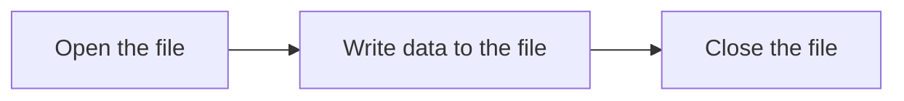

# C++ Writing Files

## Introduction

File writing is an essential aspect of programming that allows your applications to store data persistently. Whether you're creating log files, saving user data, or exporting results, understanding how to write to files in C++ is a valuable skill for any programmer.

In this tutorial, we'll explore how C++ allows you to write data to files using the standard library's file handling capabilities. We'll cover both text and binary file operations, common error handling techniques, and provide practical examples that you can use in your own projects.

## Prerequisites

Before diving into file writing, make sure you have:
- Basic understanding of C++ syntax
- Familiarity with variables and data types
- A C++ compiler installed on your system

## File Output Streams in C++

In C++, writing to files is primarily handled through the `ofstream` class, which stands for "output file stream." This class is part of the `<fstream>` library and provides functionality specifically designed for writing data to files.

### The File Writing Process

Writing to a file in C++ typically involves three main steps:



Let's explore each of these steps in detail.

## Opening a File for Writing

To write to a file, you first need to create an `ofstream` object and associate it with a file on your system.

```cpp
#include <iostream>
#include <fstream>
using namespace std;

int main() {
    // Create an ofstream object
    ofstream outputFile;
    
    // Open a file for writing
    outputFile.open("example.txt");
    
    // Check if the file opened successfully
    if (!outputFile) {
        cerr << "Error opening the file!" << endl;
        return 1;
    }
    
    cout << "File opened successfully!" << endl;
    
    // Close the file
    outputFile.close();
    
    return 0;
}
```

**Output:**
```
File opened successfully!
```

You can also use the constructor to open a file directly:

```cpp
ofstream outputFile("example.txt");
```

### File Opening Modes

When opening a file, you can specify how you want to interact with it using file modes:

| Mode | Description |
|------|-------------|
| `ios::out` | Open for output operations (default for ofstream) |
| `ios::app` | Append to the end of the file |
| `ios::trunc` | If the file exists, its contents will be truncated before opening |
| `ios::binary` | Open in binary mode |

You can combine these modes using the bitwise OR operator (`|`):

```cpp
// Open file for appending
outputFile.open("log.txt", ios::out | ios::app);

// Open binary file and truncate it if it exists
outputFile.open("data.bin", ios::out | ios::binary | ios::trunc);
```

## Writing Data to Files

### Writing Text to Files

Once you've opened a file, you can write data to it using the insertion operator (`<<`), just like you would with `cout`:

```cpp
#include <iostream>
#include <fstream>
using namespace std;

int main() {
    ofstream outputFile("sample.txt");
    
    if (!outputFile) {
        cerr << "Error opening the file!" << endl;
        return 1;
    }
    
    // Write to the file
    outputFile << "Hello, File!" << endl;
    outputFile << "This is a sample text file." << endl;
    outputFile << "Here are some numbers: " << 42 << " " << 3.14 << endl;
    
    // Close the file
    outputFile.close();
    
    cout << "Data has been written to sample.txt" << endl;
    
    return 0;
}
```

**Output:**
```
Data has been written to sample.txt
```

**Content of sample.txt:**
```
Hello, File!
This is a sample text file.
Here are some numbers: 42 3.14
```

### Formatting Output

You can control how data is formatted when writing to files, just like with console output:

```cpp
#include <iostream>
#include <fstream>
#include <iomanip> // For formatting options
using namespace std;

int main() {
    ofstream outputFile("formatted.txt");
    
    if (!outputFile) {
        cerr << "Error opening the file!" << endl;
        return 1;
    }
    
    // Set precision for floating-point numbers
    outputFile << fixed << setprecision(2);
    
    // Format table-like output
    outputFile << setw(10) << "Name" << setw(8) << "Age" << setw(10) << "Salary" << endl;
    outputFile << setw(10) << "John" << setw(8) << 25 << setw(10) << 1234.56 << endl;
    outputFile << setw(10) << "Alice" << setw(8) << 30 << setw(10) << 2345.67 << endl;
    outputFile << setw(10) << "Bob" << setw(8) << 35 << setw(10) << 3456.78 << endl;
    
    outputFile.close();
    
    cout << "Formatted data has been written to formatted.txt" << endl;
    
    return 0;
}
```

**Output:**
```
Formatted data has been written to formatted.txt
```

**Content of formatted.txt:**
```
      Name     Age    Salary
      John     25   1234.56
     Alice     30   2345.67
       Bob     35   3456.78
```

## Appending to Files

Sometimes you want to add data to an existing file without overwriting its contents. You can achieve this using the `ios::app` flag:

```cpp
#include <iostream>
#include <fstream>
using namespace std;

int main() {
    // First, create a file with some content
    {
        ofstream outputFile("log.txt");
        outputFile << "Log started: 2023-05-01" << endl;
        outputFile.close();
    }
    
    // Now append to the file
    ofstream appendFile("log.txt", ios::app);
    
    if (!appendFile) {
        cerr << "Error opening the file for appending!" << endl;
        return 1;
    }
    
    appendFile << "Log entry: System initialized" << endl;
    appendFile << "Log entry: User logged in" << endl;
    
    appendFile.close();
    
    cout << "Data has been appended to log.txt" << endl;
    
    return 0;
}
```

**Output:**
```
Data has been appended to log.txt
```

**Content of log.txt:**
```
Log started: 2023-05-01
Log entry: System initialized
Log entry: User logged in
```

## Writing Binary Files

While text files are human-readable, binary files store data in its raw binary format. This approach is more efficient for storing complex data structures or large amounts of numerical data.

To write binary data, you need to:
1. Open the file with the `ios::binary` flag
2. Use the `write()` method instead of the insertion operator

```cpp
#include <iostream>
#include <fstream>
using namespace std;

struct Person {
    char name[50];
    int age;
    double salary;
};

int main() {
    // Create a Person object
    Person person1 = {"John Doe", 30, 55000.50};
    
    // Open a binary file for writing
    ofstream binFile("person.dat", ios::binary);
    
    if (!binFile) {
        cerr << "Error opening binary file!" << endl;
        return 1;
    }
    
    // Write the binary data to the file
    binFile.write(reinterpret_cast<char*>(&person1), sizeof(Person));
    
    binFile.close();
    
    cout << "Binary data has been written to person.dat" << endl;
    
    return 0;
}
```

**Output:**
```
Binary data has been written to person.dat
```

Note that binary files aren't meant to be opened in text editors; they'll appear as gibberish if you try. They're designed to be read back into your program using binary reading operations.

## Error Handling

Proper error handling is crucial when working with files. Here are some techniques to manage file-related errors:

```cpp
#include <iostream>
#include <fstream>
using namespace std;

int main() {
    ofstream outputFile;
    
    // Attempt to open a file in a directory that might not exist
    outputFile.open("nonexistent_directory/test.txt");
    
    // Check if the file opened successfully
    if (!outputFile) {
        cerr << "Error: Could not open the file!" << endl;
        cerr << "Error code: " << strerror(errno) << endl;
        return 1;
    }
    
    // If we get here, the file opened successfully
    outputFile << "This text won't be written if the file can't be opened." << endl;
    
    outputFile.close();
    
    return 0;
}
```

You can also check for specific error conditions:

```cpp
if (outputFile.fail()) {
    cerr << "General failure in file operation!" << endl;
}

if (outputFile.bad()) {
    cerr << "Critical I/O error occurred!" << endl;
}
```

## Practical Examples

### Creating a Simple Log File

Log files are commonly used to record program events, making them a practical application of file writing:

```cpp
#include <iostream>
#include <fstream>
#include <ctime>
#include <string>
using namespace std;

// Function to get current timestamp as string
string getCurrentTimestamp() {
    time_t now = time(0);
    tm* ltm = localtime(&now);
    
    char buffer[80];
    strftime(buffer, 80, "%Y-%m-%d %H:%M:%S", ltm);
    
    return string(buffer);
}

// Function to log a message with timestamp
void logMessage(const string& filename, const string& message) {
    ofstream logFile(filename, ios::app);
    
    if (logFile) {
        logFile << "[" << getCurrentTimestamp() << "] " << message << endl;
        logFile.close();
    } else {
        cerr << "Error: Could not open log file!" << endl;
    }
}

int main() {
    string logFilename = "application.log";
    
    logMessage(logFilename, "Application started");
    
    // Simulate some application events
    cout << "Performing task 1..." << endl;
    logMessage(logFilename, "Task 1 completed");
    
    cout << "Performing task 2..." << endl;
    logMessage(logFilename, "Task 2 completed");
    
    logMessage(logFilename, "Application terminated");
    
    cout << "Check " << logFilename << " for the log entries." << endl;
    
    return 0;
}
```

**Output:**
```
Performing task 1...
Performing task 2...
Check application.log for the log entries.
```

**Content of application.log:**
```
[2023-05-01 14:25:30] Application started
[2023-05-01 14:25:30] Task 1 completed
[2023-05-01 14:25:30] Task 2 completed
[2023-05-01 14:25:30] Application terminated
```

### Creating a CSV File

CSV (Comma-Separated Values) files are commonly used for storing tabular data:

```cpp
#include <iostream>
#include <fstream>
#include <vector>
#include <string>
using namespace std;

// Structure to represent a product
struct Product {
    string name;
    double price;
    int quantity;
};

// Function to write products to a CSV file
bool writeProductsToCSV(const string& filename, const vector<Product>& products) {
    ofstream csvFile(filename);
    
    if (!csvFile) {
        return false;
    }
    
    // Write header
    csvFile << "Name,Price,Quantity,Total Value" << endl;
    
    // Write product data
    for (const auto& product : products) {
        double totalValue = product.price * product.quantity;
        csvFile << product.name << "," 
                << product.price << "," 
                << product.quantity << "," 
                << totalValue << endl;
    }
    
    csvFile.close();
    return true;
}

int main() {
    // Create some sample products
    vector<Product> inventory = {
        {"Laptop", 999.99, 10},
        {"Smartphone", 499.99, 25},
        {"Headphones", 59.99, 50},
        {"Mouse", 19.99, 100},
        {"Keyboard", 49.99, 75}
    };
    
    string filename = "inventory.csv";
    
    if (writeProductsToCSV(filename, inventory)) {
        cout << "Successfully wrote inventory data to " << filename << endl;
    } else {
        cerr << "Error: Failed to write inventory data!" << endl;
    }
    
    return 0;
}
```

**Output:**
```
Successfully wrote inventory data to inventory.csv
```

**Content of inventory.csv:**
```
Name,Price,Quantity,Total Value
Laptop,999.99,10,9999.9
Smartphone,499.99,25,12499.8
Headphones,59.99,50,2999.5
Mouse,19.99,100,1999
Keyboard,49.99,75,3749.25
```

## Best Practices for File Writing

1. **Always close files** when you're done with them to free system resources.
2. **Check if files opened successfully** before attempting to write to them.
3. **Use appropriate file modes** based on your requirements (e.g., append vs. overwrite).
4. **Handle errors gracefully** to prevent your program from crashing.
5. **Use binary mode** for non-text data to avoid unexpected conversions.
6. **Flush the buffer** when necessary using `flush()` to ensure data is written immediately.
7. **Use proper file extensions** to indicate the file format.

## Summary

Writing files in C++ allows your programs to store data persistently. In this tutorial, we've covered:

- Opening files for writing using `ofstream`
- Writing text data with the insertion operator (`<<`)
- Controlling output formatting
- Appending to existing files
- Writing binary data
- Handling file-related errors
- Practical examples of file writing in real-world scenarios

With these skills, you can now create programs that save user data, generate reports, maintain logs, and much more.

## Exercises

To practice what you've learned:

1. Create a program that asks users for their name, age, and email, then saves this information to a file.
2. Write a program that generates a multiplication table (1 to 10) and saves it to a formatted text file.
3. Create a simple address book application that allows adding contacts and saves them to a file.
4. Write a program that creates a binary file containing 100 random integers, then reads them back and calculates their average.
5. Modify the CSV example to read product data from user input instead of hardcoding it.

## Additional Resources

- [C++ File I/O Documentation](https://en.cppreference.com/w/cpp/io/basic_ofstream)
- [Binary File Operations in C++](https://en.cppreference.com/w/cpp/io/basic_filebuf)
- [Input/Output Stream Library](https://en.cppreference.com/w/cpp/io)

Happy coding!