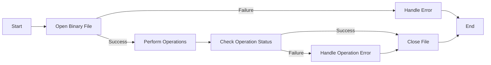

# C++ Binary Files

## Introduction

Binary files are a powerful way to store data in C++ that differs significantly from text files. Unlike text files, which store data as human-readable characters, binary files store information in the same format that the computer uses internally - as raw bytes of data. This makes binary files extremely efficient for storing large amounts of data, especially when that data doesn't need to be directly readable by humans.

In this tutorial, we'll explore:
- What binary files are and how they differ from text files
- How to write data to binary files
- How to read data from binary files
- Random access in binary files
- Practical applications of binary files

## Understanding Binary Files

### Binary vs Text Files

Before diving into binary file operations, let's understand the difference between binary and text files:

| Text Files | Binary Files |
|------------|--------------|
| Store data as human-readable characters | Store data in raw binary format |
| Automatic conversion between internal representation and text | No conversion - data is stored exactly as in memory |
| Platform-dependent line breaks (e.g., `\n`, `\r\n`) | No special handling of line breaks |
| Less efficient storage for numeric data | More efficient storage |
| Can be opened and edited in any text editor | Need specialized tools to view content |

### When to Use Binary Files

Binary files are particularly useful when:
- Storing large amounts of numeric data
- Working with custom data structures
- Developing applications where data should not be easily readable
- Performance and storage efficiency are critical
- Exact representation of data is important (no rounding errors)

## Working with Binary Files in C++

To work with binary files in C++, we use the `fstream` library, but with special open modes that indicate binary operations.

### Opening Binary Files

```cpp
#include <fstream>
#include <iostream>

int main() {
    // Opening a binary file for writing
    std::ofstream outFile("data.bin", std::ios::binary);
    
    if (!outFile) {
        std::cerr << "Error opening file for writing!" << std::endl;
        return 1;
    }
    
    // Use the file...
    
    outFile.close();
    
    // Opening a binary file for reading
    std::ifstream inFile("data.bin", std::ios::binary);
    
    if (!inFile) {
        std::cerr << "Error opening file for reading!" << std::endl;
        return 1;
    }
    
    // Use the file...
    
    inFile.close();
    
    return 0;
}
```

The key difference is the `std::ios::binary` flag that we add when opening the file. This tells C++ not to perform any text-based transformations on the data.

## Writing to Binary Files

### Writing Simple Data Types

To write simple data types to a binary file, we use the `write()` method, which takes a pointer to the data and the number of bytes to write:

```cpp
#include <fstream>
#include <iostream>

int main() {
    std::ofstream outFile("numbers.bin", std::ios::binary);
    
    if (!outFile) {
        std::cerr << "Error opening file!" << std::endl;
        return 1;
    }
    
    int numbers[] = {10, 20, 30, 40, 50};
    
    // Write the array to the file
    outFile.write(reinterpret_cast<char*>(numbers), sizeof(numbers));
    
    outFile.close();
    
    std::cout << "Data written successfully!" << std::endl;
    return 0;
}
```

**Explanation:**
- `reinterpret_cast<char*>(numbers)` converts our integer array pointer to a character pointer, which is what `write()` expects
- `sizeof(numbers)` gives us the total size in bytes of our array
- The `write()` method then stores the raw binary data of our integers in the file

### Writing Custom Structures

A common use case for binary files is storing custom data structures:

```cpp
#include <fstream>
#include <iostream>
#include <string>
#include <cstring>

struct Person {
    char name[50];  // Fixed-size array for name
    int age;
    double salary;
};

int main() {
    std::ofstream outFile("people.bin", std::ios::binary);
    
    if (!outFile) {
        std::cerr << "Error opening file!" << std::endl;
        return 1;
    }
    
    // Create some sample data
    Person people[3];
    
    // Person 1
    std::strcpy(people[0].name, "John Doe");
    people[0].age = 30;
    people[0].salary = 55000.50;
    
    // Person 2
    std::strcpy(people[1].name, "Jane Smith");
    people[1].age = 25;
    people[1].salary = 62000.75;
    
    // Person 3
    std::strcpy(people[2].name, "Bob Johnson");
    people[2].age = 45;
    people[2].salary = 71000.00;
    
    // Write the array of structures to the file
    outFile.write(reinterpret_cast<char*>(people), sizeof(people));
    
    outFile.close();
    
    std::cout << "People data written successfully!" << std::endl;
    return 0;
}
```

**Important Notes on Writing Structures:**
- Fixed-size arrays are used for strings to ensure consistent structure size
- The structure should not contain pointers or non-standard data types that might not be correctly represented in binary
- C++ standard does not guarantee the same binary representation of structures across different compilers or platforms

## Reading from Binary Files

### Reading Simple Data Types

Reading is similar to writing, but we use the `read()` method instead:

```cpp
#include <fstream>
#include <iostream>

int main() {
    std::ifstream inFile("numbers.bin", std::ios::binary);
    
    if (!inFile) {
        std::cerr << "Error opening file!" << std::endl;
        return 1;
    }
    
    int numbers[5];
    
    // Read from the file into our array
    inFile.read(reinterpret_cast<char*>(numbers), sizeof(numbers));
    
    // Check if read was successful
    if (!inFile) {
        std::cerr << "Error reading from file!" << std::endl;
        return 1;
    }
    
    // Display the numbers
    std::cout << "Numbers read from file:" << std::endl;
    for (int i = 0; i < 5; i++) {
        std::cout << numbers[i] << " ";
    }
    std::cout << std::endl;
    
    inFile.close();
    return 0;
}
```

**Expected Output:**
```
Numbers read from file:
10 20 30 40 50
```

### Reading Custom Structures

Reading custom structures follows the same pattern:

```cpp
#include <fstream>
#include <iostream>
#include <iomanip>

struct Person {
    char name[50];
    int age;
    double salary;
};

int main() {
    std::ifstream inFile("people.bin", std::ios::binary);
    
    if (!inFile) {
        std::cerr << "Error opening file!" << std::endl;
        return 1;
    }
    
    Person people[3];
    
    // Read the array of structures from the file
    inFile.read(reinterpret_cast<char*>(people), sizeof(people));
    
    // Check if read was successful
    if (!inFile) {
        std::cerr << "Error reading from file!" << std::endl;
        return 1;
    }
    
    // Display the data
    std::cout << "People read from file:" << std::endl;
    std::cout << std::left << std::setw(15) << "Name" 
              << std::setw(10) << "Age" 
              << std::setw(15) << "Salary" << std::endl;
    std::cout << std::string(40, '-') << std::endl;
    
    for (int i = 0; i < 3; i++) {
        std::cout << std::left << std::setw(15) << people[i].name 
                  << std::setw(10) << people[i].age 
                  << std::fixed << std::setprecision(2) << people[i].salary << std::endl;
    }
    
    inFile.close();
    return 0;
}
```

**Expected Output:**
```
People read from file:
Name           Age       Salary
----------------------------------------
John Doe       30        55000.50
Jane Smith     25        62000.75
Bob Johnson    45        71000.00
```

## Random Access in Binary Files

One of the major advantages of binary files is the ability to access data at any position directly - without reading through all preceding data.

### File Positioning

We use the following functions for positioning within a file:
- `seekg()` and `seekp()` - to move the get (read) and put (write) positions
- `tellg()` and `tellp()` - to determine the current get and put positions

```cpp
#include <fstream>
#include <iostream>

int main() {
    // First, let's create a file with some integers
    std::ofstream outFile("random_access.bin", std::ios::binary);
    
    if (!outFile) {
        std::cerr << "Error opening file for writing!" << std::endl;
        return 1;
    }
    
    int numbers[] = {100, 200, 300, 400, 500};
    outFile.write(reinterpret_cast<char*>(numbers), sizeof(numbers));
    outFile.close();
    
    // Now, let's perform random access
    std::fstream file("random_access.bin", std::ios::in | std::ios::out | std::ios::binary);
    
    if (!file) {
        std::cerr << "Error opening file for random access!" << std::endl;
        return 1;
    }
    
    // Read the third integer (index 2)
    int value;
    file.seekg(2 * sizeof(int));  // Move to the third integer position
    file.read(reinterpret_cast<char*>(&value), sizeof(int));
    std::cout << "Third value: " << value << std::endl;  // Should print 300
    
    // Change the fourth integer (index 3) to 999
    file.seekp(3 * sizeof(int));  // Move to the fourth integer position
    value = 999;
    file.write(reinterpret_cast<char*>(&value), sizeof(int));
    
    // Read all values to confirm the change
    file.seekg(0);  // Move back to the beginning
    int allValues[5];
    file.read(reinterpret_cast<char*>(allValues), sizeof(allValues));
    
    std::cout << "All values after modification:" << std::endl;
    for (int i = 0; i < 5; i++) {
        std::cout << allValues[i] << " ";
    }
    std::cout << std::endl;
    
    file.close();
    return 0;
}
```

**Expected Output:**
```
Third value: 300
All values after modification:
100 200 300 999 500
```

## Practical Example: A Simple Database

Let's create a more practical example: a simple database of products that can be stored, retrieved, updated, and deleted using binary files.

```cpp
#include <fstream>
#include <iostream>
#include <iomanip>
#include <string>
#include <cstring>

struct Product {
    int id;
    char name[50];
    double price;
    int quantity;
    bool isDeleted;  // Flag to indicate if the record is deleted
};

class ProductDatabase {
private:
    std::string filename;

public:
    ProductDatabase(const std::string& file) : filename(file) {
        // Check if file exists, if not create it
        std::ifstream checkFile(filename, std::ios::binary);
        if (!checkFile) {
            std::ofstream createFile(filename, std::ios::binary);
            createFile.close();
        } else {
            checkFile.close();
        }
    }

    bool addProduct(const Product& product) {
        std::fstream file(filename, std::ios::in | std::ios::out | std::ios::binary);
        
        if (!file) {
            return false;
        }
        
        // Check if ID already exists
        Product temp;
        file.seekg(0);
        
        while (file.read(reinterpret_cast<char*>(&temp), sizeof(Product))) {
            if (temp.id == product.id && !temp.isDeleted) {
                file.close();
                return false;  // ID already exists
            }
        }
        
        // Add product at the end of file
        file.clear();  // Clear any error flags
        file.seekp(0, std::ios::end);
        file.write(reinterpret_cast<const char*>(&product), sizeof(Product));
        
        file.close();
        return true;
    }

    bool getProduct(int id, Product& product) {
        std::ifstream file(filename, std::ios::binary);
        
        if (!file) {
            return false;
        }
        
        while (file.read(reinterpret_cast<char*>(&product), sizeof(Product))) {
            if (product.id == id && !product.isDeleted) {
                file.close();
                return true;  // Product found
            }
        }
        
        file.close();
        return false;  // Product not found
    }

    bool updateProduct(const Product& product) {
        std::fstream file(filename, std::ios::in | std::ios::out | std::ios::binary);
        
        if (!file) {
            return false;
        }
        
        Product temp;
        long position = 0;
        
        while (file.read(reinterpret_cast<char*>(&temp), sizeof(Product))) {
            if (temp.id == product.id && !temp.isDeleted) {
                // Move back to the start of this record
                file.seekp(position);
                file.write(reinterpret_cast<const char*>(&product), sizeof(Product));
                file.close();
                return true;  // Update successful
            }
            position = file.tellg();  // Get current position
        }
        
        file.close();
        return false;  // Product not found
    }

    bool deleteProduct(int id) {
        std::fstream file(filename, std::ios::in | std::ios::out | std::ios::binary);
        
        if (!file) {
            return false;
        }
        
        Product temp;
        long position = 0;
        
        while (file.read(reinterpret_cast<char*>(&temp), sizeof(Product))) {
            if (temp.id == id && !temp.isDeleted) {
                // Mark as deleted
                temp.isDeleted = true;
                
                // Move back to the start of this record
                file.seekp(position);
                file.write(reinterpret_cast<const char*>(&temp), sizeof(Product));
                file.close();
                return true;  // Deletion successful
            }
            position = file.tellg();  // Get current position
        }
        
        file.close();
        return false;  // Product not found
    }

    void displayAllProducts() {
        std::ifstream file(filename, std::ios::binary);
        
        if (!file) {
            std::cout << "No products found or error opening database." << std::endl;
            return;
        }
        
        Product product;
        bool found = false;
        
        // Header
        std::cout << std::left << std::setw(5) << "ID" 
                  << std::setw(25) << "Name" 
                  << std::setw(10) << "Price" 
                  << std::setw(10) << "Quantity" << std::endl;
        std::cout << std::string(50, '-') << std::endl;
        
        while (file.read(reinterpret_cast<char*>(&product), sizeof(Product))) {
            if (!product.isDeleted) {
                std::cout << std::left << std::setw(5) << product.id
                          << std::setw(25) << product.name
                          << std::fixed << std::setprecision(2) << std::setw(10) << product.price
                          << std::setw(10) << product.quantity << std::endl;
                found = true;
            }
        }
        
        if (!found) {
            std::cout << "No products found in the database." << std::endl;
        }
        
        file.close();
    }
};

int main() {
    ProductDatabase db("products.bin");
    int choice;
    
    do {
        std::cout << "\n===== Product Database Menu =====" << std::endl;
        std::cout << "1. Add Product" << std::endl;
        std::cout << "2. Find Product" << std::endl;
        std::cout << "3. Update Product" << std::endl;
        std::cout << "4. Delete Product" << std::endl;
        std::cout << "5. Display All Products" << std::endl;
        std::cout << "6. Exit" << std::endl;
        std::cout << "Enter choice (1-6): ";
        std::cin >> choice;
        
        switch (choice) {
            case 1: {  // Add Product
                Product product;
                product.isDeleted = false;
                
                std::cout << "Enter product ID: ";
                std::cin >> product.id;
                
                std::cin.ignore();  // Clear newline from buffer
                std::cout << "Enter product name: ";
                std::cin.getline(product.name, 50);
                
                std::cout << "Enter price: ";
                std::cin >> product.price;
                
                std::cout << "Enter quantity: ";
                std::cin >> product.quantity;
                
                if (db.addProduct(product)) {
                    std::cout << "Product added successfully!" << std::endl;
                } else {
                    std::cout << "Failed to add product. ID might already exist." << std::endl;
                }
                break;
            }
            
            case 2: {  // Find Product
                int id;
                std::cout << "Enter product ID to find: ";
                std::cin >> id;
                
                Product product;
                if (db.getProduct(id, product)) {
                    std::cout << "\nProduct Found:" << std::endl;
                    std::cout << "ID: " << product.id << std::endl;
                    std::cout << "Name: " << product.name << std::endl;
                    std::cout << "Price: $" << std::fixed << std::setprecision(2) << product.price << std::endl;
                    std::cout << "Quantity: " << product.quantity << std::endl;
                } else {
                    std::cout << "Product not found!" << std::endl;
                }
                break;
            }
            
            case 3: {  // Update Product
                int id;
                std::cout << "Enter product ID to update: ";
                std::cin >> id;
                
                Product product;
                if (db.getProduct(id, product)) {
                    std::cout << "Updating product: " << product.name << std::endl;
                    
                    std::cin.ignore();  // Clear newline from buffer
                    std::cout << "Enter new name (or press Enter to keep current): ";
                    char newName[50];
                    std::cin.getline(newName, 50);
                    
                    if (strlen(newName) > 0) {
                        strcpy(product.name, newName);
                    }
                    
                    std::cout << "Current price: $" << product.price << std::endl;
                    std::cout << "Enter new price (or -1 to keep current): ";
                    double newPrice;
                    std::cin >> newPrice;
                    
                    if (newPrice >= 0) {
                        product.price = newPrice;
                    }
                    
                    std::cout << "Current quantity: " << product.quantity << std::endl;
                    std::cout << "Enter new quantity (or -1 to keep current): ";
                    int newQuantity;
                    std::cin >> newQuantity;
                    
                    if (newQuantity >= 0) {
                        product.quantity = newQuantity;
                    }
                    
                    if (db.updateProduct(product)) {
                        std::cout << "Product updated successfully!" << std::endl;
                    } else {
                        std::cout << "Failed to update product!" << std::endl;
                    }
                } else {
                    std::cout << "Product not found!" << std::endl;
                }
                break;
            }
            
            case 4: {  // Delete Product
                int id;
                std::cout << "Enter product ID to delete: ";
                std::cin >> id;
                
                if (db.deleteProduct(id)) {
                    std::cout << "Product deleted successfully!" << std::endl;
                } else {
                    std::cout << "Failed to delete product. ID might not exist." << std::endl;
                }
                break;
            }
            
            case 5:  // Display All Products
                std::cout << "\n===== All Products =====" << std::endl;
                db.displayAllProducts();
                break;
                
            case 6:  // Exit
                std::cout << "Exiting program. Goodbye!" << std::endl;
                break;
                
            default:
                std::cout << "Invalid choice. Please try again." << std::endl;
        }
        
    } while (choice != 6);
    
    return 0;
}
```

This comprehensive example demonstrates a practical application of binary files for storing and managing data. It implements a simple database system with CRUD (Create, Read, Update, Delete) functionality.

## Points to Remember When Working with Binary Files

1. **Platform Independence**: Binary file formats can be platform-dependent. The same binary file might not be readable across different systems or compilers due to differences in data representation.

2. **Data Alignment**: Some systems have specific alignment requirements for data structures. This can affect how your structures are stored in binary files.

3. **String Handling**: Be careful with strings in binary files. Fixed-length character arrays are safer than using C++ string objects, which store pointers rather than the actual string data.

4. **File Corruption**: Binary files are more susceptible to corruption. A single byte error can make the entire file unreadable.

5. **Error Checking**: Always check for errors when opening files and performing read/write operations.

6. **File Closing**: Always close files when you're done with them to prevent resource leaks.



## Summary

In this tutorial, we've covered:

1. **The basics of binary files** in C++ and how they differ from text files
2. **Writing to binary files** using `write()` for both simple data types and structures
3. **Reading from binary files** using `read()` to retrieve stored data
4. **Random access operations** in binary files with `seekg()`, `seekp()`, `tellg()`, and `tellp()`
5. **A practical example** of using binary files to create a simple product database

Binary files are powerful tools for C++ developers, offering efficient storage and retrieval of data in its raw form. They're particularly useful for applications requiring large data storage, custom data formats, or when data doesn't need to be human-readable.

## Exercises

To reinforce your understanding, try these exercises:

1. Modify the product database example to include additional fields like product category and manufacture date.

2. Create a binary file program that stores and retrieves images (represented as pixel arrays).

3. Implement a program that converts a text file to a binary file and vice versa.

4. Create a student record system using binary files that supports sorting by different fields.

5. Implement a simple file encryption/decryption system using binary file operations.

## Additional Resources

- [C++ Reference: Binary I/O](https://en.cppreference.com/w/cpp/io/basic_ostream/write)
- [C++ File Handling Documentation](https://cplusplus.com/doc/tutorial/files/)
- Book: "C++ Primer" by Stanley B. Lippman, Josée Lajoie, and Barbara E. Moo
- Book: "Professional C++" by Marc Gregoire

Happy coding with C++ binary files!