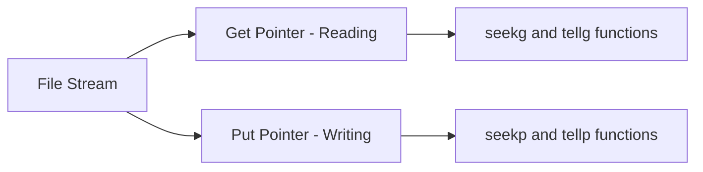

# C++ File Pointers

## Introduction

File pointers in C++ are essential components that allow your programs to interact with files on your system. They act as intermediaries between your program and the files, enabling you to perform operations such as reading data from files, writing data to files, and navigating through file content.

In this tutorial, we'll explore how file pointers work in C++, how to use them effectively, and how they can be manipulated to perform various file operations. By the end, you'll have a solid understanding of file pointers and be able to implement them in your own C++ programs.

## Understanding File Pointers

In C++ file handling, a file pointer (or file position pointer) represents the current position within a file where the next reading or writing operation will take place. Think of it as a cursor in a text editor that shows where you're currently positioned.

C++ provides two types of file position pointers:

1. **Get Pointer (g)**: Used for reading operations to track the position from where the next character will be read
2. **Put Pointer (p)**: Used for writing operations to track the position where the next character will be written



## File Stream Classes and File Pointers

Before we dive deeper into file pointers, let's quickly review the stream classes used for file operations in C++:

- `ifstream`: Input file stream for reading data from files
- `ofstream`: Output file stream for writing data to files
- `fstream`: File stream for both reading from and writing to files

Each of these classes provides methods to manipulate file pointers.

## Opening a File and Initializing File Pointers

When you open a file using a file stream, file pointers are automatically initialized:

```cpp
#include <iostream>
#include <fstream>
using namespace std;

int main() {
    // Opening a file for reading
    ifstream inFile("sample.txt");
    
    if (!inFile) {
        cerr << "Error opening file!" << endl;
        return 1;
    }
    
    cout << "File opened successfully!" << endl;
    
    inFile.close();
    return 0;
}
```

When the file is opened:
- For `ifstream`, the get pointer is positioned at the beginning of the file
- For `ofstream`, the put pointer is positioned at the beginning of the file (or the file is truncated if it already exists)
- For `fstream`, both pointers are positioned according to the open mode

## Functions for Manipulating File Pointers

C++ provides four main functions to work with file pointers:

1. **tellg()**: Returns the current position of the get pointer
2. **seekg()**: Moves the get pointer to a specified position
3. **tellp()**: Returns the current position of the put pointer
4. **seekp()**: Moves the put pointer to a specified position

### Working with the Get Pointer (Reading)

#### tellg() Function

The `tellg()` function returns the current position of the get pointer. It's useful when you need to remember a position to return to it later.

```cpp
#include <iostream>
#include <fstream>
using namespace std;

int main() {
    ifstream inFile("sample.txt");
    
    if (!inFile) {
        cerr << "Error opening file!" << endl;
        return 1;
    }
    
    // Get current position (beginning of file)
    streampos begin = inFile.tellg();
    cout << "Beginning position: " << begin << endl;
    
    // Read a character
    char ch;
    inFile.get(ch);
    cout << "Read character: " << ch << endl;
    
    // Get new position
    streampos after_read = inFile.tellg();
    cout << "Position after reading: " << after_read << endl;
    
    inFile.close();
    return 0;
}
```

**Output (assuming sample.txt starts with 'H'):**
```
Beginning position: 0
Read character: H
Position after reading: 1
```

#### seekg() Function

The `seekg()` function allows you to move the get pointer to a specific position in the file. It can be used in two ways:

1. **Absolute positioning**: `seekg(position)`
2. **Relative positioning**: `seekg(offset, direction)`

The direction can be:
- `ios::beg`: Beginning of the file
- `ios::cur`: Current position
- `ios::end`: End of the file

```cpp
#include <iostream>
#include <fstream>
using namespace std;

int main() {
    ifstream inFile("sample.txt");
    
    if (!inFile) {
        cerr << "Error opening file!" << endl;
        return 1;
    }
    
    // Move to the 5th character (0-based index)
    inFile.seekg(4, ios::beg);
    
    // Read and display a character
    char ch;
    inFile.get(ch);
    cout << "5th character: " << ch << endl;
    
    // Move to the last character
    inFile.seekg(-1, ios::end);
    
    // Read and display the last character
    inFile.get(ch);
    cout << "Last character: " << ch << endl;
    
    // Move 3 characters back from current position
    inFile.seekg(-3, ios::cur);
    
    // Read and display a character
    inFile.get(ch);
    cout << "Character 3 positions before the last: " << ch << endl;
    
    inFile.close();
    return 0;
}
```

**Output (assuming sample.txt contains "Hello, World!"):**
```
5th character: ,
Last character: !
Character 3 positions before the last: r
```

### Working with the Put Pointer (Writing)

#### tellp() Function

Similar to `tellg()`, the `tellp()` function returns the current position of the put pointer.

```cpp
#include <iostream>
#include <fstream>
using namespace std;

int main() {
    ofstream outFile("output.txt");
    
    if (!outFile) {
        cerr << "Error opening file!" << endl;
        return 1;
    }
    
    // Get initial position
    streampos begin = outFile.tellp();
    cout << "Beginning position: " << begin << endl;
    
    // Write a string
    outFile << "Hello";
    
    // Get position after writing
    streampos after_write = outFile.tellp();
    cout << "Position after writing 'Hello': " << after_write << endl;
    
    outFile.close();
    return 0;
}
```

**Output:**
```
Beginning position: 0
Position after writing 'Hello': 5
```

#### seekp() Function

The `seekp()` function allows you to move the put pointer to a specific position, similar to `seekg()`.

```cpp
#include <iostream>
#include <fstream>
using namespace std;

int main() {
    // Open file in read/write mode
    fstream file("modify.txt", ios::in | ios::out | ios::trunc);
    
    if (!file) {
        cerr << "Error opening file!" << endl;
        return 1;
    }
    
    // Write initial content
    file << "Hello, World!";
    
    // Move put pointer to position 7 (after 'Hello, ')
    file.seekp(7, ios::beg);
    
    // Replace "World" with "C++"
    file << "C++   ";  // Extra spaces to overwrite "World!"
    
    // Reset to beginning for reading
    file.seekg(0, ios::beg);
    
    // Read and display modified content
    string content;
    getline(file, content);
    cout << "Modified content: " << content << endl;
    
    file.close();
    return 0;
}
```

**Output:**
```
Modified content: Hello, C++   
```

## Practical Example: Simple Text Editor

Let's create a simple text editor that demonstrates practical usage of file pointers:

```cpp
#include <iostream>
#include <fstream>
#include <string>
using namespace std;

void displayContent(fstream &file) {
    // Save current position
    streampos currentPos = file.tellg();
    
    // Go to beginning
    file.seekg(0, ios::beg);
    
    // Read and display file content
    string line;
    int lineNum = 1;
    cout << "\n--- File Content ---\n";
    
    while (getline(file, line)) {
        cout << lineNum++ << ": " << line << endl;
    }
    
    cout << "-------------------\n";
    
    // Clear EOF flag if reached end
    file.clear();
    
    // Restore original position
    file.seekg(currentPos);
}

int main() {
    string fileName;
    cout << "Enter file name to edit: ";
    getline(cin, fileName);
    
    // Open file for reading and writing
    fstream file(fileName, ios::in | ios::out | ios::app);
    
    if (!file) {
        // File doesn't exist, create it
        cout << "File doesn't exist. Creating new file.\n";
        file.open(fileName, ios::in | ios::out | ios::trunc);
    }
    
    if (!file) {
        cerr << "Error: Could not open file.\n";
        return 1;
    }
    
    int choice;
    do {
        cout << "\nMini Text Editor\n";
        cout << "1. Display file content\n";
        cout << "2. Add text at the end\n";
        cout << "3. Replace text at a specific line\n";
        cout << "4. Exit\n";
        cout << "Enter your choice: ";
        cin >> choice;
        
        // Consume newline after reading choice
        cin.ignore();
        
        switch (choice) {
            case 1:
                displayContent(file);
                break;
                
            case 2: {
                // Move to end of file for appending
                file.seekp(0, ios::end);
                
                string newText;
                cout << "Enter text to add: ";
                getline(cin, newText);
                
                file << newText << endl;
                break;
            }
            
            case 3: {
                int lineNumber;
                cout << "Enter line number to replace: ";
                cin >> lineNumber;
                cin.ignore(); // Consume newline
                
                // Create a temporary file to store modified content
                fstream tempFile("temp.txt", ios::out | ios::trunc);
                
                // Go to beginning of original file
                file.seekg(0, ios::beg);
                
                string line;
                int currentLine = 1;
                
                // Copy content line by line, replacing the specified line
                while (getline(file, line)) {
                    if (currentLine == lineNumber) {
                        string newText;
                        cout << "Enter new text: ";
                        getline(cin, newText);
                        tempFile << newText << endl;
                    } else {
                        tempFile << line << endl;
                    }
                    currentLine++;
                }
                
                // Close both files
                file.close();
                tempFile.close();
                
                // Replace original file with temp file
                remove(fileName.c_str());
                rename("temp.txt", fileName.c_str());
                
                // Reopen the modified file
                file.open(fileName, ios::in | ios::out);
                
                cout << "Line " << lineNumber << " replaced successfully.\n";
                break;
            }
            
            case 4:
                cout << "Exiting editor. Goodbye!\n";
                break;
                
            default:
                cout << "Invalid choice. Please try again.\n";
        }
    } while (choice != 4);
    
    file.close();
    return 0;
}
```

This mini text editor demonstrates:
- Using `seekg()` to navigate through file content for reading
- Using `seekp()` to position the write pointer for adding content
- Manipulating file content by creating a temporary file
- Combining reading and writing operations using `fstream`

## Real-World Application: Binary File Navigation

File pointers are especially useful when working with binary files. Here's an example of a simple database-like application that stores records and uses file pointers to navigate between them:

```cpp
#include <iostream>
#include <fstream>
#include <string>
#include <cstring>
using namespace std;

// Define a fixed-size record structure
struct Student {
    int id;
    char name[50];
    float gpa;
};

// Function to add a student record
void addStudent(fstream &file) {
    Student student;
    
    cout << "Enter student ID: ";
    cin >> student.id;
    cin.ignore(); // Consume newline
    
    cout << "Enter student name: ";
    cin.getline(student.name, 50);
    
    cout << "Enter student GPA: ";
    cin >> student.gpa;
    
    // Move to the end of the file to append
    file.seekp(0, ios::end);
    
    // Write the record
    file.write(reinterpret_cast<char*>(&student), sizeof(Student));
    
    cout << "Student record added successfully.\n";
}

// Function to display a specific student record
void displayStudent(fstream &file, int recordNumber) {
    // Calculate position of the record
    streampos position = (recordNumber - 1) * sizeof(Student);
    
    // Move to the position
    file.seekg(position);
    
    // Read the record
    Student student;
    file.read(reinterpret_cast<char*>(&student), sizeof(Student));
    
    // Check if read was successful
    if (file) {
        cout << "\nStudent #" << recordNumber << " Details:\n";
        cout << "ID: " << student.id << endl;
        cout << "Name: " << student.name << endl;
        cout << "GPA: " << student.gpa << endl;
    } else {
        cout << "Record #" << recordNumber << " does not exist.\n";
        file.clear(); // Clear error flags
    }
}

// Function to update a student record
void updateStudent(fstream &file, int recordNumber) {
    // Calculate position of the record
    streampos position = (recordNumber - 1) * sizeof(Student);
    
    // Check if the record exists
    file.seekg(0, ios::end);
    streampos endPos = file.tellg();
    
    if (position >= endPos) {
        cout << "Record #" << recordNumber << " does not exist.\n";
        return;
    }
    
    // Move to the record position
    file.seekg(position);
    
    // Read existing record
    Student student;
    file.read(reinterpret_cast<char*>(&student), sizeof(Student));
    
    // Display current details
    cout << "\nCurrent Details:\n";
    cout << "ID: " << student.id << endl;
    cout << "Name: " << student.name << endl;
    cout << "GPA: " << student.gpa << endl;
    
    // Get updated information
    cout << "\nEnter new details:\n";
    
    cout << "Enter student ID: ";
    cin >> student.id;
    cin.ignore(); // Consume newline
    
    cout << "Enter student name: ";
    cin.getline(student.name, 50);
    
    cout << "Enter student GPA: ";
    cin >> student.gpa;
    
    // Move back to the record position for writing
    file.seekp(position);
    
    // Write the updated record
    file.write(reinterpret_cast<char*>(&student), sizeof(Student));
    
    cout << "Student record updated successfully.\n";
}

// Function to calculate and display the number of records
void countRecords(fstream &file) {
    // Move to end to get file size
    file.seekg(0, ios::end);
    streampos endPos = file.tellg();
    
    // Calculate number of records
    int numRecords = endPos / sizeof(Student);
    
    cout << "Total number of student records: " << numRecords << endl;
}

int main() {
    // Open binary file for reading and writing
    fstream file("students.dat", ios::binary | ios::in | ios::out | ios::app);
    
    if (!file) {
        // File doesn't exist, create it
        file.open("students.dat", ios::binary | ios::in | ios::out | ios::trunc);
    }
    
    if (!file) {
        cerr << "Error: Could not open file.\n";
        return 1;
    }
    
    int choice;
    do {
        cout << "\nStudent Records Manager\n";
        cout << "1. Add new student\n";
        cout << "2. Display student by record number\n";
        cout << "3. Update student record\n";
        cout << "4. Count total records\n";
        cout << "5. Exit\n";
        cout << "Enter your choice: ";
        cin >> choice;
        
        switch (choice) {
            case 1:
                addStudent(file);
                break;
                
            case 2: {
                int recordNum;
                cout << "Enter record number to display: ";
                cin >> recordNum;
                displayStudent(file, recordNum);
                break;
            }
            
            case 3: {
                int recordNum;
                cout << "Enter record number to update: ";
                cin >> recordNum;
                updateStudent(file, recordNum);
                break;
            }
            
            case 4:
                countRecords(file);
                break;
                
            case 5:
                cout << "Exiting program. Goodbye!\n";
                break;
                
            default:
                cout << "Invalid choice. Please try again.\n";
        }
    } while (choice != 5);
    
    file.close();
    return 0;
}
```

This example demonstrates:
- Using file pointers for random access in a binary file
- Calculating positions for specific records
- Moving between reading and writing operations
- Handling both sequential and random access patterns

## Summary

File pointers are essential components in C++ file handling that allow you to navigate through files, read from specific positions, and write to specific locations. Here's a summary of the key concepts we've covered:

1. C++ provides two types of file pointers:
   - Get pointer (for reading) - controlled with `tellg()` and `seekg()`
   - Put pointer (for writing) - controlled with `tellp()` and `seekp()`

2. File pointer manipulation functions:
   - `tellg()` and `tellp()` return the current position
   - `seekg()` and `seekp()` allow positioning the pointers
   
3. Positioning modes:
   - `ios::beg` - relative to the beginning of the file
   - `ios::cur` - relative to the current position
   - `ios::end` - relative to the end of the file

4. File pointers enable powerful file operations:
   - Random access in files
   - Efficient navigation through file content
   - Combining reading and writing operations

5. Practical applications:
   - Text editors and document processors
   - Database-like systems with record access
   - Configuration file parsing and modification
   - Binary file manipulation

Understanding file pointers is crucial for developing more complex applications that require sophisticated file handling capabilities.

## Exercises

To reinforce your understanding of file pointers, here are some exercises to try:

1. Create a program that counts the frequency of each word in a text file.

2. Implement a simple file encryption/decryption tool that processes a file in chunks using file pointers.

3. Create a log file analyzer that can jump to specific timestamps in a log file.

4. Build a CSV file parser that can navigate to specific rows and columns.

5. Modify the binary student database example to include a feature to delete records (mark them as deleted without rewriting the entire file).

6. Create a program that can merge two sorted text files into a third sorted file.

## Additional Resources

- [C++ Reference: File I/O](https://en.cppreference.com/w/cpp/io)
- [File Positioning](https://en.cppreference.com/w/cpp/io/basic_istream/seekg)
- Book: "C++ Primer" by Stanley B. Lippman (Chapters on File I/O)
- Book: "The C++ Programming Language" by Bjarne Stroustrup

By mastering file pointers, you've added a powerful tool to your C++ programming toolkit that will enable you to create more sophisticated file handling solutions.