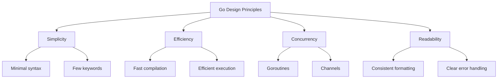

# Go Introduction

## What is Go?

<div style={{
    "width": "20%",
    "margin": "0 auto",
    "text-align": "center"
}}>
    
</div>

Go (or Golang) is a modern programming language developed by Google in 2007 and released to the public in 2009. It was created by Robert Griesemer, Rob Pike, and Ken Thompson with the goal of combining the efficiency of a compiled language with the ease of programming of a dynamic language.

Go was designed to address some of the challenges faced in software development at Google:
- Fast compilation
- Efficient execution
- Easy to write and maintain
- Built-in support for concurrent programming

## Why Learn Go?

Go has gained significant popularity for several compelling reasons:

- **Simplicity**: Go has a clean syntax and a small set of features, making it easy to learn
- **Performance**: Go compiles to machine code, offering performance close to C/C++
- **Concurrency**: Built-in support for concurrent programming with goroutines and channels
- **Strong Standard Library**: Comprehensive standard library that reduces dependency on third-party packages
- **Cross-Platform**: Go can compile for different operating systems from a single codebase
- **Great for Backend**: Widely used for building web servers, APIs, and microservices
- **Growing Ecosystem**: Strong community and expanding job opportunities

## Setting Up Go

Before writing your first Go program, you need to install Go on your computer:

1. Visit the [official Go website](https://golang.org/dl/) to download the installer for your operating system
2. Follow the installation instructions
3. Verify the installation by opening a terminal and typing:

```bash
go version
```

You should see output similar to:

```
go version go1.21.0 darwin/amd64
```

## Your First Go Program

Let's create the traditional "Hello, World!" program in Go:

```go
package main

import "fmt"

func main() {
    fmt.Println("Hello, World!")
}
```

Save this code in a file named `hello.go`, then run it using:

```bash
go run hello.go
```

Output:
```
Hello, World!
```

### Breaking down the code:

1. `package main` - Every Go program starts with a package declaration. The `main` package is special - it tells Go that this is an executable program, not a library.

2. `import "fmt"` - This imports the format package (fmt) from the standard library, which provides formatting and printing functions.

3. `func main()` - The `main` function is the entry point of the program. When you run a Go program, execution starts in the main function.

4. `fmt.Println("Hello, World!")` - This calls the `Println` function from the `fmt` package to print text to the console.

## Basic Syntax and Concepts

### Variables

In Go, you can declare variables in several ways:

```go
package main

import "fmt"

func main() {
    // Method 1: Declare with explicit type
    var name string = "John"
    
    // Method 2: Type inference (Go determines the type)
    var age = 25
    
    // Method 3: Short declaration (only inside functions)
    salary := 50000.50
    
    fmt.Println("Name:", name)
    fmt.Println("Age:", age)
    fmt.Println("Salary:", salary)
}
```

Output:
```
Name: John
Age: 25
Salary: 50000.5
```

### Data Types

Go has several basic data types:

```go
package main

import "fmt"

func main() {
    // Numeric types
    var integer int = 42
    var floatingPoint float64 = 3.14
    
    // Boolean type
    var isGolang bool = true
    
    // String type
    var language string = "Go"
    
    // Complex numbers
    var complex complex128 = 1 + 2i
    
    fmt.Printf("Integer: %d (%T)
", integer, integer)
    fmt.Printf("Float: %f (%T)
", floatingPoint, floatingPoint)
    fmt.Printf("Boolean: %t (%T)
", isGolang, isGolang)
    fmt.Printf("String: %s (%T)
", language, language)
    fmt.Printf("Complex: %v (%T)
", complex, complex)
}
```

Output:
```
Integer: 42 (int)
Float: 3.140000 (float64)
Boolean: true (bool)
String: Go (string)
Complex: (1+2i) (complex128)
```

### Constants

Constants are values that cannot be changed during program execution:

```go
package main

import "fmt"

func main() {
    const PI = 3.14159
    const APP_NAME = "GoApp"
    
    fmt.Println("PI value:", PI)
    fmt.Println("App name:", APP_NAME)
    
    // This would cause a compile error:
    // PI = 3.15
}
```

Output:
```
PI value: 3.14159
App name: GoApp
```

### Control Structures

Go provides familiar control structures like if statements, loops, and switches:

#### If-Else Statements

```go
package main

import "fmt"

func main() {
    age := 18
    
    if age < 18 {
        fmt.Println("You are a minor")
    } else if age == 18 {
        fmt.Println("You just became an adult")
    } else {
        fmt.Println("You are an adult")
    }
}
```

Output:
```
You just became an adult
```

#### For Loops

```go
package main

import "fmt"

func main() {
    // Basic for loop
    for i := 0; i < 5; i++ {
        fmt.Println("Count:", i)
    }
    
    // For loop as a while loop
    sum := 0
    for sum < 10 {
        sum += 2
        fmt.Println("Sum is now:", sum)
    }
    
    // Infinite loop with break
    counter := 0
    for {
        counter++
        if counter > 3 {
            break
        }
        fmt.Println("Infinite loop iteration:", counter)
    }
}
```

Output:
```
Count: 0
Count: 1
Count: 2
Count: 3
Count: 4
Sum is now: 2
Sum is now: 4
Sum is now: 6
Sum is now: 8
Sum is now: 10
Infinite loop iteration: 1
Infinite loop iteration: 2
Infinite loop iteration: 3
```

#### Switch Statement

```go
package main

import "fmt"

func main() {
    day := "Wednesday"
    
    switch day {
    case "Monday":
        fmt.Println("Start of work week")
    case "Wednesday":
        fmt.Println("Middle of work week")
    case "Friday":
        fmt.Println("End of work week")
    default:
        fmt.Println("Another day")
    }
}
```

Output:
```
Middle of work week
```

## Go's Philosophy and Design Principles

Go follows specific design principles that influence how programs are written:



## Functions in Go

Functions are a core component of Go programs:

```go
package main

import "fmt"

// Basic function
func greet(name string) {
    fmt.Println("Hello,", name)
}

// Function with multiple parameters and a return value
func add(a, b int) int {
    return a + b
}

// Function with multiple return values
func divide(a, b float64) (float64, error) {
    if b == 0 {
        return 0, fmt.Errorf("cannot divide by zero")
    }
    return a / b, nil
}

func main() {
    // Calling a basic function
    greet("Gopher")
    
    // Function with a return value
    sum := add(5, 3)
    fmt.Println("Sum:", sum)
    
    // Function with multiple return values
    result, err := divide(10, 2)
    if err != nil {
        fmt.Println("Error:", err)
    } else {
        fmt.Println("Division result:", result)
    }
    
    // Error case
    result, err = divide(10, 0)
    if err != nil {
        fmt.Println("Error:", err)
    } else {
        fmt.Println("Division result:", result)
    }
}
```

Output:
```
Hello, Gopher
Sum: 8
Division result: 5
Error: cannot divide by zero
```

## A Real-World Example: Web Server

One of Go's strengths is building web servers. Here's a simple example:

```go
package main

import (
    "fmt"
    "net/http"
)

func homePage(w http.ResponseWriter, r *http.Request) {
    fmt.Fprintf(w, "Welcome to Go Web Programming!")
}

func aboutPage(w http.ResponseWriter, r *http.Request) {
    fmt.Fprintf(w, "About Go: A modern programming language developed by Google")
}

func main() {
    http.HandleFunc("/", homePage)
    http.HandleFunc("/about", aboutPage)
    
    fmt.Println("Server started on http://localhost:8080")
    http.ListenAndServe(":8080", nil)
}
```

When you run this program and visit http://localhost:8080 in your browser, you'll see "Welcome to Go Web Programming!". If you visit http://localhost:8080/about, you'll see the about page content.

## Go's Package System

Go code is organized into packages. A package is a collection of Go files in the same directory. Let's create a simple example with multiple files:

File: `math.go`
```go
package calculator

// Add returns the sum of two integers
func Add(a, b int) int {
    return a + b
}

// Subtract returns the difference between two integers
func Subtract(a, b int) int {
    return a - b
}
```

File: `main.go`
```go
package main

import (
    "fmt"
    "myapp/calculator" // Import our custom package
)

func main() {
    sum := calculator.Add(10, 5)
    difference := calculator.Subtract(10, 5)
    
    fmt.Println("Sum:", sum)
    fmt.Println("Difference:", difference)
}
```

To run this example, you'd need to set up a proper Go module structure.

## Error Handling in Go

Go handles errors by returning them as values, rather than using exceptions:

```go
package main

import (
    "fmt"
    "os"
)

func main() {
    // Try to open a file
    file, err := os.Open("non-existent.txt")
    
    // Check if there was an error
    if err != nil {
        fmt.Println("Error opening file:", err)
        return
    }
    
    // If we got here, the file was opened successfully
    defer file.Close() // Ensure the file is closed when the function exits
    fmt.Println("File opened successfully")
}
```

Output:
```
Error opening file: open non-existent.txt: no such file or directory
```

## Summary

In this introduction to Go, we've covered:

- What Go is and why it's worth learning
- How to set up Go and create a basic program
- Variables, data types, and constants
- Control structures like if statements and loops
- Functions and how they work in Go
- A real-world example with a simple web server
- Go's package system
- Error handling approach

Go's simplicity, performance, and built-in concurrency support make it an excellent choice for a wide range of applications, particularly in backend development, cloud services, and microservices.

## Additional Resources

To continue your Go journey, here are some recommended resources:

1. [The Go Tour](https://tour.golang.org/) - An interactive introduction to Go
2. [Go by Example](https://gobyexample.com/) - Hands-on introduction to Go with annotated example programs
3. [Effective Go](https://golang.org/doc/effective_go) - Tips for writing clear, idiomatic Go code
4. [Go Documentation](https://golang.org/doc/) - Official documentation
5. [Go Playground](https://play.golang.org/) - Try Go code online without installing

## Exercises

To practice what you've learned, try these exercises:

1. Create a program that calculates the factorial of a number.
2. Write a function that checks if a string is a palindrome.
3. Build a simple CLI tool that can read and display the contents of a file.
4. Create a basic HTTP server that returns JSON data for different endpoints.
5. Implement a program that uses goroutines to calculate the sum of numbers in parallel.