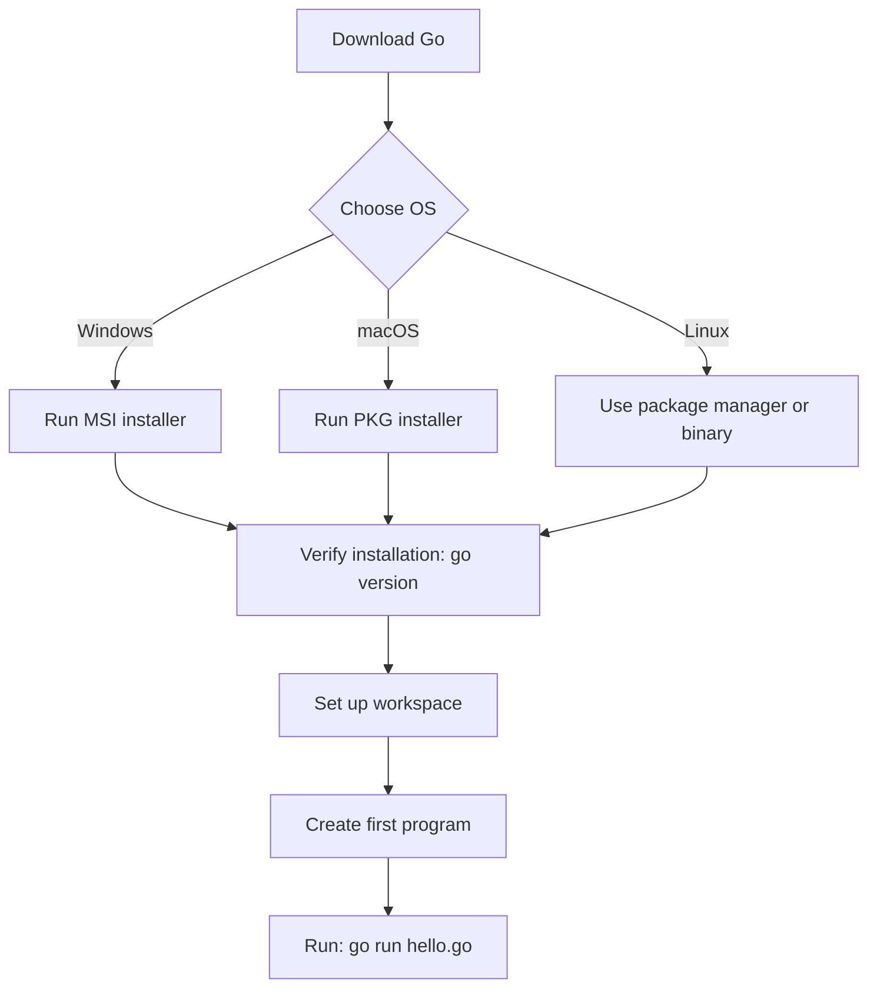

# Go Installation

## Introduction

Go (or Golang) is a statically typed, compiled programming language designed by Google. It combines the efficiency of compiled languages with the ease of use and safety features of modern languages. Before you can start writing and running Go programs, you'll need to install the Go toolchain on your system.

This guide will walk you through the installation process on different operating systems, verifying your installation, and setting up your Go workspace. By the end, you'll have everything you need to start developing with Go.

## Installing Go

Go is available for Windows, macOS, and Linux. The installation process is straightforward across all platforms.

### Download Go

First, visit the [official Go download page](https://golang.org/dl/) to get the latest stable version for your operating system.

### Platform-Specific Installation Instructions

#### Windows

1. Download the Windows MSI installer.
2. Run the installer and follow the prompts.
3. By default, Go will be installed in `C:\Program Files\Go` or `C:\Program Files (x86)\Go`.
4. The installer will automatically add Go to your PATH environment variable.

#### macOS

1. Download the macOS package file (.pkg).
2. Open the package file and follow the installation prompts.
3. Go will be installed to `/usr/local/go`.
4. The installer should add `/usr/local/go/bin` to your PATH variable in `/etc/paths.d/go`.

#### Linux

##### Using package manager (recommended):

For Ubuntu/Debian:
```bash
sudo apt update
sudo apt install golang
```

For Fedora:
```bash
sudo dnf install golang
```

For CentOS/RHEL:
```bash
sudo yum install golang
```

##### Using the official binary:

1. Download the Linux tarball.
2. Extract it to `/usr/local`:
   ```bash
   sudo tar -C /usr/local -xzf go1.21.0.linux-amd64.tar.gz
   ```
   (Replace the filename with your downloaded version)
3. Add Go to your PATH by adding the following line to your `~/.profile` or `~/.bashrc`:
   ```bash
   export PATH=$PATH:/usr/local/go/bin
   ```
4. Apply the changes:
   ```bash
   source ~/.profile
   ```
   or
   ```bash
   source ~/.bashrc
   ```

## Verifying Your Installation

After installation, verify that Go is properly installed by opening a terminal (or command prompt on Windows) and running:

```bash
go version
```

You should see output similar to:

```
go version go1.21.0 darwin/amd64
```

This confirms that Go is installed and available in your PATH.

## Setting Up Your Go Workspace

Go uses a specific workspace structure to organize your code. While this is less strict in recent Go versions, understanding it is important for beginners.

### GOPATH Environment Variable

The `GOPATH` environment variable specifies the location of your Go workspace. By default, it's set to:

- Windows: `%USERPROFILE%\go`
- macOS/Linux: `$HOME/go`

You can check your current GOPATH by running:

```bash
go env GOPATH
```

### Workspace Structure

A traditional Go workspace contains three directories:

```
go/
├── bin/    # Contains compiled executable programs
├── pkg/    # Contains package objects
└── src/    # Contains source code organized by import path
```

With Go modules (introduced in Go 1.11), you have more flexibility in organizing your code, but understanding this structure is still valuable.

## Setting Up Go Modules

Modern Go development uses modules for dependency management. Here's how to start a new project with modules:

1. Create a new directory for your project:
   ```bash
   mkdir my-go-project
   cd my-go-project
   ```

2. Initialize a new module:
   ```bash
   go mod init github.com/yourusername/my-go-project
   ```
   Replace `github.com/yourusername/my-go-project` with your module's import path.

3. This creates a `go.mod` file in your project directory, which tracks your dependencies.

## Your First Go Program

Let's create a simple "Hello, World!" program to confirm everything is working:

1. Create a file named `hello.go`:
   ```go
   package main

   import "fmt"

   func main() {
       fmt.Println("Hello, World! Go is installed successfully.")
   }
   ```

2. Run your program:
   ```bash
   go run hello.go
   ```

3. You should see the output:
   ```
   Hello, World! Go is installed successfully.
   ```

## Go Installation Diagram

Here's a simplified diagram of the Go installation process:



## Upgrading Go

To upgrade to a newer version of Go:

1. Download the new version from the official website.
2. Follow the same installation steps as above.
3. The installer will replace your existing Go installation.

## Common Installation Issues and Solutions

### "go: command not found"

This means Go's binary directory is not in your PATH.

**Solution:**
- Windows: Restart your command prompt or system.
- macOS/Linux: Make sure `/usr/local/go/bin` is in your PATH and source your profile file.

### Permission Issues on Linux/macOS

**Solution:**
- Use `sudo` when extracting the tarball.
- Make sure you have write permissions for the Go workspace.

### Multiple Go Versions

If you need to manage multiple Go versions, consider using a version manager like:
- [GVM](https://github.com/moovweb/gvm) for Linux/macOS
- [g](https://github.com/stefanmaric/g) for Windows/Linux/macOS

## Summary

Congratulations! You've successfully installed Go on your system and set up your development environment. You've also created and run your first Go program.

In this guide, you learned:
- How to install Go on different operating systems
- How to verify your installation
- How to set up your Go workspace
- How to create and run a simple Go program

## Additional Resources

- [Official Go Documentation](https://golang.org/doc/)
- [Go Tour](https://tour.golang.org/) - An interactive introduction to Go
- [Effective Go](https://golang.org/doc/effective_go) - Tips for writing clear, idiomatic Go code
- [Go by Example](https://gobyexample.com/) - Hands-on examples of Go

## Exercises

1. Install Go on your preferred operating system.
2. Run `go version` to verify the installation.
3. Set up your Go workspace.
4. Create and run the "Hello, World!" program.
5. Try modifying the program to display your name.
6. Explore the Go documentation and try out other simple examples.