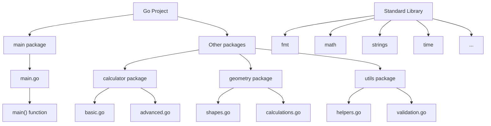

# Go Packages

## Introduction

In Go, packages are a fundamental way to organize and reuse code. A package is a collection of Go source files in the same directory that are compiled together. Packages allow you to:

- Group related code together
- Manage code dependencies
- Control visibility of variables, functions, and types
- Reuse code across different projects

As your Go projects grow in size and complexity, understanding how to effectively use packages becomes essential for maintaining clean, organized, and reusable code.

## What are Go Packages?

A package in Go is essentially a directory containing Go source files that belong together. Every Go source file must start with a package declaration that identifies which package the file belongs to.

```go
// file: greeting.go
package greeting

func SayHello(name string) string {
    return "Hello, " + name + "!"
}
```

In this simple example, we've created a file called `greeting.go` that belongs to the `greeting` package and contains a function called `SayHello`.

## The Main Package

Every executable Go program must contain a `main` package with a `main()` function, which serves as the entry point for the program. 

```go
// file: main.go
package main

import "fmt"

func main() {
    fmt.Println("Hello, World!")
}
```

**Output:**
```
Hello, World!
```

When you run `go run main.go`, the Go compiler looks for the `main()` function in the `main` package and executes it.

## Importing Packages

To use functions, variables, or types from other packages, you need to import them using the `import` statement.

```go
// file: main.go
package main

import (
    "fmt"
    "math/rand"
    "time"
)

func main() {
    // Seed the random number generator
    rand.Seed(time.Now().UnixNano())
    
    // Generate a random number between 1 and 100
    randomNum := rand.Intn(100) + 1
    
    fmt.Println("Random number:", randomNum)
}
```

**Output:**
```
Random number: 42  // The output will vary with each execution
```

In this example, we've imported three packages:
- `fmt`: For formatted I/O
- `math/rand`: For random number generation
- `time`: For time-related functions

### Import Syntax Variations

Go offers several ways to import packages:

1. **Single Import**
   ```go
   import "fmt"
   ```

2. **Multiple Imports (Grouped)**
   ```go
   import (
       "fmt"
       "math/rand"
   )
   ```

3. **Imports with Aliases**
   ```go
   import (
       "fmt"
       r "math/rand"  // Now we can use r.Intn() instead of rand.Intn()
   )
   ```

4. **Dot Imports** (Generally discouraged except in tests)
   ```go
   import (
       "fmt"
       . "math/rand"  // Functions can be called without the package prefix
   )
   // Now we can use Intn() directly instead of rand.Intn()
   ```

5. **Blank Imports** (Used for side effects)
   ```go
   import (
       "fmt"
       _ "image/png"  // Register PNG format without using its exported functions
   )
   ```

## Standard Library Packages

Go comes with a rich standard library that provides a wide range of functionality. Here are some commonly used standard library packages:

- `fmt`: Formatted I/O
- `os`: Operating system functionality
- `io`: Core I/O functionality
- `strconv`: String conversions
- `strings`: String manipulation
- `time`: Time-related functions
- `math`: Mathematical functions
- `net/http`: HTTP client and server implementations
- `encoding/json`: JSON encoding and decoding
- `database/sql`: Database interface

Example using the `strings` package:

```go
package main

import (
    "fmt"
    "strings"
)

func main() {
    message := "  Go Packages are powerful!  "
    
    // String manipulation using the strings package
    fmt.Println("Original:", message)
    fmt.Println("Trimmed:", strings.TrimSpace(message))
    fmt.Println("Uppercase:", strings.ToUpper(message))
    fmt.Println("Contains 'Package'?", strings.Contains(message, "Package"))
    fmt.Println("Replace 'Go' with 'Golang':", strings.Replace(message, "Go", "Golang", 1))
}
```

**Output:**
```
Original:   Go Packages are powerful!  
Trimmed: Go Packages are powerful!
Uppercase:   GO PACKAGES ARE POWERFUL!  
Contains 'Package'? false
Replace 'Go' with 'Golang':   Golang Packages are powerful!  
```

## Creating Your Own Packages

Let's create a simple project with multiple packages to demonstrate how to organize and use your own packages.

First, let's set up a basic project structure:

```
myproject/
├── main.go
└── calculator/
    ├── basic.go
    └── advanced.go
```

### Step 1: Create the calculator package files

```go
// file: calculator/basic.go
package calculator

// Add returns the sum of two integers
func Add(a, b int) int {
    return a + b
}

// Subtract returns the difference between two integers
func Subtract(a, b int) int {
    return a - b
}
```

```go
// file: calculator/advanced.go
package calculator

import "math"

// Power returns a raised to the power of b
func Power(a, b float64) float64 {
    return math.Pow(a, b)
}

// Factorial returns the factorial of n
func Factorial(n int) int {
    if n <= 1 {
        return 1
    }
    return n * Factorial(n-1)
}
```

### Step 2: Create the main.go file to use the calculator package

```go
// file: main.go
package main

import (
    "fmt"
    "myproject/calculator" // Import our custom package
)

func main() {
    // Using functions from the calculator package
    sum := calculator.Add(5, 3)
    difference := calculator.Subtract(10, 4)
    power := calculator.Power(2, 3)
    factorial := calculator.Factorial(5)
    
    fmt.Println("5 + 3 =", sum)
    fmt.Println("10 - 4 =", difference)
    fmt.Println("2^3 =", power)
    fmt.Println("5! =", factorial)
}
```

**Output:**
```
5 + 3 = 8
10 - 4 = 6
2^3 = 8
5! = 120
```

## Go Modules

Go modules are the official dependency management system for Go, introduced in Go 1.11. They allow you to:

- Create versioned packages
- Manage dependencies
- Work outside of the GOPATH
- Have reproducible builds

### Creating a Go Module

To create a Go module, you need to initialize it with `go mod init`:

```bash
$ mkdir mymodule
$ cd mymodule
$ go mod init github.com/yourusername/mymodule
```

This creates a `go.mod` file that defines your module and its dependencies:

```
module github.com/yourusername/mymodule

go 1.16
```

As you add dependencies to your code, they will be automatically added to the `go.mod` file when you run commands like `go build` or `go test`.

## Package Visibility Rules

In Go, the visibility of a function, variable, type, or constant is determined by its first letter:

- **Exported (Public)**: If the first letter is uppercase, it's exported and can be accessed from other packages.
- **Unexported (Private)**: If the first letter is lowercase, it's unexported and can only be accessed within its own package.

Let's see an example:

```go
// file: geometry/shapes.go
package geometry

import "math"

// Circle is an exported struct (public)
type Circle struct {
    Radius float64 // Exported field (public)
    color  string  // Unexported field (private)
}

// Area is an exported method (public)
func (c Circle) Area() float64 {
    return math.Pi * c.Radius * c.Radius
}

// setColor is an unexported method (private)
func (c *Circle) setColor(color string) {
    c.color = color
}

// GetColor is an exported method to access private field
func (c Circle) GetColor() string {
    return c.color
}

// NewCircle is a constructor function (public)
func NewCircle(radius float64, color string) Circle {
    c := Circle{Radius: radius}
    c.setColor(color)
    return c
}
```

```go
// file: main.go
package main

import (
    "fmt"
    "myproject/geometry"
)

func main() {
    // Create a circle using the constructor
    circle := geometry.NewCircle(5.0, "blue")
    
    // Access public fields and methods
    fmt.Println("Radius:", circle.Radius)
    fmt.Println("Area:", circle.Area())
    fmt.Println("Color:", circle.GetColor())
    
    // This would cause a compilation error:
    // fmt.Println(circle.color)        // Can't access private field
    // circle.setColor("red")           // Can't access private method
}
```

**Output:**
```
Radius: 5
Area: 78.53981633974483
Color: blue
```

