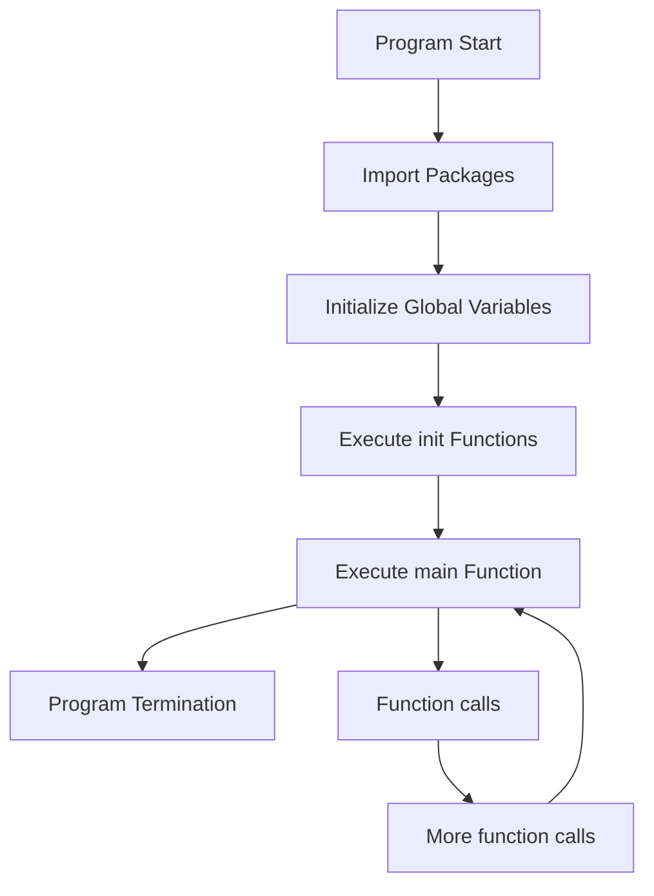

# Go Main Function

## Introduction

In Go programming, the `main` function serves as the entry point for executable programs. When you run a Go program, execution begins at the `main` function. This makes it one of the most fundamental concepts to understand when learning Go.

In this guide, we'll explore:
- What the `main` function is and why it's important
- How to define and structure the `main` function
- Special rules that apply to the `main` function
- Practical examples of `main` functions in real-world applications

## The Main Function Fundamentals

### What is the Main Function?

The `main` function in Go is a special function that serves as the starting point for program execution. When you build and run a Go application, the runtime system automatically looks for and calls the `main` function to begin execution.

### Key Requirements

For a Go program to be executable, it must:

1. Be part of a package named `main`
2. Contain a function called `main` that takes no arguments and returns no values

Here's the basic structure:

```go
package main

func main() {
    // Your code goes here
}
```

Let's break down these requirements:

#### Package main

In Go, a program must belong to package `main` to be executable. Other packages create libraries or modules that can be imported and used by other programs.

#### Function main

The function itself must:
- Be named exactly `main` (Go is case-sensitive)
- Take no parameters
- Return no values

If you try to add parameters or return values to the `main` function, the compiler will generate an error.

## Creating Your First Main Function

Let's create a simple "Hello, World!" program to demonstrate the `main` function:

```go
package main

import "fmt"

func main() {
    fmt.Println("Hello, World!")
}
```

**Output:**
```
Hello, World!
```

In this example:
1. We declare our program as part of package `main`
2. We import the `fmt` package for formatted output
3. We define our `main` function
4. Inside the function, we call `fmt.Println()` to display text

## Initialization in the Main Function

The `main` function is an excellent place to:
- Initialize resources needed by your program
- Set up configuration
- Create connections to databases or services
- Define and process command-line arguments

Here's an example that initializes a simple configuration:

```go
package main

import (
    "fmt"
    "os"
)

func main() {
    // Initialize configuration
    appName := "MyGoApp"
    version := "1.0.0"
    
    // Display startup information
    fmt.Printf("Starting %s (version %s)", appName, version)
    
    // Check if any command-line arguments were provided
    if len(os.Args) > 1 {
        fmt.Println("Arguments provided:", os.Args[1:])
    } else {
        fmt.Println("No arguments provided")
    }
    
    // Main program logic would go here
    fmt.Println("Program executing...")
    
    // Cleanup and exit
    fmt.Println("Program complete")
}
```

**Sample Output (with no arguments):**
```
Starting MyGoApp (version 1.0.0)
No arguments provided
Program executing...
Program complete
```

**Sample Output (with arguments `--debug --port=8080`):**
```
Starting MyGoApp (version 1.0.0)
Arguments provided: [--debug --port=8080]
Program executing...
Program complete
```

## Program Flow and the Main Function

The following diagram illustrates how the `main` function fits into the overall program flow in a Go application:



As you can see, the `main` function is executed after:
1. All imported packages are loaded
2. Global variables are initialized
3. All `init()` functions (special functions for initialization) are executed

When the `main` function completes its execution, the program terminates.

## Error Handling in Main

Since `main` cannot return values, error handling typically involves:
1. Using log packages to report errors
2. Calling `os.Exit()` with appropriate exit codes

Here's an example showing error handling in the `main` function:

```go
package main

import (
    "errors"
    "fmt"
    "log"
    "os"
)

// Function that simulates a database connection
func connectToDatabase(connectionString string) error {
    if connectionString == "" {
        return errors.New("empty connection string")
    }
    // In a real app, actual connection logic would go here
    return nil
}

func main() {
    // Set up logging
    log.SetPrefix("MyApp: ")
    
    // Attempt to connect to database
    connectionString := os.Getenv("DB_CONNECTION")
    err := connectToDatabase(connectionString)
    
    if err != nil {
        log.Printf("Database connection failed: %v", err)
        fmt.Println("Could not start application due to database error")
        os.Exit(1) // Exit with non-zero status to indicate error
    }
    
    fmt.Println("Application running successfully")
    // Rest of the application would run here
}
```

**Output (when DB_CONNECTION environment variable is not set):**
```
MyApp: Database connection failed: empty connection string
Could not start application due to database error
```

The program would exit with status code 1, indicating an error.

## Practical Applications

### Command-Line Tool

A common use of the `main` function is to create command-line tools. Here's a simple calculator example:

```go
package main

import (
    "fmt"
    "os"
    "strconv"
)

func main() {
    // Check if we have the right number of arguments
    if len(os.Args) != 4 {
        fmt.Println("Usage: calc <number> <operator> <number>")
        fmt.Println("Example: calc 5 + 3")
        os.Exit(1)
    }
    
    // Parse the first number
    num1, err := strconv.ParseFloat(os.Args[1], 64)
    if err != nil {
        fmt.Println("Error: First argument must be a number")
        os.Exit(1)
    }
    
    // Get the operator
    operator := os.Args[2]
    
    // Parse the second number
    num2, err := strconv.ParseFloat(os.Args[3], 64)
    if err != nil {
        fmt.Println("Error: Third argument must be a number")
        os.Exit(1)
    }
    
    // Perform the calculation
    var result float64
    switch operator {
    case "+":
        result = num1 + num2
    case "-":
        result = num1 - num2
    case "*":
        result = num1 * num2
    case "/":
        if num2 == 0 {
            fmt.Println("Error: Cannot divide by zero")
            os.Exit(1)
        }
        result = num1 / num2
    default:
        fmt.Printf("Error: Unsupported operator: %s", operator)
        fmt.Println("Supported operators: +, -, *, /")
        os.Exit(1)
    }
    
    // Display the result
    fmt.Printf("%g %s %g = %g", num1, operator, num2, result)
}
```

**Sample Usage:**
```
$ ./calc 5 + 3
5 + 3 = 8

$ ./calc 10 / 2
10 / 2 = 5
```

### Web Server

The `main` function is also used to start web servers. Here's a simple example:

```go
package main

import (
    "fmt"
    "log"
    "net/http"
)

// Handler function for the root path
func homeHandler(w http.ResponseWriter, r *http.Request) {
    fmt.Fprintln(w, "Welcome to my Go web server!")
}

// Handler function for the about path
func aboutHandler(w http.ResponseWriter, r *http.Request) {
    fmt.Fprintln(w, "This is a simple web server written in Go")
}

func main() {
    // Register the route handlers
    http.HandleFunc("/", homeHandler)
    http.HandleFunc("/about", aboutHandler)
    
    // Set the port to listen on
    port := ":8080"
    
    // Start the server
    fmt.Printf("Starting server on port %s...", port)
    err := http.ListenAndServe(port, nil)
    
    // This code only runs if the server fails to start
    if err != nil {
        log.Fatalf("Server failed to start: %v", err)
    }
}
```

When you run this program, it starts a web server that listens on port 8080. You can access it by navigating to `http://localhost:8080` in your web browser.

## Common Pitfalls and Best Practices

### Pitfalls to Avoid

1. **Forgetting the package name**: If you don't use `package main`, your program won't be executable.
   
2. **Adding parameters or return values**: The `main` function must not have parameters or return values.

   ```go
   // This will not compile
   func main(args []string) {
       // Code here
   }
   
   // This also will not compile
   func main() int {
       return 0
   }
   ```

3. **Infinite loops without exit conditions**: Be careful with infinite loops in the `main` function, as they will prevent your program from terminating.

### Best Practices

1. **Keep the main function clean and short**: Delegate specific functionality to other functions and packages.

2. **Handle signals appropriately**: For long-running applications, handle interruption signals (SIGINT, SIGTERM) to ensure clean shutdown.

   ```go
   package main
   
   import (
       "fmt"
       "os"
       "os/signal"
       "syscall"
   )
   
   func main() {
       // Set up channel to receive signals
       sigChan := make(chan os.Signal, 1)
       signal.Notify(sigChan, syscall.SIGINT, syscall.SIGTERM)
       
       fmt.Println("Application started. Press Ctrl+C to exit.")
       
       // Wait for termination signal
       sig := <-sigChan
       fmt.Printf("Received signal: %v", sig)
       
       // Perform cleanup
       fmt.Println("Cleaning up resources...")
       // Cleanup code would go here
       
       fmt.Println("Application terminated gracefully")
   }
   ```

3. **Use flags package for command-line options**: The standard library provides the `flag` package for parsing command-line arguments.

   ```go
   package main
   
   import (
       "flag"
       "fmt"
   )
   
   func main() {
       // Define flags
       portPtr := flag.Int("port", 8080, "port to listen on")
       debugPtr := flag.Bool("debug", false, "enable debug mode")
       configPtr := flag.String("config", "config.json", "path to config file")
       
       // Parse the flags
       flag.Parse()
       
       // Use the flags
       fmt.Printf("Port: %d", *portPtr)
       fmt.Printf("Debug: %t", *debugPtr)
       fmt.Printf("Config: %s", *configPtr)
       
       // Rest of your program
   }
   ```

## Summary

The `main` function is the entry point for Go programs. It must:
- Be part of package `main`
- Take no arguments
- Return no values

The `main` function is responsible for:
- Initializing your application
- Coordinating the program flow
- Managing resources
- Handling command-line arguments
- Ensuring proper termination

By understanding how to use the `main` function effectively, you've taken a significant step toward mastering Go programming. This knowledge forms the foundation for building more complex Go applications.

## Additional Resources and Exercises

### Resources

- [Go Documentation on Program Execution](https://golang.org/doc/effective_go#program_execution)
- [Go by Example: Command-Line Arguments](https://gobyexample.com/command-line-arguments)
- [Go by Example: Command-Line Flags](https://gobyexample.com/command-line-flags)

### Exercises

1. **Hello Name**: Modify the "Hello World" program to accept a name as a command-line argument and print "Hello, [name]!".

2. **File Counter**: Create a program that counts and displays the number of lines, words, and characters in a text file specified as a command-line argument.

3. **Simple HTTP Server**: Build a web server that serves different HTML content based on the URL path.

4. **Config Loader**: Write a program that loads configuration from a JSON file specified as a command-line argument and prints the configuration values.

5. **Signal Handler**: Expand the signal handling example to perform different cleanup actions based on which signal was received.