# Go Syntax

## Introduction

Go (or Golang) is a statically typed, compiled programming language designed at Google by Robert Griesemer, Rob Pike, and Ken Thompson. It combines the efficiency of compiled languages with the ease of use and safety features of modern languages. This guide will walk you through the fundamental syntax of Go, providing a solid foundation for your journey into Go programming.

Go's syntax is clean, concise, and designed to be easy to read and write. Unlike many other languages that have evolved over decades, Go was designed from scratch to address common pain points in software development, making it particularly well-suited for modern applications, especially in cloud computing, web servers, and distributed systems.

## Basic Structure of a Go Program

Every Go program follows a specific structure. Let's look at the famous "Hello, World!" example:

```go
package main

import "fmt"

func main() {
    fmt.Println("Hello, World!")
}
```

When you run this program, you'll see:

```
Hello, World!
```

Let's break down the key components:

1. **Package Declaration**: Every Go file starts with a `package` declaration. The `main` package is special as it defines an executable program rather than a library.

2. **Import Statements**: The `import` keyword is used to include packages (libraries) needed for your program.

3. **Function Declaration**: Functions in Go start with the `func` keyword. The `main()` function is the entry point of execution for a Go program.

4. **Code Block**: Enclosed in curly braces `{}`.

## Variables and Data Types

### Variable Declaration

Go offers several ways to declare variables:

```go
// Method 1: Declaration with explicit type
var name string = "John"

// Method 2: Type inference (Go figures out the type)
var age = 25

// Method 3: Short declaration (only inside functions)
salary := 50000.50

// Multiple declarations
var (
    city    string = "New York"
    country string = "USA"
)
```

### Basic Data Types

Go has several built-in data types:

```go
// Numeric types
var integer int = 42
var float float64 = 3.14159
var complex complex128 = 3 + 4i

// Boolean type
var isActive bool = true

// String type
var message string = "Hello, Go!"

// Byte (alias for uint8)
var b byte = 'A'

// Rune (alias for int32, represents a Unicode code point)
var r rune = '😀'
```

### Constants

Constants are declared using the `const` keyword:

```go
const Pi = 3.14159
const (
    StatusOK       = 200
    StatusNotFound = 404
)
```

## Control Structures

### Conditional Statements

#### If-Else

```go
package main

import "fmt"

func main() {
    age := 18
    
    if age >= 18 {
        fmt.Println("You are an adult")
    } else if age >= 13 {
        fmt.Println("You are a teenager")
    } else {
        fmt.Println("You are a child")
    }
}
```

Output:
```
You are an adult
```

Go also supports a special form of `if` with a short statement before the condition:

```go
if score := calculateScore(); score > 100 {
    fmt.Println("High score!")
} else {
    fmt.Println("Keep trying!")
}
// score is not accessible here
```

#### Switch Statement

```go
package main

import "fmt"

func main() {
    day := "Monday"
    
    switch day {
    case "Monday":
        fmt.Println("Start of work week")
    case "Friday":
        fmt.Println("End of work week")
    case "Saturday", "Sunday":
        fmt.Println("Weekend!")
    default:
        fmt.Println("Mid-week")
    }
}
```

Output:
```
Start of work week
```

### Loops

Go has only one looping construct: the `for` loop, which has several forms:

#### Standard For Loop

```go
package main

import "fmt"

func main() {
    for i := 0; i < 5; i++ {
        fmt.Println(i)
    }
}
```

Output:
```
0
1
2
3
4
```

#### While-like For Loop

```go
package main

import "fmt"

func main() {
    sum := 1
    for sum < 10 {
        sum += sum
        fmt.Println(sum)
    }
}
```

Output:
```
2
4
8
16
```

#### Infinite Loop

```go
for {
    // This will run forever unless broken out of
    if condition {
        break
    }
}
```

#### For-Range Loop

Used to iterate over arrays, slices, strings, maps, and channels:

```go
package main

import "fmt"

func main() {
    fruits := []string{"apple", "banana", "cherry"}
    
    for index, fruit := range fruits {
        fmt.Printf("Index: %d, Fruit: %s
", index, fruit)
    }
}
```

Output:
```
Index: 0, Fruit: apple
Index: 1, Fruit: banana
Index: 2, Fruit: cherry
```

## Functions

Functions in Go are declared using the `func` keyword:

```go
package main

import "fmt"

// Basic function
func greet(name string) string {
    return "Hello, " + name + "!"
}

// Multiple return values
func divide(a, b float64) (float64, error) {
    if b == 0 {
        return 0, fmt.Errorf("cannot divide by zero")
    }
    return a / b, nil
}

// Named return values
func rectangleProperties(length, width float64) (area, perimeter float64) {
    area = length * width
    perimeter = 2 * (length + width)
    return // "naked" return
}

func main() {
    // Calling a basic function
    message := greet("Alice")
    fmt.Println(message)
    
    // Handling multiple return values
    result, err := divide(10, 2)
    if err != nil {
        fmt.Println("Error:", err)
    } else {
        fmt.Println("Result:", result)
    }
    
    // Using named return values
    a, p := rectangleProperties(5, 3)
    fmt.Printf("Area: %.2f, Perimeter: %.2f
", a, p)
}
```

Output:
```
Hello, Alice!
Result: 5
Area: 15.00, Perimeter: 16.00
```

## Packages and Imports

Go code is organized into packages. Every `.go` file must belong to a package:

```go
package mypackage

// Content of this file belongs to mypackage
```

To use code from other packages, you need to import them:

```go
// Single import
import "fmt"

// Multiple imports
import (
    "fmt"
    "strings"
    "time"
)
```

You can also give imported packages an alias:

```go
import (
    f "fmt"
    s "strings"
)

func main() {
    f.Println(s.ToUpper("hello"))
}
```

## Data Structures

### Arrays

Arrays in Go have a fixed length:

```go
package main

import "fmt"

func main() {
    // Declare an array
    var numbers [5]int
    numbers[0] = 10
    numbers[1] = 20
    
    // Initialize with values
    names := [3]string{"Alice", "Bob", "Charlie"}
    
    // Let Go count the elements
    colors := [...]string{"Red", "Green", "Blue", "Yellow"}
    
    fmt.Println(numbers)
    fmt.Println(names)
    fmt.Println(colors)
    fmt.Println("Length of colors:", len(colors))
}
```

Output:
```
[10 20 0 0 0]
[Alice Bob Charlie]
[Red Green Blue Yellow]
Length of colors: 4
```

### Slices

Slices are like arrays but with dynamic length:

```go
package main

import "fmt"

func main() {
    // Create a slice
    numbers := []int{1, 2, 3, 4, 5}
    
    // Slice from an array
    arr := [5]int{10, 20, 30, 40, 50}
    slice1 := arr[1:4]  // Elements 1 through 3
    
    // Make function to create slices
    slice2 := make([]int, 5)      // Length 5, capacity 5
    slice3 := make([]int, 5, 10)  // Length 5, capacity 10
    
    // Append to a slice
    numbers = append(numbers, 6, 7, 8)
    
    fmt.Println(numbers)
    fmt.Println(slice1)
    fmt.Println(slice2)
    fmt.Println(slice3)
    fmt.Println("Length:", len(numbers), "Capacity:", cap(numbers))
}
```

Output:
```
[1 2 3 4 5 6 7 8]
[20 30 40]
[0 0 0 0 0]
[0 0 0 0 0]
Length: 8 Capacity: 8
```

### Maps

Maps are Go's built-in hash tables:

```go
package main

import "fmt"

func main() {
    // Create a map
    studentScores := map[string]int{
        "Alice": 92,
        "Bob":   85,
        "Charlie": 79,
    }
    
    // Add or update
    studentScores["David"] = 88
    
    // Check if key exists
    score, exists := studentScores["Eva"]
    if !exists {
        fmt.Println("Eva is not in the map")
    }
    
    // Delete a key
    delete(studentScores, "Charlie")
    
    // Iterate over a map
    for name, score := range studentScores {
        fmt.Printf("%s: %d
", name, score)
    }
}
```

Output (note: map iteration order is not guaranteed):
```
Eva is not in the map
Alice: 92
Bob: 85
David: 88
```

## Structures and Methods

### Structs

Structs are collections of fields:

```go
package main

import "fmt"

// Define a struct
type Person struct {
    FirstName string
    LastName  string
    Age       int
}

func main() {
    // Create a struct
    p1 := Person{
        FirstName: "John",
        LastName:  "Doe",
        Age:       30,
    }
    
    // Short initialization (order matters)
    p2 := Person{"Jane", "Smith", 25}
    
    // Zero-value initialization
    var p3 Person
    p3.FirstName = "Mike"
    p3.LastName = "Johnson"
    
    fmt.Println(p1)
    fmt.Println(p2)
    fmt.Println(p3)
}
```

Output:
```
{John Doe 30}
{Jane Smith 25}
{Mike Johnson 0}
```

### Methods

Methods are functions with a special receiver argument:

```go
package main

import (
    "fmt"
    "strings"
)

type Person struct {
    FirstName string
    LastName  string
    Age       int
}

// Method with a value receiver
func (p Person) FullName() string {
    return p.FirstName + " " + p.LastName
}

// Method with a pointer receiver
func (p *Person) SetName(first, last string) {
    p.FirstName = first
    p.LastName = last
}

func main() {
    person := Person{
        FirstName: "John",
        LastName:  "Doe",
        Age:       30,
    }
    
    fmt.Println(person.FullName())
    
    person.SetName("Jane", "Smith")
    fmt.Println(person.FullName())
}
```

Output:
```
John Doe
Jane Smith
```

## Error Handling

Go handles errors through explicit return values rather than exceptions:

```go
package main

import (
    "fmt"
    "errors"
)

// Function that returns an error
func divide(a, b int) (int, error) {
    if b == 0 {
        return 0, errors.New("cannot divide by zero")
    }
    return a / b, nil
}

func main() {
    // Proper error handling
    result, err := divide(10, 2)
    if err != nil {
        fmt.Println("Error:", err)
    } else {
        fmt.Println("Result:", result)
    }
    
    // Error case
    result, err = divide(10, 0)
    if err != nil {
        fmt.Println("Error:", err)
    } else {
        fmt.Println("Result:", result)
    }
}
```

Output:
```
Result: 5
Error: cannot divide by zero
```

## Flow Visualization

Let's visualize Go program flow with a simple example:

```mermaid
flowchart LR
    A[Start Program] --> B[Package Declaration]
    B --> C[Import Statements]
    C --> D[Function Declarations]
    D --> E["main() Function"]
    E --> F[Variable Declarations]
    F --> G[Control Structures]
    G --> H[Function Calls]
    H --> I[Return Values]
    I --> J[End Program]
```



## Real-World Example: Weather App Component

Let's build a small component for a weather application to demonstrate Go syntax in practice:

```go
package weather

import (
    "encoding/json"
    "fmt"
    "net/http"
    "time"
)

// WeatherData represents the structure of our weather information
type WeatherData struct {
    Location    string
    Temperature float64
    Conditions  string
    Humidity    int
    UpdatedAt   time.Time
}

// FetchWeather gets weather data for a given city
func FetchWeather(city string) (*WeatherData, error) {
    // In a real app, this would call an API
    // This is a simplified example
    
    if city == "" {
        return nil, fmt.Errorf("city name cannot be empty")
    }
    
    // Simulate API call
    time.Sleep(500 * time.Millisecond)
    
    // Mock data for demonstration
    weatherData := &WeatherData{
        Location:    city,
        Temperature: 22.5,
        Conditions:  "Partly Cloudy",
        Humidity:    65,
        UpdatedAt:   time.Now(),
    }
    
    return weatherData, nil
}

// FormatWeather returns a human-readable weather report
func (w *WeatherData) FormatWeather() string {
    return fmt.Sprintf(
        "Weather for %s:
"+
        "Temperature: %.1f°C
"+
        "Conditions: %s
"+
        "Humidity: %d%%
"+
        "Updated: %s",
        w.Location,
        w.Temperature,
        w.Conditions,
        w.Humidity,
        w.UpdatedAt.Format("15:04:05"),
    )
}

// ToJSON converts weather data to JSON
func (w *WeatherData) ToJSON() (string, error) {
    data, err := json.Marshal(w)
    if err != nil {
        return "", err
    }
    return string(data), nil
}

// Example usage in a web handler function
func WeatherHandler(w http.ResponseWriter, r *http.Request) {
    city := r.URL.Query().Get("city")
    if city == "" {
        http.Error(w, "Please provide a city parameter", http.StatusBadRequest)
        return
    }
    
    weatherData, err := FetchWeather(city)
    if err != nil {
        http.Error(w, err.Error(), http.StatusInternalServerError)
        return
    }
    
    jsonData, err := weatherData.ToJSON()
    if err != nil {
        http.Error(w, "Error generating JSON", http.StatusInternalServerError)
        return
    }
    
    w.Header().Set("Content-Type", "application/json")
    w.Write([]byte(jsonData))
}
```

This example demonstrates:
- Struct definitions
- Error handling
- Methods with receivers
- Function declarations
- Concurrency with sleep (simulating async operations)
- JSON encoding
- HTTP handling
- String formatting
- Time handling

## Summary

We've covered the fundamental elements of Go syntax:

- Program structure and package system
- Variables and data types
- Control structures (conditional statements and loops)
- Functions and methods
- Data structures (arrays, slices, maps)
- Structs and custom types
- Error handling

Go's syntax is designed to be clear and concise, making it easier to read and maintain. Its simplicity reduces cognitive load and allows developers to focus on solving problems rather than fighting with complex language features.

## Exercises

1. **Hello You**: Modify the Hello World program to ask for a user's name and print a personalized greeting.

2. **Temperature Converter**: Write a program that converts temperatures between Celsius and Fahrenheit.

3. **Word Counter**: Create a function that counts the occurrences of each word in a given text.

4. **Student Database**: Build a simple student database using structs and maps to store and retrieve student information.

5. **URL Shortener**: Implement a basic URL shortener service that maps long URLs to short codes.

## Additional Resources

- [Official Go Documentation](https://golang.org/doc/)
- [A Tour of Go](https://tour.golang.org/)
- [Go by Example](https://gobyexample.com/)
- [The Go Programming Language](https://www.gopl.io/) (book by Alan A. A. Donovan and Brian W. Kernighan)
- [Effective Go](https://golang.org/doc/effective_go)

Happy coding with Go!