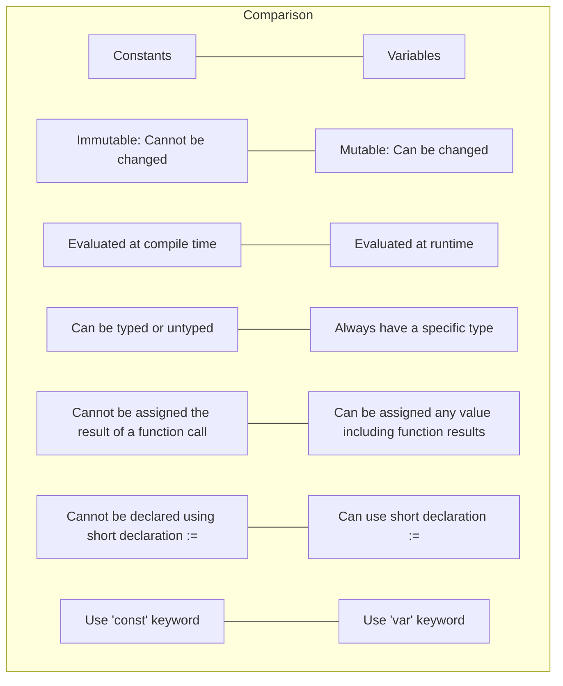

# Go Constants

## Introduction

Constants in Go are fixed values that cannot be modified once they are declared. They play a crucial role in Go programming by providing immutable values that remain consistent throughout your program's execution. Unlike variables, which can change their values during runtime, constants maintain their initial values, making your code more predictable and easier to maintain.

In this tutorial, we'll explore how to work with constants in Go, their types, declaration methods, and best practices for using them effectively in your programs.

## Declaring Constants

In Go, constants are declared using the `const` keyword. The basic syntax for declaring a constant is:

```go
const name = value
```

Let's look at some examples:

```go
package main

import "fmt"

func main() {
    // Single constant declaration
    const PI = 3.14159
    
    fmt.Println("The value of PI is:", PI)
    
    // This would cause a compile-time error
    // PI = 3.14  // Cannot assign to PI (constant)
}
```

Output:
```
The value of PI is: 3.14159
```

### Multiple Constants Declaration

You can declare multiple constants in a single block using the `const` keyword followed by parentheses:

```go
package main

import "fmt"

func main() {
    const (
        Monday    = 1
        Tuesday   = 2
        Wednesday = 3
        Thursday  = 4
        Friday    = 5
        Saturday  = 6
        Sunday    = 7
    )
    
    fmt.Println("Monday:", Monday)
    fmt.Println("Friday:", Friday)
}
```

Output:
```
Monday: 1
Friday: 5
```

## Types of Constants

Go supports several types of constants:

1. **Numeric constants**: Integer, floating-point, and complex numbers
2. **Boolean constants**: `true` and `false`
3. **String constants**: Text enclosed in double quotes
4. **Character constants**: Also known as runes, enclosed in single quotes
5. **Named constants**: User-defined constants with specific names

Let's see examples of each type:

```go
package main

import "fmt"

func main() {
    // Numeric constants
    const (
        Integer     = 42
        FloatNumber = 3.14
        Complex     = 3 + 4i
    )
    
    // Boolean constants
    const (
        IsEnabled = true
        IsVisible = false
    )
    
    // String constant
    const Greeting = "Hello, Go programmer!"
    
    // Character/rune constant
    const NewLine = ''
    
    fmt.Println("Integer:", Integer)
    fmt.Println("Float:", FloatNumber)
    fmt.Println("Complex:", Complex)
    fmt.Println("IsEnabled:", IsEnabled)
    fmt.Println("Greeting:", Greeting)
    fmt.Printf("NewLine character code: %d", NewLine)
}
```

Output:
```
Integer: 42
Float: 3.14
Complex: (3+4i)
IsEnabled: true
Greeting: Hello, Go programmer!
NewLine character code: 10
```

## Typed vs. Untyped Constants

Go constants can be either typed or untyped. Untyped constants are more flexible because they don't have a specific type until they're used in a context that requires a type.

### Typed Constants

A typed constant is declared with a specific type:

```go
package main

import "fmt"

func main() {
    const TypedInt int = 42
    const TypedFloat float64 = 3.14
    const TypedString string = "Hello"
    
    fmt.Printf("TypedInt type: %T, value: %v", TypedInt, TypedInt)
    fmt.Printf("TypedFloat type: %T, value: %v", TypedFloat, TypedFloat)
    fmt.Printf("TypedString type: %T, value: %v", TypedString, TypedString)
    
    // This will cause a compilation error
    // var myFloat float32 = TypedFloat // Cannot use TypedFloat (type float64) as type float32
}
```

Output:
```
TypedInt type: int, value: 42
TypedFloat type: float64, value: 3.14
TypedString type: string, value: Hello
```

### Untyped Constants

Untyped constants don't have a specific type until they're assigned to a variable or used in a context that requires a specific type:

```go
package main

import "fmt"

func main() {
    const UntypedInt = 42
    const UntypedFloat = 3.14
    const UntypedString = "Hello"
    
    // These work fine because untyped constants are flexible
    var myInt int = UntypedInt
    var myInt32 int32 = UntypedInt
    var myInt64 int64 = UntypedInt
    
    var myFloat32 float32 = UntypedFloat
    var myFloat64 float64 = UntypedFloat
    
    fmt.Printf("myInt: %v, myInt32: %v, myInt64: %v", myInt, myInt32, myInt64)
    fmt.Printf("myFloat32: %v, myFloat64: %v", myFloat32, myFloat64)
}
```

Output:
```
myInt: 42, myInt32: 42, myInt64: 42
myFloat32: 3.14, myFloat64: 3.14
```

## The iota Identifier

Go provides a special identifier called `iota` that makes it easier to create a sequence of related constants. The `iota` identifier is automatically incremented by 1 for each constant in a `const` block, starting from 0.

```go
package main

import "fmt"

func main() {
    const (
        Sunday    = iota // 0
        Monday           // 1
        Tuesday          // 2
        Wednesday        // 3
        Thursday         // 4
        Friday           // 5
        Saturday         // 6
    )
    
    fmt.Println("Sunday:", Sunday)
    fmt.Println("Monday:", Monday)
    fmt.Println("Saturday:", Saturday)
}
```

Output:
```
Sunday: 0
Monday: 1
Saturday: 6
```

### Advanced iota Usage

You can also use expressions with `iota` for more complex sequences:

```go
package main

import "fmt"

func main() {
    const (
        // Bit shifting
        KB = 1 << (10 * iota) // 1 << (10 * 0) = 1
        MB                     // 1 << (10 * 1) = 1024
        GB                     // 1 << (10 * 2) = 1048576
        TB                     // 1 << (10 * 3) = 1073741824
    )
    
    fmt.Printf("1 KB = %d bytes", KB)
    fmt.Printf("1 MB = %d bytes", MB)
    fmt.Printf("1 GB = %d bytes", GB)
    fmt.Printf("1 TB = %d bytes", TB)
    
    // Another example: using iota with offset and multiplication
    const (
        Open = iota + 1 // 0 + 1 = 1
        Close           // 1 + 1 = 2
        Pending         // 2 + 1 = 3
        
        // Skip a value
        _
        
        // Continue the sequence
        Active = iota * 10 // 4 * 10 = 40
        Inactive           // 5 * 10 = 50
    )
    
    fmt.Println("Open:", Open)
    fmt.Println("Close:", Close)
    fmt.Println("Pending:", Pending)
    fmt.Println("Active:", Active)
    fmt.Println("Inactive:", Inactive)
}
```

Output:
```
1 KB = 1 bytes
1 MB = 1024 bytes
1 GB = 1048576 bytes
1 TB = 1073741824 bytes
Open: 1
Close: 2
Pending: 3
Active: 40
Inactive: 50
```

## Practical Applications of Constants

Constants are useful in many real-world scenarios. Here are some practical applications:

### Configuration Settings

Constants can be used to define configuration settings that shouldn't change during program execution:

```go
package main

import "fmt"

const (
    DatabaseHost     = "localhost"
    DatabasePort     = 5432
    DatabaseUser     = "admin"
    MaxConnections   = 100
    ConnectionTimeout = 30 // in seconds
)

func connectToDatabase() {
    // Simulate database connection
    fmt.Printf("Connecting to %s:%d as %s", DatabaseHost, DatabasePort, DatabaseUser)
    fmt.Printf("Using max %d connections with %d second timeout", MaxConnections, ConnectionTimeout)
}

func main() {
    connectToDatabase()
}
```

Output:
```
Connecting to localhost:5432 as admin
Using max 100 connections with 30 second timeout
```

### Error Codes

Constants can define error codes and their messages:

```go
package main

import "fmt"

const (
    ErrorSuccess = iota
    ErrorFileNotFound
    ErrorPermissionDenied
    ErrorOutOfMemory
)

// Map error codes to messages
func getErrorMessage(errorCode int) string {
    switch errorCode {
    case ErrorSuccess:
        return "Operation completed successfully"
    case ErrorFileNotFound:
        return "The specified file was not found"
    case ErrorPermissionDenied:
        return "You don't have permission to access this resource"
    case ErrorOutOfMemory:
        return "Not enough memory to complete the operation"
    default:
        return "Unknown error"
    }
}

func main() {
    // Simulate some operations
    fmt.Println("Error 0:", getErrorMessage(ErrorSuccess))
    fmt.Println("Error 1:", getErrorMessage(ErrorFileNotFound))
    fmt.Println("Error 2:", getErrorMessage(ErrorPermissionDenied))
}
```

Output:
```
Error 0: Operation completed successfully
Error 1: The specified file was not found
Error 2: You don't have permission to access this resource
```

### Defining Flags and Options

Constants can be used with bitwise operations to define flags:

```go
package main

import "fmt"

const (
    ReadPermission = 1 << iota // 1 (001)
    WritePermission            // 2 (010)
    ExecutePermission          // 4 (100)
)

func checkPermissions(permissions int) {
    fmt.Printf("Permissions: %03b", permissions)
    
    if permissions&ReadPermission != 0 {
        fmt.Println("- Read permission granted")
    }
    
    if permissions&WritePermission != 0 {
        fmt.Println("- Write permission granted")
    }
    
    if permissions&ExecutePermission != 0 {
        fmt.Println("- Execute permission granted")
    }
}

func main() {
    // Read-only permission
    fmt.Println("User 1:")
    checkPermissions(ReadPermission)
    
    // Read and write permissions
    fmt.Println("User 2:")
    checkPermissions(ReadPermission | WritePermission)
    
    // All permissions
    fmt.Println("User 3:")
    checkPermissions(ReadPermission | WritePermission | ExecutePermission)
}
```

Output:
```
User 1:
Permissions: 001
- Read permission granted

User 2:
Permissions: 011
- Read permission granted
- Write permission granted

User 3:
Permissions: 111
- Read permission granted
- Write permission granted
- Execute permission granted
```

## Constants vs. Variables

To understand when to use constants instead of variables, let's compare them:

