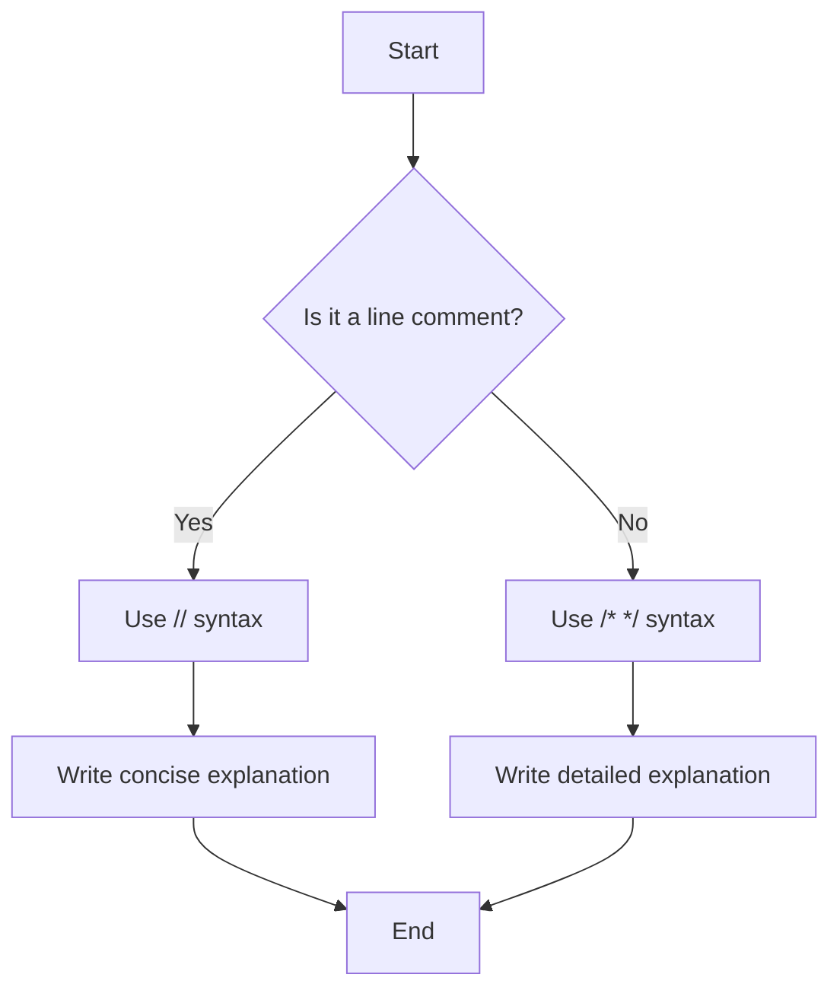

# Go Comments

Comments are an essential part of writing clean, readable, and maintainable code. In Go, comments serve as explanations and documentation that help developers understand your code's purpose, implementation details, and usage.

## Introduction to Comments in Go

Comments are text annotations that the Go compiler ignores during compilation. They exist solely for human readers. Good comments explain **why** certain code exists rather than just restating **what** the code does.

Go supports two types of comments:
1. **Line comments** - Single-line comments beginning with `//`
2. **Block comments** - Multi-line comments enclosed between `/*` and `*/`

## Line Comments

Line comments start with `//` and continue until the end of the line. They are useful for short explanations.

```go
// This is a line comment
fmt.Println("Hello, World!") // This is also a line comment
```

### Best Practices for Line Comments

- Use line comments for brief explanations
- Place them above the code they describe or at the end of a line
- Keep them concise and to the point
- Use proper grammar and spelling

## Block Comments

Block comments start with `/*` and end with `*/`. They can span multiple lines and are useful for longer explanations or temporarily commenting out large sections of code.

```go
/* This is a block comment
   that spans multiple lines.
   The compiler will ignore everything between
   the opening and closing markers. */
   
fmt.Println("Hello, Go!")

/* You can also use block comments
   to temporarily disable code:
   
   func unusedFunction() {
       fmt.Println("This function is not currently used")
   }
*/
```

### Best Practices for Block Comments

- Use block comments for detailed explanations
- Use them to temporarily disable large sections of code during development
- Ensure proper indentation for readability
- Avoid nesting block comments (Go doesn't support nested block comments)

## Documentation Comments

Go has a special kind of comment called a documentation comment. These comments are placed immediately before a package clause or a declaration, and they're used to generate documentation with the `go doc` tool.

```go
// Package math provides basic mathematical functions.
package math

// Sum returns the sum of two integers.
// It takes two integers as input and returns their sum.
func Sum(a, b int) int {
    return a + b
}

/* Multiply returns the product of two integers.
   It takes two integers as input and returns their product.
*/
func Multiply(a, b int) int {
    return a * b
}
```

When you run `go doc` on this package, it will generate documentation using these comments.

### Best Practices for Documentation Comments

- Begin with the name of the item being documented
- Write complete sentences with proper punctuation
- Use a consistent style throughout your code
- Document every exported (capitalized) function, type, constant, and variable

## Practical Examples

### Example 1: Function Documentation

```go
package main

import "fmt"

// calculateArea computes the area of a rectangle.
// It takes width and height as inputs and returns the area.
func calculateArea(width, height float64) float64 {
    return width * height
}

func main() {
    width := 5.0
    height := 3.0
    area := calculateArea(width, height)
    fmt.Printf("The area of a rectangle with width %.1f and height %.1f is %.1f
", 
               width, height, area)
}
```

**Output:**
```
The area of a rectangle with width 5.0 and height 3.0 is 15.0
```

### Example 2: Package Documentation

```go
// Package calculator provides basic mathematical operations.
// It includes functions for addition, subtraction, multiplication,
// and division of integers and floating-point numbers.
package calculator

// Add returns the sum of two integers.
func Add(a, b int) int {
    return a + b
}

// Subtract returns the difference between two integers.
func Subtract(a, b int) int {
    return a - b
}

// Multiply returns the product of two integers.
func Multiply(a, b int) int {
    return a * b
}

// Divide returns the quotient of two integers.
// It panics if b is zero.
func Divide(a, b int) int {
    if b == 0 {
        panic("division by zero")
    }
    return a / b
}
```

### Example 3: Code Explanation with Comments

```go
package main

import (
    "fmt"
    "time"
)

func main() {
    // Get the current time
    now := time.Now()
    
    // Extract the hour from the current time
    hour := now.Hour()
    
    // Determine the appropriate greeting based on the time of day
    var greeting string
    
    if hour < 12 {
        // Morning: before 12 PM
        greeting = "Good morning"
    } else if hour < 18 {
        // Afternoon: 12 PM - 6 PM
        greeting = "Good afternoon"
    } else {
        // Evening: after 6 PM
        greeting = "Good evening"
    }
    
    // Display the greeting
    fmt.Println(greeting)
}
```

## Using Comments to Generate Diagrams

Go's tooling doesn't directly support generating diagrams from comments, but when creating documentation with Docusaurus, you can use Mermaid diagrams in your MDX files:



## Code Organization with Comments

Comments can help organize your code into logical sections:

```go
package main

import (
    "fmt"
    "math/rand"
    "time"
)

func main() {
    // Initialization
    rand.Seed(time.Now().UnixNano())
    numbers := generateRandomNumbers(10, 1, 100)
    
    // Data processing
    sum := calculateSum(numbers)
    average := calculateAverage(numbers)
    
    // Output results
    fmt.Println("Random numbers:", numbers)
    fmt.Println("Sum:", sum)
    fmt.Printf("Average: %.2f", average)
}

// generateRandomNumbers creates a slice of random integers.
// Parameters:
//   - count: number of random integers to generate
//   - min: minimum possible value (inclusive)
//   - max: maximum possible value (inclusive)
// Returns: a slice containing the random integers
func generateRandomNumbers(count, min, max int) []int {
    result := make([]int, count)
    for i := 0; i < count; i++ {
        result[i] = rand.Intn(max-min+1) + min
    }
    return result
}

// calculateSum computes the sum of all integers in a slice.
// Parameter:
//   - numbers: slice of integers
// Returns: the sum of all integers in the slice
func calculateSum(numbers []int) int {
    sum := 0
    for _, num := range numbers {
        sum += num
    }
    return sum
}

// calculateAverage computes the average of all integers in a slice.
// Parameter:
//   - numbers: slice of integers
// Returns: the average as a float64
func calculateAverage(numbers []int) float64 {
    sum := calculateSum(numbers)
    return float64(sum) / float64(len(numbers))
}
```

## Common Mistakes to Avoid

1. **Commenting the obvious**
   ```go
   // Increment i by 1
   i++  // This comment doesn't add any value
   ```

2. **Outdated comments**
   ```go
   // Calculate the sum of a and b
   result := a * b  // Comment is misleading; this calculates the product
   ```

3. **Too many or too few comments**
   - Too many comments can make code harder to read
   - Too few comments can make complex code difficult to understand

4. **Not documenting exported identifiers**
   - All exported (capitalized) functions, types, etc., should have documentation comments

5. **Non-English comments in publicly shared code**
   - The Go community standard is to use English for comments in public repositories

## Summary

Comments in Go are a powerful tool for improving code readability and maintenance. They help developers understand your code and communicate your intent. Remember these key points:

- Use `//` for line comments and `/* */` for block comments
- Write comments that explain **why**, not just **what**
- Document all exported identifiers with documentation comments
- Keep comments updated when you modify code
- Use clear, concise language

## Additional Resources and Exercises

### Resources
- [Go Documentation Comments](https://go.dev/doc/comment)
- [Effective Go: Commentary](https://go.dev/doc/effective_go#commentary)
- [Go Code Review Comments](https://github.com/golang/go/wiki/CodeReviewComments)

### Exercises

1. **Basic Comment Practice**
   Write appropriate comments for the following function:
   ```go
   func fahrenheitToCelsius(fahrenheit float64) float64 {
       return (fahrenheit - 32) * 5 / 9
   }
   ```

2. **Documentation Comments**
   Create a `temperature` package with functions for temperature conversion. Include proper documentation comments that would be useful with `go doc`.

3. **Code Organization**
   Take a longer program (50+ lines) and use comments to organize it into logical sections that make it easier to understand.

4. **Comment Review**
   Review open-source Go projects on GitHub and analyze their commenting style. What patterns do you notice? How could their comments be improved?