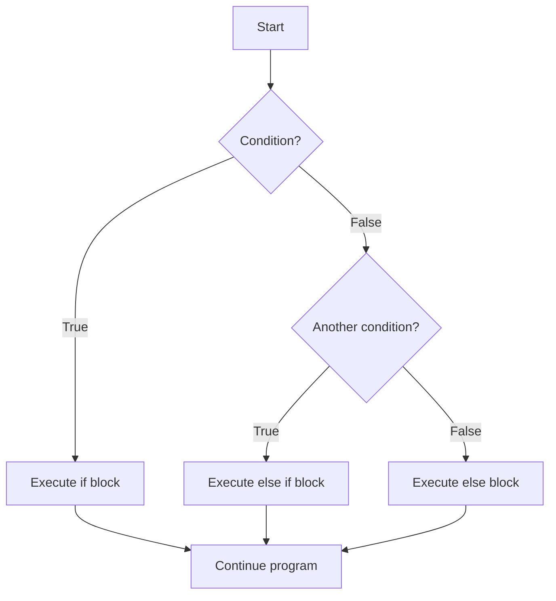

# Go Conditionals

## Introduction

Conditional statements are a fundamental part of programming that allow your code to make decisions and execute different actions based on whether certain conditions are true or false. In Go, conditionals help you control the flow of your program, making it more dynamic and responsive.

Think of conditionals as forks in a road—depending on the condition, your program will take one path or another. This ability to make decisions is what makes programs intelligent and useful.

In this tutorial, we'll explore Go's conditional statements, including:
- The `if`, `else if`, and `else` statements
- The `switch` statement and its various forms
- Best practices and common patterns

## Basic If Statements

The simplest form of a conditional in Go is the `if` statement. It evaluates a condition and executes a block of code if the condition is true.

### Syntax

```go
if condition {
    // Code to execute if condition is true
}
```

### Example

```go
package main

import "fmt"

func main() {
    age := 18
    
    if age >= 18 {
        fmt.Println("You are eligible to vote!")
    }
}
```

**Output:**
```
You are eligible to vote!
```

In this example, the program checks if the `age` variable is greater than or equal to 18. Since it is, the message "You are eligible to vote!" is printed.

## If-Else Statements

When you want to execute one block of code if a condition is true and another block if it's false, you use an `if-else` statement.

### Syntax

```go
if condition {
    // Code to execute if condition is true
} else {
    // Code to execute if condition is false
}
```

### Example

```go
package main

import "fmt"

func main() {
    score := 75
    
    if score >= 65 {
        fmt.Println("You passed the exam!")
    } else {
        fmt.Println("You failed the exam. Try again.")
    }
}
```

**Output:**
```
You passed the exam!
```

Here, since the score is 75 (which is greater than 65), the program prints "You passed the exam!".

## If with a Short Statement

Go allows you to execute a short statement before the condition. This is useful when you want to compute a value and then immediately check a condition based on that value.

### Syntax

```go
if initialization; condition {
    // Code to execute if condition is true
}
```

### Example

```go
package main

import (
    "fmt"
    "math/rand"
    "time"
)

func main() {
    // Seed the random number generator
    rand.Seed(time.Now().UnixNano())
    
    if num := rand.Intn(10); num < 5 {
        fmt.Println("Got a small number:", num)
    } else {
        fmt.Println("Got a big number:", num)
    }
    
    // Note: num is not accessible here
}
```

**Possible Output:**
```
Got a small number: 3
```
or
```
Got a big number: 7
```

In this example, we first generate a random number between 0 and 9, assign it to `num`, and then check if it's less than 5. The variable `num` is only accessible within the scope of the `if` and `else` blocks.

## Multiple Conditions with else if

When you need to check multiple conditions, you can use `else if`.

### Syntax

```go
if condition1 {
    // Code to execute if condition1 is true
} else if condition2 {
    // Code to execute if condition1 is false and condition2 is true
} else {
    // Code to execute if all conditions are false
}
```

### Example

```go
package main

import "fmt"

func main() {
    hour := 14
    
    if hour < 12 {
        fmt.Println("Good morning!")
    } else if hour < 18 {
        fmt.Println("Good afternoon!")
    } else {
        fmt.Println("Good evening!")
    }
}
```

**Output:**
```
Good afternoon!
```

Here, since `hour` is 14 (or 2 PM), which is between 12 and 18, the program prints "Good afternoon!".

## Logical Operators in Conditions

You can combine multiple conditions using logical operators:
- `&&` (AND): Both conditions must be true
- `||` (OR): At least one condition must be true
- `!` (NOT): Inverts the condition (true becomes false, false becomes true)

### Example

```go
package main

import "fmt"

func main() {
    age := 25
    hasID := true
    
    if age >= 21 && hasID {
        fmt.Println("You can enter the bar and drink.")
    } else if age >= 18 && hasID {
        fmt.Println("You can enter the bar but cannot drink.")
    } else {
        fmt.Println("You cannot enter the bar.")
    }
}
```

**Output:**
```
You can enter the bar and drink.
```

In this example, both conditions (`age >= 21` and `hasID`) are true, so the first message is printed.

## The Switch Statement

When you have multiple conditions to check against a single value, the `switch` statement provides a cleaner alternative to multiple `if-else if` statements.

### Basic Switch Syntax

```go
switch expression {
case value1:
    // Code to execute if expression == value1
case value2, value3:
    // Code to execute if expression == value2 or expression == value3
default:
    // Code to execute if none of the cases match
}
```

### Example

```go
package main

import "fmt"

func main() {
    day := "Wednesday"
    
    switch day {
    case "Monday":
        fmt.Println("Start of the work week")
    case "Wednesday":
        fmt.Println("Middle of the work week")
    case "Friday":
        fmt.Println("End of the work week")
    case "Saturday", "Sunday":
        fmt.Println("Weekend!")
    default:
        fmt.Println("Regular work day")
    }
}
```

**Output:**
```
Middle of the work week
```

In Go, after a case is executed, the switch automatically breaks (unlike languages like C or Java where you need to explicitly add a `break` statement).

## Switch with No Expression

You can also use a switch statement without an expression, which is equivalent to `switch true`. In this case, each case is a boolean expression.

### Example

```go
package main

import "fmt"

func main() {
    hour := 14
    
    switch {
    case hour < 12:
        fmt.Println("Good morning!")
    case hour < 18:
        fmt.Println("Good afternoon!")
    default:
        fmt.Println("Good evening!")
    }
}
```

**Output:**
```
Good afternoon!
```

This example is equivalent to the earlier `if-else if-else` example but uses a switch statement instead.

## Switch with a Short Statement

Just like `if`, `switch` also supports executing a short statement before the switch expression.

### Example

```go
package main

import (
    "fmt"
    "time"
)

func main() {
    switch today := time.Now().Weekday(); today {
    case time.Saturday, time.Sunday:
        fmt.Println("It's the weekend!")
    default:
        fmt.Println("It's a weekday. Can't wait for the weekend!")
    }
}
```

**Output (depends on the current day):**
If it's a weekday:
```
It's a weekday. Can't wait for the weekend!
```
If it's the weekend:
```
It's the weekend!
```

## Fallthrough

By default, Go's switch cases break automatically after executing. If you want to execute the next case as well, you can use the `fallthrough` keyword.

### Example

```go
package main

import "fmt"

func main() {
    num := 75
    
    switch {
    case num >= 90:
        fmt.Println("Grade: A")
    case num >= 80:
        fmt.Println("Grade: B")
    case num >= 70:
        fmt.Println("Grade: C")
        fallthrough
    case num >= 60:
        fmt.Println("You passed!")
    default:
        fmt.Println("You failed.")
    }
}
```

**Output:**
```
Grade: C
You passed!
```

In this example, after printing "Grade: C", the `fallthrough` keyword causes the next case to execute as well, printing "You passed!".

## Type Switch

Go provides a special form of switch called a type switch that can be used to check the type of an interface variable.

### Example

```go
package main

import "fmt"

func printType(i interface{}) {
    switch v := i.(type) {
    case int:
        fmt.Printf("Integer: %d
", v)
    case string:
        fmt.Printf("String: %s
", v)
    case bool:
        fmt.Printf("Boolean: %t
", v)
    default:
        fmt.Printf("Unknown type: %T
", v)
    }
}

func main() {
    printType(42)
    printType("Hello")
    printType(true)
    printType(3.14)
}
```

**Output:**
```
Integer: 42
String: Hello
Boolean: true
Unknown type: float64
```

Type switches are especially useful when working with empty interfaces (`interface{}`), as they allow you to handle different types of values accordingly.

## Conditional Flow Diagram

Here's a visual representation of how conditional statements control the flow of your program:



## Best Practices

1. **Keep conditions simple**: Complex conditions can be hard to understand and maintain. Consider breaking them down or using helper functions.

2. **Use early returns**: For functions with multiple conditions, consider returning early to avoid deeply nested conditionals.

```go
func processUser(user User) error {
    // Early return for invalid cases
    if user.Age < 18 {
        return errors.New("user must be at least 18 years old")
    }
    
    if user.Name == "" {
        return errors.New("user name cannot be empty")
    }
    
    // Process valid user...
    return nil
}
```

3. **Prefer switch over long if-else chains**: Switch statements are generally more readable when checking a single value against multiple options.

4. **Be careful with floating-point comparisons**: Due to precision issues, avoid direct equality comparisons with floating-point numbers.

```go
// Not recommended
if x == 0.1 {
    // ...
}

// Better approach
const epsilon = 1e-9
if math.Abs(x - 0.1) < epsilon {
    // ...
}
```

## Real-World Application: Simple Weather App

Let's use conditionals to build a simple weather recommendation system:

```go
package main

import "fmt"

func getWeatherAdvice(temperature float64, isRaining bool) string {
    switch {
    case isRaining:
        return "Take an umbrella with you!"
    case temperature < 0:
        return "Wear a heavy coat and gloves."
    case temperature < 10:
        return "Wear a warm coat."
    case temperature < 20:
        return "A light jacket should be fine."
    case temperature < 30:
        return "Perfect weather! Enjoy!"
    default:
        return "It's hot! Remember to stay hydrated."
    }
}

func main() {
    // Simulating different weather conditions
    fmt.Println("Weather advice for 5°C, no rain:", getWeatherAdvice(5, false))
    fmt.Println("Weather advice for 25°C, no rain:", getWeatherAdvice(25, false))
    fmt.Println("Weather advice for 15°C, raining:", getWeatherAdvice(15, true))
}
```

**Output:**
```
Weather advice for 5°C, no rain: Wear a warm coat.
Weather advice for 25°C, no rain: Perfect weather! Enjoy!
Weather advice for 15°C, raining: Take an umbrella with you!
```

This example demonstrates how conditionals can be used to make decisions based on multiple factors (temperature and rain status) to provide relevant advice.

## Real-World Application: Login System

Here's how conditionals might be used in a simple login system:

```go
package main

import (
    "fmt"
    "strings"
)

func validateLogin(username, password string) string {
    // Check if fields are empty
    if username == "" || password == "" {
        return "Username and password cannot be empty"
    }
    
    // Check username format
    if strings.Contains(username, " ") {
        return "Username cannot contain spaces"
    }
    
    // Check password strength
    if len(password) < 8 {
        return "Password must be at least 8 characters long"
    }
    
    hasUpper := false
    hasDigit := false
    
    for _, char := range password {
        switch {
        case char >= 'A' && char <= 'Z':
            hasUpper = true
        case char >= '0' && char <= '9':
            hasDigit = true
        }
    }
    
    if !hasUpper || !hasDigit {
        return "Password must contain at least one uppercase letter and one digit"
    }
    
    // If all validations pass
    return "Login successful!"
}

func main() {
    fmt.Println(validateLogin("", "password123"))
    fmt.Println(validateLogin("john doe", "Password123"))
    fmt.Println(validateLogin("johndoe", "password"))
    fmt.Println(validateLogin("johndoe", "Password123"))
}
```

**Output:**
```
Username and password cannot be empty
Username cannot contain spaces
Password must be at least 8 characters long
Login successful!
```

This example shows how conditionals can implement validation logic with various rules.

## Summary

Conditionals are a powerful feature in Go that allow your programs to make decisions based on different conditions. In this tutorial, we've covered:

- Basic `if`, `else if`, and `else` statements
- The `if` statement with a short initialization statement
- Logical operators for combining conditions
- The `switch` statement in its various forms
- Best practices for using conditionals
- Real-world applications demonstrating how conditionals solve practical problems

Mastering conditionals is crucial for writing programs that can respond intelligently to different situations. They form the backbone of program logic and control flow.

## Exercises

1. Write a program that checks if a given year is a leap year. (Hint: A leap year is divisible by 4, but not by 100 unless it's also divisible by 400)

2. Create a simple calculator that takes two numbers and an operator (+, -, *, /) as input and returns the result of the operation using a switch statement.

3. Write a function that grades student scores according to the following scale:
   - 90-100: A
   - 80-89: B
   - 70-79: C
   - 60-69: D
   - Below 60: F

4. Implement a function that checks if a string is a palindrome (reads the same forward and backward, ignoring case and non-alphanumeric characters).

5. Create a program that simulates a traffic light with three states (Red, Yellow, Green) and prints what a driver should do for each state.

## Additional Resources

- [Go by Example: If/Else](https://gobyexample.com/if-else)
- [Go by Example: Switch](https://gobyexample.com/switch)
- [A Tour of Go: Flow control statements](https://tour.golang.org/flowcontrol/1)
- [Go Documentation: Control structures](https://golang.org/doc/effective_go.html#control-structures)

Remember, practice is key to mastering conditionals. Try to solve the exercises and experiment with different conditions to see how they affect the flow of your programs!