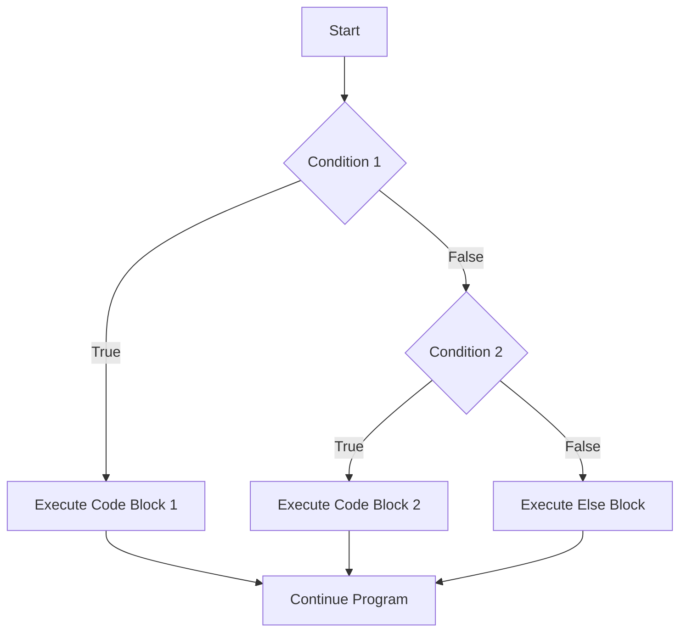

# Go If-Else Statements

## Introduction

Decision-making is a fundamental aspect of programming. In Go, like many other programming languages, we use conditional statements to control the flow of our program based on specific conditions. The `if-else` construct is one of the primary ways to implement decision-making logic in Go.

In this tutorial, we'll explore how to use `if`, `else if`, and `else` statements in Go to create programs that can make decisions and execute different code blocks based on various conditions.

## Basic If Statement

The simplest form of conditional execution in Go is the `if` statement. It allows you to execute a block of code only if a condition evaluates to `true`.

### Syntax

```go
if condition {
    // code to execute if condition is true
}
```

### Example

Let's write a simple program that checks if a number is positive:

```go
package main

import "fmt"

func main() {
    number := 10
    
    if number > 0 {
        fmt.Println("The number is positive")
    }
}
```

**Output:**
```
The number is positive
```

In this example, the condition `number > 0` evaluates to `true` because 10 is greater than 0, so the message "The number is positive" is printed.

## If-Else Statement

The `if-else` statement allows you to execute one block of code if a condition is `true` and another block if the condition is `false`.

### Syntax

```go
if condition {
    // code to execute if condition is true
} else {
    // code to execute if condition is false
}
```

### Example

Let's modify our previous example to handle negative numbers as well:

```go
package main

import "fmt"

func main() {
    number := -5
    
    if number > 0 {
        fmt.Println("The number is positive")
    } else {
        fmt.Println("The number is not positive")
    }
}
```

**Output:**
```
The number is not positive
```

In this example, the condition `number > 0` evaluates to `false` because -5 is not greater than 0, so the code in the `else` block is executed.

## If-Else If-Else Statement

For multiple conditions, we can use the `if-else if-else` chain, which allows us to check several conditions in sequence.

### Syntax

```go
if condition1 {
    // code to execute if condition1 is true
} else if condition2 {
    // code to execute if condition1 is false and condition2 is true
} else {
    // code to execute if all conditions are false
}
```

### Example

Let's expand our number example to handle positive, negative, and zero values:

```go
package main

import "fmt"

func main() {
    number := 0
    
    if number > 0 {
        fmt.Println("The number is positive")
    } else if number < 0 {
        fmt.Println("The number is negative")
    } else {
        fmt.Println("The number is zero")
    }
}
```

**Output:**
```
The number is zero
```

In this example, neither `number > 0` nor `number < 0` is true (since number equals 0), so the code in the final `else` block is executed.

## Special Features of If Statements in Go

Go offers some unique features for `if` statements that make them more powerful and convenient.

### 1. Initialization Statement

In Go, you can include an initialization statement before the condition. This is often used to initialize a variable that will be used in the condition.

#### Syntax

```go
if initialization; condition {
    // code to execute if condition is true
}
```

#### Example

```go
package main

import "fmt"

func main() {
    if x := 10; x > 5 {
        fmt.Println("x is greater than 5, and x =", x)
    }
    
    // Note: x is not accessible here, as its scope is limited to the if block
}
```

**Output:**
```
x is greater than 5, and x = 10
```

In this example, we initialize `x` with the value 10 and then check if it's greater than 5. The variable `x` is only accessible within the `if` and any corresponding `else` blocks.

### 2. Short Circuit Evaluation

Go uses short-circuit evaluation for logical operators. This means that in a chain of logical operations, evaluation stops as soon as the result is determined.

#### Example

```go
package main

import "fmt"

func main() {
    a, b := 5, 10
    
    // Using && (AND) operator
    if a > 0 && b/a > 1 {
        fmt.Println("Both conditions are true")
    }
    
    // Using || (OR) operator
    if a > 100 || b > 5 {
        fmt.Println("At least one condition is true")
    }
}
```

**Output:**
```
Both conditions are true
At least one condition is true
```

In the second `if` statement, even though `a > 100` is false, the entire condition evaluates to `true` because `b > 5` is true, and we're using the OR operator.

## Nested If Statements

You can place an `if` statement inside another `if` or `else` block, creating nested conditional statements.

### Example

```go
package main

import "fmt"

func main() {
    num := 15
    
    if num > 0 {
        fmt.Println("The number is positive")
        
        if num%2 == 0 {
            fmt.Println("The number is even")
        } else {
            fmt.Println("The number is odd")
        }
    } else {
        fmt.Println("The number is not positive")
    }
}
```

**Output:**
```
The number is positive
The number is odd
```

In this example, we first check if the number is positive. Since 15 is positive, we then check if it's even or odd.

## Common Patterns and Best Practices

### 1. Early Returns

In Go, it's common to use early returns to simplify code and reduce nesting:

```go
package main

import "fmt"

func processNumber(num int) string {
    // Early return for negative numbers
    if num < 0 {
        return "Cannot process negative numbers"
    }
    
    // Early return for zero
    if num == 0 {
        return "Number is zero"
    }
    
    // Process positive numbers
    return fmt.Sprintf("Processed positive number: %d", num*2)
}

func main() {
    fmt.Println(processNumber(-5))
    fmt.Println(processNumber(0))
    fmt.Println(processNumber(10))
}
```

**Output:**
```
Cannot process negative numbers
Number is zero
Processed positive number: 20
```

### 2. Avoiding Complex Conditions

It's generally better to break down complex conditions into simpler ones:

```go
// Instead of this:
if x > 0 && x < 10 && y > 20 && y < 30 && z == 5 {
    // Do something
}

// Consider this:
if x > 0 && x < 10 {
    if y > 20 && y < 30 {
        if z == 5 {
            // Do something
        }
    }
}

// Or using early returns:
if x <= 0 || x >= 10 {
    return // or handle this case
}
if y <= 20 || y >= 30 {
    return // or handle this case
}
if z != 5 {
    return // or handle this case
}
// Do something
```

## Real-World Applications

Let's explore some practical examples of using `if-else` statements in Go.

### Example 1: Simple Authentication

```go
package main

import "fmt"

func main() {
    // Hardcoded credentials (in real-world, these would be securely stored)
    correctUsername := "admin"
    correctPassword := "password123"
    
    // User input (in real-world, these would come from a form or input)
    username := "admin"
    password := "wrongpassword"
    
    if username == correctUsername && password == correctPassword {
        fmt.Println("Authentication successful. Welcome!")
    } else if username == correctUsername {
        fmt.Println("Incorrect password. Please try again.")
    } else {
        fmt.Println("User not found. Please register.")
    }
}
```

**Output:**
```
Incorrect password. Please try again.
```

### Example 2: Grade Calculator

```go
package main

import "fmt"

func calculateGrade(score int) string {
    if score < 0 || score > 100 {
        return "Invalid score"
    } else if score >= 90 {
        return "A"
    } else if score >= 80 {
        return "B"
    } else if score >= 70 {
        return "C"
    } else if score >= 60 {
        return "D"
    } else {
        return "F"
    }
}

func main() {
    fmt.Println("Score 95:", calculateGrade(95))
    fmt.Println("Score 85:", calculateGrade(85))
    fmt.Println("Score 75:", calculateGrade(75))
    fmt.Println("Score 65:", calculateGrade(65))
    fmt.Println("Score 55:", calculateGrade(55))
    fmt.Println("Score 105:", calculateGrade(105))
}
```

**Output:**
```
Score 95: A
Score 85: B
Score 75: C
Score 65: D
Score 55: F
Score 105: Invalid score
```

### Example 3: Weather Suggestion App

```go
package main

import "fmt"

func suggestActivity(weather string, temperature int) string {
    if weather == "sunny" {
        if temperature > 30 {
            return "It's hot! How about swimming?"
        } else if temperature > 20 {
            return "Perfect weather for a picnic!"
        } else {
            return "Good day for a walk in the park!"
        }
    } else if weather == "rainy" {
        if temperature < 10 {
            return "It's cold and rainy. Stay inside with a book!"
        } else {
            return "Bring an umbrella if you're going out!"
        }
    } else if weather == "snowy" {
        return "How about building a snowman?"
    } else {
        return "Check the forecast for accurate suggestions!"
    }
}

func main() {
    fmt.Println(suggestActivity("sunny", 25))
    fmt.Println(suggestActivity("sunny", 35))
    fmt.Println(suggestActivity("rainy", 5))
    fmt.Println(suggestActivity("snowy", 0))
}
```

**Output:**
```
Perfect weather for a picnic!
It's hot! How about swimming?
It's cold and rainy. Stay inside with a book!
How about building a snowman?
```

## Flow Diagram

Here's a visualization of how the if-else flow works in Go:



## Summary

In this tutorial, we've explored the if-else statement in Go:

- The basic `if` statement executes code only when a condition is true
- The `if-else` statement provides an alternative execution path when the condition is false
- The `if-else if-else` chain allows for multiple conditions to be checked in sequence
- Go's special features for `if` statements include initialization statements and scoped variables
- Nested `if` statements allow for more complex decision trees
- Best practices include using early returns and avoiding overly complex conditions
- We've seen practical real-world applications of if-else statements in Go

Conditional statements are a fundamental building block in programming, and mastering them will allow you to create more sophisticated and responsive programs.

## Exercises

To practice what you've learned, try these exercises:

1. Write a program that checks if a number is divisible by both 2 and 3, only by 2, only by 3, or by neither.
2. Create a simple calculator that takes two numbers and an operator (+, -, *, /) and performs the appropriate operation.
3. Write a function that determines if a year is a leap year (hint: a year is a leap year if it's divisible by 4, but not by 100 unless it's also divisible by 400).
4. Create a program that recommends a type of transportation (walk, bike, car, public transport) based on distance and weather conditions.

## Additional Resources

- [Go Documentation on Control Structures](https://golang.org/doc/effective_go.html#control-structures)
- [A Tour of Go - Flow Control](https://tour.golang.org/flowcontrol/1)
- [Go by Example: If/Else](https://gobyexample.com/if-else)