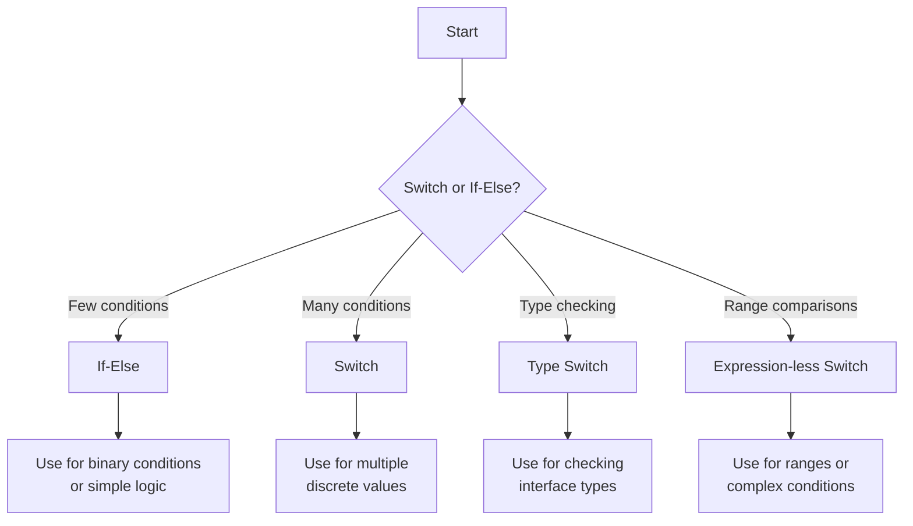

# Go Switch

## Introduction

The switch statement in Go provides a clean and efficient way to evaluate expressions and execute code based on matching conditions. Unlike the if-else statement that can become verbose with multiple conditions, the switch statement offers a more readable and maintainable approach for multi-branch conditionals.

In this tutorial, we'll explore how to use the switch statement in Go, its special features, and various patterns for common programming scenarios.

## Basic Syntax

The basic syntax of a switch statement in Go looks like this:

```go
switch expression {
case value1:
    // code to execute if expression == value1
case value2, value3:
    // code to execute if expression == value2 OR expression == value3
default:
    // code to execute if no case matches
}
```

Let's look at a simple example:

```go
package main

import "fmt"

func main() {
    day := 3
    
    switch day {
    case 1:
        fmt.Println("Monday")
    case 2:
        fmt.Println("Tuesday")
    case 3:
        fmt.Println("Wednesday")
    case 4:
        fmt.Println("Thursday")
    case 5:
        fmt.Println("Friday")
    case 6:
        fmt.Println("Saturday")
    case 7:
        fmt.Println("Sunday")
    default:
        fmt.Println("Invalid day")
    }
}
```

**Output:**
```
Wednesday
```

In this example, we evaluate the variable `day`. Since it contains the value `3`, the code within the `case 3` block executes, and "Wednesday" is printed to the console.

## Key Features of Go's Switch Statement

Go's switch statement has several unique characteristics that make it more powerful and flexible than switch statements in other languages:

### 1. Automatic Break

In many programming languages, you need to add a `break` statement at the end of each case to prevent fall-through to the next case. In Go, **break is implicit** - each case automatically breaks after execution.

### 2. Multiple Values in a Single Case

You can test multiple values in a single case by separating them with commas:

```go
package main

import "fmt"

func main() {
    day := "Saturday"
    
    switch day {
    case "Monday", "Tuesday", "Wednesday", "Thursday", "Friday":
        fmt.Println("It's a weekday")
    case "Saturday", "Sunday":
        fmt.Println("It's the weekend")
    default:
        fmt.Println("Invalid day")
    }
}
```

**Output:**
```
It's the weekend
```

### 3. Expression-less Switch

Go allows you to omit the expression in a switch statement, which makes it behave like a cleaner series of if-else statements:

```go
package main

import "fmt"

func main() {
    hour := 14
    
    switch {
    case hour < 12:
        fmt.Println("Good morning!")
    case hour < 17:
        fmt.Println("Good afternoon!")
    default:
        fmt.Println("Good evening!")
    }
}
```

**Output:**
```
Good afternoon!
```

### 4. Fallthrough Keyword

While Go doesn't automatically fall through to the next case, you can force this behavior using the `fallthrough` keyword:

```go
package main

import "fmt"

func main() {
    num := 5
    
    switch num {
    case 5:
        fmt.Println("Five")
        fallthrough
    case 4:
        fmt.Println("Four")
        fallthrough
    case 3:
        fmt.Println("Three")
    default:
        fmt.Println("Unknown")
    }
}
```

**Output:**
```
Five
Four
Three
```

Note that `fallthrough` causes execution to continue with the next case regardless of whether its condition is true.

### 5. Type Switch

Go has a special form of switch statement that can check the type of an interface value:

```go
package main

import "fmt"

func printType(i interface{}) {
    switch v := i.(type) {
    case int:
        fmt.Printf("Integer: %v
", v)
    case string:
        fmt.Printf("String: %v
", v)
    case bool:
        fmt.Printf("Boolean: %v
", v)
    default:
        fmt.Printf("Unknown type: %T
", v)
    }
}

func main() {
    printType(42)
    printType("hello")
    printType(true)
    printType(3.14)
}
```

**Output:**
```
Integer: 42
String: hello
Boolean: true
Unknown type: float64
```

In a type switch, the special syntax `v := i.(type)` allows us to check the type of the interface variable `i` and also assign its value to `v`.

## Initialization Statement in Switch

Similar to if statements, Go's switch can include an initialization statement that executes before the expression is evaluated:

```go
package main

import (
    "fmt"
    "time"
)

func main() {
    switch today := time.Now().Weekday(); today {
    case time.Saturday, time.Sunday:
        fmt.Println("It's the weekend!")
    default:
        fmt.Printf("It's a weekday: %v
", today)
    }
}
```

This example initializes `today` with the current weekday and then uses it in the switch expression.

## Practical Examples

### Example 1: Simple Menu System

```go
package main

import "fmt"

func main() {
    fmt.Println("Menu:")
    fmt.Println("1. Create new file")
    fmt.Println("2. Open existing file")
    fmt.Println("3. Save file")
    fmt.Println("4. Exit")
    fmt.Print("Enter your choice: ")
    
    var choice int
    fmt.Scan(&choice)
    
    switch choice {
    case 1:
        fmt.Println("Creating new file...")
    case 2:
        fmt.Println("Opening file...")
    case 3:
        fmt.Println("Saving file...")
    case 4:
        fmt.Println("Exiting program...")
    default:
        fmt.Println("Invalid choice!")
    }
}
```

### Example 2: HTTP Status Code Checker

```go
package main

import "fmt"

func checkHTTPStatus(statusCode int) {
    switch {
    case statusCode >= 200 && statusCode < 300:
        fmt.Println("Success!")
    case statusCode >= 300 && statusCode < 400:
        fmt.Println("Redirection.")
    case statusCode >= 400 && statusCode < 500:
        fmt.Println("Client error.")
    case statusCode >= 500:
        fmt.Println("Server error.")
    default:
        fmt.Println("Unknown status code.")
    }
}

func main() {
    checkHTTPStatus(200) // Success!
    checkHTTPStatus(307) // Redirection.
    checkHTTPStatus(404) // Client error.
    checkHTTPStatus(500) // Server error.
}
```

### Example 3: Season Detector

```go
package main

import "fmt"

func getSeason(month int) string {
    switch month {
    case 12, 1, 2:
        return "Winter"
    case 3, 4, 5:
        return "Spring"
    case 6, 7, 8:
        return "Summer"
    case 9, 10, 11:
        return "Fall"
    default:
        return "Invalid month"
    }
}

func main() {
    for i := 1; i <= 12; i++ {
        fmt.Printf("Month %d is in %s
", i, getSeason(i))
    }
}
```

## Switch vs. If-Else

Let's compare switch statements with if-else statements to demonstrate when switch is more readable:

