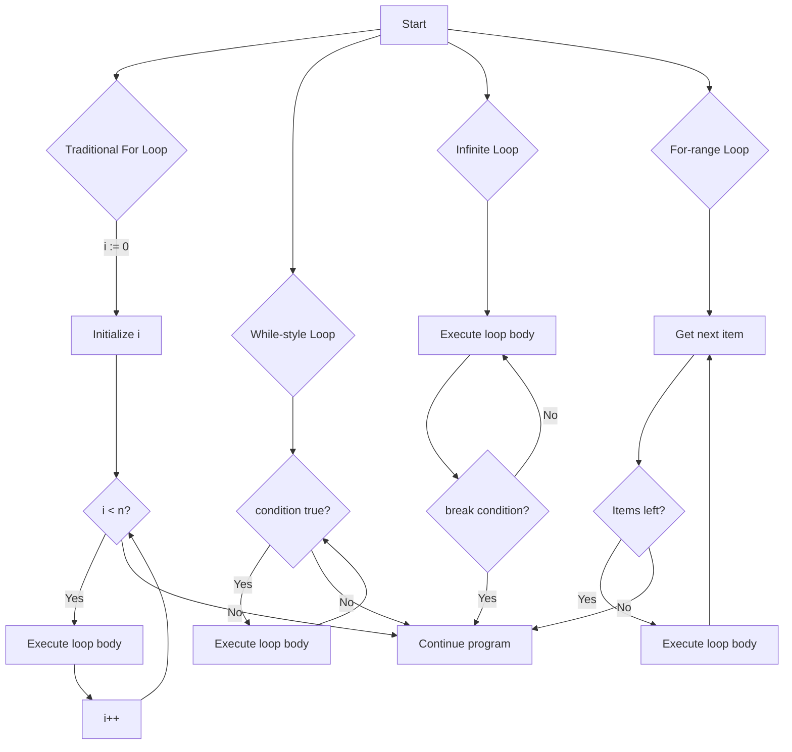

# Go Loops

## Introduction

Loops are fundamental structures in programming that allow you to execute a block of code repeatedly. In Go, loops are essential for tasks like processing collections of data, implementing algorithms, or simply repeating actions a specific number of times.

Unlike many other programming languages that provide various looping constructs (while, do-while, for, foreach), Go simplifies this by providing only the `for` loop. However, don't let this fool you—Go's `for` loop is versatile and can be configured to behave like all the loop types you might be familiar with from other languages.

In this tutorial, we'll explore the different ways to use loops in Go and how they can help you write efficient, clear code.

## Basic For Loop

The most common loop structure in Go is the traditional `for` loop with three components:

1. **Initialization**: Executes before the loop starts
2. **Condition**: Evaluated before each iteration
3. **Post statement**: Executes after each iteration

### Syntax

```go
for initialization; condition; post {
    // Code to be executed
}
```

### Example: Counting from 1 to 5

```go
package main

import "fmt"

func main() {
    for i := 1; i <= 5; i++ {
        fmt.Println(i)
    }
}
```

**Output:**
```
1
2
3
4
5
```

In this example:
- `i := 1` initializes a variable `i` with value 1
- `i <= 5` is the condition that keeps the loop running as long as it evaluates to true
- `i++` increments `i` after each iteration

## While-style Loops in Go

Go doesn't have a separate `while` keyword, but you can create while-style loops using the `for` loop with just a condition.

### Syntax

```go
for condition {
    // Code to be executed
}
```

### Example: Decreasing Counter

```go
package main

import "fmt"

func main() {
    count := 5
    for count > 0 {
        fmt.Println(count)
        count--
    }
    fmt.Println("Liftoff!")
}
```

**Output:**
```
5
4
3
2
1
Liftoff!
```

In this example, the loop continues as long as `count` is greater than 0.

## Infinite Loops

You can create an infinite loop by omitting the condition. Make sure to include a `break` statement inside to exit the loop when needed.

### Syntax

```go
for {
    // Code to be executed
    if someCondition {
        break
    }
}
```

### Example: User Input Validation

```go
package main

import "fmt"

func main() {
    sum := 0
    
    for {
        fmt.Println("Current sum:", sum)
        fmt.Println("Enter a number to add (or 0 to exit):")
        
        var input int
        fmt.Scan(&input)
        
        if input == 0 {
            break
        }
        
        sum += input
    }
    
    fmt.Println("Final sum:", sum)
}
```

**Sample Interaction:**
```
Current sum: 0
Enter a number to add (or 0 to exit):
5
Current sum: 5
Enter a number to add (or 0 to exit):
10
Current sum: 15
Enter a number to add (or 0 to exit):
0
Final sum: 15
```

## For-each Loops with Range

The `range` keyword is used in combination with `for` to iterate over elements in various data structures such as arrays, slices, maps, and strings.

### Syntax for Slices and Arrays

```go
for index, value := range collection {
    // Code to be executed
}
```

### Example: Iterating Over a Slice

```go
package main

import "fmt"

func main() {
    fruits := []string{"apple", "banana", "cherry", "durian", "elderberry"}
    
    for i, fruit := range fruits {
        fmt.Printf("Index %d: %s
", i, fruit)
    }
}
```

**Output:**
```
Index 0: apple
Index 1: banana
Index 2: cherry
Index 3: durian
Index 4: elderberry
```

If you only need the index or value, you can use:

```go
// Only index
for i := range collection {
    // Use i
}

// Only value
for _, value := range collection {
    // Use value
}
```

### Example: Iterating Over a Map

```go
package main

import "fmt"

func main() {
    capitalCities := map[string]string{
        "USA":    "Washington, D.C.",
        "France": "Paris",
        "Japan":  "Tokyo",
        "India":  "New Delhi",
        "Brazil": "Brasília",
    }
    
    for country, capital := range capitalCities {
        fmt.Printf("The capital of %s is %s
", country, capital)
    }
}
```

**Output:**
```
The capital of USA is Washington, D.C.
The capital of France is Paris
The capital of Japan is Tokyo
The capital of India is New Delhi
The capital of Brazil is Brasília
```

Note: The iteration order over maps is not guaranteed in Go.

## Control Statements in Loops

Go provides two important control statements for loops:

1. **break**: Exits the loop immediately
2. **continue**: Skips the current iteration and moves to the next one

### Example: Using break and continue

```go
package main

import "fmt"

func main() {
    for i := 1; i <= 10; i++ {
        // Skip even numbers
        if i%2 == 0 {
            continue
        }
        
        // Stop when we reach 7
        if i > 7 {
            break
        }
        
        fmt.Println(i)
    }
}
```

**Output:**
```
1
3
5
7
```

## Nested Loops

You can place one loop inside another to create nested loops. This is useful for working with multi-dimensional data structures or when you need to combine elements from different collections.

### Example: Multiplication Table

```go
package main

import "fmt"

func main() {
    for i := 1; i <= 5; i++ {
        for j := 1; j <= 5; j++ {
            fmt.Printf("%d×%d=%d\t", i, j, i*j)
        }
        fmt.Println() // New line after each row
    }
}
```

**Output:**
```
1×1=1   1×2=2   1×3=3   1×4=4   1×5=5   
2×1=2   2×2=4   2×3=6   2×4=8   2×5=10  
3×1=3   3×2=6   3×3=9   3×4=12  3×5=15  
4×1=4   4×2=8   4×3=12  4×4=16  4×5=20  
5×1=5   5×2=10  5×3=15  5×4=20  5×5=25  
```

## Labeled Break and Continue

In nested loops, you might want to break or continue a specific outer loop. Go supports labeled statements to accomplish this.

### Example: Finding a Value in a 2D Grid

```go
package main

import "fmt"

func main() {
    // Define a 2D grid
    grid := [][]int{
        {1, 2, 3},
        {4, 5, 6},
        {7, 8, 9},
    }
    
    // Value to find
    valueToFind := 6
    
    // Use labeled outer loop
OuterLoop:
    for i, row := range grid {
        for j, value := range row {
            fmt.Printf("Checking position [%d][%d] with value %d
", i, j, value)
            
            if value == valueToFind {
                fmt.Printf("Found %d at position [%d][%d]!
", valueToFind, i, j)
                break OuterLoop
            }
        }
    }
}
```

**Output:**
```
Checking position [0][0] with value 1
Checking position [0][1] with value 2
Checking position [0][2] with value 3
Checking position [1][0] with value 4
Checking position [1][1] with value 5
Checking position [1][2] with value 6
Found 6 at position [1][2]!
```

## Visual Flow of Different Loop Types

Here's a diagram showing the execution flow of different types of loops in Go:



## Real-world Applications

### Example 1: Data Processing

This example shows how to process a dataset using loops to calculate the average temperature:

```go
package main

import "fmt"

func main() {
    temperatures := []float64{23.5, 25.1, 22.7, 26.8, 24.3, 27.1, 21.9}
    
    var sum float64
    for _, temp := range temperatures {
        sum += temp
    }
    
    average := sum / float64(len(temperatures))
    fmt.Printf("Average temperature: %.2f°C
", average)
    
    // Find temperatures above average
    fmt.Println("Days with above-average temperatures:")
    for i, temp := range temperatures {
        if temp > average {
            fmt.Printf("Day %d: %.2f°C
", i+1, temp)
        }
    }
}
```

**Output:**
```
Average temperature: 24.49°C
Days with above-average temperatures:
Day 2: 25.10°C
Day 4: 26.80°C
Day 6: 27.10°C
```

### Example 2: Building a Simple Menu System

Here's how loops can be used to create an interactive menu:

```go
package main

import (
    "fmt"
    "os"
)

func main() {
    for {
        // Display menu
        fmt.Println("
---- Task Manager ----")
        fmt.Println("1. Add a new task")
        fmt.Println("2. List all tasks")
        fmt.Println("3. Mark task as complete")
        fmt.Println("4. Exit")
        fmt.Print("
Enter your choice (1-4): ")
        
        var choice int
        fmt.Scan(&choice)
        
        switch choice {
        case 1:
            fmt.Println("Adding a new task...")
            // Add task logic would go here
        case 2:
            fmt.Println("Listing all tasks...")
            // List tasks logic would go here
        case 3:
            fmt.Println("Marking task as complete...")
            // Complete task logic would go here
        case 4:
            fmt.Println("Exiting program. Goodbye!")
            os.Exit(0)
        default:
            fmt.Println("Invalid choice! Please enter a number between 1 and 4.")
        }
    }
}
```

## Common Pitfalls and Best Practices

### Variable Scope

Variables declared inside a for loop are scoped to that loop's block:

```go
for i := 0; i < 5; i++ {
    // i is accessible here
}
// i is NOT accessible here
```

### Loop Variable Capture

When using goroutines inside loops, be careful with variable capture:

```go
// Incorrect
for i := 0; i < 5; i++ {
    go func() {
        fmt.Println(i) // Will likely print the final value of i multiple times
    }()
}

// Correct
for i := 0; i < 5; i++ {
    go func(val int) {
        fmt.Println(val) // Will print the expected values
    }(i)
}
```

### Infinite Loop Detection

Go doesn't automatically detect infinite loops, so ensure your loop conditions eventually become false or that you have a `break` statement that will be reached.

### Performance Considerations

- For large collections, consider if your loop operation can be parallelized using goroutines.
- When iterating over large structures, avoid unnecessary memory allocations inside the loop.
- For simple iterations over integers, traditional for loops are generally more efficient than range-based loops.

## Summary

Go provides a single, versatile `for` loop construct that can be adapted to handle all common looping patterns:

1. **Traditional for loops**: `for i := 0; i < n; i++ {}`
2. **While-style loops**: `for condition {}`
3. **Infinite loops**: `for {}`
4. **For-each loops with range**: `for index, value := range collection {}`

Remember these key points:

- The `break` statement exits a loop completely
- The `continue` statement skips to the next iteration
- Labeled statements allow you to control outer loops from inner loops
- Variables declared in the loop initialization are scoped to the loop body
- Be cautious of variable capture in goroutines inside loops

## Exercises

1. Write a program that prints all even numbers between 1 and 20.
2. Create a loop that counts down from 10 to 1, then prints "Blast off!".
3. Write a program that computes the sum of all elements in an array of integers.
4. Create a program that finds the largest number in a slice of integers using a loop.
5. Write a nested loop that prints a simple pattern like a triangle or a square.

## Additional Resources

- [Go Tour: For loops](https://tour.golang.org/flowcontrol/1)
- [Effective Go: For loops](https://golang.org/doc/effective_go.html#for)
- [Go by Example: For loops](https://gobyexample.com/for)
- [Go Programming Language Specification](https://golang.org/ref/spec#For_statements)

Happy coding with Go loops!