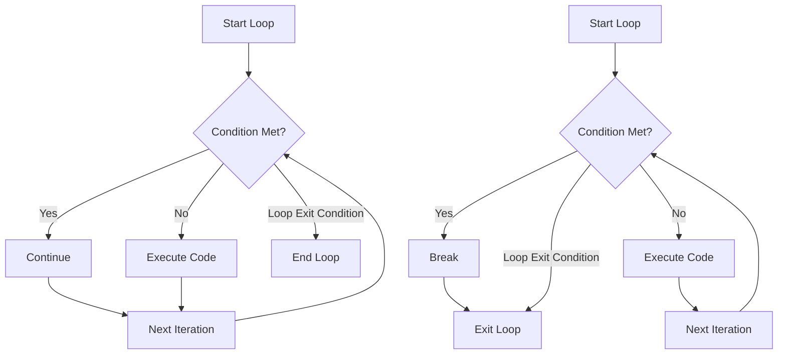

# Continue Statement in Go

## Introduction

When writing loops in Go, you'll often encounter situations where you want to skip the current iteration and move to the next one without exiting the entire loop. The `continue` statement provides this functionality, allowing you to create more efficient and readable code by bypassing unnecessary operations when certain conditions are met.

In this tutorial, we'll explore how the `continue` statement works in Go, when to use it, and how it can improve your code through practical examples.

## What is the Continue Statement?

The `continue` statement is a control flow feature that skips the remaining code in the current iteration of a loop and jumps directly to the next iteration. It works in all three types of Go loops:
- `for` loops
- `for` with range loops
- While-style loops (`for` with a condition)

```go
for condition {
    // some code
    if someCondition {
        continue // Skip remainder of this iteration
    }
    // This code will be skipped when continue is executed
}
```

## Basic Syntax and Usage

Let's start with a simple example to understand how `continue` works:

```go
package main

import "fmt"

func main() {
    for i := 1; i <= 10; i++ {
        // Skip printing even numbers
        if i%2 == 0 {
            continue
        }
        fmt.Println(i)
    }
}
```

**Output:**
```
1
3
5
7
9
```

In this example, when `i` is even, the `continue` statement is executed, skipping the `fmt.Println(i)` statement and moving to the next iteration. As a result, only odd numbers are printed.

## Continue in Nested Loops

`continue` applies only to the innermost loop containing it. Here's how it works with nested loops:

```go
package main

import "fmt"

func main() {
    for i := 1; i <= 3; i++ {
        fmt.Printf("Outer loop: %d
", i)
        
        for j := 1; j <= 3; j++ {
            if j == 2 {
                fmt.Println("  Skipping j=2")
                continue // Skips only the current iteration of the inner loop
            }
            fmt.Printf("  Inner loop: %d
", j)
        }
    }
}
```

**Output:**
```
Outer loop: 1
  Inner loop: 1
  Skipping j=2
  Inner loop: 3
Outer loop: 2
  Inner loop: 1
  Skipping j=2
  Inner loop: 3
Outer loop: 3
  Inner loop: 1
  Skipping j=2
  Inner loop: 3
```

Notice that when `j == 2`, the inner loop skips to the next iteration, but the outer loop continues normally.

## Continue with Labels

Go allows you to use labeled `continue` statements to specify which loop to continue when working with nested loops. This gives you more precise control over your program flow:

```go
package main

import "fmt"

func main() {
    outerLoop:
    for i := 1; i <= 3; i++ {
        fmt.Printf("Outer loop: %d
", i)
        
        for j := 1; j <= 3; j++ {
            if i == 2 && j == 2 {
                fmt.Println("  Skipping to next outer loop iteration")
                continue outerLoop // Jumps to the next iteration of the outer loop
            }
            fmt.Printf("  Inner loop: %d
", j)
        }
    }
}
```

**Output:**
```
Outer loop: 1
  Inner loop: 1
  Inner loop: 2
  Inner loop: 3
Outer loop: 2
  Inner loop: 1
  Skipping to next outer loop iteration
Outer loop: 3
  Inner loop: 1
  Inner loop: 2
  Inner loop: 3
```

When `i == 2` and `j == 2`, the `continue outerLoop` statement skips the rest of the inner loop and continues with the next iteration of the outer loop.

## Continue in For-Range Loops

The `continue` statement also works with range-based `for` loops:

```go
package main

import "fmt"

func main() {
    fruits := []string{"apple", "banana", "orange", "grape", "kiwi"}
    
    fmt.Println("Fruits (except those starting with 'b' or 'o'):")
    for _, fruit := range fruits {
        // Skip fruits that start with 'b' or 'o'
        if fruit[0] == 'b' || fruit[0] == 'o' {
            continue
        }
        fmt.Println(fruit)
    }
}
```

**Output:**
```
Fruits (except those starting with 'b' or 'o'):
apple
grape
kiwi
```

## Practical Use Cases

### 1. Filtering Data

One common use of `continue` is to filter elements during iteration:

```go
package main

import "fmt"

func main() {
    numbers := []int{1, 2, 3, 4, 5, 6, 7, 8, 9, 10}
    sum := 0
    
    // Calculate sum of odd numbers only
    for _, num := range numbers {
        if num%2 == 0 {
            continue // Skip even numbers
        }
        sum += num
    }
    
    fmt.Printf("Sum of odd numbers: %d
", sum)
}
```

**Output:**
```
Sum of odd numbers: 25
```

### 2. Input Validation

`continue` is useful when processing inputs and skipping invalid entries:

```go
package main

import "fmt"

func main() {
    userScores := []int{85, -10, 92, 105, 78, 65, -5, 100}
    
    fmt.Println("Valid scores:")
    for _, score := range userScores {
        // Skip invalid scores (outside 0-100 range)
        if score < 0 || score > 100 {
            continue
        }
        fmt.Printf("Score: %d
", score)
    }
}
```

**Output:**
```
Valid scores:
Score: 85
Score: 92
Score: 78
Score: 65
Score: 100
```

### 3. Processing Large Files

When processing files line by line, `continue` helps skip lines that don't need processing:

```go
package main

import (
    "bufio"
    "fmt"
    "strings"
)

func main() {
    // Simulate reading from a file
    fileContent := `# Configuration file
    # Lines starting with # are comments
    server=localhost
    # Development settings
    port=8080
    debug=true
    # End of file`
    
    reader := bufio.NewScanner(strings.NewReader(fileContent))
    
    fmt.Println("Configuration settings:")
    for reader.Scan() {
        line := strings.TrimSpace(reader.Text())
        
        // Skip empty lines and comments
        if line == "" || strings.HasPrefix(line, "#") {
            continue
        }
        
        fmt.Println(line)
    }
}
```

**Output:**
```
Configuration settings:
server=localhost
port=8080
debug=true
```

## Continue vs. Break

It's important to understand the difference between `continue` and `break`:



- `continue` skips the rest of the current iteration and moves to the next one
- `break` exits the loop entirely

## Best Practices

1. **Prefer positive conditions**: When possible, use positive conditions to make your code more readable:

   ```go
   // Less readable
   for _, item := range items {
       if !isValid(item) {
           continue
       }
       process(item)
   }
   
   // More readable
   for _, item := range items {
       if isValid(item) {
           process(item)
       }
   }
   ```

2. **Avoid too many continue statements**: Multiple `continue` statements can make code harder to follow. Consider refactoring if you have many conditions.

3. **Add comments**: For complex conditions, add a comment explaining why you're skipping the iteration.

## Summary

The `continue` statement in Go provides a powerful way to control loop execution by skipping iterations when certain conditions are met. Key points to remember:

- `continue` skips the remainder of the current iteration and jumps to the next one
- It works in all types of Go loops: standard `for` loops, range-based loops, and condition-based loops
- You can use labeled `continue` statements to target specific outer loops
- Common use cases include filtering data, input validation, and skipping irrelevant items during processing

By mastering the `continue` statement, you can write more efficient and cleaner Go code that focuses on processing only the relevant data in your loops.

## Exercises

1. Write a program that prints numbers from 1 to 20, but skips multiples of 3.
2. Create a function that takes a string and prints each character, but skips vowels.
3. Write a program that processes an array of integers, skipping negative numbers and numbers greater than 100, and calculates the average of the valid numbers.
4. Implement a nested loop that prints a pattern, using `continue` with labels to skip certain iterations.

## Additional Resources

- [Go Tour: Continue Statement](https://tour.golang.org/flowcontrol/continue)
- [Go by Example: For Loops](https://gobyexample.com/for)
- [Effective Go](https://golang.org/doc/effective_go.html)