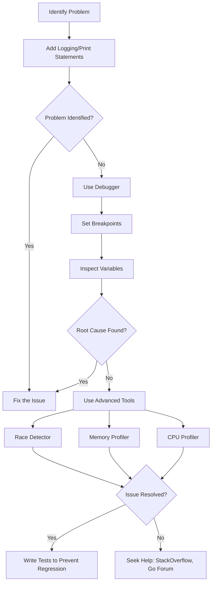

# Go Debugging

## Introduction

Debugging is an essential skill for any programmer. Even the most carefully written code can contain bugs, and knowing how to find and fix these issues efficiently will save you hours of frustration. In Go, there are several powerful debugging tools and techniques available that can help you identify and resolve problems in your code.

This guide will introduce you to Go's debugging ecosystem, from simple print statements to sophisticated debugging tools. Whether you're tracking down a nil pointer exception or trying to understand why your goroutines aren't behaving as expected, these techniques will help you become more efficient at solving problems in your Go code.

## Basic Debugging Techniques

### Print Statements

The simplest form of debugging is adding print statements to your code. In Go, we can use the `fmt` package for this purpose:

```go
package main

import (
    "fmt"
)

func main() {
    x := 10
    y := 0
    
    fmt.Println("Value of x:", x)
    fmt.Println("Value of y:", y)
    
    // This will cause a panic
    fmt.Println("Result of x/y:", x/y)
}
```

Output:
```
Value of x: 10
Value of y: 0
panic: runtime error: integer divide by zero

goroutine 1 [running]:
main.main()
        /tmp/sandbox123456789/prog.go:15 +0x1a
exit status 2
```

While print statements are easy to use, they have limitations:
- They require modifying your code
- They can clutter your code
- You need to recompile after each change
- They're not interactive

### Logging

Go's standard library includes a `log` package that provides more sophisticated logging than simple print statements:

```go
package main

import (
    "log"
)

func main() {
    log.SetFlags(log.Ldate | log.Ltime | log.Lshortfile)
    
    x := 10
    log.Printf("Value of x: %d", x)
    
    y := 0
    log.Printf("Value of y: %d", y)
    
    // This will cause a panic
    log.Printf("About to divide %d by %d", x, y)
    z := x / y
    log.Printf("Result: %d", z) // This line won't execute
}
```

Output:
```
2023/01/01 12:34:56 main.go:13: Value of x: 10
2023/01/01 12:34:56 main.go:16: Value of y: 0
2023/01/01 12:34:56 main.go:19: About to divide 10 by 0
panic: runtime error: integer divide by zero

goroutine 1 [running]:
main.main()
        /tmp/sandbox123456789/prog.go:20 +0x1a
exit status 2
```

Logging offers several advantages over print statements:
- Timestamps and file information are included by default
- Log output can be redirected to files
- Log levels can be used (although this requires additional packages)

## Go's Built-in Debugging Tools

### The Go Runtime Stack Trace

When your Go program panics, it generates a stack trace showing the sequence of function calls that led to the error:

```go
package main

func recursiveFunction(n int) int {
    // Base case: should stop recursion
    if n <= 0 {
        return 0
    }
    
    // Recursive case
    return recursiveFunction(n-1) + n
}

func main() {
    // Set a very large number to cause a stack overflow
    recursiveFunction(1000000)
}
```

Output:
```
runtime: goroutine stack exceeds 1000000000-byte limit
runtime: sp=0xc020060768 stack=[0xc020060000, 0xc040060000]
fatal error: stack overflow

runtime stack:
runtime.throw({0x10c5cc9, 0x0})
        /usr/local/go/src/runtime/panic.go:1047 +0x5d
runtime.newstack()
        /usr/local/go/src/runtime/stack.go:1088 +0x7c2
runtime.morestack()
        /usr/local/go/src/runtime/asm_amd64.s:461 +0x8b

goroutine 1 [running]:
main.recursiveFunction(0xf4240, 0xc020060768)
        /tmp/sandbox123456789/prog.go:9 +0x6b fp=0xc020060770 sp=0xc020060768 pc=0x10a15cb
main.recursiveFunction(0xf4241, 0xc020060798)
        /tmp/sandbox123456789/prog.go:9 +0x6b fp=0xc0200607a0 sp=0xc020060798 pc=0x10a15cb
...many more lines of recursive calls...
main.main()
        /tmp/sandbox123456789/prog.go:15 +0x1a fp=0xc0200e0780 sp=0xc0200e0778 pc=0x10a163a
runtime.main()
        /usr/local/go/src/runtime/proc.go:250 +0x207 fp=0xc0200e07e0 sp=0xc0200e0780 pc=0x10a77a7
runtime.goexit()
        /usr/local/go/src/runtime/asm_amd64.s:1594 +0x1 fp=0xc0200e07e8 sp=0xc0200e07e0 pc=0x10a9a01
```

This stack trace shows:
- The error message: "stack overflow"
- The state of the goroutines at the time of the panic
- The sequence of function calls that led to the error
- File names and line numbers where each call occurred

Understanding stack traces is crucial for debugging Go programs.

### The `runtime/pprof` Package

Go includes a built-in profiling tool called `pprof` that can help identify performance bottlenecks and memory leaks:

```go
package main

import (
    "fmt"
    "os"
    "runtime/pprof"
)

func fibonacci(n int) int {
    if n <= 1 {
        return n
    }
    return fibonacci(n-1) + fibonacci(n-2)
}

func main() {
    // Create CPU profile
    f, err := os.Create("cpu.prof")
    if err != nil {
        fmt.Println("Could not create CPU profile:", err)
        return
    }
    defer f.Close()
    
    if err := pprof.StartCPUProfile(f); err != nil {
        fmt.Println("Could not start CPU profile:", err)
        return
    }
    defer pprof.StopCPUProfile()
    
    // Run our inefficient fibonacci function
    result := fibonacci(40)
    fmt.Println("Fibonacci result:", result)
    
    // Create memory profile
    f2, err := os.Create("mem.prof")
    if err != nil {
        fmt.Println("Could not create memory profile:", err)
        return
    }
    defer f2.Close()
    
    if err := pprof.WriteHeapProfile(f2); err != nil {
        fmt.Println("Could not write memory profile:", err)
        return
    }
    
    fmt.Println("CPU and memory profiles created")
}
```

After running this program, you can analyze the profiles with:

```bash
go tool pprof cpu.prof
go tool pprof mem.prof
```

While `pprof` is primarily a profiling tool, it can be invaluable for debugging performance issues and memory leaks.

### The `runtime/trace` Package

The `runtime/trace` package enables tracing of Go program execution:

```go
package main

import (
    "context"
    "fmt"
    "os"
    "runtime/trace"
    "time"
)

func main() {
    // Create trace file
    f, err := os.Create("trace.out")
    if err != nil {
        fmt.Println("Failed to create trace file:", err)
        return
    }
    defer f.Close()
    
    // Start tracing
    if err := trace.Start(f); err != nil {
        fmt.Println("Failed to start trace:", err)
        return
    }
    defer trace.Stop()
    
    // Create a context for tracing
    ctx := context.Background()
    
    // Create a task
    ctx, task := trace.NewTask(ctx, "main")
    defer task.End()
    
    // Record some events
    trace.Log(ctx, "event", "Starting work")
    time.Sleep(100 * time.Millisecond)
    
    trace.WithRegion(ctx, "heavyWork", func() {
        // Simulate heavy work
        time.Sleep(200 * time.Millisecond)
    })
    
    trace.Log(ctx, "event", "Work completed")
}
```

After running this program, you can analyze the trace with:

```bash
go tool trace trace.out
```

The trace viewer provides detailed information about goroutine scheduling, garbage collection pauses, and other runtime events.

## Delve: A Powerful Go Debugger

Delve is a powerful debugger designed specifically for Go. It provides features like breakpoints, variable inspection, and step-by-step execution.

### Installing Delve

```bash
go install github.com/go-delve/delve/cmd/dlv@latest
```

### Basic Delve Commands

Let's debug the following program:

```go
// main.go
package main

import "fmt"

func add(a, b int) int {
    return a + b
}

func main() {
    x := 5
    y := 7
    sum := add(x, y)
    fmt.Printf("%d + %d = %d
", x, y, sum)
}
```

Here's how you can debug it with Delve:

```bash
# Start debugging the program
dlv debug main.go

# Set a breakpoint at the main function
(dlv) break main.main
Breakpoint 1 set at 0x10a4120 for main.main() ./main.go:8

# Run the program until it hits the breakpoint
(dlv) continue
> main.main() ./main.go:8 (hits goroutine(1):1 total:1)

# Step through the code one line at a time
(dlv) next
> main.main() ./main.go:9

# Display the value of a variable
(dlv) print x
5

# Set a breakpoint at the add function
(dlv) break main.add
Breakpoint 2 set at 0x10a40a0 for main.add() ./main.go:4

# Continue execution until the next breakpoint
(dlv) continue
> main.add() ./main.go:4 (hits goroutine(1):1 total:1)

# Print function arguments
(dlv) args
a = 5
b = 7

# Step into the function
(dlv) step
> main.add() ./main.go:5

# Exit the debugger
(dlv) quit
```

### Debugging Goroutines

Delve excels at debugging concurrent Go programs:

```go
// concurrency.go
package main

import (
    "fmt"
    "sync"
    "time"
)

func worker(id int, wg *sync.WaitGroup) {
    defer wg.Done()
    
    fmt.Printf("Worker %d starting
", id)
    time.Sleep(time.Second)
    fmt.Printf("Worker %d done
", id)
}

func main() {
    var wg sync.WaitGroup
    
    for i := 1; i <= 3; i++ {
        wg.Add(1)
        go worker(i, &wg)
    }
    
    wg.Wait()
    fmt.Println("All workers completed")
}
```

Debugging with Delve:

```bash
# Start debugging
dlv debug concurrency.go

# Set a breakpoint in the worker function
(dlv) break main.worker
Breakpoint 1 set at 0x10a4180 for main.worker() ./concurrency.go:10

# Run the program
(dlv) continue
> main.worker() ./concurrency.go:10 (hits goroutine(18):1 total:1)

# Show goroutine information
(dlv) goroutines
  Goroutine 1 - User: ./concurrency.go:21 main.main (0x10a4240) [sleep]
* Goroutine 18 - User: ./concurrency.go:10 main.worker (0x10a4180) (thread 1)
  Goroutine 19 - User: ./concurrency.go:10 main.worker (0x10a4180) [runnable]
  Goroutine 20 - User: ./concurrency.go:10 main.worker (0x10a4180) [runnable]

# Switch to another goroutine
(dlv) goroutine 19
Switched from 18 to 19 (thread 1)

# Continue execution
(dlv) continue
> main.worker() ./concurrency.go:10 (hits goroutine(19):1 total:2)

# Exit
(dlv) quit
```

## Advanced Debugging Techniques

### Conditional Breakpoints

Delve supports conditional breakpoints that only trigger when certain conditions are met:

```bash
# Set a breakpoint that only triggers when id equals 2
(dlv) break main.worker id == 2
```

### Logging and Tracing in Delve

```bash
# Log whenever a function is called
(dlv) on main.worker print id

# Trace function calls
(dlv) trace main.worker
```

### Memory Debugger

Go has a built-in memory inspector that can help find memory leaks:

```go
package main

import (
    "fmt"
    "net/http"
    _ "net/http/pprof" // Import for side effects
    "time"
)

func main() {
    // Start pprof server
    go func() {
        fmt.Println("Starting pprof server on :6060")
        fmt.Println(http.ListenAndServe("localhost:6060", nil))
    }()
    
    // Allocate memory in a loop
    var data []string
    for i := 0; i < 1000; i++ {
        data = append(data, fmt.Sprintf("Data item %d", i))
        time.Sleep(100 * time.Millisecond)
    }
}
```

While this program is running, you can analyze its memory usage with:

```bash
go tool pprof http://localhost:6060/debug/pprof/heap
```

## Debugging Common Go Problems

### Nil Pointer Dereference

One of the most common errors in Go is dereferencing a nil pointer:

```go
package main

import "fmt"

type Person struct {
    Name string
    Age  int
}

func main() {
    var p *Person // p is nil
    fmt.Println("Person's name:", p.Name) // This will panic
}
```

Output:
```
panic: runtime error: invalid memory address or nil pointer dereference
[signal SIGSEGV: segmentation violation code=0x1 addr=0x0 pc=0x10a4150]

goroutine 1 [running]:
main.main()
        /tmp/sandbox123456789/prog.go:11 +0x20
exit status 2
```

Solution: Always check if a pointer is nil before dereferencing it:

```go
package main

import "fmt"

type Person struct {
    Name string
    Age  int
}

func main() {
    var p *Person // p is nil
    
    // Check if p is nil
    if p != nil {
        fmt.Println("Person's name:", p.Name)
    } else {
        fmt.Println("Person is nil")
    }
}
```

### Race Conditions

Race conditions occur when multiple goroutines access shared data without proper synchronization:

```go
package main

import (
    "fmt"
    "sync"
)

func main() {
    counter := 0
    var wg sync.WaitGroup
    
    for i := 0; i < 1000; i++ {
        wg.Add(1)
        go func() {
            defer wg.Done()
            counter++ // Race condition here
        }()
    }
    
    wg.Wait()
    fmt.Println("Counter:", counter) // May not be 1000
}
```

You can detect race conditions using Go's race detector:

```bash
go run -race main.go
```

Solution: Use proper synchronization:

```go
package main

import (
    "fmt"
    "sync"
)

func main() {
    counter := 0
    var wg sync.WaitGroup
    var mu sync.Mutex
    
    for i := 0; i < 1000; i++ {
        wg.Add(1)
        go func() {
            defer wg.Done()
            mu.Lock()
            counter++
            mu.Unlock()
        }()
    }
    
    wg.Wait()
    fmt.Println("Counter:", counter) // Will be 1000
}
```

### Deadlocks

Deadlocks occur when goroutines are waiting for each other, creating a circular dependency:

```go
package main

import (
    "fmt"
    "sync"
    "time"
)

func main() {
    var mu1, mu2 sync.Mutex
    
    go func() {
        mu1.Lock()
        fmt.Println("Goroutine 1: Locked mu1")
        time.Sleep(100 * time.Millisecond)
        fmt.Println("Goroutine 1: Waiting for mu2")
        mu2.Lock() // Deadlock: waiting for mu2 while holding mu1
        fmt.Println("Goroutine 1: Locked mu2")
        mu2.Unlock()
        mu1.Unlock()
    }()
    
    go func() {
        mu2.Lock()
        fmt.Println("Goroutine 2: Locked mu2")
        time.Sleep(100 * time.Millisecond)
        fmt.Println("Goroutine 2: Waiting for mu1")
        mu1.Lock() // Deadlock: waiting for mu1 while holding mu2
        fmt.Println("Goroutine 2: Locked mu1")
        mu1.Unlock()
        mu2.Unlock()
    }()
    
    time.Sleep(2 * time.Second)
    fmt.Println("Program completed") // This line won't be reached
}
```

Output:
```
Goroutine 1: Locked mu1
Goroutine 2: Locked mu2
Goroutine 1: Waiting for mu2
Goroutine 2: Waiting for mu1
fatal error: all goroutines are asleep - deadlock!

goroutine 1 [semacquire]:
sync.runtime_SemacquireMutex(0xc000118008, 0x0, 0x1)
        /usr/local/go/src/runtime/sema.go:71 +0x47
sync.(*Mutex).lockSlow(0xc000118008)
        /usr/local/go/src/sync/mutex.go:138 +0x105
sync.(*Mutex).Lock(0xc000118008)
        /usr/local/go/src/sync/mutex.go:81 +0x90
main.main.func1()
        /tmp/sandbox123456789/prog.go:17 +0x11a
created by main.main
        /tmp/sandbox123456789/prog.go:10 +0x92

goroutine 18 [semacquire]:
sync.runtime_SemacquireMutex(0xc000118000, 0x0, 0x1)
        /usr/local/go/src/runtime/sema.go:71 +0x47
sync.(*Mutex).lockSlow(0xc000118000)
        /usr/local/go/src/sync/mutex.go:138 +0x105
sync.(*Mutex).Lock(0xc000118000)
        /usr/local/go/src/sync/mutex.go:81 +0x90
main.main.func2()
        /tmp/sandbox123456789/prog.go:27 +0x11a
created by main.main
        /tmp/sandbox123456789/prog.go:20 +0x12a
```

Solution: Ensure consistent lock ordering:

```go
package main

import (
    "fmt"
    "sync"
    "time"
)

func main() {
    var mu1, mu2 sync.Mutex
    
    go func() {
        // Always lock mu1 before mu2
        mu1.Lock()
        fmt.Println("Goroutine 1: Locked mu1")
        time.Sleep(100 * time.Millisecond)
        fmt.Println("Goroutine 1: Waiting for mu2")
        mu2.Lock()
        fmt.Println("Goroutine 1: Locked mu2")
        mu2.Unlock()
        mu1.Unlock()
    }()
    
    go func() {
        // Always lock mu1 before mu2
        mu1.Lock()
        fmt.Println("Goroutine 2: Locked mu1")
        time.Sleep(100 * time.Millisecond)
        fmt.Println("Goroutine 2: Waiting for mu2")
        mu2.Lock()
        fmt.Println("Goroutine 2: Locked mu2")
        mu2.Unlock()
        mu1.Unlock()
    }()
    
    time.Sleep(2 * time.Second)
    fmt.Println("Program completed")
}
```

## Debugging Go Testing

Go's testing package includes built-in support for debugging tests:

```go
// math.go
package math

func Add(a, b int) int {
    return a + b
}

func Multiply(a, b int) int {
    return a * b
}
```

```go
// math_test.go
package math

import (
    "testing"
)

func TestAdd(t *testing.T) {
    result := Add(2, 3)
    if result != 5 {
        t.Errorf("Add(2, 3) = %d; want 5", result)
    }
}

func TestMultiply(t *testing.T) {
    result := Multiply(2, 3)
    if result != 6 {
        t.Errorf("Multiply(2, 3) = %d; want 6", result)
    }
}
```

Debugging tests with Delve:

```bash
# Debug tests
dlv test

# Set a breakpoint in a test function
(dlv) break math.TestAdd
Breakpoint 1 set at 0x10a4180 for math.TestAdd() ./math_test.go:8

# Run the tests
(dlv) continue
> math.TestAdd() ./math_test.go:8 (hits goroutine(5):1 total:1)

# Step through the test
(dlv) next
> math.TestAdd() ./math_test.go:9

# Inspect variables
(dlv) print result
2

# Exit
(dlv) quit
```

## Visual Studio Code Integration

Visual Studio Code offers excellent debugging support for Go through the Go extension:

1. Install the Go extension in VS Code
2. Open your Go project
3. Set breakpoints by clicking in the gutter next to line numbers
4. Click the Debug icon in the sidebar and select "Run and Debug"
5. Choose "Go: Launch Package" from the configuration dropdown
6. Start debugging with F5

This provides a graphical interface for:
- Setting breakpoints
- Stepping through code
- Inspecting variables
- Watching expressions
- Viewing call stacks
- Debugging goroutines

## Debugging Flow in Go



## Summary

Debugging is an essential skill for Go developers. In this guide, we've covered:

1. Basic debugging techniques using print statements and logging
2. Go's built-in debugging tools:
   - Stack traces
   - The `runtime/pprof` package
   - The `runtime/trace` package
3. Using Delve, a powerful Go debugger
4. Advanced debugging techniques:
   - Conditional breakpoints
   - Logging and tracing
   - Memory debugging
5. Debugging common Go problems:
   - Nil pointer dereferences
   - Race conditions
   - Deadlocks
6. Debugging Go tests
7. Visual Studio Code integration

## Additional Resources

- [Delve Documentation](https://github.com/go-delve/delve)
- [Go's pprof Package](https://pkg.go.dev/runtime/pprof)
- [Go's trace Package](https://pkg.go.dev/runtime/trace)
- [Debugging Go Code with GDB](https://golang.org/doc/gdb)
- [VS Code Go Extension](https://marketplace.visualstudio.com/items?itemName=golang.Go)

## Exercises

1. Debug a simple Go program with Delve:
   - Create a program with a deliberate error (like division by zero)
   - Set breakpoints and step through the code
   - Fix the issue

2. Use the race detector:
   - Create a program with a race condition
   - Run it with `go run -race`
   - Fix the race condition using synchronization primitives

3. Profile a Go program:
   - Create a program that performs a CPU-intensive operation
   - Profile it using the `runtime/pprof` package
   - Optimize the program based on the profiling results

4. Debug goroutines:
   - Create a program with multiple goroutines
   - Use Delve to inspect and debug each goroutine
   - Identify and fix any concurrency issues

Happy debugging!