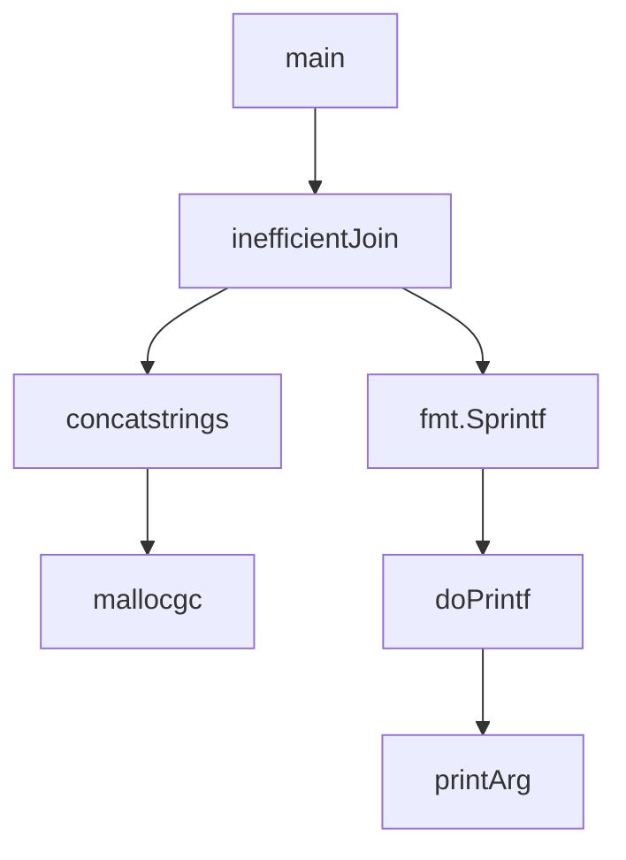

# Go Profiling

## Introduction

Performance profiling is an essential skill for any Go developer who wants to build efficient applications. Go includes a powerful built-in profiling toolkit called `pprof` that helps you identify bottlenecks, memory leaks, and other performance issues in your programs.

In this tutorial, we'll explore Go's profiling capabilities, understand how to use the different profiling tools, and learn how to interpret the results to improve your code's performance.

## What is Profiling?

Profiling is the process of analyzing a program's behavior during execution to identify which parts consume the most resources. Instead of guessing where performance problems might be, profiling provides concrete data about:

- CPU usage (which functions take the most time?)
- Memory allocations (which parts of your code allocate the most memory?)
- Blocking operations (where is your code waiting for operations to complete?)
- Goroutine activity (are you creating too many goroutines or experiencing deadlocks?)

Let's get started with Go's profiling tools and see them in action!

## Go's Profiling Toolkit: pprof

Go's primary profiling tool is `pprof`, which is part of the standard library in the `runtime/pprof` package. Additionally, the `net/http/pprof` package provides HTTP endpoints for profiling running web applications.

### Types of Profiles

Go supports several types of profiles:

1. **CPU Profile**: Shows where your program spends its CPU time
2. **Memory Profile**: Shows memory allocation patterns
3. **Block Profile**: Shows where goroutines block waiting for synchronization primitives
4. **Goroutine Profile**: Shows all currently running goroutines
5. **Mutex Profile**: Shows contention on mutexes

## Setting Up Basic Profiling

Let's start with a simple example program that has some performance issues:

```go
package main

import (
	"fmt"
	"os"
	"runtime/pprof"
	"strings"
)

func main() {
	// Create CPU profile file
	f, err := os.Create("cpu.prof")
	if err != nil {
		fmt.Printf("Could not create CPU profile: %v
", err)
		return
	}
	defer f.Close()
	
	// Start CPU profiling
	if err := pprof.StartCPUProfile(f); err != nil {
		fmt.Printf("Could not start CPU profile: %v
", err)
		return
	}
	defer pprof.StopCPUProfile()
	
	// Our inefficient program
	result := inefficientJoin(50000)
	fmt.Printf("Result length: %d
", len(result))
	
	// Create memory profile
	f2, err := os.Create("mem.prof")
	if err != nil {
		fmt.Printf("Could not create memory profile: %v
", err)
		return
	}
	defer f2.Close()
	
	// Write memory profile
	if err := pprof.WriteHeapProfile(f2); err != nil {
		fmt.Printf("Could not write memory profile: %v
", err)
		return
	}
	
	fmt.Println("CPU and memory profiles created")
}

// This function is intentionally inefficient
func inefficientJoin(n int) string {
	result := ""
	for i := 0; i < n; i++ {
		// Inefficient string concatenation
		result += fmt.Sprintf("number-%d,", i)
	}
	return result
}
```

When we run this program, it will create two profile files:
- `cpu.prof`: Records CPU usage
- `mem.prof`: Records memory allocations

### Output:
```
Result length: 499995
CPU and memory profiles created
```

## Analyzing Profiles with pprof

Let's analyze the profiles we've created. You can use the `go tool pprof` command to analyze profiles:

```bash
go tool pprof cpu.prof
```

This opens an interactive console where you can explore the profile:

```
Type: cpu
Time: Mar 2, 2023, 15:04:05
Duration: 200ms, Total samples = 180ms (90.00%)
Entering interactive mode (type "help" for commands, "o" for options)
(pprof) top10
Showing nodes accounting for 170ms, 94.44% of 180ms total
Showing top 10 nodes out of 25
      flat  flat%   sum%        cum   cum%
      80ms 44.44% 44.44%       80ms 44.44%  runtime.concatstrings
      40ms 22.22% 66.67%      130ms 72.22%  main.inefficientJoin
      30ms 16.67% 83.33%       30ms 16.67%  runtime.mallocgc
      10ms  5.56% 88.89%       10ms  5.56%  fmt.Sprintf
      10ms  5.56% 94.44%       10ms  5.56%  runtime.convTstring
         0     0% 94.44%       10ms  5.56%  fmt.(*pp).doPrintf
         0     0% 94.44%       10ms  5.56%  fmt.(*pp).printArg
         0     0% 94.44%       10ms  5.56%  fmt.Fprintf
         0     0% 94.44%       10ms  5.56%  os.(*File).Write
         0     0% 94.44%       10ms  5.56%  runtime.convT2E
```

We can also visualize the profile as a graph by running:

```bash
go tool pprof -http=:8080 cpu.prof
```

This opens a web browser with an interactive visualization:



## Interpreting Profile Results

Looking at our CPU profile, we can see:

1. `concatstrings` and `inefficientJoin` take up most of the CPU time (66.67%)
2. Memory allocation (`mallocgc`) takes 16.67%
3. `fmt.Sprintf` also consumes resources

The problem is clear: string concatenation in a loop is inefficient in Go because strings are immutable, so each concatenation creates a new string.

## Optimizing Based on Profile Results

Let's improve our code based on the profiling results:

```go
// Improved version using strings.Builder
func efficientJoin(n int) string {
    var builder strings.Builder
    // Pre-allocate approximate capacity
    builder.Grow(n * 10)
    
    for i := 0; i < n; i++ {
        fmt.Fprintf(&builder, "number-%d,", i)
    }
    
    return builder.String()
}
```

Now let's run a benchmark comparing both functions:

```go
package main

import (
    "fmt"
    "strings"
    "testing"
)

func BenchmarkInefficientJoin(b *testing.B) {
    for i := 0; i < b.N; i++ {
        inefficientJoin(5000)
    }
}

func BenchmarkEfficientJoin(b *testing.B) {
    for i := 0; i < b.N; i++ {
        efficientJoin(5000)
    }
}
```

Run the benchmark:

```bash
go test -bench=. -benchmem
```

Sample output:

```
BenchmarkInefficientJoin-8     3     429876733 ns/op     238529064 B/op     10002 allocs/op
BenchmarkEfficientJoin-8      88      13587499 ns/op        51312 B/op         8 allocs/op
```

The optimized version:
- Is approximately 32x faster
- Uses 4,600x less memory
- Performs 1,250x fewer allocations

## Profiling Web Applications

For web applications, Go provides the `net/http/pprof` package, which adds HTTP endpoints for profiling a running server:

```go
package main

import (
    "fmt"
    "log"
    "net/http"
    _ "net/http/pprof" // Import for side effects
    "strings"
)

func heavyHandler(w http.ResponseWriter, r *http.Request) {
    // Simulate expensive operation
    result := strings.Builder{}
    for i := 0; i < 10000; i++ {
        result.WriteString(fmt.Sprintf("number-%d,", i))
    }
    fmt.Fprintf(w, "Done: length=%d", result.Len())
}

func main() {
    http.HandleFunc("/heavy", heavyHandler)
    
    log.Println("Server starting on :8080")
    log.Println("Access profiling data at /debug/pprof/")
    log.Fatal(http.ListenAndServe(":8080", nil))
}
```

Now you can access different profiling endpoints:
- `http://localhost:8080/debug/pprof/` - Index page
- `http://localhost:8080/debug/pprof/heap` - Memory profile
- `http://localhost:8080/debug/pprof/profile` - 30-second CPU profile
- `http://localhost:8080/debug/pprof/goroutine` - Goroutine stack traces

To analyze a running web application:

```bash
go tool pprof http://localhost:8080/debug/pprof/profile
```

## Advanced Profiling: Tracing

For more detailed insights, Go provides execution tracing:

```go
package main

import (
    "fmt"
    "os"
    "runtime/trace"
)

func main() {
    f, err := os.Create("trace.out")
    if err != nil {
        panic(err)
    }
    defer f.Close()
    
    err = trace.Start(f)
    if err != nil {
        panic(err)
    }
    defer trace.Stop()
    
    // Your code here
    fmt.Println("Tracing in progress...")
    
    // Example workload
    for i := 0; i < 10; i++ {
        go func(n int) {
            total := 0
            for j := 0; j < 1000000; j++ {
                total += j
            }
            fmt.Printf("Worker %d: %d
", n, total)
        }(i)
    }
    
    // Wait a bit for goroutines to finish
    fmt.Scanln()
}
```

Run the trace viewer:

```bash
go tool trace trace.out
```

This opens a web interface showing:
- Goroutine execution
- Network/sync blocking
- System calls
- Garbage collection events

## Continuous Profiling

For production applications, consider implementing continuous profiling:

1. Periodically capture profiles
2. Store profiles with timestamps
3. Compare profiles over time to detect regressions

Popular tools for continuous profiling:
- Google Cloud Profiler
- Datadog Continuous Profiler
- Pyroscope
- Parca

## Best Practices

1. **Profile early and often**: Don't wait until you have performance problems
2. **Focus on hot spots**: Address the most significant issues first
3. **Benchmark before and after**: Verify your optimizations actually help
4. **Consider the full picture**: Sometimes CPU improvements come at the cost of memory usage
5. **Profile in realistic environments**: Development machines may not show the same patterns as production

## Memory Management Tips

Based on profiling, here are common memory optimization patterns:

1. **Pre-allocate slices** when you know the approximate size
2. **Use object pools** for frequently allocated/deallocated objects
3. **Watch for hidden allocations** in interface conversions, string operations, etc.
4. **Use value types** instead of pointers when appropriate
5. **Be mindful of closure captures** which can prevent garbage collection

## Summary

Go's profiling tools provide powerful insights into your application's performance:

- CPU profiling reveals computation bottlenecks
- Memory profiling shows allocation patterns and potential leaks
- Block profiling identifies concurrency issues
- Trace tool visualizes goroutine behavior and scheduling

By learning to use these tools effectively, you can make data-driven optimization decisions rather than relying on intuition or guesswork.

## Additional Resources

1. [Go Blog: Profiling Go Programs](https://blog.golang.org/pprof)
2. [Runtime pprof package documentation](https://pkg.go.dev/runtime/pprof)
3. [Dave Cheney: High Performance Go Workshop](https://dave.cheney.net/high-performance-go-workshop/gophercon-2019.html)
4. [Practical Go Benchmarks repository](https://github.com/nikolaydubina/go-benchmarks)

## Exercises

1. Use pprof to identify and fix performance issues in a simple program that sorts a large slice of integers
2. Set up continuous profiling for a web server and monitor it under load
3. Compare the performance of different data structures (map, slice, etc.) for your specific use case
4. Use block profiling to identify contention issues in a concurrent program
5. Profile a program before and after applying the optimization techniques described in this guide

Remember, profiling should be part of your regular development workflow, not just something you do when problems arise. Happy profiling!