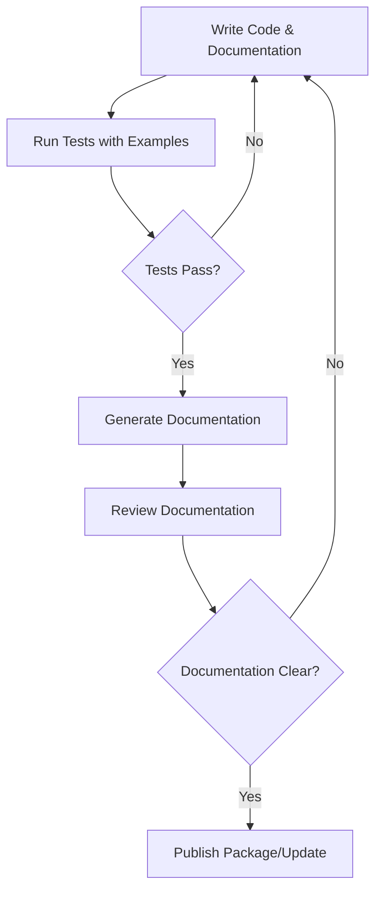

# Go Documentation

## Introduction

Documentation is a crucial aspect of any programming language or software project. In Go (or Golang), documentation is treated as a first-class citizen, with built-in tools that make it easy to create, read, and maintain documentation. This guide will introduce you to Go's documentation system, including how to write effective documentation for your code and how to use the tools that Go provides to navigate and understand existing code.

Go's approach to documentation is simple yet powerful - it extracts documentation directly from your source code comments, ensuring that documentation stays close to the code it describes and making it more likely to remain up-to-date as your code evolves.

## Understanding Go Documentation

### The Philosophy of Go Documentation

Go's documentation philosophy centers around a few key principles:

1. **Documentation is code-adjacent**: Comments written directly above declarations in your code become the documentation for those items.
2. **Simple plain text**: Documentation is written in plain text with some minimal formatting conventions.
3. **Tool-assisted**: Go provides tools like `godoc` and `go doc` to generate and view documentation.
4. **Standard format**: The standard library sets conventions that the community follows.

### Types of Go Documentation

In Go, there are primarily two types of documentation:

1. **Package documentation**: Overview documentation for an entire package.
2. **Element documentation**: Documentation for specific elements within a package (functions, types, methods, etc.).

## Writing Go Documentation

### Package Documentation

Package documentation is written as a block comment preceding the package declaration. This comment should provide an overview of the package's purpose and functionality.

```go
// Package math provides basic mathematical constants and functions.
//
// This package provides constants like Pi and E, and functions for
// common mathematical operations like Sqrt, Sin, Cos, etc.
package math
```

### Function, Type, and Method Documentation

Documentation for functions, types, methods, and other declarations is written as a comment block immediately preceding the declaration.

```go
// Sum returns the sum of all integers in the provided slice.
// It returns 0 if the slice is empty.
func Sum(numbers []int) int {
    total := 0
    for _, num := range numbers {
        total += num
    }
    return total
}
```

### Formatting Conventions

Go documentation follows some simple formatting conventions:

- Begin each sentence on a new line
- Use full sentences with proper punctuation
- Start function/method documentation with the name of the function
- For complex types, document fields with comments
- Use examples where appropriate (more on this later)

### Example

```go
// UserService provides methods to manage users in the system.
type UserService struct {
    // DB is the database connection used for user operations.
    // It must be set before calling any methods.
    DB *sql.DB
    
    // Logger is used for logging operations.
    // If nil, logging is disabled.
    Logger *log.Logger
}

// GetUser retrieves a user by their ID.
// It returns the user if found, or an error if the user doesn't exist
// or if a database error occurs.
func (s *UserService) GetUser(id int) (*User, error) {
    // Implementation...
}
```

## Documentation Examples

One of Go's most powerful documentation features is its support for runnable examples. These examples appear in the documentation and are also run as tests to ensure they stay correct as your code evolves.

Here's how to write a documentation example:

```go
func ExampleSum() {
    numbers := []int{1, 2, 3, 4, 5}
    sum := Sum(numbers)
    fmt.Println(sum)
    // Output: 15
}
```

This example will:
1. Appear in the generated documentation
2. Run during tests to verify the output matches the comment

You can also create examples for methods:

```go
func ExampleUserService_GetUser() {
    service := &UserService{DB: db}
    user, err := service.GetUser(123)
    if err != nil {
        fmt.Println("Error:", err)
        return
    }
    fmt.Println("Found user:", user.Name)
    // Output: Found user: John Doe
}
```

## Go Documentation Tools

### go doc

The `go doc` command is a built-in tool that lets you view documentation from the command line:

```bash
# View package documentation
go doc net/http

# View documentation for a specific function
go doc net/http.Get

# View detailed documentation
go doc -all net/http
```

### godoc

`godoc` is a more comprehensive documentation tool that can generate and serve HTML documentation:

```bash
# Install godoc
go install golang.org/x/tools/cmd/godoc@latest

# Start a documentation server
godoc -http=:6060
```

After starting the server, you can navigate to `http://localhost:6060` to browse your Go installation's documentation.

### pkg.go.dev

[pkg.go.dev](https://pkg.go.dev) is the official documentation site for Go packages. It hosts documentation for the standard library and public Go modules. When you publish a Go module, its documentation becomes available on pkg.go.dev.

## Documenting a Complete Package

Let's look at a complete example of documenting a small package:

```go
// Package calculator provides basic mathematical operations.
//
// This package demonstrates how to document a complete Go package
// with function documentation, examples, and more.
package calculator

// Add returns the sum of a and b.
func Add(a, b int) int {
    return a + b
}

// Subtract returns the difference of a and b.
func Subtract(a, b int) int {
    return a - b
}

// Multiply returns the product of a and b.
func Multiply(a, b int) int {
    return a * b
}

// Divide returns the quotient of a and b.
// It panics if b is zero.
func Divide(a, b int) int {
    if b == 0 {
        panic("division by zero")
    }
    return a / b
}
```

And here's how you would add examples:

```go
package calculator_test

import (
    "fmt"
    
    "example.com/calculator"
)

func ExampleAdd() {
    sum := calculator.Add(5, 3)
    fmt.Println(sum)
    // Output: 8
}

func ExampleSubtract() {
    difference := calculator.Subtract(10, 4)
    fmt.Println(difference)
    // Output: 6
}

func ExampleMultiply() {
    product := calculator.Multiply(3, 4)
    fmt.Println(product)
    // Output: 12
}

func ExampleDivide() {
    quotient := calculator.Divide(10, 2)
    fmt.Println(quotient)
    // Output: 5
}
```

## Documentation Workflow

Here's a typical workflow for working with Go documentation:

