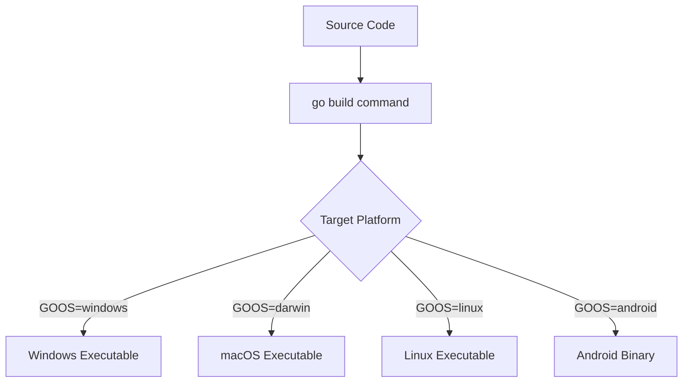

# Go Build

## Introduction

The `go build` command is one of the most fundamental tools in the Go programming toolkit. It compiles Go packages and their dependencies into executable binaries. Unlike interpreted languages where you run code directly, Go is a compiled language, which means your source code must be translated into machine code before it can be executed. This is precisely what `go build` does for you.

In this guide, you'll learn:
- How the `go build` command works
- Basic and advanced usage patterns
- Common flags and options
- Best practices for building Go applications
- How to troubleshoot common build errors

## Basic Usage

At its simplest, you can build a Go program by navigating to your project directory and running:

```bash
go build
```

This command compiles the package in the current directory. If the package is `main`, it produces an executable file. The output file is named after the directory containing the source files.

### Example: Hello World

Let's start with a simple "Hello World" program:

1. Create a file named `hello.go`:

```go
package main

import "fmt"

func main() {
    fmt.Println("Hello, Go Builder!")
}
```

2. Run the build command:

```bash
go build hello.go
```

3. This will generate an executable file:
   - On Windows: `hello.exe`
   - On macOS/Linux: `hello`

4. Run the executable:

```bash
# On Windows
hello.exe

# On macOS/Linux
./hello
```

**Output:**
```
Hello, Go Builder!
```

## Specifying Output File Name

You can specify the name of the output file using the `-o` flag:

```bash
go build -o myapp hello.go
```

This will create an executable named `myapp` (or `myapp.exe` on Windows) instead of the default name.

## Building Multiple Files

You can include multiple Go files in your build command:

```bash
go build file1.go file2.go file3.go
```

Or more commonly, you'll organize your code in packages and build the entire package:

```bash
go build
```

## Building for Different Platforms

One of Go's strengths is its ability to cross-compile for different operating systems and architectures. You can control this using environment variables:

```bash
# Build for Windows 64-bit
GOOS=windows GOARCH=amd64 go build -o myapp.exe

# Build for macOS
GOOS=darwin GOARCH=amd64 go build -o myapp_mac

# Build for Linux
GOOS=linux GOARCH=amd64 go build -o myapp_linux
```

Here's a diagram showing the cross-compilation process:



## Common Build Flags

The `go build` command supports several useful flags:

| Flag | Description |
|------|-------------|
| `-o` | Specifies the output file name |
| `-v` | Enables verbose output, showing packages being compiled |
| `-race` | Enables race condition detection |
| `-ldflags` | Passes flags to the linker |
| `-tags` | Specifies build tags |

### Practical Example: Using Build Tags

Build tags allow you to include or exclude code based on certain conditions. This is useful for platform-specific code or feature toggles.

1. Create a file named `main.go`:

```go
package main

import "fmt"

func main() {
    fmt.Println("Hello from the main program!")
    printFeature()
}
```

2. Create `feature_enabled.go`:

```go
//go:build feature
// +build feature

package main

import "fmt"

func printFeature() {
    fmt.Println("This feature is enabled!")
}
```

3. Create `feature_disabled.go`:

```go
//go:build !feature
// +build !feature

package main

func printFeature() {
    // No feature output when disabled
}
```

4. Build with the feature disabled (default):

```bash
go build -o app_regular
```

5. Build with the feature enabled:

```bash
go build -tags=feature -o app_with_feature
```

When you run `app_regular`, you'll see only:
```
Hello from the main program!
```

When you run `app_with_feature`, you'll see:
```
Hello from the main program!
This feature is enabled!
```

## Optimizing Builds

### Stripping Debug Information

For production builds, you can use the `-ldflags` option to reduce binary size:

```bash
go build -ldflags="-s -w" -o app_optimized
```

The `-s` flag omits the symbol table and debug information, while `-w` omits the DWARF table, resulting in a smaller executable.

### Setting Version Information

You can inject version information at build time:

```bash
go build -ldflags="-X main.Version=1.0.0 -X main.BuildTime=$(date)" -o app_versioned
```

In your code:

```go
package main

import "fmt"

var (
    Version   = "development"
    BuildTime = "unknown"
)

func main() {
    fmt.Printf("Running version %s built on %s
", Version, BuildTime)
}
```

## Understanding Build Artifacts

When you run `go build`, it creates an executable but doesn't leave any other intermediate files. This is different from some other compiled languages where you might see object files.

If you want to examine the compilation process without producing an executable, you can use:

```bash
go build -n
```

This shows the commands that would be executed without actually running them.

## Troubleshooting Common Errors

### 1. "cannot find package" error

```
cannot find package "github.com/example/package" in any of:
        /usr/local/go/src/github.com/example/package (from $GOROOT)
        /home/user/go/src/github.com/example/package (from $GOPATH)
```

**Solution**: Run `go get github.com/example/package` to download the missing package.

### 2. "undefined: someFunction" error

```
./main.go:10:2: undefined: someFunction
```

**Solution**: Check for typos in function names or ensure you've imported the correct package.

### 3. Build taking too long

**Solution**: Use the `-v` flag to see which packages are being compiled, helping identify slow dependencies:

```bash
go build -v
```

## Best Practices

1. **Use Modules**: Always use Go modules (`go.mod`) for dependency management.
2. **Consistent Directory Structure**: Follow standard Go project layout.
3. **Separate Build Scripts**: For complex builds, create shell scripts or Makefiles.
4. **Version Your Binaries**: Include version information in your builds.
5. **Use Build Constraints Wisely**: Leverage build tags for platform-specific code.

Here's a typical Go project structure:

```
myproject/
├── cmd/
│   └── myapp/
│       └── main.go
├── internal/
│   └── pkg1/
│       └── pkg1.go
├── pkg/
│   └── shared/
│       └── shared.go
├── go.mod
├── go.sum
└── Makefile
```

## Real-World Example: Building a Web Server

Let's create a simple web server and build it:

1. Create a project structure:

```
webserver/
├── main.go
├── handlers/
│   └── hello.go
└── go.mod
```

2. Initialize the module:

```bash
cd webserver
go mod init example.com/webserver
```

3. Create `handlers/hello.go`:

```go
package handlers

import (
    "fmt"
    "net/http"
)

func HelloHandler(w http.ResponseWriter, r *http.Request) {
    fmt.Fprintf(w, "Hello, Web Builder!")
}
```

4. Create `main.go`:

```go
package main

import (
    "log"
    "net/http"
    
    "example.com/webserver/handlers"
)

var (
    Version = "development"
)

func main() {
    http.HandleFunc("/hello", handlers.HelloHandler)
    
    log.Printf("Starting server (Version: %s)...", Version)
    log.Fatal(http.ListenAndServe(":8080", nil))
}
```

5. Build with version information:

```bash
go build -ldflags="-X main.Version=1.0.0" -o webserver
```

6. Run the server:

```bash
./webserver
```

7. Test the server:

```bash
curl http://localhost:8080/hello
```

Output:
```
Hello, Web Builder!
```

## Integrating with CI/CD

For automated builds in continuous integration pipelines, you can use `go build` in scripts:

```yaml
# Example GitHub Actions workflow
name: Build Go Application

on: [push]

jobs:
  build:
    runs-on: ubuntu-latest
    steps:
    - uses: actions/checkout@v3
    
    - name: Set up Go
      uses: actions/setup-go@v4
      with:
        go-version: '1.21'
        
    - name: Build
      run: go build -v -o myapp
      
    - name: Upload artifact
      uses: actions/upload-artifact@v3
      with:
        name: myapp
        path: ./myapp
```

## Summary

The `go build` command is a powerful tool that forms the foundation of Go's compilation system. We've covered:

- Basic usage for compiling Go programs
- Specifying output file names and locations
- Cross-compilation for different platforms
- Using build flags for optimization and customization
- Troubleshooting common build errors
- Best practices for organizing your build process

By mastering `go build`, you'll be well on your way to becoming a proficient Go developer, able to create efficient, portable applications for any platform.

## Additional Resources

- [Official Go Documentation on Command Build](https://golang.org/cmd/go/#hdr-Compile_packages_and_dependencies)
- [Go Modules Reference](https://golang.org/ref/mod)
- [Effective Go](https://golang.org/doc/effective_go)

## Exercises

1. Create a simple Go program and build it for three different platforms.
2. Experiment with build tags to conditionally include debug code in your application.
3. Create a build script that automatically injects the current git commit hash as a version number.
4. Build a Go application that reads its configuration from environment variables set at build time.
5. Create a multi-package Go application and explore different ways to build and organize it.