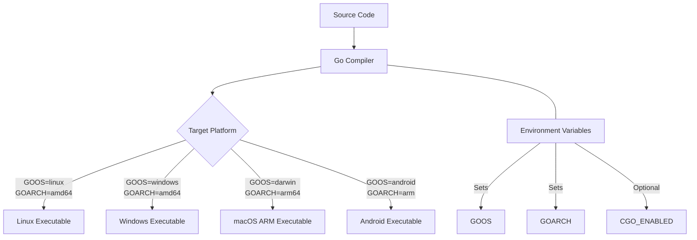

# Go Cross-Compilation

## Introduction

One of Go's most powerful features is its ability to compile code for different operating systems and architectures from a single development machine. This process, known as **cross-compilation**, allows you to build executable binaries for platforms other than the one you're currently using.

For example, you might be developing on a Windows laptop but need to deploy your application on a Linux server, or you want to build your application for both macOS and Windows users. Cross-compilation makes this possible without needing separate development environments for each target platform.

## Why Cross-Compilation Matters

Cross-compilation offers several advantages:

- **Build once, deploy anywhere**: Create binaries for multiple platforms from a single codebase
- **Simplified CI/CD pipelines**: Build for all target platforms in one environment
- **Efficient development workflow**: No need to switch between different operating systems
- **Reduced infrastructure costs**: Eliminate the need for multiple build servers

## Understanding Go Build Targets

Go uses two primary environment variables to determine the build target:

- `GOOS`: The target operating system (linux, windows, darwin, etc.)
- `GOARCH`: The target architecture (amd64, arm64, 386, etc.)

### Common GOOS Values

| GOOS | Operating System |
|------|-----------------|
| linux | Linux |
| windows | Windows |
| darwin | macOS |
| android | Android |
| ios | iOS |
| freebsd | FreeBSD |

### Common GOARCH Values

| GOARCH | Architecture |
|--------|-------------|
| amd64 | 64-bit x86 (Intel/AMD) |
| 386 | 32-bit x86 |
| arm64 | 64-bit ARM |
| arm | 32-bit ARM |
| ppc64 | 64-bit PowerPC |
| s390x | IBM System z |

You can see all supported combinations by running:

```bash
go tool dist list
```

## Basic Cross-Compilation

Let's start with a simple example. Here's a basic "Hello World" Go program:

```go
// hello.go
package main

import (
    "fmt"
    "runtime"
)

func main() {
    fmt.Printf("Hello from %s/%s!
", runtime.GOOS, runtime.GOARCH)
}
```

### Cross-Compiling for Linux from Another OS

To compile this program for Linux (64-bit) from any operating system:

```bash
GOOS=linux GOARCH=amd64 go build -o hello-linux hello.go
```

This command:
1. Sets `GOOS=linux` to target the Linux operating system
2. Sets `GOARCH=amd64` to target 64-bit architecture
3. Uses `go build` with the `-o` flag to specify the output filename

### Cross-Compiling for Windows from Another OS

For a Windows executable:

```bash
GOOS=windows GOARCH=amd64 go build -o hello-windows.exe hello.go
```

Notice the `.exe` extension, which is standard for Windows executables.

### Cross-Compiling for macOS from Another OS

For a macOS executable:

```bash
GOOS=darwin GOARCH=amd64 go build -o hello-macos hello.go
```

### Output Examples

Running these commands produces executables for different platforms:

```
hello-linux    # Linux 64-bit executable
hello-windows.exe  # Windows 64-bit executable
hello-macos    # macOS 64-bit executable
```

When run on their respective platforms, each executable will show different output:

```
# On Linux:
Hello from linux/amd64!

# On Windows:
Hello from windows/amd64!

# On macOS:
Hello from darwin/amd64!
```

## Advanced Cross-Compilation Techniques

### Using Build Tags

Build tags allow you to include or exclude code based on the target platform. This is useful when you need platform-specific functionality:

```go
// main.go
package main

import "fmt"

func main() {
    fmt.Println("Common code for all platforms")
    printPlatformSpecific()
}

// platform_windows.go
//go:build windows
package main

func printPlatformSpecific() {
    fmt.Println("This is Windows-specific code")
}

// platform_linux.go
//go:build linux
package main

func printPlatformSpecific() {
    fmt.Println("This is Linux-specific code")
}
```

When you cross-compile this code, only the relevant platform-specific file will be included in the binary.

### CGO Considerations

By default, CGO (which allows calling C code from Go) is disabled during cross-compilation. For projects that depend on C libraries, you'll need to ensure those libraries are available for your target platform or disable CGO:

```bash
CGO_ENABLED=0 GOOS=linux GOARCH=amd64 go build -o app-linux main.go
```

Setting `CGO_ENABLED=0` ensures your application is statically linked and doesn't depend on C libraries on the target system.

### Cross-Compiling with Vendor Dependencies

If your project uses vendored dependencies:

```bash
GOOS=linux GOARCH=arm64 go build -mod=vendor -o app-linux-arm64 main.go
```

The `-mod=vendor` flag tells Go to use the dependencies in the `vendor` directory.

## Real-World Example: Building a Web Server for Multiple Platforms

Let's create a simple HTTP server and cross-compile it for multiple platforms:

```go
// server.go
package main

import (
    "fmt"
    "log"
    "net/http"
    "os"
    "runtime"
)

func main() {
    http.HandleFunc("/", func(w http.ResponseWriter, r *http.Request) {
        hostname, _ := os.Hostname()
        fmt.Fprintf(w, "Hello from %s running on %s/%s!
", 
            hostname, runtime.GOOS, runtime.GOARCH)
    })
    
    fmt.Printf("Starting server on :8080 (built for %s/%s)
", 
        runtime.GOOS, runtime.GOARCH)
    log.Fatal(http.ListenAndServe(":8080", nil))
}
```

### Build Script for Multiple Targets

Here's a shell script to build this server for multiple platforms:

```bash
#!/bin/bash
# build.sh

# Create output directory
mkdir -p builds

# Build for multiple platforms
echo "Building for Linux (amd64)..."
GOOS=linux GOARCH=amd64 go build -o builds/server-linux-amd64 server.go

echo "Building for Linux (arm64)..."
GOOS=linux GOARCH=arm64 go build -o builds/server-linux-arm64 server.go

echo "Building for Windows (amd64)..."
GOOS=windows GOARCH=amd64 go build -o builds/server-windows-amd64.exe server.go

echo "Building for macOS (amd64)..."
GOOS=darwin GOARCH=amd64 go build -o builds/server-darwin-amd64 server.go

echo "Building for macOS (arm64)..."
GOOS=darwin GOARCH=arm64 go build -o builds/server-darwin-arm64 server.go

echo "All builds completed!"
```

To make this script executable and run it:

```bash
chmod +x build.sh
./build.sh
```

The output will be:

```
Building for Linux (amd64)...
Building for Linux (arm64)...
Building for Windows (amd64)...
Building for macOS (amd64)...
Building for macOS (arm64)...
All builds completed!
```

This script creates a `builds` directory containing executables for each target platform.

## Cross-Compilation Workflow Visualization

Here's a diagram showing the cross-compilation workflow:



## Automating Cross-Compilation with GoReleaser

For production applications, you might want to use [GoReleaser](https://goreleaser.com/), a tool that helps with building and releasing Go binaries:

```yaml
# .goreleaser.yml
builds:
  - env:
      - CGO_ENABLED=0
    goos:
      - linux
      - windows
      - darwin
    goarch:
      - amd64
      - arm64
```

With this configuration, running `goreleaser` will automatically build binaries for all specified combinations of operating systems and architectures.

## Common Challenges and Solutions

### Problem: Incompatible Dependencies

Some dependencies might not be compatible with all platforms.

**Solution**: Use build tags to conditionally include dependencies:

```go
//go:build !windows
// +build !windows

package main

import "unix/specific/package"
```

### Problem: Different File Path Formats

Windows uses backslashes (`\`) while Unix-like systems use forward slashes (`/`).

**Solution**: Use the `path/filepath` package:

```go
import "path/filepath"

// Will be correct on any platform
filePath := filepath.Join("directory", "file.txt")
```

### Problem: Platform-Specific Features

Some features, like file permissions, work differently across platforms.

**Solution**: Use the `runtime` package to check the platform:

```go
if runtime.GOOS == "windows" {
    // Windows-specific code
} else {
    // Unix-like code
}
```

## Summary

Go's cross-compilation is a powerful feature that allows you to build applications for multiple platforms from a single development environment. By setting the `GOOS` and `GOARCH` environment variables, you can create executables for different operating systems and architectures without needing to switch between different machines.

Key points to remember:
- Use `GOOS` to specify the target operating system
- Use `GOARCH` to specify the target architecture
- Consider `CGO_ENABLED=0` for more portable binaries
- Use build tags for platform-specific code
- Use tools like GoReleaser to automate the cross-compilation process

## Exercises

1. Build a simple "Hello World" program for at least three different platforms.
2. Create a file utility that handles path differences between Windows and Unix-like systems.
3. Write a program with platform-specific code using build tags.
4. Create a build script that compiles your Go application for all platforms you support.
5. Experiment with GoReleaser to automate your build and release process.

## Additional Resources

- [Official Go Documentation on Cross-Compilation](https://golang.org/doc/install/source#environment)
- [Go Modules and Cross-Compilation](https://blog.golang.org/go116-module-changes)
- [GoReleaser Documentation](https://goreleaser.com/intro/)
- [Dave Cheney's Cross-Compilation Guide](https://dave.cheney.net/tag/cross-compilation)
- [Cross-Compiling Go Applications for Multiple Platforms](https://www.digitalocean.com/community/tutorials/how-to-build-go-executables-for-multiple-platforms-on-ubuntu-16-04)