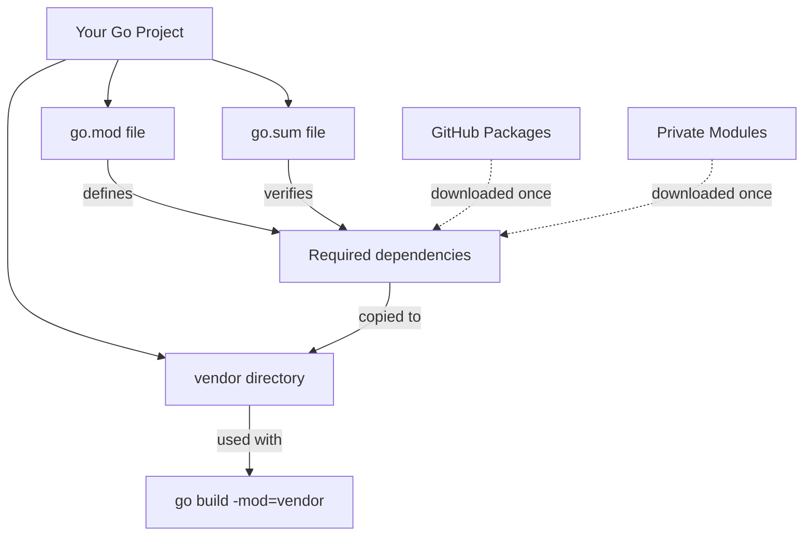

# Go Vendoring

## Introduction

When building software applications in Go, you'll likely depend on external packages and libraries. **Go vendoring** is a dependency management technique that allows you to include copies of your project's dependencies directly within your project's source tree. This approach ensures that your project always has access to the exact versions of dependencies it needs, even if the original sources become unavailable or change unexpectedly.

In this guide, we'll explore:
- What vendoring is and why it's useful
- How vendoring works in Go
- How to vendor dependencies in your Go projects
- When to use vendoring versus other dependency approaches
- Best practices for managing vendored dependencies

## What is Vendoring?

Vendoring refers to the practice of copying all the dependencies your project needs into a special directory within your project, typically named `vendor`. This creates a self-contained project where all required code is available locally, reducing external dependencies.

### Benefits of Vendoring

- **Reproducible builds**: Ensures the same code is used for every build
- **Offline development**: Work without internet access once dependencies are vendored
- **Protection against disappearing packages**: Guards against dependencies being removed or changing unexpectedly
- **Explicit dependency management**: Makes dependencies visible in your source control
- **Easier deployment**: Simplifies deployment in restricted environments

## Vendoring in Go: Historical Context

Before diving into how vendoring works today, it's helpful to understand its evolution in Go:

1. **Pre-Go 1.5**: No official vendoring support; developers used various workarounds
2. **Go 1.5**: Experimental vendoring support via `GO15VENDOREXPERIMENT` flag
3. **Go 1.6**: Vendoring officially supported without a flag
4. **Go 1.11**: Introduction of Go Modules alongside vendoring
5. **Present**: Vendoring remains supported as an option within the Go Modules ecosystem

## Using Go Vendoring

### Prerequisites

To follow along with this guide, you'll need:
- Go 1.11 or later installed
- Basic familiarity with Go Modules
- A Go project initialized with modules (`go mod init`)

### Enabling Vendoring in a Go Modules Project

Vendoring works seamlessly with Go Modules. Here's how to vendor dependencies in a project:

1. Initialize your project with Go Modules (if not already done):

```bash
# Initialize a new module
go mod init github.com/yourusername/myproject
```

2. Download and add dependencies to your project as usual:

```bash
# Add some dependencies by importing them in your code
# Then run go mod tidy to update go.mod
go mod tidy
```

3. Create a vendor directory with all dependencies:

```bash
go mod vendor
```

This command creates a `vendor` directory containing all your direct and indirect dependencies. It copies the necessary files from your module cache to the vendor directory.

4. Verify it worked by checking the structure of your project:

```
myproject/
├── go.mod
├── go.sum
├── main.go
└── vendor/
    ├── modules.txt
    └── github.com/
        └── ...
```

The `vendor/modules.txt` file lists all the vendored modules and their versions.

### Using Vendored Dependencies

To build or run your project using the vendored dependencies, use the `-mod=vendor` flag:

```bash
go build -mod=vendor
go run -mod=vendor main.go
```

Alternatively, you can set an environment variable to always use the vendor directory:

```bash
export GOFLAGS="-mod=vendor"
go build
```

### Example: Creating a Project with Vendored Dependencies

Let's walk through a complete example of creating a small program that uses vendoring:

1. First, create a new project directory and initialize it:

```bash
mkdir weather-app
cd weather-app
go mod init github.com/example/weather-app
```

2. Create a `main.go` file that uses an external package:

```go
package main

import (
    "fmt"
    "log"

    "github.com/fatih/color"
)

func main() {
    // Use the color package to print colored output
    color.Blue("Weather Forecast Application")
    
    // Simulate getting weather data
    temp := 22.5
    condition := "Sunny"
    
    color.Yellow("Current temperature: %.1f°C", temp)
    color.Green("Conditions: %s", condition)
}
```

3. Download the dependencies:

```bash
go mod tidy
```

4. Vendor the dependencies:

```bash
go mod vendor
```

5. Build using the vendored dependencies:

```bash
go build -mod=vendor
```

6. Run the application:

```bash
./weather-app
```

The output will be colored text showing the weather information, and all dependencies are now contained within your project.

## When to Use Vendoring

Vendoring is particularly useful in certain scenarios:

- **Corporate environments** with restricted internet access
- **CI/CD pipelines** where you want guaranteed reproducible builds
- **Production deployments** where you want to ensure all code is available locally
- **Long-term projects** where you want protection against upstream changes

### Vendoring vs. Go Modules

While Go Modules and vendoring can work together, they serve different purposes:

| Go Modules | Vendoring |
|------------|-----------|
| Records dependencies in go.mod | Copies dependency code into the project |
| Uses a central module cache | Uses local vendor directory |
| Requires internet access to download initially | Works completely offline once vendored |
| Default approach since Go 1.11 | Optional addition to Go Modules |

In most cases, using Go Modules without vendoring is sufficient, but vendoring provides additional isolation and reproducibility guarantees.

## Vendoring Best Practices

### Commit the vendor Directory?

Whether to commit the `vendor` directory to version control is a common question:

**Pros of committing vendor:**
- Complete reproducibility without running additional commands
- Full offline development capability
- Protection against upstream package deletion
- Easier auditing of all code in the project

**Cons of committing vendor:**
- Increases repository size significantly
- Can lead to large, noisy diffs when updating dependencies
- Potential for merge conflicts in the vendor directory

#### Recommendation:

- For small to medium projects: Commit the vendor directory
- For larger projects: Consider not committing it but ensure your CI pipeline runs `go mod vendor` before building
- For deployments: Always vendor dependencies for reproducibility

### Updating Vendored Dependencies

To update vendored dependencies:

1. Update your dependencies as normal:

```bash
# Update all dependencies
go get -u ./...

# Or update a specific dependency
go get -u github.com/some/dependency
```

2. Clean up the go.mod file:

```bash
go mod tidy
```

3. Re-vendor dependencies:

```bash
go mod vendor
```

### Managing Vendor Directory Size

The vendor directory can become quite large. Here are some tips to manage it:

- Use `.gitignore` to exclude test files in vendor directory if you commit it
- Consider tools like `go mod vendor -v` to see what's being vendored
- Regularly clean up unused dependencies with `go mod tidy`

## Common Vendoring Problems and Solutions

### Problem: Build Ignores Vendor Directory

**Solution**: Ensure you're using the `-mod=vendor` flag when building:

```bash
go build -mod=vendor
```

### Problem: Conflicts Between Vendored and Module Dependencies

**Solution**: Be consistent in your approach. Either:
- Always use `-mod=vendor` when building
- Set `GOFLAGS="-mod=vendor"` in your environment

### Problem: Large Repository Size

**Solution**: Consider:
- Not committing the vendor directory (use `.gitignore`)
- Using Git LFS for the vendor directory
- Using a more selective vendoring approach (though this is manual)

## Diagrams: Understanding Go Vendoring

Here's a diagram showing how vendoring fits into Go's dependency management:



## Practical Exercise: Adding Vendoring to Your Project

Now that you understand the basics of Go vendoring, here's a practical exercise to try:

1. Create a new Go application that uses at least two external libraries
2. Initialize Go Modules and add your dependencies
3. Vendor the dependencies
4. Build and run your application using the vendored dependencies
5. Try disconnecting from the internet and repeating step 4 to verify it works offline
6. Update one of your dependencies and re-vendor

## Summary

Go vendoring is a powerful technique for making your Go projects more self-contained and reproducible. By copying dependencies directly into your project's vendor directory, you ensure that you always have access to the exact code your application depends on.

While Go Modules provide a modern, convenient approach to dependency management, vendoring adds an extra layer of isolation and reproducibility that is particularly valuable in certain environments and for long-term projects.

Key takeaways:
- Vendoring copies dependencies into your project's vendor directory
- It works seamlessly with Go Modules via `go mod vendor`
- Use `-mod=vendor` to build with vendored dependencies
- Consider your project's needs when deciding whether to commit the vendor directory
- Regularly update and re-vendor dependencies to stay current

## Additional Resources

- [Go Modules Reference](https://golang.org/ref/mod)
- [Go Wiki: Modules](https://github.com/golang/go/wiki/Modules)
- [Go Blog: Using Go Modules](https://blog.golang.org/using-go-modules)
- [Go Package Documentation](https://pkg.go.dev)

## Further Reading

For more advanced dependency management in Go, consider exploring:
- Versioning strategies for your own modules
- Working with private modules
- Using replace directives in go.mod
- Dependency auditing and security scanning tools