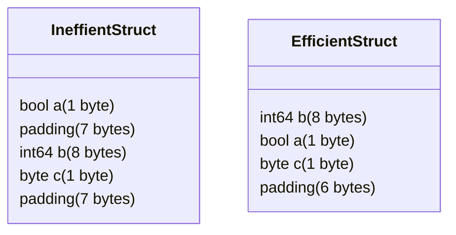

# Go Unsafe Package

## Introduction

Go is designed to be a memory-safe language, providing protection against common programming errors like buffer overflows, dangling pointers, and memory leaks. However, there are situations where developers need to step outside these safety guardrails to achieve specific performance optimizations or interact with code written in other languages.

The `unsafe` package in Go provides this escape hatch, allowing programmers to bypass Go's type system and directly manipulate memory. As its name suggests, using this package can lead to unsafe code that might crash or behave unpredictably if not used with extreme care.

This tutorial explores Go's `unsafe` package, its capabilities, use cases, and the potential risks associated with using it.

## Why Does Go Include an "Unsafe" Package?

Before diving into the details, it's important to understand why Go includes an `unsafe` package:

1. **Systems Programming**: For low-level systems programming where direct memory access is necessary
2. **Performance Optimization**: For specific scenarios where bypassing the type system can provide significant performance benefits
3. **C Interoperability**: To facilitate communication with C libraries and operating system APIs
4. **Special Requirements**: For implementing certain algorithms that require direct memory manipulation

## The Unsafe Package Components

The `unsafe` package is quite small but powerful. It consists of:

- The `Pointer` type
- Three functions: `Sizeof`, `Alignof`, and `Offsetof`

Let's look at each component in detail.

### Unsafe.Pointer Type

`unsafe.Pointer` is the core type in the `unsafe` package. It represents a pointer to an arbitrary memory location and can be converted to or from any pointer type.

```go
import "unsafe"

func main() {
    var i int = 42
    
    // Convert a normal pointer to unsafe.Pointer
    ptr := unsafe.Pointer(&i)
    
    // Convert unsafe.Pointer back to a typed pointer
    intPtr := (*int)(ptr)
    
    fmt.Println(*intPtr) // Output: 42
}
```

Think of `unsafe.Pointer` as Go's equivalent to C's `void*` - a type-agnostic pointer that can point to any type of data.

### Unsafe.Sizeof Function

`unsafe.Sizeof` returns the size in bytes of the representation of its argument:

```go
import (
    "fmt"
    "unsafe"
)

func main() {
    var (
        a bool
        b int8
        c int
        d float64
        e string
        f [5]int
        g struct {
            x int
            y float64
        }
    )
    
    fmt.Println("bool size:    ", unsafe.Sizeof(a)) // Output: 1
    fmt.Println("int8 size:    ", unsafe.Sizeof(b)) // Output: 1
    fmt.Println("int size:     ", unsafe.Sizeof(c)) // Output: 8 (on 64-bit systems)
    fmt.Println("float64 size: ", unsafe.Sizeof(d)) // Output: 8
    fmt.Println("string size:  ", unsafe.Sizeof(e)) // Output: 16 (on 64-bit systems)
    fmt.Println("array size:   ", unsafe.Sizeof(f)) // Output: 40 (5 ints * 8 bytes)
    fmt.Println("struct size:  ", unsafe.Sizeof(g)) // Output: 16 (8 for int + 8 for float64)
}
```

### Unsafe.Alignof Function

`unsafe.Alignof` returns the alignment of its argument, which is the minimum alignment required by the value:

```go
import (
    "fmt"
    "unsafe"
)

func main() {
    var (
        a bool
        b int8
        c int
        d float64
    )
    
    fmt.Println("bool align:    ", unsafe.Alignof(a)) // Output: 1
    fmt.Println("int8 align:    ", unsafe.Alignof(b)) // Output: 1
    fmt.Println("int align:     ", unsafe.Alignof(c)) // Output: 8 (on 64-bit systems)
    fmt.Println("float64 align: ", unsafe.Alignof(d)) // Output: 8
}
```

Alignment requirements can cause "padding" in structures, which is important to understand when optimizing memory usage.

### Unsafe.Offsetof Function

`unsafe.Offsetof` returns the offset of a field within a struct:

```go
import (
    "fmt"
    "unsafe"
)

func main() {
    type MyStruct struct {
        a bool
        b int64
        c int32
    }
    
    x := MyStruct{}
    
    fmt.Println("Offset of a:", unsafe.Offsetof(x.a)) // Output: 0
    fmt.Println("Offset of b:", unsafe.Offsetof(x.b)) // Output: 8 (with padding)
    fmt.Println("Offset of c:", unsafe.Offsetof(x.c)) // Output: 16
}
```

This function is useful for understanding memory layout and for implementing certain low-level data structure manipulations.

## Common Use Cases for Unsafe

### 1. Type Conversions Without Memory Allocation

One common use of `unsafe` is to convert between types without allocating new memory:

```go
import (
    "fmt"
    "unsafe"
)

func main() {
    // Convert a string to a byte slice without copying
    s := "Hello, unsafe world!"
    
    // This is the conventional way (creates a copy)
    bytesCopy := []byte(s)
    
    // This uses unsafe to avoid copying
    bytesUnsafe := unsafe.Slice((*byte)(unsafe.Pointer(unsafe.StringData(s))), len(s))
    
    fmt.Println(bytesCopy)    // Output: [72 101 108 108 111 44 32 117 110 115 97 102 101 32 119 111 114 108 100 33]
    fmt.Println(bytesUnsafe)  // Same output but without allocation
    
    // IMPORTANT: bytesUnsafe shares memory with s
    // Modifying bytesUnsafe would modify the string, which is normally immutable in Go
    // This could lead to unexpected behavior in other parts of your program
}
```

### 2. Memory Layout and Padding Analysis

The `unsafe` package can help understand memory layout:

```go
import (
    "fmt"
    "unsafe"
)

func main() {
    // Inefficient struct layout
    type Inefficient struct {
        a bool     // 1 byte
        // 7 bytes of padding here
        b int64    // 8 bytes
        c byte     // 1 byte
        // 7 bytes of padding here
    }
    
    // More efficient layout
    type Efficient struct {
        b int64    // 8 bytes
        a bool     // 1 byte
        c byte     // 1 byte
        // 6 bytes of padding at the end
    }
    
    fmt.Println("Inefficient size:", unsafe.Sizeof(Inefficient{})) // Output: 24
    fmt.Println("Efficient size:  ", unsafe.Sizeof(Efficient{}))   // Output: 16
}
```

### 3. Interacting with C Libraries

The `unsafe` package is crucial when working with cgo to call C libraries:

```go
// #include <stdlib.h>
import "C"
import (
    "fmt"
    "unsafe"
)

func main() {
    // Allocate memory in C land
    cptr := C.malloc(C.size_t(8))
    if cptr == nil {
        panic("malloc failed")
    }
    
    // Don't forget to free the memory when done
    defer C.free(cptr)
    
    // Convert to Go pointer
    ptr := unsafe.Pointer(cptr)
    
    // Use the memory as an int64 array
    intPtr := (*int64)(ptr)
    *intPtr = 42
    
    fmt.Println("Value stored in C memory:", *intPtr) // Output: 42
}
```

### 4. Custom Memory Management

For advanced scenarios requiring custom memory management:

```go
import (
    "fmt"
    "unsafe"
)

func main() {
    // Create a slice with capacity for 10 ints
    buf := make([]int, 10)
    
    // Store some values
    for i := range buf {
        buf[i] = i * 10
    }
    
    // Get pointer to the first element
    firstPtr := unsafe.Pointer(&buf[0])
    
    // Access elements directly through pointer arithmetic
    // (which is normally not allowed in Go)
    for i := 0; i < len(buf); i++ {
        // Calculate pointer to element i
        elemPtr := unsafe.Add(firstPtr, uintptr(i)*unsafe.Sizeof(buf[0]))
        
        // Dereference pointer to get value
        value := *(*int)(elemPtr)
        fmt.Printf("Element %d: %d
", i, value)
    }
    
    // Output:
    // Element 0: 0
    // Element 1: 10
    // Element 2: 20
    // ...and so on
}
```

## Dangers and Risks

Using the `unsafe` package comes with significant risks:

1. **Memory Corruption**: Improperly using `unsafe` can lead to writing to incorrect memory locations
2. **Program Crashes**: Dereferencing invalid pointers can cause program crashes
3. **Undefined Behavior**: The Go language specification doesn't define the behavior of improper `unsafe` usage
4. **Portability Issues**: Code using `unsafe` may behave differently across architectures or Go versions
5. **Maintainability Problems**: `unsafe` code is harder to understand and maintain

### Example of Dangerous Code

Here's an example of code that can lead to memory corruption:

```go
import (
    "fmt"
    "unsafe"
)

func main() {
    // Create a slice with 5 elements
    s := []int{1, 2, 3, 4, 5}
    
    // Get pointer to the first element
    ptr := unsafe.Pointer(&s[0])
    
    // DANGEROUS: Access beyond the bounds of the slice
    // This might work but it's accessing memory we don't own
    for i := 0; i < 10; i++ {
        elemPtr := unsafe.Add(ptr, uintptr(i)*unsafe.Sizeof(int(0)))
        fmt.Printf("Value at position %d: %d
", i, *(*int)(elemPtr))
        
        // Modifying this memory is even more dangerous
        *(*int)(elemPtr) = 42
    }
    
    // The behavior of this code is undefined
    // It might work on some systems, crash on others,
    // or silently corrupt memory
}
```

## Best Practices When Using Unsafe

If you must use the `unsafe` package, follow these guidelines:

1. **Isolate Unsafe Code**: Keep `unsafe` code isolated in separate packages
2. **Write Extensive Tests**: Test `unsafe` code thoroughly, including edge cases
3. **Document Everything**: Clearly document why `unsafe` is necessary and how it's being used
4. **Consider Alternatives**: Always check if there's a safe alternative before using `unsafe`
5. **Review Memory Lifecycle**: Be extremely careful about memory lifetimes and garbage collection
6. **Validate Assumptions**: Add runtime checks for assumptions about memory layout when possible

### Example of Properly Isolated Unsafe Code

```go
// Package fastconv provides fast conversions between types.
package fastconv

import (
    "reflect"
    "unsafe"
)

// StringToBytes converts a string to a byte slice without copying.
// The returned slice must not be modified, as this will modify the original string.
func StringToBytes(s string) []byte {
    return unsafe.Slice((*byte)(unsafe.Pointer(unsafe.StringData(s))), len(s))
}

// BytesToString converts a byte slice to a string without copying.
// Any modifications to the original slice after this call may affect the returned string.
func BytesToString(b []byte) string {
    return unsafe.String(unsafe.SliceData(b), len(b))
}
```

Then in your application code:

```go
import (
    "fmt"
    "yourpackage/fastconv"
)

func main() {
    s := "Hello, world!"
    
    // Use the unsafe operations through a clean API
    bytes := fastconv.StringToBytes(s)
    
    fmt.Println(bytes) // Output: [72 101 108 108 111 44 32 119 111 114 108 100 33]
    
    // IMPORTANT: Don't modify bytes here!
}
```

## Real-World Applications

Despite its risks, the `unsafe` package is used in several legitimate scenarios:

### 1. High-Performance JSON Parsing

Libraries like `jsoniter` and `easyjson` use `unsafe` for faster JSON parsing:

```go
import (
    "fmt"
    "github.com/json-iterator/go"
)

func main() {
    var json = jsoniter.ConfigFastest
    
    data := []byte(`{"Name":"John","Age":30}`)
    
    type Person struct {
        Name string
        Age  int
    }
    
    var p Person
    json.Unmarshal(data, &p)
    
    fmt.Printf("%+v
", p) // Output: {Name:John Age:30}
}
```

Under the hood, these libraries use `unsafe` to avoid reflection overhead and memory allocations.

### 2. Memory Pooling in High-Performance Servers

Some high-performance servers use custom memory pools to reduce GC pressure:

```go
import (
    "fmt"
    "sync"
    "unsafe"
)

// A simple byte pool that reuses memory
type BytePool struct {
    pool sync.Pool
    size int
}

func NewBytePool(size int) *BytePool {
    return &BytePool{
        pool: sync.Pool{
            New: func() interface{} {
                b := make([]byte, size)
                return &b
            },
        },
        size: size,
    }
}

func (p *BytePool) Get() []byte {
    return *p.pool.Get().(*[]byte)
}

func (p *BytePool) Put(b []byte) {
    // Using unsafe to verify the slice capacity is as expected
    if cap(b) >= p.size {
        bp := unsafe.Pointer(unsafe.SliceData(b))
        // Reset the slice to ensure previous data isn't leaked
        b = unsafe.Slice((*byte)(bp), p.size)
        p.pool.Put(&b)
    }
    // If capacity is wrong, let the GC handle it
}

func main() {
    pool := NewBytePool(1024)
    
    // Get a buffer from the pool
    buf := pool.Get()
    fmt.Println("Got buffer of size:", len(buf))
    
    // Use the buffer...
    
    // Return it to the pool
    pool.Put(buf)
}
```

### 3. System Programming

For system programming tasks that interface with the OS:

```go
import (
    "fmt"
    "syscall"
    "unsafe"
)

func main() {
    // Example: Getting system info on Linux
    var info syscall.Sysinfo_t
    
    if err := syscall.Sysinfo(&info); err != nil {
        panic(err)
    }
    
    // Convert load averages from fixed-point to floating-point
    loadScale := 1 << 16
    load1 := float64(info.Loads[0]) / float64(loadScale)
    load5 := float64(info.Loads[1]) / float64(loadScale)
    load15 := float64(info.Loads[2]) / float64(loadScale)
    
    fmt.Printf("Load averages: %.2f, %.2f, %.2f
", load1, load5, load15)
    fmt.Printf("Total RAM: %d MB
", info.Totalram/1024/1024)
    fmt.Printf("Free RAM: %d MB
", info.Freeram/1024/1024)
}
```

## Visualizing Memory Layout

Let's use a diagram to visualize how struct memory layout works with padding:



This diagram shows how reordering struct fields can save memory by reducing padding.

## Summary

The `unsafe` package provides Go programmers with powerful tools to bypass type safety for specific use cases. While it can offer significant performance benefits and enable certain systems programming tasks, it comes with substantial risks.

Key takeaways:

1. Use `unsafe` only when absolutely necessary and when you fully understand the risks
2. Isolate `unsafe` code in well-tested packages with clear documentation
3. Consider the implications for portability, maintenance, and program correctness
4. Be mindful of garbage collection and memory lifetimes
5. Always validate assumptions and consider safer alternatives

Remember, with great power comes great responsibility. The `unsafe` package exists for good reasons, but using it unnecessarily or improperly can lead to hard-to-debug issues.

## Further Resources

To deepen your understanding of Go's unsafe package:

1. [Go documentation for unsafe package](https://pkg.go.dev/unsafe)
2. [Go Blog: The Laws of Reflection](https://blog.golang.org/laws-of-reflection)
3. [Go 101: Unsafe Pointer](https://go101.org/article/unsafe.html)
4. [The Art of Memory Layout in Go](https://www.youtube.com/watch?v=jgVhBThJdXc) (Conference talk)

## Exercises

1. Write a program that uses `unsafe.Sizeof`, `unsafe.Alignof`, and `unsafe.Offsetof` to analyze the memory layout of various struct configurations.

2. Implement a string to byte slice conversion function similar to the example in this tutorial, and benchmark it against the standard library's approach.

3. Create a simple memory pool for a specific type (e.g., a struct you define) using `unsafe` and compare its performance to standard allocation.

4. Investigate how changing the order of fields in a struct affects its memory usage and padding.

5. Write a program that demonstrates a memory safety issue when using `unsafe` improperly, then fix the issue while still using `unsafe`.