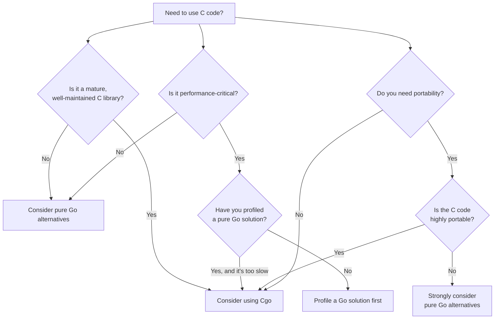

# Go Cgo: Integrating C with Go

## Introduction

Welcome to our exploration of Cgo, a powerful feature in the Go programming language that allows you to call C code from your Go programs. As you advance in your Go programming journey, you'll occasionally encounter situations where you need to leverage existing C libraries or optimize performance-critical sections of your code. This is where Cgo comes in.

Cgo serves as a bridge between Go and C, enabling seamless interoperability between these two languages. By the end of this tutorial, you'll understand how to:

- Use the Cgo toolchain to call C functions from Go
- Pass data between Go and C code
- Work with C libraries and header files
- Handle memory management when working across language boundaries
- Apply Cgo in real-world scenarios

Let's dive into the world of language interoperability!

## What is Cgo?

Cgo is a feature of the Go programming language that provides a foreign function interface (FFI) for calling C code from Go and vice versa. The name "Cgo" comes from "C" and "Go" combined, indicating its purpose of bridging these two languages.

Here's why Cgo is important:

1. **Reuse existing C libraries**: Leverage the vast ecosystem of C libraries without rewriting them in Go
2. **Performance optimization**: Implement performance-critical parts in C when necessary
3. **System integration**: Interface with system APIs that may only be available through C interfaces
4. **Gradual migration**: Incrementally port C codebases to Go

However, using Cgo comes with trade-offs:

1. **Complexity**: Introduces additional complexity to your Go code
2. **Performance overhead**: There's a small overhead for cross-language calls
3. **Platform dependency**: May reduce the portability of your Go code
4. **Safety concerns**: C doesn't have the same memory safety guarantees as Go

## Getting Started with Cgo

Let's start with a simple example to understand the basic syntax and workflow of Cgo.

### A Simple "Hello, Cgo!" Example

Create a file named `hello_cgo.go` with the following content:

```go
package main

/*
#include <stdio.h>
#include <stdlib.h>

void printMessage(const char* message) {
    printf("%s
", message);
}
*/
import "C"
import "fmt"

func main() {
    // Convert Go string to C string
    message := C.CString("Hello from Cgo!")
    // Free the C string when we're done
    defer C.free(unsafe.Pointer(message))
    
    // Call the C function
    C.printMessage(message)
    
    fmt.Println("Back in Go!")
}
```

To run this code, you'll need to import the `unsafe` package. Update the imports:

```go
import (
    "fmt"
    "unsafe"
)
```

When you run this program with `go run hello_cgo.go`, you should see:

```
Hello from Cgo!
Back in Go!
```

Let's break down what's happening:

1. We define C code within a special comment block before the `import "C"` statement
2. The `import "C"` statement must appear directly after the C code block (no blank lines in between)
3. We use `C.CString()` to convert a Go string to a C string
4. We call the C function `printMessage` with `C.printMessage()`
5. We use `C.free()` with `unsafe.Pointer()` to properly free the memory allocated for the C string

## Basic Cgo Concepts

### The C Pseudo-Package

When you import the special `"C"` package in Go after a comment block containing C code, the Go compiler treats it as a pseudo-package that provides access to C functions, types, and variables declared in the comment block.

The C code can include standard C library functions, custom functions, and can even include external header files using the `#include` directive.

### Converting Between Go and C Types

One of the most common operations when using Cgo is converting between Go and C data types. Here's a handy reference for common conversions:

| Go Type | C Type | Go to C | C to Go |
|---------|--------|---------|---------|
| string | char* | C.CString(goString) | C.GoString(cString) |
| []byte | char* | C.CBytes(goBytes) | C.GoBytes(cBytes, length) |
| int | int | C.int(goInt) | int(cInt) |
| float64 | double | C.double(goFloat) | float64(cDouble) |
| bool | int | C.int(boolToInt(goBool)) | cInt != 0 |

Remember that when you convert from Go to C using functions like `C.CString()`, you're allocating memory that Go's garbage collector doesn't manage. You must manually free this memory using `C.free()` to avoid memory leaks.

### Example: Type Conversions

Here's an example demonstrating various type conversions between Go and C:

```go
package main

/*
#include <stdio.h>
#include <stdlib.h>

void processValues(int number, double decimal, const char* text) {
    printf("C received: number=%d, decimal=%.2f, text=%s
", 
           number, decimal, text);
}
*/
import "C"
import (
    "fmt"
    "unsafe"
)

func main() {
    // Go values
    goNumber := 42
    goDecimal := 3.14159
    goText := "Hello from Go!"
    
    // Convert Go values to C values
    cNumber := C.int(goNumber)
    cDecimal := C.double(goDecimal)
    cText := C.CString(goText)
    defer C.free(unsafe.Pointer(cText))
    
    // Call C function with converted values
    C.processValues(cNumber, cDecimal, cText)
    
    // Convert C values back to Go
    backToGoNumber := int(cNumber)
    backToGoDecimal := float64(cDecimal)
    backToGoText := C.GoString(cText)
    
    fmt.Println("Back in Go with values:")
    fmt.Printf("number=%d, decimal=%.5f, text=%s
", 
              backToGoNumber, backToGoDecimal, backToGoText)
}
```

Output:
```
C received: number=42, decimal=3.14, text=Hello from Go!
Back in Go with values:
number=42, decimal=3.14159, text=Hello from Go!
```

## Working with C Structs

When working with C libraries, you'll often need to interact with C structs. Cgo allows you to define and use C structs in your Go code.

### Example: Using C Structs

```go
package main

/*
#include <stdio.h>

typedef struct {
    int id;
    char name[50];
    double score;
} Student;

void printStudent(Student s) {
    printf("Student ID: %d
", s.id);
    printf("Name: %s
", s.name);
    printf("Score: %.2f
", s.score);
}
*/
import "C"
import (
    "fmt"
    "unsafe"
)

func main() {
    // Create a C struct
    var student C.Student
    
    // Set values in the struct
    student.id = C.int(101)
    student.score = C.double(92.5)
    
    // For strings in fixed-size arrays, we need to copy carefully
    name := "Alice Smith"
    nameBytes := []byte(name)
    
    // Ensure we don't overflow the buffer (C arrays have fixed size)
    maxLen := len(student.name) - 1 // -1 for null terminator
    copyLen := len(nameBytes)
    if copyLen > maxLen {
        copyLen = maxLen
    }
    
    // Copy bytes into the C struct's name field
    for i := 0; i < copyLen; i++ {
        student.name[i] = C.char(nameBytes[i])
    }
    student.name[copyLen] = 0 // Null terminator
    
    // Call C function with the struct
    C.printStudent(student)
    
    // Access struct fields in Go
    fmt.Println("
Accessing from Go:")
    fmt.Printf("Student ID: %d
", int(student.id))
    fmt.Printf("Score: %.2f
", float64(student.score))
    
    // For the name, we need to convert it back to a Go string
    fmt.Printf("Name: %s
", C.GoString(&student.name[0]))
}
```

Output:
```
Student ID: 101
Name: Alice Smith
Score: 92.50

Accessing from Go:
Student ID: 101
Score: 92.50
Name: Alice Smith
```

## Using C Libraries in Go

One of the primary use cases for Cgo is to leverage existing C libraries in your Go applications. Let's see how to use a simple C library.

### Example: Using the Standard C Math Library

```go
package main

/*
#include <math.h>
*/
import "C"
import "fmt"

func main() {
    // Using C's math functions
    x := 2.0
    
    // Convert Go float64 to C double, call C function, convert result back to Go float64
    squareRoot := float64(C.sqrt(C.double(x)))
    sine := float64(C.sin(C.double(x)))
    logarithm := float64(C.log(C.double(x)))
    
    fmt.Printf("Square root of %.1f: %.4f
", x, squareRoot)
    fmt.Printf("Sine of %.1f: %.4f
", x, sine)
    fmt.Printf("Natural logarithm of %.1f: %.4f
", x, logarithm)
}
```

Output:
```
Square root of 2.0: 1.4142
Sine of 2.0: 0.9093
Natural logarithm of 2.0: 0.6931
```

### Using External C Libraries

To use an external C library, you need to:

1. Install the library and development headers on your system
2. Tell the compiler where to find the library's headers and binaries
3. Link against the library

Let's see an example using the SQLite library, a popular embedded database:

```go
package main

/*
#cgo CFLAGS: -I/usr/include
#cgo LDFLAGS: -lsqlite3

#include <sqlite3.h>
#include <stdlib.h>
#include <stdio.h>

// Helper function to create a database
static int create_example_db(const char* dbpath) {
    sqlite3 *db;
    char *err_msg = 0;
    int rc;
    
    rc = sqlite3_open(dbpath, &db);
    
    if (rc != SQLITE_OK) {
        fprintf(stderr, "Cannot open database: %s
", sqlite3_errmsg(db));
        sqlite3_close(db);
        return 1;
    }
    
    const char *sql = "DROP TABLE IF EXISTS Users;"
                      "CREATE TABLE Users(Id INT, Name TEXT, Email TEXT);"
                      "INSERT INTO Users VALUES(1, 'Alice', 'alice@example.com');"
                      "INSERT INTO Users VALUES(2, 'Bob', 'bob@example.com');";
    
    rc = sqlite3_exec(db, sql, 0, 0, &err_msg);
    
    if (rc != SQLITE_OK) {
        fprintf(stderr, "SQL error: %s
", err_msg);
        sqlite3_free(err_msg);
    }
    
    sqlite3_close(db);
    return rc;
}
*/
import "C"
import (
    "fmt"
    "unsafe"
)

func main() {
    // Path for our SQLite database
    dbpath := C.CString("./example.db")
    defer C.free(unsafe.Pointer(dbpath))
    
    // Create database with our C helper function
    rc := C.create_example_db(dbpath)
    if rc != C.SQLITE_OK {
        fmt.Println("Failed to create database")
        return
    }
    
    fmt.Println("Database created successfully with sample data!")
    fmt.Println("Try using the 'sqlite3' command line tool to verify:")
    fmt.Println("$ sqlite3 example.db 'SELECT * FROM Users;'")
}
```

To compile and run this example, you'll need the SQLite3 development package installed on your system:

- On Ubuntu/Debian: `sudo apt-get install libsqlite3-dev`
- On macOS with Homebrew: `brew install sqlite`

The `#cgo` directives tell the compiler how to find and link against the SQLite library:
- `CFLAGS` specifies include directories
- `LDFLAGS` specifies which libraries to link against

## Callbacks: Calling Go Functions from C

Sometimes you need to pass Go functions as callbacks to C code. This is a more advanced use case of Cgo, but it's essential for many integrations.

```go
package main

/*
#include <stdio.h>
#include <stdlib.h>

// Function type for the callback
typedef void (*callback_fn)(int);

// C function that calls the callback
void call_with_integers(callback_fn callback, int start, int end) {
    for (int i = start; i <= end; i++) {
        callback(i);
    }
}

// This is a forward declaration of the Go function we'll implement
// and export to C
extern void goCallbackHandler(int value);
*/
import "C"
import (
    "fmt"
    "runtime"
)

//export goCallbackHandler
func goCallbackHandler(value C.int) {
    fmt.Printf("Go callback received: %d
", int(value))
}

func main() {
    // Set maximum OS threads to ensure enough threads for callbacks
    runtime.LockOSThread()
    defer runtime.UnlockOSThread()
    
    fmt.Println("Calling C function with Go callback:")
    
    // Call the C function with our Go callback
    C.call_with_integers(
        (C.callback_fn)(C.goCallbackHandler),
        C.int(1),
        C.int(5),
    )
    
    fmt.Println("Done!")
}
```

Output:
```
Calling C function with Go callback:
Go callback received: 1
Go callback received: 2
Go callback received: 3
Go callback received: 4
Go callback received: 5
Done!
```

Key points about this example:

1. We use the `//export` comment to make the Go function accessible to C
2. We declare the Go function in the C comment block with `extern`
3. We cast the Go function to the appropriate C function pointer type
4. We use `runtime.LockOSThread()` to ensure thread safety during callbacks

## Best Practices and Pitfalls

### Memory Management

When using Cgo, you need to be careful about memory management, especially when allocating memory in one language that needs to be freed in another.

#### Rules to Follow:

1. **Always free C memory**: When you allocate memory with `C.CString()`, `C.CBytes()`, or `C.malloc()`, always free it with `C.free()`
2. **Use defer for cleanup**: Use `defer` to ensure memory is freed even if an error occurs
3. **Be aware of ownership**: Keep track of which language "owns" each piece of memory
4. **Don't pass pointers to Go objects to C**: Go's garbage collector may move objects in memory

### Example of Proper Memory Management

```go
package main

/*
#include <stdlib.h>
#include <string.h>

char* concatenate_strings(const char* str1, const char* str2) {
    size_t len1 = strlen(str1);
    size_t len2 = strlen(str2);
    
    // Allocate memory for the result (+1 for null terminator)
    char* result = (char*)malloc(len1 + len2 + 1);
    
    if (result) {
        strcpy(result, str1);
        strcat(result, str2);
    }
    
    return result;
}
*/
import "C"
import (
    "fmt"
    "unsafe"
)

func main() {
    // Allocate C strings
    str1 := C.CString("Hello, ")
    defer C.free(unsafe.Pointer(str1))
    
    str2 := C.CString("Cgo!")
    defer C.free(unsafe.Pointer(str2))
    
    // Call C function that returns allocated memory
    result := C.concatenate_strings(str1, str2)
    
    // IMPORTANT: We must free this C-allocated memory
    defer C.free(unsafe.Pointer(result))
    
    // Convert result to Go string
    goResult := C.GoString(result)
    
    fmt.Println(goResult)
}
```

Output:
```
Hello, Cgo!
```

### Performance Considerations

Cgo calls have overhead due to the transitions between Go and C runtimes. Here are some tips for optimizing Cgo performance:

1. **Batch operations**: Minimize the number of Go-to-C transitions by batching operations
2. **Pass data efficiently**: Pass larger chunks of data instead of making many small calls
3. **Profile your code**: Use profiling tools to identify bottlenecks
4. **Consider alternatives**: For simple operations, a pure Go implementation might be faster

<div class="alert alert--warning">
    <strong>Note:</strong> According to Go's documentation, a Cgo function call can be approximately 50-100x slower than
    a native Go function call due to the overhead of switching between Go and C contexts. Use Cgo judiciously.
</div>

## Real-World Example: Image Processing with libjpeg

Let's create a more substantial example using libjpeg, a popular C library for JPEG image compression/decompression.

```go
package main

/*
#cgo CFLAGS: -I/usr/include
#cgo LDFLAGS: -ljpeg

#include <stdio.h>
#include <stdlib.h>
#include <jpeglib.h>
#include <jerror.h>

// Function to get JPEG dimensions
int get_jpeg_dimensions(const char* filename, int* width, int* height) {
    struct jpeg_decompress_struct cinfo;
    struct jpeg_error_mgr jerr;
    FILE* infile;
    
    if ((infile = fopen(filename, "rb")) == NULL) {
        return 0;
    }
    
    cinfo.err = jpeg_std_error(&jerr);
    jpeg_create_decompress(&cinfo);
    jpeg_stdio_src(&cinfo, infile);
    jpeg_read_header(&cinfo, TRUE);
    
    *width = cinfo.image_width;
    *height = cinfo.image_height;
    
    jpeg_destroy_decompress(&cinfo);
    fclose(infile);
    return 1;
}
*/
import "C"
import (
    "fmt"
    "os"
    "unsafe"
)

func GetJPEGDimensions(filename string) (width, height int, err error) {
    cFilename := C.CString(filename)
    defer C.free(unsafe.Pointer(cFilename))
    
    var cWidth, cHeight C.int
    
    result := C.get_jpeg_dimensions(cFilename, &cWidth, &cHeight)
    if result == 0 {
        return 0, 0, fmt.Errorf("failed to open or process JPEG file: %s", filename)
    }
    
    return int(cWidth), int(cHeight), nil
}

func main() {
    // Check if we have a filename argument
    if len(os.Args) < 2 {
        fmt.Println("Usage: go run jpeginfo.go <jpeg-file>")
        return
    }
    
    filename := os.Args[1]
    
    width, height, err := GetJPEGDimensions(filename)
    if err != nil {
        fmt.Println("Error:", err)
        return
    }
    
    fmt.Printf("JPEG dimensions: %d x %d pixels
", width, height)
    fmt.Printf("Aspect ratio: %.2f
", float64(width)/float64(height))
}
```

To run this example, you'll need the libjpeg development package:
- On Ubuntu/Debian: `sudo apt-get install libjpeg-dev`
- On macOS with Homebrew: `brew install libjpeg`

Usage:
```
$ go run jpeginfo.go image.jpg
JPEG dimensions: 1920 x 1080 pixels
Aspect ratio: 1.78
```

This example demonstrates a practical application of Cgo:
1. We're using an established C library (libjpeg) to avoid reinventing the wheel
2. We've created a clean Go API that hides the Cgo details
3. We're properly managing memory with `defer C.free()`
4. We're handling errors appropriately in both languages

## When to Use Cgo (and When Not To)

Cgo is a powerful tool, but it comes with trade-offs. Here's when you might want to use it:

### Good Use Cases for Cgo:

1. **Accessing established C libraries**: When you need functionality from a mature C library
2. **System programming**: Interfacing with low-level system calls that aren't exposed in Go
3. **Performance-critical code**: When a specific algorithm has a highly optimized C implementation
4. **Gradual migration**: When porting a C codebase to Go incrementally

### When to Avoid Cgo:

1. **Simple algorithms**: If you can implement it in pure Go with comparable performance
2. **Cross-platform concerns**: Cgo reduces the portability of your Go code
3. **Small projects**: The complexity overhead may not be worth it for small projects
4. **When Go alternatives exist**: Many C libraries have pure Go alternatives



## Summary

In this tutorial, we've explored Cgo, Go's foreign function interface for integrating with C code. We've learned:

- How to call C functions from Go and pass data between languages
- How to work with C data types, including structs and pointers
- How to use external C libraries in Go applications
- How to implement callbacks from C to Go
- Best practices for memory management and performance optimization
- When to use Cgo and when to consider alternatives

Cgo is a powerful tool that extends Go's capabilities by allowing you to leverage the vast ecosystem of C libraries and performance-optimized C code. However, it comes with additional complexity and potential pitfalls, particularly around memory management and portability.

As you continue your Go journey, use Cgo judiciously, considering both its benefits and trade-offs for each use case.

## Additional Resources

Here are some resources to deepen your understanding of Cgo:

1. [Official Cgo Documentation](https://golang.org/cmd/cgo/)
2. [Go Wiki: cgo](https://github.com/golang/go/wiki/cgo)
3. [Cgo is not Go](https://dave.cheney.net/2016/01/18/cgo-is-not-go) - A blog post by Dave Cheney
4. [The Cost of Using Cgo](https://www.cockroachlabs.com/blog/the-cost-of-using-cgo/) - Performance analysis by Cockroach Labs
5. [Go Modules with Cgo Dependencies](https://golang.org/wiki/Modules#how-can-i-track-tool-dependencies-for-a-module)

## Exercises

To reinforce your learning, try these exercises:

1. Modify the "Hello, Cgo!" example to pass multiple strings to C and concatenate them before printing.
2. Create a Go wrapper for a simple C library of your choice (e.g., libcurl, libxml2).
3. Implement a performance comparison between a pure Go function and an equivalent C function called via Cgo.
4. Build a small utility that uses libjpeg (or another image library) to resize JPEG images.
5. Create a Go application that uses SQLite through Cgo to store and retrieve data.