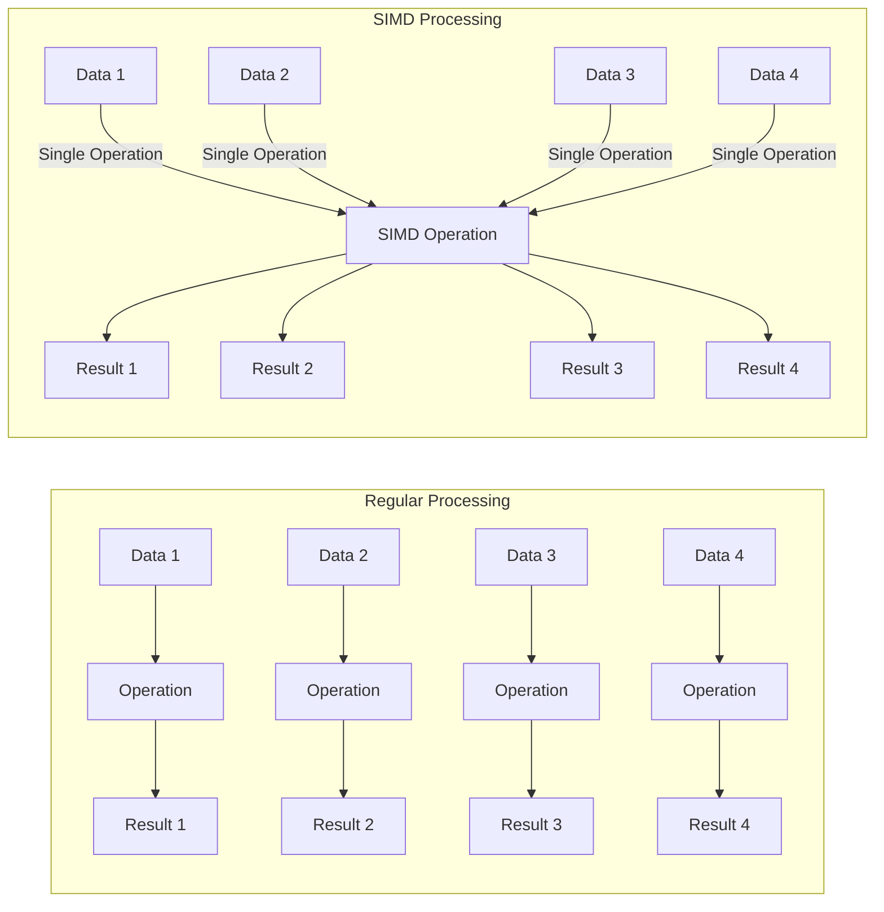

# Go Assembly

## Introduction

Go Assembly, often referred to as "Go's assembler" or simply "the assembler," is a unique feature of the Go programming language that allows developers to write low-level assembly code that integrates seamlessly with Go programs. Unlike traditional assembly languages that directly map to machine instructions, Go Assembly is a portable assembly language that works across different architectures supported by Go.

This guide will introduce you to the basics of Go Assembly, explain how it differs from traditional assembly languages, and show you practical examples of when and how to use it. While assembly programming is considered an advanced topic, we'll break it down step by step to make it accessible even if you're new to low-level programming.

## Why Learn Go Assembly?

Before diving into the details, let's understand why you might want to learn Go Assembly:

1. **Performance optimization**: For performance-critical code sections where Go's compiler optimizations aren't sufficient
2. **Hardware-specific features**: To access CPU instructions not exposed through Go's standard library
3. **Understanding Go internals**: To gain deeper insights into how Go works under the hood
4. **System programming**: For tasks requiring direct hardware interaction

## Go Assembly vs. Traditional Assembly

Go Assembly differs from traditional assembly languages in several important ways:

- It's not a direct representation of machine code but rather a portable abstraction
- It uses a syntax based on Plan 9's assembler (not Intel or AT&T syntax)
- It's integrated with Go's toolchain and calling conventions
- It's designed to work with Go's garbage collector and runtime

## Getting Started with Go Assembly

### How Go Assembly Files Work

Go Assembly code is typically placed in files with the `.s` extension. These files can be included in your Go project alongside regular `.go` files.

A basic structure for a Go project using assembly might look like:

```
myproject/
├── main.go
├── assembly_func.go  // Go declarations for assembly functions
└── assembly_func.s   // The actual assembly implementation
```

### Writing Your First Go Assembly Function

Let's create a simple assembly function that adds two integers. We'll need two files:

1. A Go file with the function declaration
2. An assembly file with the implementation

First, let's create the Go file (`add.go`):

```go
package main

// Add is implemented in assembly
func Add(a, b int) int
```

Note that there's no function body—just a declaration. This tells Go that the implementation will be provided elsewhere.

Next, let's create the assembly file (`add.s`):

```
// add.s
TEXT ·Add(SB), NOSPLIT, $0-24
    MOVQ a+0(FP), AX  // Load first argument into AX
    MOVQ b+8(FP), BX  // Load second argument into BX
    ADDQ BX, AX       // Add BX to AX
    MOVQ AX, ret+16(FP) // Store result
    RET
```

Let's break down this code:

- `TEXT ·Add(SB), NOSPLIT, $0-24`: Declares a function named `Add` in the current package.
  - `SB` refers to the "static base" register (a virtual register in Go Assembly)
  - `NOSPLIT` is a directive that tells the Go runtime not to insert stack-split checks
  - `$0-24` indicates 0 bytes of local stack space and 24 bytes of arguments and return values

- `MOVQ a+0(FP), AX`: Moves the first argument into the AX register.
  - `FP` is the frame pointer (another virtual register)
  - `a+0(FP)` refers to the first argument's location

- `MOVQ b+8(FP), BX`: Moves the second argument into the BX register.

- `ADDQ BX, AX`: Adds the value in BX to AX.

- `MOVQ AX, ret+16(FP)`: Moves the result from AX to the return value location.

- `RET`: Returns from the function.

### Using the Assembly Function

Now, you can use this function in a Go program:

```go
package main

import "fmt"

func main() {
    result := Add(5, 7)
    fmt.Printf("5 + 7 = %d
", result)
}
```

Output:
```
5 + 7 = 12
```

## Key Concepts in Go Assembly

### Virtual Registers

Go Assembly uses virtual registers that don't directly correspond to hardware registers:

- `FP`: Frame pointer, used to refer to function arguments
- `PC`: Program counter
- `SB`: Static base pointer, used for global symbols
- `SP`: Stack pointer

### Addressing Modes

Go Assembly supports various addressing modes:

- `name+offset(reg)`: Memory at address `reg+offset` with symbol `name`
- `$value`: Immediate value
- `symbol+offset(SB)`: Global variable or function

### Data Movement Instructions

Common instructions for moving data:

- `MOVQ src, dst`: Move a 64-bit value
- `MOVL src, dst`: Move a 32-bit value
- `MOVW src, dst`: Move a 16-bit value
- `MOVB src, dst`: Move an 8-bit value

### Arithmetic Instructions

Basic arithmetic operations:

- `ADDQ src, dst`: Add src to dst (64-bit)
- `SUBQ src, dst`: Subtract src from dst (64-bit)
- `IMULQ src, dst`: Multiply dst by src (64-bit)

## A More Complex Example: Finding the Maximum in a Slice

Let's implement a function that finds the maximum value in a slice of integers using Go Assembly.

First, the Go file (`max.go`):

```go
package main

// FindMax finds the maximum value in a slice of integers
//go:noescape
func FindMax(s []int) int
```

The assembly implementation (`max.s`):

```
// max.s
TEXT ·FindMax(SB), NOSPLIT, $0-32
    MOVQ s_base+0(FP), SI  // SI = &s[0]
    MOVQ s_len+8(FP), CX   // CX = len(s)
    CMPQ CX, $0            // Check if len is 0
    JEQ empty              // Jump if empty slice
    
    MOVQ (SI), AX          // AX = s[0] (initial max)
    DECQ CX                // CX--
    JEQ done               // If only one element, we're done
    
    ADDQ $8, SI            // Move to s[1]
    
loop:
    MOVQ (SI), DX          // DX = s[i]
    CMPQ DX, AX            // Compare with current max
    JLE not_greater        // If not greater, skip
    MOVQ DX, AX            // Update max value
    
not_greater:
    ADDQ $8, SI            // Move to next element
    DECQ CX                // Decrement counter
    JNE loop               // Continue if more elements
    JMP done

empty:
    MOVQ $0, AX            // Return 0 for empty slice

done:
    MOVQ AX, ret+24(FP)    // Store result
    RET
```

Here's how we can use it:

```go
package main

import "fmt"

func main() {
    numbers := []int{42, 7, 68, 23, 99, 31, 45}
    max := FindMax(numbers)
    fmt.Printf("Maximum value: %d
", max)
}
```

Output:
```
Maximum value: 99
```

## Performance Considerations

When deciding whether to use assembly in your Go code, consider:

1. **Profile first**: Only optimize what measurements prove is a bottleneck
2. **Benchmark**: Compare the assembly version with pure Go implementations
3. **Maintenance cost**: Assembly code is harder to maintain and debug
4. **Architecture dependence**: You might need different implementations for different architectures

### Benchmarking Example

Here's how to benchmark your assembly function against a pure Go implementation:

```go
package main

import (
    "testing"
)

// Pure Go implementation for comparison
func FindMaxGo(s []int) int {
    if len(s) == 0 {
        return 0
    }
    
    max := s[0]
    for i := 1; i < len(s); i++ {
        if s[i] > max {
            max = s[i]
        }
    }
    return max
}

func BenchmarkFindMaxAssembly(b *testing.B) {
    nums := make([]int, 1000)
    for i := range nums {
        nums[i] = i
    }
    
    b.ResetTimer()
    for i := 0; i < b.N; i++ {
        FindMax(nums)
    }
}

func BenchmarkFindMaxGo(b *testing.B) {
    nums := make([]int, 1000)
    for i := range nums {
        nums[i] = i
    }
    
    b.ResetTimer()
    for i := 0; i < b.N; i++ {
        FindMaxGo(nums)
    }
}
```

Run the benchmark with:

```
go test -bench=.
```

## Real-World Applications

### Cryptographic Operations

Assembly is often used in cryptographic libraries to implement operations that need to be both secure and fast:

```go
// Pseudocode for a cryptographic hash function
func SHA256Hash(data []byte) [32]byte
```

The implementation might use assembly to access specialized CPU instructions for encryption.

### SIMD Optimizations

Single Instruction Multiple Data (SIMD) operations allow processing multiple data elements in parallel:

