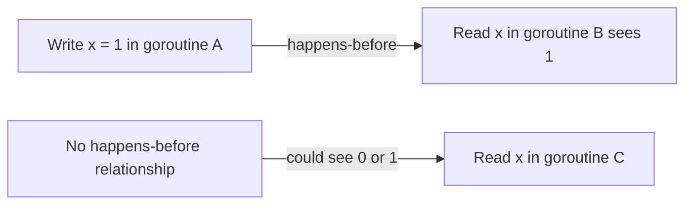

# Go Memory Model

## Introduction

The Go Memory Model defines the conditions under which reads of a variable in one goroutine can be guaranteed to observe values produced by writes to the same variable in a different goroutine. Understanding this model is crucial for writing correct concurrent programs in Go.

When multiple goroutines access shared variables concurrently, they must use proper synchronization mechanisms to avoid race conditions. The Go Memory Model provides the rules that govern how and when these shared variables can be accessed safely.

## Why the Memory Model Matters

Before diving into the specifics of Go's memory model, let's understand why it's important:

1. **Concurrency Safety**: Go was designed for concurrency. The memory model helps you write code that safely shares data between goroutines.
2. **Optimizations**: Understanding the memory model helps you reason about compiler and CPU optimizations that might reorder operations.
3. **Predictability**: It provides guarantees about when values written by one goroutine become visible to another.

## The Happens-Before Relationship

The core of Go's memory model is the "happens-before" relationship. This relationship is the fundamental concept that determines when memory operations become visible to other goroutines.

In simple terms:

- If event A happens before event B, then event B happens after event A
- If event A happens before event B, then the effects of A are visible to B

Let's see how this works with a diagram:



## Memory Model Rules in Go

The Go memory model provides specific rules for different synchronization mechanisms:

### 1. Initialization

Variables in Go are initialized before any goroutine starts. If a package `p` imports package `q`, the initialization functions for `q` complete before any of those of `p` start.

```go
var a = 1  // Initialized before any goroutine runs

func main() {
    // All goroutines can safely read 'a' without synchronization
    go func() {
        fmt.Println(a)  // Always prints 1
    }()
}
```

### 2. Channel Operations

Channels are Go's primary synchronization mechanism. The memory model defines several guarantees for channel operations:

- A send on a channel happens before the corresponding receive from that channel completes
- A receive from a closed channel happens after the close of the channel
- A receive from an unbuffered channel happens before the send on that channel completes

Let's see a practical example:

```go
package main

import (
	"fmt"
	"time"
)

func main() {
	done := make(chan bool)
	message := ""
	
	go func() {
		message = "hello, world"
		done <- true  // Send on channel
	}()
	
	<-done  // Receive from channel
	fmt.Println(message)  // Guaranteed to print "hello, world"
}
```

**Output:**
```
hello, world
```

In this example, the send on the `done` channel happens after `message` is updated. The receive from `done` happens before printing `message`. The happens-before relationship ensures that the main goroutine sees the updated value of `message`.

### 3. Mutex Operations

When using sync.Mutex or sync.RWMutex:

- For any `sync.Mutex` or `sync.RWMutex` variable `l` and n < m, the n-th call to `l.Unlock()` happens before the m-th call to `l.Lock()` returns

Here's an example:

```go
package main

import (
	"fmt"
	"sync"
)

func main() {
	var mu sync.Mutex
	var data int
	
	go func() {
		mu.Lock()
		data = 42
		mu.Unlock()
	}()
	
	// Some time later
	mu.Lock()
	fmt.Println("Data:", data)  // Guaranteed to see data = 42
	mu.Unlock()
}
```

### 4. Once Operations

The `sync.Once` type provides a mechanism to perform one-time initialization safely:

- A call to `once.Do(f)` happens before `f` returns
- The completion of `f` happens before any call to `once.Do(f)` returns

```go
package main

import (
	"fmt"
	"sync"
)

func main() {
	var once sync.Once
	var data string
	
	initData := func() {
		data = "initialized"
		fmt.Println("Initialization done")
	}
	
	for i := 0; i < 5; i++ {
		go func() {
			once.Do(initData)
			fmt.Println("Data:", data)  // Always sees "initialized"
		}()
	}
	
	// Sleep to allow goroutines to complete (for demonstration only)
	// In real code, use proper synchronization
	time.Sleep(time.Second)
}
```

**Output:**
```
Initialization done
Data: initialized
Data: initialized
Data: initialized
Data: initialized
Data: initialized
```

The initialization function runs exactly once, but all goroutines can safely access the initialized data.

### 5. Atomic Operations

The `sync/atomic` package provides low-level atomic memory operations:

```go
package main

import (
	"fmt"
	"sync/atomic"
)

func main() {
	var counter int64
	
	// Atomically increment counter
	go func() {
		for i := 0; i < 1000; i++ {
			atomic.AddInt64(&counter, 1)
		}
	}()
	
	// Atomically read counter
	go func() {
		for i := 0; i < 5; i++ {
			time.Sleep(100 * time.Millisecond)
			value := atomic.LoadInt64(&counter)
			fmt.Println("Counter:", value)
		}
	}()
	
	time.Sleep(time.Second)
	fmt.Println("Final counter:", atomic.LoadInt64(&counter))
}
```

## Common Memory Model Pitfalls

### 1. The Illusion of Atomicity

Operations that appear atomic in single-threaded code might not be atomic in concurrent execution:

```go
package main

import (
	"fmt"
	"sync"
)

func main() {
	counter := 0
	var wg sync.WaitGroup
	
	for i := 0; i < 1000; i++ {
		wg.Add(1)
		go func() {
			counter++  // NOT atomic!
			wg.Done()
		}()
	}
	
	wg.Wait()
	fmt.Println("Counter:", counter)  // Likely less than 1000
}
```

**Output (may vary):**
```
Counter: 973
```

The counter increment isn't atomic, so some updates may be lost due to race conditions.

### 2. False Sharing

False sharing occurs when different goroutines update variables that share the same cache line, causing performance degradation:

```go
type Counters struct {
	a int64  // might be in the same cache line as b
	b int64
}

func increment(c *Counters, wg *sync.WaitGroup) {
	for i := 0; i < 1000000; i++ {
		c.a++  // Goroutine 1 updates a
		// c.b++ // Goroutine 2 updates b (in different function call)
	}
	wg.Done()
}
```

To avoid false sharing, use padding or separate variables into different cache lines.

### 3. Relaxed Memory Ordering

Don't assume that operations will occur in the order they appear in the code. The compiler and CPU may reorder operations for optimization:

```go
// This is NOT guaranteed to work!
done := false
value := 0

go func() {
	value = 42
	done = true
}()

for !done {
	// Might never see done = true or might see done = true 
	// but value = 0 due to reordering
}
fmt.Println(value)
```

## Real-World Application: Worker Pool

Let's implement a worker pool that processes jobs safely using the memory model guarantees:

```go
package main

import (
	"fmt"
	"sync"
	"time"
)

// Job represents a task to be processed
type Job struct {
	ID      int
	payload string
}

// Result of processing a job
type Result struct {
	JobID  int
	output string
}

func main() {
	jobs := make(chan Job, 100)
	results := make(chan Result, 100)
	
	// Start 3 workers
	var wg sync.WaitGroup
	for w := 1; w <= 3; w++ {
		wg.Add(1)
		go worker(w, jobs, results, &wg)
	}
	
	// Send 5 jobs
	for j := 1; j <= 5; j++ {
		jobs <- Job{j, fmt.Sprintf("Job payload %d", j)}
	}
	close(jobs)
	
	// Start a goroutine to close results channel when all workers are done
	go func() {
		wg.Wait()
		close(results)
	}()
	
	// Collect results
	for result := range results {
		fmt.Printf("Result: Job %d - %s
", result.JobID, result.output)
	}
}

func worker(id int, jobs <-chan Job, results chan<- Result, wg *sync.WaitGroup) {
	defer wg.Done()
	
	for job := range jobs {
		fmt.Printf("Worker %d processing job %d
", id, job.ID)
		time.Sleep(100 * time.Millisecond) // Simulate work
		
		results <- Result{
			JobID:  job.ID,
			output: fmt.Sprintf("Processed by worker %d", id),
		}
	}
}
```

**Output (order may vary):**
```
Worker 1 processing job 1
Worker 2 processing job 2
Worker 3 processing job 3
Worker 1 processing job 4
Worker 2 processing job 5
Result: Job 1 - Processed by worker 1
Result: Job 2 - Processed by worker 2
Result: Job 3 - Processed by worker 3
Result: Job 4 - Processed by worker 1
Result: Job 5 - Processed by worker 2
```

This example demonstrates several memory model guarantees:
- Channel sends happen before corresponding receives
- The close of a channel happens before a receive that returns a zero value
- WaitGroup operations ensure proper synchronization

## Best Practices for Working with Go's Memory Model

1. **Prefer Channels for Communication**
   ```go
   // Prefer this (communicating by sharing)
   result := make(chan int)
   go func() {
       // do work
       result <- 42
   }()
   value := <-result
   ```

2. **Use Proper Synchronization**
   ```go
   var mu sync.Mutex
   var data map[string]string
   
   // Protect shared data with a mutex
   mu.Lock()
   data["key"] = "value"
   mu.Unlock()
   ```

3. **Consider Using Atomic Operations for Simple Cases**
   ```go
   var counter int64
   atomic.AddInt64(&counter, 1)
   value := atomic.LoadInt64(&counter)
   ```

4. **Avoid Data Races**
   Use the race detector to identify data races:
   ```
   go run -race myprogram.go
   ```

5. **Structure Code for Clear Ownership**
   Design your code so that each piece of data has a clear owner (typically a single goroutine).

## Summary

The Go Memory Model provides the rules that govern how memory operations in one goroutine become visible to another. Understanding these rules is essential for writing correct concurrent Go programs.

Key points to remember:
- The happens-before relationship is fundamental to the memory model
- Channels, mutexes, and other synchronization primitives establish happens-before relationships
- Without proper synchronization, memory operations can be reordered
- Always use appropriate synchronization when sharing data between goroutines

## Additional Resources

- [The Go Memory Model Official Documentation](https://golang.org/ref/mem)
- [Effective Go: Concurrency](https://golang.org/doc/effective_go#concurrency)
- [Go by Example: Mutexes](https://gobyexample.com/mutexes)
- [The Go Blog: Race Detector](https://blog.golang.org/race-detector)

## Exercises

1. Implement a concurrent counter that can be safely incremented from multiple goroutines.
2. Create a program that demonstrates a data race, then fix it using channels.
3. Implement a reader-writer pattern where multiple readers can access data concurrently, but writers need exclusive access.
4. Use sync.Once to implement a thread-safe singleton pattern.
5. Create a program that demonstrates how channel operations establish happens-before relationships.