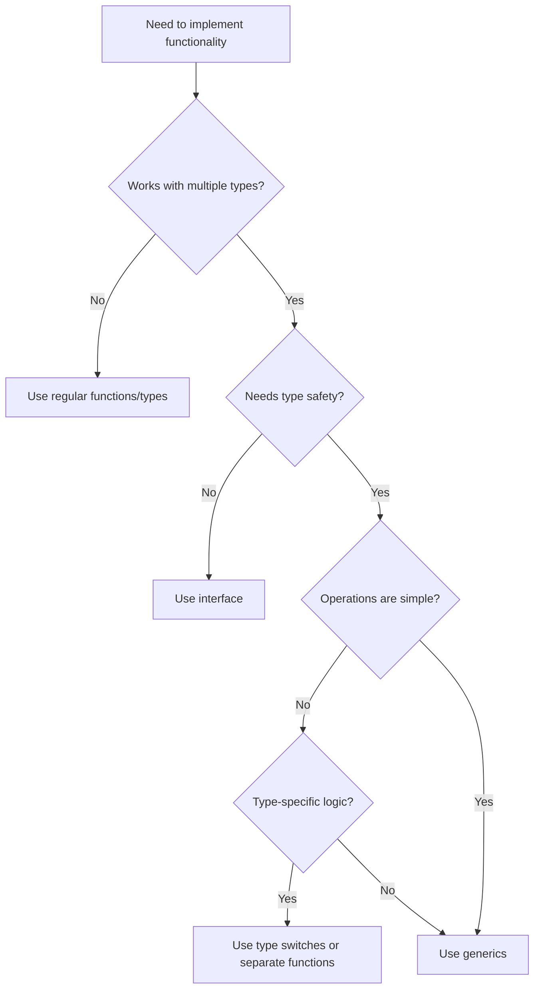

# Go Generics

## Introduction

Go 1.18 introduced one of the most anticipated features to the language: **generics**. Before generics, Go developers had to choose between type safety and code reusability, often resorting to interfaces, reflection, or code generation to work around this limitation. With generics, you can write functions and data structures that work with multiple types while maintaining type safety at compile time.

In this tutorial, we'll explore:
- What generics are and why they matter
- How to define and use generic functions
- How to create generic data structures
- Practical applications of generics in real-world scenarios
- Best practices and limitations

## What Are Generics?

Generics allow you to write code that can work with different types while maintaining type safety. Instead of writing separate functions for different data types or using the empty interface (`interface{}`), you can write a single generic function that works with any type that meets specific requirements.

Let's look at a simple example to illustrate the problem generics solve:

```go
// Without generics - need separate functions for each type
func sumInts(numbers []int) int {
    var total int
    for _, n := range numbers {
        total += n
    }
    return total
}

func sumFloats(numbers []float64) float64 {
    var total float64
    for _, n := range numbers {
        total += n
    }
    return total
}
```

With generics, we can combine these into a single function:

```go
// With generics - one function that works with multiple types
func Sum[T int | float64](numbers []T) T {
    var total T
    for _, n := range numbers {
        total += n
    }
    return total
}
```

## Generic Functions

### Basic Syntax

The syntax for defining a generic function involves type parameters enclosed in square brackets:

```go
func FunctionName[T Type](param T) ReturnType {
    // Function body
}
```

Where:
- `T` is the type parameter (similar to a function parameter, but for types)
- `Type` is the type constraint (what types T can be)

### Example: Generic Print Function

```go
package main

import "fmt"

// PrintAny prints any value, showing its type and value
func PrintAny[T any](value T) {
    fmt.Printf("Type: %T, Value: %v
", value, value)
}

func main() {
    PrintAny(42)          // Works with int
    PrintAny("hello")     // Works with string
    PrintAny(3.14)        // Works with float64
    PrintAny(true)        // Works with bool
}
```

**Output:**
```
Type: int, Value: 42
Type: string, Value: hello
Type: float64, Value: 3.14
Type: bool, Value: true
```

### Type Constraints

Type parameters need constraints that specify which types can be used. Go provides several ways to define constraints:

1. Using the predefined `any` constraint (equivalent to `interface{}`)
2. Using `|` to create union types
3. Using interface types
4. Using the `constraints` package

#### Example: Union Type Constraints

```go
package main

import "fmt"

// Sum works with both int and float64 slices
func Sum[T int | float64](numbers []T) T {
    var total T
    for _, n := range numbers {
        total += n
    }
    return total
}

func main() {
    // Works with int slice
    ints := []int{1, 2, 3, 4, 5}
    fmt.Println("Sum of ints:", Sum(ints))

    // Works with float64 slice
    floats := []float64{1.1, 2.2, 3.3, 4.4, 5.5}
    fmt.Println("Sum of floats:", Sum(floats))
}
```

**Output:**
```
Sum of ints: 15
Sum of floats: 16.5
```

#### Using Interface Constraints

We can define interfaces that describe the operations our generic function requires:

```go
package main

import "fmt"

// Stringer is an interface with a String method
type Stringer interface {
    String() string
}

// ToString converts any type that implements Stringer to a string
func ToString[T Stringer](value T) string {
    return value.String()
}

// Point implements Stringer
type Point struct {
    X, Y int
}

// String method makes Point implement Stringer
func (p Point) String() string {
    return fmt.Sprintf("(%d,%d)", p.X, p.Y)
}

func main() {
    p := Point{10, 20}
    fmt.Println(ToString(p))
}
```

**Output:**
```
(10,20)
```

### The `constraints` Package

Go's standard library includes a `constraints` package that provides common type constraints:

```go
package main

import (
    "fmt"
    "golang.org/x/exp/constraints"
)

// Max returns the larger of two values
func Max[T constraints.Ordered](a, b T) T {
    if a > b {
        return a
    }
    return b
}

func main() {
    fmt.Println(Max(42, 17))       // Works with int
    fmt.Println(Max(3.14, 2.71))   // Works with float64
    fmt.Println(Max("abc", "xyz")) // Works with string
}
```

**Output:**
```
42
3.14
xyz
```

## Generic Data Structures

Generics are particularly useful for creating reusable data structures that can work with any type.

### Example: Generic Stack

Let's implement a simple stack data structure that can work with any type:

```go
package main

import "fmt"

// Stack is a generic stack data structure
type Stack[T any] struct {
    items []T
}

// Push adds an element to the top of the stack
func (s *Stack[T]) Push(item T) {
    s.items = append(s.items, item)
}

// Pop removes and returns the top element
func (s *Stack[T]) Pop() (T, bool) {
    var zero T
    if len(s.items) == 0 {
        return zero, false
    }
    
    index := len(s.items) - 1
    item := s.items[index]
    s.items = s.items[:index]
    return item, true
}

// IsEmpty checks if the stack is empty
func (s *Stack[T]) IsEmpty() bool {
    return len(s.items) == 0
}

// Size returns the number of elements in the stack
func (s *Stack[T]) Size() int {
    return len(s.items)
}

func main() {
    // Stack of integers
    intStack := Stack[int]{}
    intStack.Push(1)
    intStack.Push(2)
    intStack.Push(3)
    
    fmt.Println("Int stack size:", intStack.Size())
    
    for !intStack.IsEmpty() {
        value, _ := intStack.Pop()
        fmt.Println("Popped:", value)
    }
    
    // Stack of strings
    stringStack := Stack[string]{}
    stringStack.Push("hello")
    stringStack.Push("world")
    
    fmt.Println("String stack size:", stringStack.Size())
    
    for !stringStack.IsEmpty() {
        value, _ := stringStack.Pop()
        fmt.Println("Popped:", value)
    }
}
```

**Output:**
```
Int stack size: 3
Popped: 3
Popped: 2
Popped: 1
String stack size: 2
Popped: world
Popped: hello
```

### Example: Generic Map Function

Let's implement a generic `Map` function that transforms slices of any type:

```go
package main

import "fmt"

// Map applies a function to each element of a slice and returns a new slice
func Map[T, U any](slice []T, f func(T) U) []U {
    result := make([]U, len(slice))
    for i, v := range slice {
        result[i] = f(v)
    }
    return result
}

func main() {
    // Double each integer in a slice
    ints := []int{1, 2, 3, 4, 5}
    doubled := Map(ints, func(x int) int {
        return x * 2
    })
    fmt.Println("Original:", ints)
    fmt.Println("Doubled:", doubled)
    
    // Convert integers to strings
    strings := Map(ints, func(x int) string {
        return fmt.Sprintf("Number: %d", x)
    })
    fmt.Println("As strings:", strings)
}
```

**Output:**
```
Original: [1 2 3 4 5]
Doubled: [2 4 6 8 10]
As strings: [Number: 1 Number: 2 Number: 3 Number: 4 Number: 5]
```

## Real-World Applications

### Generic Result Type

A common pattern in many languages is a "result" type that can contain either a successful value or an error:

```go
package main

import (
    "errors"
    "fmt"
)

// Result represents either a success value or an error
type Result[T any] struct {
    Value T
    Error error
}

// Success creates a new success result
func Success[T any](value T) Result[T] {
    return Result[T]{
        Value: value,
        Error: nil,
    }
}

// Failure creates a new error result
func Failure[T any](err error) Result[T] {
    var zero T
    return Result[T]{
        Value: zero,
        Error: err,
    }
}

// Divide returns a Result containing either the quotient or an error
func Divide(a, b float64) Result[float64] {
    if b == 0 {
        return Failure[float64](errors.New("division by zero"))
    }
    return Success(a / b)
}

func main() {
    // Successful division
    result1 := Divide(10, 2)
    if result1.Error != nil {
        fmt.Println("Error:", result1.Error)
    } else {
        fmt.Println("Result:", result1.Value)
    }
    
    // Failed division
    result2 := Divide(10, 0)
    if result2.Error != nil {
        fmt.Println("Error:", result2.Error)
    } else {
        fmt.Println("Result:", result2.Value)
    }
}
```

**Output:**
```
Result: 5
Error: division by zero
```

### Generic Cache

Let's implement a simple generic cache that can store any type of value:

```go
package main

import (
    "fmt"
    "sync"
    "time"
)

// CacheItem represents a cached item with an expiration time
type CacheItem[T any] struct {
    Value      T
    Expiration time.Time
}

// Cache is a generic in-memory cache
type Cache[K comparable, V any] struct {
    items map[K]CacheItem[V]
    mu    sync.RWMutex
}

// NewCache creates a new cache
func NewCache[K comparable, V any]() *Cache[K, V] {
    return &Cache[K, V]{
        items: make(map[K]CacheItem[V]),
    }
}

// Set adds an item to the cache with an expiration duration
func (c *Cache[K, V]) Set(key K, value V, expiration time.Duration) {
    c.mu.Lock()
    defer c.mu.Unlock()
    
    c.items[key] = CacheItem[V]{
        Value:      value,
        Expiration: time.Now().Add(expiration),
    }
}

// Get retrieves an item from the cache
func (c *Cache[K, V]) Get(key K) (V, bool) {
    c.mu.RLock()
    defer c.mu.RUnlock()
    
    item, found := c.items[key]
    if !found {
        var zero V
        return zero, false
    }
    
    // Check if the item has expired
    if time.Now().After(item.Expiration) {
        var zero V
        return zero, false
    }
    
    return item.Value, true
}

// Delete removes an item from the cache
func (c *Cache[K, V]) Delete(key K) {
    c.mu.Lock()
    defer c.mu.Unlock()
    delete(c.items, key)
}

func main() {
    // Create a cache for string values
    stringCache := NewCache[string, string]()
    stringCache.Set("greeting", "Hello, World!", 5*time.Second)
    
    // Retrieve the value
    if value, found := stringCache.Get("greeting"); found {
        fmt.Println("Found string value:", value)
    } else {
        fmt.Println("String value not found")
    }
    
    // Create a cache for user objects
    type User struct {
        ID   int
        Name string
    }
    
    userCache := NewCache[int, User]()
    userCache.Set(1, User{ID: 1, Name: "Alice"}, 10*time.Second)
    
    // Retrieve the user
    if user, found := userCache.Get(1); found {
        fmt.Printf("Found user: ID=%d, Name=%s
", user.ID, user.Name)
    } else {
        fmt.Println("User not found")
    }
    
    // Try to get a non-existent key
    if _, found := userCache.Get(2); !found {
        fmt.Println("User with ID 2 not found, as expected")
    }
}
```

**Output:**
```
Found string value: Hello, World!
Found user: ID=1, Name=Alice
User with ID 2 not found, as expected
```

## When to Use Generics (and When Not To)

Generics are powerful, but they're not always the right tool for the job. Here are some guidelines:

