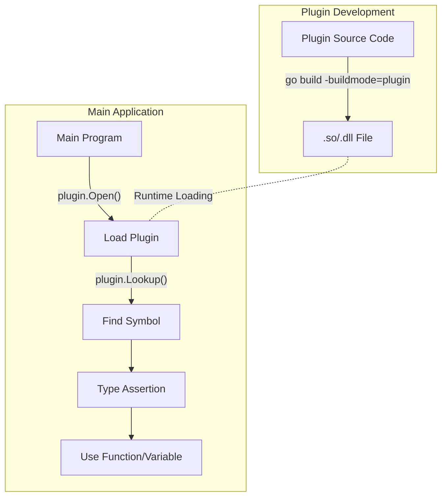

# Go Plugins

## Introduction

When building large applications, you might want to extend functionality without recompiling the entire program. Go's plugin system provides a way to dynamically load compiled code at runtime, allowing for modular and extensible applications.

Plugins in Go enable you to:
- Add features to your application after deployment
- Allow third-party extensions to your software
- Create a modular architecture where components can be swapped or updated independently
- Separate core functionality from optional features

This tutorial will guide you through understanding, creating, and using Go plugins effectively.

## What Are Go Plugins?

A Go plugin is a Go package compiled with special flags that produce a shared object file (`.so` on Linux/macOS, `.dll` on Windows). This file can be loaded at runtime by a Go program, which can then access the functions, variables, and types exported by the plugin.

> **Important Note**: Go plugin support is currently limited to Linux, FreeBSD, and macOS. Windows support is experimental and not officially supported.

## Prerequisites

Before diving into plugins, make sure you have:
- Go 1.8 or later installed (plugins were introduced in Go 1.8)
- Basic understanding of Go packages and modules
- Familiarity with Go's compile process

## Creating Your First Plugin

Let's create a simple plugin that exports a greeting function:

### Step 1: Create the Plugin Package

Create a new directory for your plugin:

```bash
mkdir greeting-plugin
cd greeting-plugin
```

Create a file named `greeting.go`:

```go
package main

import "fmt"

// Greeting returns a personalized greeting message
// Export functions must start with uppercase letter
func Greeting(name string) string {
    return fmt.Sprintf("Hello, %s! Welcome to Go Plugins.", name)
}

// This variable will be exported
var Version = "1.0.0"

// This unexported function won't be accessible
func internalHelper() string {
    return "I'm internal to the plugin"
}

// Required: empty main function
func main() {}
```

### Step 2: Compile the Plugin

Compile your plugin with the `-buildmode=plugin` flag:

```bash
go build -buildmode=plugin -o greeting.so greeting.go
```

This creates a shared object file named `greeting.so` that can be loaded at runtime.

### Step 3: Create the Main Application

Now, let's create an application that will load and use our plugin. Create a new directory:

```bash
mkdir plugin-user
cd plugin-user
```

Create a file named `main.go`:

```go
package main

import (
    "fmt"
    "plugin"
)

func main() {
    // Load the plugin
    plug, err := plugin.Open("../greeting-plugin/greeting.so")
    if err != nil {
        fmt.Printf("Error loading plugin: %v
", err)
        return
    }
    
    // Look up the Greeting function
    greetingSymbol, err := plug.Lookup("Greeting")
    if err != nil {
        fmt.Printf("Error looking up Greeting function: %v
", err)
        return
    }
    
    // Assert that the symbol is a function
    greeting, ok := greetingSymbol.(func(string) string)
    if !ok {
        fmt.Println("Unexpected type for Greeting function")
        return
    }
    
    // Call the function
    message := greeting("Gopher")
    fmt.Println(message)
    
    // Look up the Version variable
    versionSymbol, err := plug.Lookup("Version")
    if err != nil {
        fmt.Printf("Error looking up Version variable: %v
", err)
        return
    }
    
    // Assert that the symbol is a string pointer
    version, ok := versionSymbol.(*string)
    if !ok {
        fmt.Println("Unexpected type for Version variable")
        return
    }
    
    fmt.Printf("Plugin version: %s
", *version)
}
```

### Step 4: Run the Application

Compile and run the main application:

```bash
go build -o app
./app
```

Output:
```
Hello, Gopher! Welcome to Go Plugins.
Plugin version: 1.0.0
```

## How Plugins Work in Go

