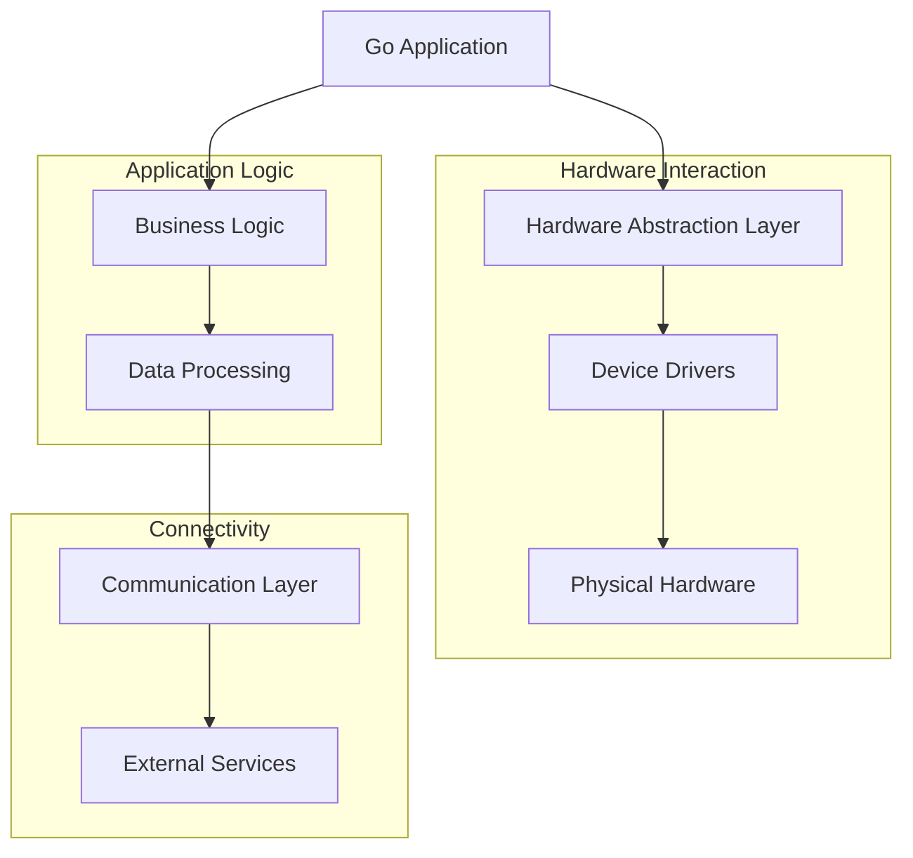

# Go Embedded Systems

## Introduction

Embedded systems are specialized computing systems that operate within larger mechanical or electrical systems. Unlike general-purpose computers, embedded systems are designed to perform specific tasks with real-time computing constraints. Common examples include smart thermostats, industrial controllers, and IoT devices.

Go (or Golang) has been gaining traction in embedded systems development due to its simplicity, efficiency, and robust concurrency model. While traditionally, languages like C and C++ dominated this domain, Go brings several advantages that make it an appealing alternative for modern embedded applications.

This guide will introduce you to using Go for embedded systems development, covering the fundamentals, practical applications, and best practices.

## Why Go for Embedded Systems?

Go offers several advantages for embedded development:

1. **Garbage Collection**: Automatic memory management reduces memory leaks common in C/C++
2. **Concurrency Model**: Goroutines and channels simplify concurrent programming
3. **Cross-compilation**: Easily compile code for different architectures
4. **Static Linking**: Produces standalone binaries without external dependencies
5. **Rich Standard Library**: Reduces reliance on third-party packages

However, there are also challenges:

1. **Garbage Collection Pauses**: Can affect real-time performance
2. **Runtime Overhead**: Larger binary sizes compared to C/C++
3. **Hardware Access**: Requires CGO or specific libraries for direct hardware interaction

## Getting Started with Go Embedded Development

### Setting Up Your Development Environment

Before diving into code, you'll need to set up your development environment:

```bash
# Install Go
# Visit https://golang.org/dl/ and follow installation instructions

# Install TinyGo (optional but recommended for microcontroller programming)
brew install tinygo  # macOS
# or
sudo apt install tinygo  # Ubuntu/Debian

# Verify installations
go version
tinygo version
```

### Cross-Compilation Basics

One of Go's strengths is cross-compilation. Here's how to compile for different architectures:

```bash
# Compile for ARM (e.g., Raspberry Pi)
GOOS=linux GOARCH=arm go build -o myapp main.go

# Compile for MIPS (e.g., certain routers)
GOOS=linux GOARCH=mips go build -o myapp main.go

# For small microcontrollers using TinyGo
tinygo build -target=arduino -o output.hex main.go
```

## Hardware Interaction with Go

### Direct Hardware Access using CGO

For low-level hardware access, you can use CGO to interface with C libraries:

```go
package main

/*
#include <stdio.h>
#include <stdlib.h>
#include <fcntl.h>
#include <unistd.h>
#include <sys/mman.h>

#define BCM2708_PERI_BASE 0x3F000000
#define GPIO_BASE (BCM2708_PERI_BASE + 0x200000)

volatile unsigned int *setup_gpio() {
    int fd = open("/dev/mem", O_RDWR | O_SYNC);
    if (fd < 0) {
        printf("Unable to open /dev/mem
");
        return NULL;
    }
    
    void *gpio_map = mmap(
        NULL,
        4*1024,
        PROT_READ | PROT_WRITE,
        MAP_SHARED,
        fd,
        GPIO_BASE
    );
    
    close(fd);
    
    if (gpio_map == MAP_FAILED) {
        printf("mmap error
");
        return NULL;
    }
    
    return (volatile unsigned int *)gpio_map;
}
*/
import "C"
import (
	"fmt"
	"time"
	"unsafe"
)

func main() {
	// Set up GPIO (This example is for Raspberry Pi)
	gpio := C.setup_gpio()
	if gpio == nil {
		fmt.Println("Failed to set up GPIO")
		return
	}
	
	fmt.Println("GPIO initialized successfully")
	
	// Example: Toggle LED on GPIO pin 17
	pin := 17
	
	// Set GPIO pin as output
	// ... GPIO setup code would go here
	
	// Toggle LED 5 times
	for i := 0; i < 5; i++ {
		fmt.Println("LED ON")
		// ... Code to turn LED on
		time.Sleep(time.Second)
		
		fmt.Println("LED OFF")
		// ... Code to turn LED off
		time.Sleep(time.Second)
	}
}
```

> Note: This code demonstrates the concept but is not complete. Real-world GPIO manipulation would require proper register operations specific to your hardware.

### Using Go Libraries for Hardware Access

Several Go libraries simplify hardware interaction:

```go
package main

import (
	"fmt"
	"time"

	"github.com/stianeikeland/go-rpio/v4"
)

func main() {
	// Open and map memory to access GPIO
	if err := rpio.Open(); err != nil {
		fmt.Println(err)
		return
	}
	
	// Unmap GPIO memory when done
	defer rpio.Close()
	
	// Get a reference to pin 17 (using BCM numbering)
	pin := rpio.Pin(17)
	
	// Set pin as output
	pin.Output()
	
	// Toggle LED 5 times
	for i := 0; i < 5; i++ {
		pin.High()
		fmt.Println("LED ON")
		time.Sleep(time.Second)
		
		pin.Low()
		fmt.Println("LED OFF")
		time.Sleep(time.Second)
	}
}
```

Example output:
```
LED ON
LED OFF
LED ON
LED OFF
LED ON
LED OFF
LED ON
LED OFF
LED ON
LED OFF
```

## Using TinyGo for Microcontrollers

For extremely resource-constrained environments, TinyGo is a Go compiler designed for microcontrollers. It produces significantly smaller binaries and has lower memory requirements.

### Blinking an LED with TinyGo (Arduino)

```go
package main

import (
	"machine"
	"time"
)

func main() {
	led := machine.LED
	led.Configure(machine.PinConfig{Mode: machine.PinOutput})
	
	for {
		led.High()
		time.Sleep(time.Millisecond * 500)
		
		led.Low()
		time.Sleep(time.Millisecond * 500)
	}
}
```

To compile and flash this to an Arduino:

```bash
tinygo flash -target arduino main.go
```

The LED connected to the Arduino's built-in LED pin will blink every half second.

## Real-Time Considerations in Go

For real-time embedded systems, you need to consider Go's garbage collection behavior:

```go
package main

import (
	"fmt"
	"runtime"
	"time"
)

func main() {
	// Disable GC for demonstration purposes
	runtime.GC()
	runtime.SetGCPercent(-1)
	
	// Allocate memory to prevent it from being optimized away
	var data []byte
	
	// Measure operation time
	start := time.Now()
	
	// Critical section - would be your real-time operation
	for i := 0; i < 1000000; i++ {
		// Simulate work without allocation
		_ = i * i
	}
	
	duration := time.Since(start)
	fmt.Printf("Operation took: %v
", duration)
	
	// Force allocation to prevent data optimization
	data = make([]byte, 1024*1024)
	_ = data
	
	// Re-enable GC
	runtime.SetGCPercent(100)
}
```

Output (will vary by system):
```
Operation took: 2.532ms
```

### Best Practices for Real-Time Go

1. **Pre-allocate memory**: Avoid allocations in critical paths
2. **Use sync.Pool**: Reuse objects to reduce GC pressure
3. **Consider manual memory management**: For extremely time-sensitive operations
4. **Profile and tune GC**: Use `GOGC` environment variable to control GC frequency
5. **Use `runtime.GC()` strategically**: Force garbage collection at appropriate times

## IoT Application Example: MQTT Weather Station

Here's a practical example of a Go-powered weather station that publishes data to an MQTT broker:

```go
package main

import (
	"fmt"
	"log"
	"math/rand"
	"time"

	mqtt "github.com/eclipse/paho.mqtt.golang"
)

// Simulate sensor readings
func readTemperature() float64 {
	return 20.0 + rand.Float64()*10.0
}

func readHumidity() float64 {
	return 30.0 + rand.Float64()*20.0
}

func main() {
	// Set up MQTT client options
	opts := mqtt.NewClientOptions()
	opts.AddBroker("tcp://broker.hivemq.com:1883")
	opts.SetClientID("go-weather-station")
	
	// Create and start client
	client := mqtt.NewClient(opts)
	if token := client.Connect(); token.Wait() && token.Error() != nil {
		log.Fatalf("Failed to connect to MQTT broker: %v", token.Error())
	}
	
	fmt.Println("Connected to MQTT broker")
	defer client.Disconnect(250)
	
	// Publish sensor data every 5 seconds
	ticker := time.NewTicker(5 * time.Second)
	for range ticker.C {
		temp := readTemperature()
		humidity := readHumidity()
		
		payload := fmt.Sprintf(`{"temperature": %.2f, "humidity": %.2f, "timestamp": %d}`,
			temp, humidity, time.Now().Unix())
		
		// Publish to temperature topic
		token := client.Publish("sensors/weather-station", 0, false, payload)
		token.Wait()
		
		fmt.Printf("Published: %s
", payload)
	}
}
```

Example output:
```
Connected to MQTT broker
Published: {"temperature": 25.36, "humidity": 42.18, "timestamp": 1646412003}
Published: {"temperature": 22.47, "humidity": 38.92, "timestamp": 1646412008}
Published: {"temperature": 28.14, "humidity": 45.67, "timestamp": 1646412013}
```

## System Architecture for Go Embedded Applications

A typical Go embedded system architecture might look like this:



## Performance Optimization Techniques

### Memory Optimization

```go
package main

import (
	"fmt"
	"runtime"
)

func main() {
	// Before optimization
	var stats runtime.MemStats
	runtime.ReadMemStats(&stats)
	fmt.Printf("Before: Alloc = %v MiB
", stats.Alloc/1024/1024)
	
	// Inefficient approach - creates many small allocations
	inefficientProcess()
	
	// After inefficient process
	runtime.ReadMemStats(&stats)
	fmt.Printf("After inefficient: Alloc = %v MiB
", stats.Alloc/1024/1024)
	
	// Run GC to reset
	runtime.GC()
	
	// Efficient approach - preallocates memory
	efficientProcess()
	
	// After efficient process
	runtime.ReadMemStats(&stats)
	fmt.Printf("After efficient: Alloc = %v MiB
", stats.Alloc/1024/1024)
}

func inefficientProcess() {
	var data []int
	// This will cause multiple reallocations
	for i := 0; i < 100000; i++ {
		data = append(data, i)
	}
}

func efficientProcess() {
	// Preallocate with capacity
	data := make([]int, 0, 100000)
	for i := 0; i < 100000; i++ {
		data = append(data, i)
	}
}
```

Example output:
```
Before: Alloc = 0 MiB
After inefficient: Alloc = 3 MiB
After efficient: Alloc = 1 MiB
```

### CPU Optimization with Concurrency

```go
package main

import (
	"fmt"
	"runtime"
	"sync"
	"time"
)

func main() {
	// Set max number of CPUs to use
	numCPU := runtime.NumCPU()
	runtime.GOMAXPROCS(numCPU)
	fmt.Printf("Using %d CPUs
", numCPU)
	
	// Sequential processing
	start := time.Now()
	sequentialProcess()
	fmt.Printf("Sequential processing took: %v
", time.Since(start))
	
	// Concurrent processing
	start = time.Now()
	concurrentProcess()
	fmt.Printf("Concurrent processing took: %v
", time.Since(start))
}

func sequentialProcess() {
	for i := 0; i < 8; i++ {
		heavyComputation()
	}
}

func concurrentProcess() {
	var wg sync.WaitGroup
	
	for i := 0; i < 8; i++ {
		wg.Add(1)
		go func() {
			defer wg.Done()
			heavyComputation()
		}()
	}
	
	wg.Wait()
}

func heavyComputation() {
	// Simulate CPU-bound work
	result := 0
	for i := 0; i < 10000000; i++ {
		result += i
	}
}
```

Example output:
```
Using 8 CPUs
Sequential processing took: 176.582ms
Concurrent processing took: 24.813ms
```

## Debugging Embedded Go Applications

Debugging embedded applications can be challenging. Here are some techniques:

### Remote Debugging

```go
package main

import (
	"fmt"
	"log"
	"net/http"
	_ "net/http/pprof"  // Import for side effects
	"time"
)

func main() {
	// Start pprof server for remote debugging
	go func() {
		log.Println("Starting debug server on :6060")
		log.Println(http.ListenAndServe("0.0.0.0:6060", nil))
	}()
	
	// Main application loop
	for {
		processData()
		time.Sleep(time.Second)
	}
}

func processData() {
	// Simulate data processing
	fmt.Println("Processing data...")
	
	// Do work...
	time.Sleep(500 * time.Millisecond)
}
```

To debug, connect to the device using:

```bash
# View goroutines
curl http://device-ip:6060/debug/pprof/goroutine?debug=1

# Capture CPU profile
go tool pprof http://device-ip:6060/debug/pprof/profile
```

## Case Study: Building a Home Automation Controller

Let's put everything together in a practical example of a home automation controller:

```go
package main

import (
	"encoding/json"
	"fmt"
	"log"
	"net/http"
	"sync"
	"time"

	mqtt "github.com/eclipse/paho.mqtt.golang"
	"github.com/stianeikeland/go-rpio/v4"
)

// Device represents a controllable device
type Device struct {
	ID       string
	Name     string
	Type     string
	Pin      rpio.Pin
	State    bool
	mutex    sync.Mutex
}

// Toggle changes the device state
func (d *Device) Toggle() {
	d.mutex.Lock()
	defer d.mutex.Unlock()
	
	d.State = !d.State
	if d.State {
		d.Pin.High()
	} else {
		d.Pin.Low()
	}
	
	fmt.Printf("Device %s is now %v
", d.Name, d.State)
}

// Set explicitly sets the device state
func (d *Device) Set(state bool) {
	d.mutex.Lock()
	defer d.mutex.Unlock()
	
	d.State = state
	if d.State {
		d.Pin.High()
	} else {
		d.Pin.Low()
	}
	
	fmt.Printf("Device %s is now %v
", d.Name, d.State)
}

// Main controller
type HomeController struct {
	Devices map[string]*Device
	client  mqtt.Client
	mutex   sync.RWMutex
}

// Initialize creates a new controller
func NewHomeController() (*HomeController, error) {
	// Open GPIO
	if err := rpio.Open(); err != nil {
		return nil, fmt.Errorf("failed to open GPIO: %w", err)
	}
	
	// Create controller
	controller := &HomeController{
		Devices: make(map[string]*Device),
	}
	
	// Set up MQTT
	opts := mqtt.NewClientOptions()
	opts.AddBroker("tcp://broker.hivemq.com:1883")
	opts.SetClientID("go-home-controller")
	opts.SetDefaultPublishHandler(controller.handleMQTTMessage)
	
	controller.client = mqtt.NewClient(opts)
	if token := controller.client.Connect(); token.Wait() && token.Error() != nil {
		return nil, fmt.Errorf("failed to connect to MQTT: %w", token.Error())
	}
	
	// Subscribe to commands
	topic := "home/commands/#"
	token := controller.client.Subscribe(topic, 0, nil)
	token.Wait()
	
	return controller, nil
}

// Add a device to the controller
func (c *HomeController) AddDevice(id, name, deviceType string, pin rpio.Pin) {
	c.mutex.Lock()
	defer c.mutex.Unlock()
	
	device := &Device{
		ID:    id,
		Name:  name,
		Type:  deviceType,
		Pin:   pin,
		State: false,
	}
	
	// Configure pin as output
	device.Pin.Output()
	device.Pin.Low()
	
	c.Devices[id] = device
	fmt.Printf("Added device: %s (%s)
", name, id)
}

// Handle incoming MQTT messages
func (c *HomeController) handleMQTTMessage(client mqtt.Client, msg mqtt.Message) {
	fmt.Printf("Received message: %s from topic: %s
", msg.Payload(), msg.Topic())
	
	// Parse command
	var command struct {
		DeviceID string `json:"device_id"`
		Action   string `json:"action"`
		State    bool   `json:"state,omitempty"`
	}
	
	if err := json.Unmarshal(msg.Payload(), &command); err != nil {
		fmt.Printf("Error parsing command: %v
", err)
		return
	}
	
	// Find device
	c.mutex.RLock()
	device, exists := c.Devices[command.DeviceID]
	c.mutex.RUnlock()
	
	if !exists {
		fmt.Printf("Device not found: %s
", command.DeviceID)
		return
	}
	
	// Execute command
	switch command.Action {
	case "toggle":
		device.Toggle()
	case "set":
		device.Set(command.State)
	default:
		fmt.Printf("Unknown action: %s
", command.Action)
	}
	
	// Publish status update
	c.publishStatus(device)
}

// Publish device status
func (c *HomeController) publishStatus(device *Device) {
	device.mutex.Lock()
	defer device.mutex.Unlock()
	
	status := struct {
		DeviceID string `json:"device_id"`
		Name     string `json:"name"`
		Type     string `json:"type"`
		State    bool   `json:"state"`
	}{
		DeviceID: device.ID,
		Name:     device.Name,
		Type:     device.Type,
		State:    device.State,
	}
	
	payload, err := json.Marshal(status)
	if err != nil {
		fmt.Printf("Error marshaling status: %v
", err)
		return
	}
	
	topic := fmt.Sprintf("home/status/%s", device.ID)
	token := c.client.Publish(topic, 0, false, payload)
	token.Wait()
}

// HTTP handler for controlling devices
func (c *HomeController) handleHTTP(w http.ResponseWriter, r *http.Request) {
	if r.Method == "GET" {
		// Return list of devices
		c.mutex.RLock()
		devices := make([]map[string]interface{}, 0, len(c.Devices))
		for _, device := range c.Devices {
			device.mutex.Lock()
			devices = append(devices, map[string]interface{}{
				"id":    device.ID,
				"name":  device.Name,
				"type":  device.Type,
				"state": device.State,
			})
			device.mutex.Unlock()
		}
		c.mutex.RUnlock()
		
		w.Header().Set("Content-Type", "application/json")
		json.NewEncoder(w).Encode(devices)
		return
	}
	
	if r.Method == "POST" {
		// Handle command
		var command struct {
			DeviceID string `json:"device_id"`
			Action   string `json:"action"`
			State    bool   `json:"state,omitempty"`
		}
		
		if err := json.NewDecoder(r.Body).Decode(&command); err != nil {
			http.Error(w, "Invalid request", http.StatusBadRequest)
			return
		}
		
		// Find device
		c.mutex.RLock()
		device, exists := c.Devices[command.DeviceID]
		c.mutex.RUnlock()
		
		if !exists {
			http.Error(w, "Device not found", http.StatusNotFound)
			return
		}
		
		// Execute command
		switch command.Action {
		case "toggle":
			device.Toggle()
		case "set":
			device.Set(command.State)
		default:
			http.Error(w, "Unknown action", http.StatusBadRequest)
			return
		}
		
		// Publish status update
		c.publishStatus(device)
		
		w.Header().Set("Content-Type", "application/json")
		device.mutex.Lock()
		json.NewEncoder(w).Encode(map[string]interface{}{
			"id":    device.ID,
			"name":  device.Name,
			"state": device.State,
		})
		device.mutex.Unlock()
		return
	}
	
	http.Error(w, "Method not allowed", http.StatusMethodNotAllowed)
}

func main() {
	controller, err := NewHomeController()
	if err != nil {
		log.Fatalf("Failed to initialize controller: %v", err)
	}
	defer rpio.Close()
	
	// Add some devices (pin numbers would vary by hardware)
	controller.AddDevice("light1", "Living Room Light", "light", rpio.Pin(17))
	controller.AddDevice("light2", "Kitchen Light", "light", rpio.Pin(18))
	controller.AddDevice("fan1", "Bedroom Fan", "fan", rpio.Pin(19))
	
	// Start HTTP server
	http.HandleFunc("/devices", controller.handleHTTP)
	
	fmt.Println("Home automation controller is running...")
	fmt.Println("HTTP server started on :8080")
	log.Fatal(http.ListenAndServe(":8080", nil))
}
```

Example output:
```
Added device: Living Room Light (light1)
Added device: Kitchen Light (light2)
Added device: Bedroom Fan (fan1)
Home automation controller is running...
HTTP server started on :8080
Received message: {"device_id":"light1","action":"toggle"} from topic: home/commands/lights
Device Living Room Light is now true
```

## Summary

Go offers a compelling alternative for embedded systems development, particularly for IoT devices and edge computing applications. While it may not be suitable for all embedded scenarios (especially those with extreme resource constraints or hard real-time requirements), its simplicity, robust concurrency model, and cross-compilation capabilities make it an excellent choice for many modern embedded applications.

Key takeaways:
- Go provides a good balance between performance and developer productivity
- TinyGo extends Go's reach to microcontrollers and resource-constrained devices
- CGO allows integration with existing C libraries for hardware access
- Concurrency patterns in Go are well-suited for IoT and networked embedded devices
- Careful attention to garbage collection is necessary for real-time applications

## Additional Resources

### Learning Resources
- [TinyGo Documentation](https://tinygo.org/)
- [Go Embedded Programming on Raspberry Pi](https://gobot.io/documentation/platforms/raspi/)
- [Gobot - Framework for Robotics and IoT](https://gobot.io/)
- [Periph.io - Peripherals I/O in Go](https://periph.io/)

### Books
- "Hands-On Go Programming" by Tarik Guney
- "Distributed Systems with Go" by Travis Jeffery

### Exercises

1. **Basic LED Control**:  
   Create a program to control an LED using a button press.

2. **Temperature Monitor**:  
   Build a temperature monitoring system that reads from a sensor and logs data.

3. **Web-Controlled Device**:  
   Extend the home automation example to include a web interface.

4. **MQTT-Based Sensor Network**:  
   Create a network of sensors that publish data to an MQTT broker.

5. **Real-Time Control System**:  
   Implement a real-time control system with careful consideration of Go's garbage collection.