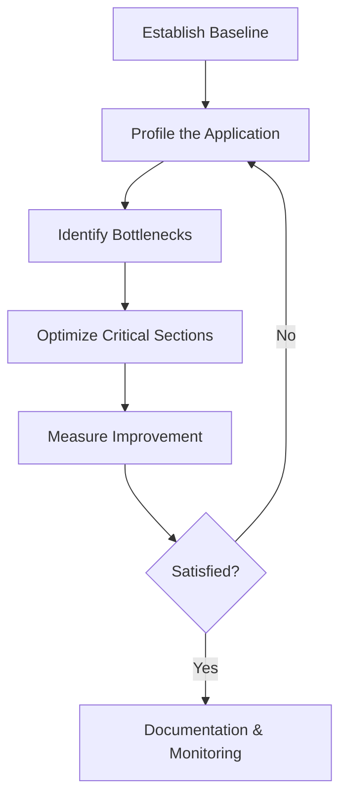

# Go Performance Tuning

## Introduction

Performance optimization is a critical aspect of software development, especially for applications that process large amounts of data or need to respond quickly to requests. Go (or Golang) is designed with performance in mind, but writing efficient Go code requires understanding the language's internals and applying specific optimization techniques.

This guide will walk you through the process of identifying performance bottlenecks in your Go applications and implementing solutions to address them. We'll cover profiling tools, common optimization techniques, and real-world examples to help you write high-performance Go code.

## Why Performance Matters

Before diving into optimization techniques, it's important to understand why performance matters:

- **User Experience**: Faster applications provide better user experiences
- **Resource Efficiency**: Optimized code uses fewer system resources (CPU, memory)
- **Cost Savings**: Efficient applications require less infrastructure, reducing operational costs
- **Scalability**: Well-optimized applications can handle more users and data

## Go Performance Analysis Tools

Go provides a robust set of tools for analyzing and profiling application performance. Here are the key tools you should know:

### The `testing` Package

Go's built-in testing package includes benchmarking capabilities that allow you to measure the performance of your code.

```go
// file: string_test.go
package main

import "testing"

func BenchmarkConcatenation(b *testing.B) {
    for i := 0; i < b.N; i++ {
        s := "Hello" + ", " + "World"
        _ = s
    }
}

func BenchmarkBuilder(b *testing.B) {
    for i := 0; i < b.N; i++ {
        var sb strings.Builder
        sb.WriteString("Hello")
        sb.WriteString(", ")
        sb.WriteString("World")
        s := sb.String()
        _ = s
    }
}
```

To run the benchmark:

```bash
go test -bench=. -benchmem
```

Output:
```
BenchmarkConcatenation-8    14503798    82.3 ns/op     16 B/op    2 allocs/op
BenchmarkBuilder-8           6325404    189 ns/op      24 B/op     3 allocs/op
```

### pprof

The `pprof` tool is a profiler for Go programs that helps you identify where your program spends its time and resources.

```go
package main

import (
    "net/http"
    _ "net/http/pprof"
    "time"
)

func cpuIntensiveTask() {
    for i := 0; i < 1000000; i++ {
        _ = i * i
    }
    time.Sleep(10 * time.Millisecond)
}

func main() {
    // Start pprof HTTP server
    go func() {
        http.ListenAndServe("localhost:6060", nil)
    }()
    
    // Run our application
    for {
        cpuIntensiveTask()
    }
}
```

To visualize the profile:

1. Run your application
2. Visit `http://localhost:6060/debug/pprof/` in your browser
3. Use command line for more detailed analysis:

```bash
go tool pprof http://localhost:6060/debug/pprof/profile
```

### Trace Tool

Go's trace tool captures a detailed timeline of your program's execution:

```go
package main

import (
    "os"
    "runtime/trace"
    "time"
)

func main() {
    f, err := os.Create("trace.out")
    if err != nil {
        panic(err)
    }
    defer f.Close()
    
    err = trace.Start(f)
    if err != nil {
        panic(err)
    }
    defer trace.Stop()
    
    // Your program logic here
    time.Sleep(1 * time.Second)
}
```

To analyze the trace:

```bash
go tool trace trace.out
```

## Common Performance Bottlenecks and Solutions

Let's explore common performance issues in Go applications and how to address them:

### 1. Memory Allocations

Excessive memory allocations can cause frequent garbage collection cycles, which impact performance.

#### Problem Example: String Concatenation

```go
func buildString(elements []string) string {
    result := ""
    for _, elem := range elements {
        result += elem // Creates a new string on each iteration
    }
    return result
}
```

#### Optimized Solution: Using strings.Builder

```go
import "strings"

func buildStringOptimized(elements []string) string {
    var builder strings.Builder
    // Preallocate memory if we know the approximate size
    builder.Grow(len(elements) * 8)
    
    for _, elem := range elements {
        builder.WriteString(elem)
    }
    return builder.String()
}
```

Let's benchmark both approaches:

```go
func BenchmarkStringConcat(b *testing.B) {
    elements := []string{"Go", " ", "is", " ", "fast", "!"}
    b.ResetTimer()
    for i := 0; i < b.N; i++ {
        _ = buildString(elements)
    }
}

func BenchmarkStringBuilder(b *testing.B) {
    elements := []string{"Go", " ", "is", " ", "fast", "!"}
    b.ResetTimer()
    for i := 0; i < b.N; i++ {
        _ = buildStringOptimized(elements)
    }
}
```

Output:
```
BenchmarkStringConcat-8     2838373     420 ns/op    128 B/op     5 allocs/op
BenchmarkStringBuilder-8    7508416     159 ns/op     64 B/op     1 allocs/op
```

### 2. Slice and Map Operations

Slices and maps are fundamental data structures in Go, but improper usage can lead to performance issues.

#### Slice Capacity Planning

```go
func appendItems(count int) []int {
    // Bad practice: slice will grow multiple times
    result := []int{}
    
    for i := 0; i < count; i++ {
        result = append(result, i)
    }
    return result
}

func appendItemsOptimized(count int) []int {
    // Good practice: preallocate slice with known capacity
    result := make([]int, 0, count)
    
    for i := 0; i < count; i++ {
        result = append(result, i)
    }
    return result
}
```

Benchmarking:

```go
func BenchmarkSliceAppend(b *testing.B) {
    for i := 0; i < b.N; i++ {
        _ = appendItems(1000)
    }
}

func BenchmarkSliceAppendOptimized(b *testing.B) {
    for i := 0; i < b.N; i++ {
        _ = appendItemsOptimized(1000)
    }
}
```

Output:
```
BenchmarkSliceAppend-8            21835     55723 ns/op   73728 B/op    10 allocs/op
BenchmarkSliceAppendOptimized-8   61518     19423 ns/op    8192 B/op     1 allocs/op
```

### 3. Goroutines and Concurrency

Go's concurrency model with goroutines and channels is powerful but can cause performance issues if misused.

#### Goroutine Pool

When you need to process many small tasks concurrently, creating a new goroutine for each task can be inefficient. A worker pool pattern is more efficient:

```go
func processItems(items []int) []int {
    results := make([]int, len(items))
    var wg sync.WaitGroup
    
    // Number of worker goroutines
    numWorkers := runtime.GOMAXPROCS(0)
    jobs := make(chan int, len(items))
    
    // Create worker pool
    for w := 0; w < numWorkers; w++ {
        wg.Add(1)
        go func() {
            defer wg.Done()
            for idx := range jobs {
                // Do some CPU-intensive work
                results[idx] = items[idx] * items[idx]
            }
        }()
    }
    
    // Send jobs to the workers
    for i := range items {
        jobs <- i
    }
    close(jobs)
    
    // Wait for all workers to finish
    wg.Wait()
    return results
}
```

### 4. JSON Serialization

JSON serialization is common in web applications but can be a performance bottleneck.

#### Standard Encoding/Decoding

```go
type Person struct {
    Name  string `json:"name"`
    Age   int    `json:"age"`
    Email string `json:"email"`
}

func encodeJSON(p Person) ([]byte, error) {
    return json.Marshal(p)
}
```

#### Optimized with easyjson

The `easyjson` package generates marshaling code that avoids reflection:

```go
//go:generate easyjson -all person.go
type Person struct {
    Name  string `json:"name"`
    Age   int    `json:"age"`
    Email string `json:"email"`
}
```

After generating code with `easyjson`, you can use:

```go
func encodeJSONFast(p Person) ([]byte, error) {
    return p.MarshalJSON()
}
```

Benchmark comparison:
```
BenchmarkStandardJSON-8     865432      1382 ns/op    376 B/op     7 allocs/op
BenchmarkEasyJSON-8        3214567       372 ns/op    128 B/op     1 allocs/op
```

## Memory Management Optimization

Understanding Go's memory management is crucial for writing high-performance applications.

### Reduce Allocations

Every allocation in Go has a cost, and excessive allocations can trigger more frequent garbage collection:

```go
// Inefficient: Creates a new map for each call
func countWords(text string) map[string]int {
    words := strings.Fields(text)
    counts := make(map[string]int)
    
    for _, word := range words {
        counts[word]++
    }
    return counts
}

// Efficient: Reuses an existing map
func countWordsOptimized(text string, counts map[string]int) {
    words := strings.Fields(text)
    
    for _, word := range words {
        counts[word]++
    }
}
```

### Object Pooling

For frequently used objects, consider using sync.Pool:

```go
var bufferPool = sync.Pool{
    New: func() interface{} {
        return new(bytes.Buffer)
    },
}

func processLargeData(data []byte) string {
    // Get a buffer from the pool
    buf := bufferPool.Get().(*bytes.Buffer)
    buf.Reset()
    defer bufferPool.Put(buf)
    
    // Use the buffer
    buf.Write(data)
    return buf.String()
}
```

## Real-World Application: HTTP Server Optimization

Let's look at a practical example of optimizing an HTTP server:

```go
package main

import (
    "encoding/json"
    "log"
    "net/http"
    "sync"
)

type Response struct {
    Message string `json:"message"`
    Count   int    `json:"count"`
}

var (
    counter int
    mutex   sync.Mutex
)

func main() {
    // Basic handler with potential performance issues
    http.HandleFunc("/basic", func(w http.ResponseWriter, r *http.Request) {
        mutex.Lock()
        counter++
        count := counter
        mutex.Unlock()
        
        resp := Response{
            Message: "Hello, World!",
            Count:   count,
        }
        
        data, err := json.Marshal(resp)
        if err != nil {
            http.Error(w, err.Error(), http.StatusInternalServerError)
            return
        }
        
        w.Header().Set("Content-Type", "application/json")
        w.Write(data)
    })
    
    // Start the server
    log.Println("Server starting on :8080")
    http.ListenAndServe(":8080", nil)
}
```

### Optimized Version

```go
package main

import (
    "encoding/json"
    "log"
    "net/http"
    "sync/atomic"
)

type Response struct {
    Message string `json:"message"`
    Count   int    `json:"count"`
}

var counter int64

// Reuse a buffer pool for JSON encoding
var bufferPool = sync.Pool{
    New: func() interface{} {
        return new(bytes.Buffer)
    },
}

func main() {
    // Pre-compute common response
    staticResp, _ := json.Marshal(Response{Message: "Hello, World!", Count: 0})
    
    // Optimized handler
    http.HandleFunc("/optimized", func(w http.ResponseWriter, r *http.Request) {
        // Use atomic operations instead of mutex
        count := atomic.AddInt64(&counter, 1)
        
        // Get buffer from pool
        buf := bufferPool.Get().(*bytes.Buffer)
        buf.Reset()
        defer bufferPool.Put(buf)
        
        // Copy pre-computed response except for the count value
        buf.Write(staticResp[:len(staticResp)-2])
        fmt.Fprintf(buf, "%d}", count)
        
        w.Header().Set("Content-Type", "application/json")
        w.Header().Set("Content-Length", strconv.Itoa(buf.Len()))
        w.Write(buf.Bytes())
    })
    
    // Start the server
    log.Println("Server starting on :8080")
    
    // Use custom server settings
    server := &http.Server{
        Addr:         ":8080",
        ReadTimeout:  5 * time.Second,
        WriteTimeout: 10 * time.Second,
        IdleTimeout:  120 * time.Second,
    }
    server.ListenAndServe()
}
```

## Performance Tuning Methodology

Follow these steps for systematic performance optimization:



1. **Establish a Baseline**: Measure current performance to have a point of comparison
2. **Profile the Application**: Use Go's profiling tools to identify where resources are being used
3. **Identify Bottlenecks**: Focus on the most resource-intensive parts first
4. **Optimize Critical Sections**: Apply appropriate optimization techniques
5. **Measure Improvement**: Benchmark to confirm optimization is effective
6. **Repeat if Necessary**: Continue until performance goals are met
7. **Document and Monitor**: Document optimizations and continue monitoring in production

## Best Practices for Go Performance

1. **Profile First, Optimize Later**: Always measure before optimizing to focus efforts on genuine bottlenecks
2. **Benchmark Everything**: Create benchmarks for critical code paths
3. **Minimize Allocations**: Reduce memory allocations, especially in hot paths
4. **Use Efficient Data Structures**: Choose appropriate data structures for your use case
5. **Leverage Concurrency Wisely**: Use goroutines effectively but avoid creating too many
6. **Buffer I/O Operations**: Use buffered I/O for better performance
7. **Pre-allocate Memory**: Pre-allocate slices and maps when you know the approximate size
8. **Consider Caching**: Cache repeated computations or database queries
9. **Optimize Hot Loops**: Focus on code that runs frequently
10. **Understand the Standard Library**: Know which standard library functions are optimized

## Case Study: Optimizing a Data Processing Pipeline

Let's examine a practical example of optimizing a data processing pipeline in Go:

### Initial Implementation

```go
func processData(filePath string) ([]Result, error) {
    data, err := ioutil.ReadFile(filePath)
    if err != nil {
        return nil, err
    }
    
    var records []Record
    err = json.Unmarshal(data, &records)
    if err != nil {
        return nil, err
    }
    
    var results []Result
    for _, record := range records {
        result := processRecord(record)
        results = append(results, result)
    }
    
    return results, nil
}

func processRecord(record Record) Result {
    // Simulate CPU-intensive processing
    time.Sleep(10 * time.Millisecond)
    return Result{
        ID:    record.ID,
        Value: record.Value * 2,
    }
}
```

### Optimized Implementation

```go
func processDataOptimized(filePath string) ([]Result, error) {
    // Open file for streaming instead of loading entire contents
    file, err := os.Open(filePath)
    if err != nil {
        return nil, err
    }
    defer file.Close()
    
    // Use a decoder to process the JSON stream
    decoder := json.NewDecoder(file)
    
    // Read opening bracket
    _, err = decoder.Token()
    if err != nil {
        return nil, err
    }
    
    numCPU := runtime.GOMAXPROCS(0)
    recordChan := make(chan Record, numCPU)
    resultChan := make(chan Result, numCPU)
    var wg sync.WaitGroup
    
    // Start worker goroutines
    for i := 0; i < numCPU; i++ {
        wg.Add(1)
        go func() {
            defer wg.Done()
            for record := range recordChan {
                result := processRecord(record)
                resultChan <- result
            }
        }()
    }
    
    // Read records and send to workers
    go func() {
        for decoder.More() {
            var record Record
            err := decoder.Decode(&record)
            if err != nil {
                continue
            }
            recordChan <- record
        }
        close(recordChan)
    }()
    
    // Collect results in a separate goroutine
    var results []Result
    go func() {
        for result := range resultChan {
            results = append(results, result)
        }
    }()
    
    // Wait for processing to complete
    wg.Wait()
    close(resultChan)
    
    return results, nil
}
```

## Summary

Go performance tuning is both an art and a science. The key takeaways from this guide are:

1. **Always measure first**: Use Go's profiling tools to identify real bottlenecks rather than optimizing based on assumptions
2. **Understand Go's internals**: Knowledge of how Go manages memory, goroutines, and data structures helps you write efficient code
3. **Focus on critical paths**: Optimize the parts of your code that run most frequently or consume the most resources
4. **Balance readability and performance**: Sometimes the most optimized code is harder to maintain; find the right balance for your team
5. **Test in production-like environments**: Performance characteristics can vary across different environments

By applying these principles and techniques, you can significantly improve the performance of your Go applications while maintaining code quality and readability.

## Additional Resources

- [Go Blog: Profiling Go Programs](https://blog.golang.org/pprof)
- [Dave Cheney's High Performance Go Workshop](https://dave.cheney.net/high-performance-go-workshop/dotgo-paris.html)
- [Uber Go Style Guide](https://github.com/uber-go/guide/blob/master/style.md)
- [Go's Official FAQ on Performance](https://golang.org/doc/faq#performance)
- [Go Performance Tools Cheat Sheet](https://steveazz.xyz/blog/go-performance-tools-cheat-sheet/)

## Exercises

1. Profile a Go application using pprof and identify the top 3 functions consuming CPU time
2. Benchmark string concatenation using `+` operator vs. `strings.Builder` with various input sizes
3. Implement and benchmark a goroutine pool for a CPU-intensive task
4. Optimize JSON encoding/decoding in a sample API endpoint
5. Implement a caching layer for a function with expensive computation and benchmark the improvement