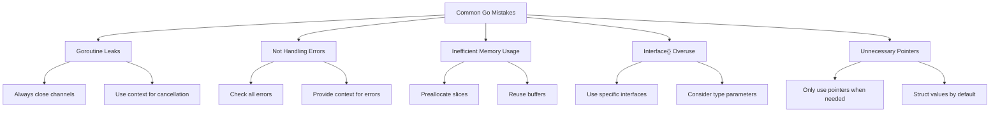

# Go Best Practices

## Introduction

Welcome to our guide on Go best practices! As you progress in your Go programming journey, it's important not just to write code that works, but code that follows the community's established patterns and practices. This guide will help you understand the idiomatic way to write Go code that is clean, efficient, and easily maintainable.

Go (or Golang) was designed with simplicity and readability in mind. Unlike many other languages, Go emphasizes convention over configuration and provides a standard formatting tool (`gofmt`). This unique approach creates a more consistent ecosystem where Go code written by different developers follows similar patterns and styles.

In this guide, we'll explore the key best practices that will help you write better Go code, avoid common pitfalls, and leverage the language's strengths effectively.

## Code Organization

### Package Structure

One of the first decisions you'll make when starting a Go project is how to organize your code into packages. Here are some best practices:

- **Package names should be simple and reflect their purpose**
- **One package per directory**
- **Use a domain-based project layout for larger applications**

Here's a common Go project structure:

```
myproject/
├── cmd/                    # Command applications
│   └── myapp/              # Main application
│       └── main.go         # Entry point
├── internal/               # Private code
│   ├── auth/               # Authentication package
│   └── database/           # Database package
├── pkg/                    # Public packages that can be imported
│   └── models/             # Data models
├── api/                    # API definitions (protobuf, OpenAPI)
├── web/                    # Web assets
├── configs/                # Configuration files
├── scripts/                # Build and utility scripts
├── go.mod                  # Module definition
└── go.sum                  # Dependencies checksum
```

### Import Conventions

Organize your imports in the following groups with a blank line between each group:

1. Standard library imports
2. Third-party imports
3. Local/internal packages

```go
import (
    "fmt"
    "strings"
    
    "github.com/pkg/errors"
    "golang.org/x/text/language"
    
    "myproject/internal/auth"
)
```

## Code Style

### Using gofmt

Always use `gofmt` (or `go fmt`) to format your code. This eliminates style debates and ensures consistency across the Go ecosystem.

```bash
# Format a single file
gofmt -w file.go

# Format all files in a directory and subdirectories
go fmt ./...
```

### Naming Conventions

Go has specific naming conventions that differ from other languages:

- **Use camelCase, not snake_case**
- **Acronyms should be all uppercase** (e.g., `HTTP`, not `Http`)
- **Short variable names for short scopes** (e.g., `i` for loop indices)
- **Exported names (capitalized) should have documentation comments**

```go
// Good
func ProcessHTTPRequest(w http.ResponseWriter, r *http.Request) {
    userID := getUserID(r)
    // ...
}

// Bad
func process_http_request(w http.ResponseWriter, r *http.Request) {
    userId := get_user_id(r)
    // ...
}
```

### Error Handling

Go's error handling is explicit. Always check errors and provide context:

```go
// Good error handling
file, err := os.Open("file.txt")
if err != nil {
    return fmt.Errorf("opening file: %w", err)
}
defer file.Close()

// Bad - ignoring errors
file, _ := os.Open("file.txt") // Never ignore errors like this!
```

For error handling in larger applications, consider using packages like `github.com/pkg/errors` for stack traces.

## Performance Best Practices

### Memory Management

Go is garbage collected, but you can still optimize memory usage:

- **Reuse slices and maps instead of recreating them**
- **Pre-allocate slices when the size is known**
- **Use pointers judiciously** (only when you need to share mutable state)

```go
// Pre-allocating a slice of known size
data := make([]int, 0, 100) // Capacity of 100, length of 0

// Appending to the slice
for i := 0; i < 100; i++ {
    data = append(data, i)
}

// This is more efficient than:
var data []int
for i := 0; i < 100; i++ {
    data = append(data, i)
}
```

### Concurrency Patterns

Go's goroutines and channels are powerful, but should be used with care:

1. **Always close channels when no more values will be sent**
2. **Use `sync.WaitGroup` to wait for goroutines to finish**
3. **Consider using worker pools for bounded concurrency**

Here's an example of a simple worker pool:

```go
func worker(id int, jobs <-chan int, results chan<- int, wg *sync.WaitGroup) {
    defer wg.Done()
    for j := range jobs {
        fmt.Printf("Worker %d processing job %d
", id, j)
        // Simulate work
        time.Sleep(time.Second)
        results <- j * 2
    }
}

func main() {
    const numJobs = 10
    const numWorkers = 3
    
    jobs := make(chan int, numJobs)
    results := make(chan int, numJobs)
    
    // Start workers
    var wg sync.WaitGroup
    for w := 1; w <= numWorkers; w++ {
        wg.Add(1)
        go worker(w, jobs, results, &wg)
    }
    
    // Send jobs
    for j := 1; j <= numJobs; j++ {
        jobs <- j
    }
    close(jobs)
    
    // Wait for all workers to finish
    go func() {
        wg.Wait()
        close(results)
    }()
    
    // Collect results
    for r := range results {
        fmt.Println("Result:", r)
    }
}
```

Output:
```
Worker 3 processing job 1
Worker 1 processing job 2
Worker 2 processing job 3
Result: 2
Worker 1 processing job 4
Result: 4
Worker 3 processing job 5
Result: 6
Worker 2 processing job 6
Result: 8
Worker 3 processing job 7
Result: 10
Worker 1 processing job 8
Result: 12
Worker 2 processing job 9
Result: 14
Worker 3 processing job 10
Result: 16
Result: 6
Result: 18
Result: 20
```

### Avoid Premature Optimization

Remember Go's proverb: "Clear is better than clever." Write clear code first, then optimize if necessary using benchmarks.

```go
// To run a benchmark
go test -bench=.

// An example benchmark function
func BenchmarkMyFunction(b *testing.B) {
    for i := 0; i < b.N; i++ {
        MyFunction()
    }
}
```

## Testing Best Practices

Go has a built-in testing framework that's simple but powerful. Here are some testing best practices:

### Writing Table-Driven Tests

Use table-driven tests to test multiple cases efficiently:

```go
func TestAdd(t *testing.T) {
    tests := []struct {
        name     string
        a, b     int
        expected int
    }{
        {"positive", 2, 3, 5},
        {"negative", -1, -2, -3},
        {"mixed", -1, 5, 4},
    }
    
    for _, tc := range tests {
        t.Run(tc.name, func(t *testing.T) {
            got := Add(tc.a, tc.b)
            if got != tc.expected {
                t.Errorf("Add(%d, %d) = %d; want %d", tc.a, tc.b, got, tc.expected)
            }
        })
    }
}
```

### Using Subtests

As shown above, use `t.Run()` to create subtests. This allows for better organization and selective test running.

### Testing HTTP Handlers

For web applications, use the `httptest` package to test HTTP handlers:

```go
func TestGreetingHandler(t *testing.T) {
    req, err := http.NewRequest("GET", "/greeting?name=World", nil)
    if err != nil {
        t.Fatal(err)
    }
    
    rr := httptest.NewRecorder()
    handler := http.HandlerFunc(GreetingHandler)
    
    handler.ServeHTTP(rr, req)
    
    // Check status code
    if status := rr.Code; status != http.StatusOK {
        t.Errorf("handler returned wrong status code: got %v want %v", status, http.StatusOK)
    }
    
    // Check response body
    expected := `{"message":"Hello, World!"}`
    if rr.Body.String() != expected {
        t.Errorf("handler returned unexpected body: got %v want %v", rr.Body.String(), expected)
    }
}
```

## Interface Design

Go's interfaces are implicitly implemented, encouraging a design focused on behavior rather than hierarchy.

### Keep Interfaces Small

Go favors small, focused interfaces:

```go
// Good - small, focused interface
type Reader interface {
    Read(p []byte) (n int, err error)
}

// Less ideal - too many methods in one interface
type FileSystem interface {
    Open(name string) (File, error)
    Create(name string) (File, error)
    Remove(name string) error
    Rename(oldname, newname string) error
    Mkdir(name string, perm os.FileMode) error
    // ... more methods
}
```

### Accept Interfaces, Return Structs

A common Go pattern is to accept interfaces and return concrete types:

```go
// Good
func NewReader(r io.Reader) *MyReader {
    return &MyReader{r: r}
}

// Not as flexible
func NewReader(r *os.File) *MyReader {
    return &MyReader{r: r}
}
```

## Dependency Management

Modern Go uses Go modules for dependency management:

```bash
# Initialize a new module
go mod init github.com/username/projectname

# Add a dependency
go get github.com/some/dependency

# Update dependencies
go get -u ./...

# Clean up unused dependencies
go mod tidy
```

### Version Selection

Be explicit about dependency versions:

```bash
# Get a specific version
go get github.com/some/dependency@v1.2.3

# Get the latest patch release of a minor version
go get github.com/some/dependency@v1.2
```

## Real-World Example: Building a REST API

Let's put these practices together in a simple REST API example:

```go
package main

import (
    "encoding/json"
    "log"
    "net/http"
    "sync"
)

// Task represents a todo item
type Task struct {
    ID        int    `json:"id"`
    Title     string `json:"title"`
    Completed bool   `json:"completed"`
}

// TaskStore manages a collection of tasks
type TaskStore struct {
    sync.RWMutex
    tasks  map[int]Task
    nextID int
}

// NewTaskStore creates a new task store
func NewTaskStore() *TaskStore {
    return &TaskStore{
        tasks:  make(map[int]Task),
        nextID: 1,
    }
}

// GetTasks returns all tasks
func (ts *TaskStore) GetTasks() []Task {
    ts.RLock()
    defer ts.RUnlock()
    
    tasks := make([]Task, 0, len(ts.tasks))
    for _, task := range ts.tasks {
        tasks = append(tasks, task)
    }
    return tasks
}

// AddTask adds a new task
func (ts *TaskStore) AddTask(title string) Task {
    ts.Lock()
    defer ts.Unlock()
    
    task := Task{
        ID:        ts.nextID,
        Title:     title,
        Completed: false,
    }
    
    ts.tasks[task.ID] = task
    ts.nextID++
    return task
}

// tasksHandler handles requests to /tasks
func tasksHandler(store *TaskStore) http.HandlerFunc {
    return func(w http.ResponseWriter, r *http.Request) {
        switch r.Method {
        case http.MethodGet:
            // Return all tasks
            tasks := store.GetTasks()
            data, err := json.Marshal(tasks)
            if err != nil {
                http.Error(w, err.Error(), http.StatusInternalServerError)
                return
            }
            w.Header().Set("Content-Type", "application/json")
            w.Write(data)
            
        case http.MethodPost:
            // Add a new task
            var req struct {
                Title string `json:"title"`
            }
            
            if err := json.NewDecoder(r.Body).Decode(&req); err != nil {
                http.Error(w, err.Error(), http.StatusBadRequest)
                return
            }
            
            task := store.AddTask(req.Title)
            data, err := json.Marshal(task)
            if err != nil {
                http.Error(w, err.Error(), http.StatusInternalServerError)
                return
            }
            
            w.Header().Set("Content-Type", "application/json")
            w.WriteHeader(http.StatusCreated)
            w.Write(data)
            
        default:
            http.Error(w, "Method not allowed", http.StatusMethodNotAllowed)
        }
    }
}

func main() {
    store := NewTaskStore()
    
    // Add some initial tasks
    store.AddTask("Learn Go")
    store.AddTask("Build a web service")
    
    // Set up routes
    http.HandleFunc("/tasks", tasksHandler(store))
    
    // Start the server
    log.Println("Server starting on :8080...")
    if err := http.ListenAndServe(":8080", nil); err != nil {
        log.Fatalf("Server failed to start: %v", err)
    }
}
```

With this server running, you can:

1. Get all tasks: `curl -X GET http://localhost:8080/tasks`
2. Add a task: `curl -X POST -H "Content-Type: application/json" -d '{"title":"New task"}' http://localhost:8080/tasks`

## Common Mistakes to Avoid

Let's look at some common mistakes in Go and how to avoid them:

