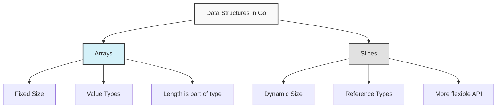

# Go Arrays

Arrays are one of the fundamental data structures in Go that allow you to store multiple values of the same type in a sequential collection. Unlike slices, arrays in Go have a fixed size that must be defined at creation time.

## Introduction to Arrays

An array in Go is a numbered sequence of elements of a specific length. The key characteristics of Go arrays are:

- **Fixed size**: The length of an array is part of its type and cannot be changed after declaration
- **Same type**: All elements in an array must be of the same data type
- **Zero-indexed**: Array indices start at 0, not 1
- **Memory efficiency**: Arrays are stored in contiguous memory locations

## Declaring and Initializing Arrays

### Basic Array Declaration

The syntax for declaring an array in Go is:

```go
var arrayName [size]dataType
```

For example:

```go
var numbers [5]int // Declares an array of 5 integers
```

When you declare an array without initialization, Go automatically initializes each element to the zero value of the array's type (0 for numbers, false for booleans, "" for strings).

### Array Initialization with Values

You can initialize an array with values at declaration time:

```go
var fruits [3]string = [3]string{"apple", "banana", "orange"}
```

Go also provides shorthand syntax:

```go
fruits := [3]string{"apple", "banana", "orange"}
```

### Using the Ellipsis Operator

If you don't want to count the elements, you can use the ellipsis operator (`...`):

```go
colors := [...]string{"red", "green", "blue", "yellow"} // Length is determined by number of elements
```

### Example: Array Declaration and Initialization

```go
package main

import "fmt"

func main() {
    // Declare an array of 5 integers (initialized to zeros)
    var scores [5]int
    fmt.Println("Empty scores array:", scores)
    
    // Initialize with values
    grades := [4]int{98, 87, 92, 83}
    fmt.Println("Grades:", grades)
    
    // Using ellipsis
    cities := [...]string{"New York", "London", "Tokyo", "Paris", "Sydney"}
    fmt.Println("Cities:", cities)
    fmt.Println("Number of cities:", len(cities))
}
```

Output:
```
Empty scores array: [0 0 0 0 0]
Grades: [98 87 92 83]
Cities: [New York London Tokyo Paris Sydney]
Number of cities: 5
```

## Accessing and Modifying Array Elements

### Accessing Elements

You can access individual elements of an array using the index syntax:

```go
arrayName[index]
```

Remember that indices start from 0, so the first element is at index 0.

### Modifying Elements

You can modify the value of an array element by assigning a new value to a specific index:

```go
arrayName[index] = newValue
```

### Example: Accessing and Modifying Array Elements

```go
package main

import "fmt"

func main() {
    temperatures := [7]float64{23.5, 25.1, 24.8, 26.3, 27.9, 26.2, 24.5}
    
    // Accessing elements
    fmt.Println("First day temperature:", temperatures[0])
    fmt.Println("Third day temperature:", temperatures[2])
    
    // Modifying elements
    temperatures[1] = 25.8
    fmt.Println("Updated temperatures:", temperatures)
    
    // Getting the last element
    lastIndex := len(temperatures) - 1
    fmt.Println("Last day temperature:", temperatures[lastIndex])
}
```

Output:
```
First day temperature: 23.5
Third day temperature: 24.8
Updated temperatures: [23.5 25.8 24.8 26.3 27.9 26.2 24.5]
Last day temperature: 24.5
```

## Array Operations

### Finding the Length of an Array

The `len()` function returns the number of elements in an array:

```go
arrayLength := len(arrayName)
```

### Iterating Over Arrays

You can iterate over arrays using loops. The two most common approaches are:

1. Using a **for loop with index**:

```go
for i := 0; i < len(arrayName); i++ {
    // Access elements with arrayName[i]
}
```

2. Using a **for-range loop**:

```go
for index, value := range arrayName {
    // Process index and value
}
```

### Example: Array Iteration

```go
package main

import "fmt"

func main() {
    prices := [4]float64{10.99, 8.75, 15.50, 7.25}
    
    // Using traditional for loop
    fmt.Println("Using traditional for loop:")
    sum := 0.0
    for i := 0; i < len(prices); i++ {
        fmt.Printf("Item %d: $%.2f
", i+1, prices[i])
        sum += prices[i]
    }
    
    // Using for-range loop
    fmt.Println("
Using for-range loop:")
    total := 0.0
    for index, price := range prices {
        fmt.Printf("Item %d: $%.2f
", index+1, price)
        total += price
    }
    
    fmt.Printf("
Total price: $%.2f
", total)
}
```

Output:
```
Using traditional for loop:
Item 1: $10.99
Item 2: $8.75
Item 3: $15.50
Item 4: $7.25

Using for-range loop:
Item 1: $10.99
Item 2: $8.75
Item 3: $15.50
Item 4: $7.25

Total price: $42.49
```

## Multi-dimensional Arrays

Go supports multi-dimensional arrays, which are essentially arrays of arrays. The most common type is the two-dimensional array, which can be visualized as a table with rows and columns.

### Declaring a 2D Array

```go
var matrix [rows][columns]dataType
```

### Example: 2D Arrays

```go
package main

import "fmt"

func main() {
    // Declare a 3x3 matrix
    var matrix [3][3]int
    
    // Initialize with values
    grid := [2][3]int{
        {1, 2, 3},
        {4, 5, 6},
    }
    
    fmt.Println("Empty matrix:", matrix)
    fmt.Println("Grid:", grid)
    
    // Accessing elements
    fmt.Println("Grid[0][2]:", grid[0][2])  // Outputs: 3
    
    // Modifying elements
    grid[1][0] = 10
    fmt.Println("Modified grid:", grid)
    
    // Iterating over a 2D array
    fmt.Println("
Grid values:")
    for i := 0; i < len(grid); i++ {
        for j := 0; j < len(grid[i]); j++ {
            fmt.Printf("%d ", grid[i][j])
        }
        fmt.Println()
    }
}
```

Output:
```
Empty matrix: [[0 0 0] [0 0 0] [0 0 0]]
Grid: [[1 2 3] [4 5 6]]
Grid[0][2]: 3
Modified grid: [[1 2 3] [10 5 6]]

Grid values:
1 2 3 
10 5 6 
```

## Arrays vs. Slices in Go

