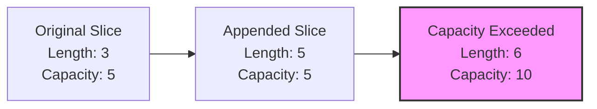

# Go Slices

## Introduction

In Go programming, slices are one of the most powerful and frequently used data structures. While arrays in Go have a fixed size, slices are dynamic, flexible, and provide a more convenient interface for sequence operations. Think of slices as flexible views into arrays - they allow you to work with sequences of data more efficiently.

This tutorial will walk you through everything you need to know about Go slices as a beginner, from basic concepts to practical applications, with plenty of examples along the way.

## What is a Slice?

A slice is a reference to a contiguous segment of an array. Unlike arrays, slices are not fixed in size and can grow or shrink as needed. A slice consists of three components:

1. A pointer to the first element
2. The length (number of elements in the slice)
3. The capacity (maximum number of elements the slice can hold before needing to reallocate)

<div className="text-center">
    ```mermaid
    graph TD
    A[Slice] --> B[Pointer to Array]
    A --> C[Length]
    A --> D[Capacity]
    B --> E[Array in Memory]
    ```
</div>

## Creating Slices

There are several ways to create slices in Go:

### 1. Using the slice literal

```go
// Creates a slice with 3 elements
numbers := []int{1, 2, 3}
fmt.Println(numbers) // Output: [1 2 3]
```

### 2. Using the `make` function

```go
// make(type, length, capacity)
// Creates a slice with length 5 and capacity 10
scores := make([]int, 5, 10)
fmt.Println(scores) // Output: [0 0 0 0 0]
fmt.Println(len(scores)) // Output: 5
fmt.Println(cap(scores)) // Output: 10
```

### 3. Creating a slice from an array

```go
// Create an array
arr := [5]int{10, 20, 30, 40, 50}

// Create a slice from the array
slice := arr[1:4] // Elements from index 1 to 3

fmt.Println(slice) // Output: [20 30 40]
```

### 4. Using the `new` keyword with `make`

```go
// Using new and make together
ptr := new([10]int)
slice := make([]int, 10)

fmt.Println(ptr)   // Output: &[0 0 0 0 0 0 0 0 0 0]
fmt.Println(slice) // Output: [0 0 0 0 0 0 0 0 0 0]
```

## Slice Operations

### Accessing Elements

Access elements of a slice using the index notation:

```go
fruits := []string{"apple", "banana", "cherry"}
fmt.Println(fruits[1]) // Output: banana
```

### Slicing a Slice

You can create a new slice from an existing slice:

```go
numbers := []int{0, 1, 2, 3, 4, 5, 6, 7, 8, 9}
subset := numbers[2:5]
fmt.Println(subset) // Output: [2 3 4]

// Omitting the start index defaults to 0
fromStart := numbers[:3]
fmt.Println(fromStart) // Output: [0 1 2]

// Omitting the end index defaults to length
toEnd := numbers[7:]
fmt.Println(toEnd) // Output: [7 8 9]

// Copy all elements
copyAll := numbers[:]
fmt.Println(copyAll) // Output: [0 1 2 3 4 5 6 7 8 9]
```

### Modifying Slices

Slices are references to underlying arrays, so changing the elements of a slice modifies the underlying array:

```go
array := [5]int{1, 2, 3, 4, 5}
slice := array[1:4]
fmt.Println(slice) // Output: [2 3 4]

slice[0] = 20
fmt.Println(slice) // Output: [20 3 4]
fmt.Println(array) // Output: [1 20 3 4 5] - Note how the array was modified
```

## Slice Length and Capacity

The length of a slice is the number of elements it contains, while the capacity is the maximum number of elements it can hold before needing to reallocate memory.

```go
numbers := make([]int, 3, 5)
fmt.Printf("Length: %d, Capacity: %d
", len(numbers), cap(numbers))
// Output: Length: 3, Capacity: 5

// Adding elements will increase length but not capacity (until capacity is exceeded)
numbers = append(numbers, 1, 2)
fmt.Printf("Length: %d, Capacity: %d
", len(numbers), cap(numbers))
// Output: Length: 5, Capacity: 5

// Adding more elements will cause reallocation, typically doubling the capacity
numbers = append(numbers, 3)
fmt.Printf("Length: %d, Capacity: %d
", len(numbers), cap(numbers))
// Output: Length: 6, Capacity: 10
```





## The `append` Function

The `append` function is used to add elements to a slice:

```go
numbers := []int{1, 2, 3}
fmt.Println(numbers) // Output: [1 2 3]

// Append one element
numbers = append(numbers, 4)
fmt.Println(numbers) // Output: [1 2 3 4]

// Append multiple elements
numbers = append(numbers, 5, 6, 7)
fmt.Println(numbers) // Output: [1 2 3 4 5 6 7]

// Append another slice
moreNumbers := []int{8, 9, 10}
numbers = append(numbers, moreNumbers...)
fmt.Println(numbers) // Output: [1 2 3 4 5 6 7 8 9 10]
```

:::tip
The three dots (`...`) after `moreNumbers` is called the "ellipsis" operator. It unpacks the slice so that each element is passed as a separate argument to `append`.
:::

## Copying Slices

To create an independent copy of a slice, use the `copy` function:

```go
original := []int{1, 2, 3, 4, 5}

duplicate := make([]int, len(original))
copied := copy(duplicate, original)

fmt.Println(original)  // Output: [1 2 3 4 5]
fmt.Println(duplicate) // Output: [1 2 3 4 5]
fmt.Println(copied)    // Output: 5 (number of elements copied)

// Now modifying duplicate will not affect original
duplicate[0] = 99
fmt.Println(original)  // Output: [1 2 3 4 5]
fmt.Println(duplicate) // Output: [99 2 3 4 5]
```

## Nil and Empty Slices

A nil slice has a length and capacity of 0 and no underlying array:

```go
var nilSlice []int
fmt.Println(nilSlice, len(nilSlice), cap(nilSlice)) 
// Output: [] 0 0
fmt.Println(nilSlice == nil) // Output: true
```

An empty slice has a length and capacity of 0 but has an underlying array:

```go
emptySlice := []int{}
fmt.Println(emptySlice, len(emptySlice), cap(emptySlice)) 
// Output: [] 0 0
fmt.Println(emptySlice == nil) // Output: false
```

:::note
Although both nil and empty slices print as `[]`, they are not the same. It's often preferable to return an empty slice rather than a nil slice to keep behavior consistent.
:::

## Practical Examples

### Example 1: Building a Queue

```go
package main

import "fmt"

func main() {
    // Initialize a queue
    var queue []string
    
    // Enqueue operations
    queue = append(queue, "First")
    queue = append(queue, "Second")
    queue = append(queue, "Third")
    
    fmt.Println("Queue:", queue) 
    // Output: Queue: [First Second Third]
    
    // Dequeue operation
    var item string
    item, queue = queue[0], queue[1:]
    fmt.Println("Dequeued:", item) 
    // Output: Dequeued: First
    
    fmt.Println("Queue after dequeue:", queue) 
    // Output: Queue after dequeue: [Second Third]
}
```

### Example 2: Implementing a Stack

```go
package main

import "fmt"

func main() {
    // Initialize a stack
    var stack []string
    
    // Push operations
    stack = append(stack, "Bottom")
    stack = append(stack, "Middle")
    stack = append(stack, "Top")
    
    fmt.Println("Stack:", stack) 
    // Output: Stack: [Bottom Middle Top]
    
    // Pop operation
    var item string
    item, stack = stack[len(stack)-1], stack[:len(stack)-1]
    fmt.Println("Popped:", item) 
    // Output: Popped: Top
    
    fmt.Println("Stack after pop:", stack) 
    // Output: Stack after pop: [Bottom Middle]
}
```

### Example 3: Filtering a Slice

```go
package main

import "fmt"

func main() {
    numbers := []int{1, 2, 3, 4, 5, 6, 7, 8, 9, 10}
    
    // Filter even numbers
    var evenNumbers []int
    for _, num := range numbers {
        if num%2 == 0 {
            evenNumbers = append(evenNumbers, num)
        }
    }
    
    fmt.Println("Original numbers:", numbers)
    // Output: Original numbers: [1 2 3 4 5 6 7 8 9 10]
    
    fmt.Println("Even numbers:", evenNumbers)
    // Output: Even numbers: [2 4 6 8 10]
}
```

### Example 4: Dynamic Data Collection

This example shows how slices can be used to collect data with an unknown size at the start:

```go
package main

import (
    "fmt"
    "math/rand"
    "time"
)

func main() {
    // Set random seed
    rand.Seed(time.Now().UnixNano())
    
    // Dynamic data collection
    var dataPoints []int
    target := rand.Intn(10) + 5 // Random number between 5 and 14
    
    fmt.Println("Collecting data points until we reach target:", target)
    
    // Collect random data points until we reach the target
    for i := 0; len(dataPoints) < target; i++ {
        // Only collect even values
        value := rand.Intn(100)
        if value%2 == 0 {
            dataPoints = append(dataPoints, value)
            fmt.Printf("Collected value: %d, Total points: %d
", 
                      value, len(dataPoints))
        }
    }
    
    fmt.Println("Final data collection:", dataPoints)
    fmt.Printf("Collected %d data points
", len(dataPoints))
}
```

## Common Slice Patterns and Tricks

### 1. Removing an Element

Remove an element at index `i`:

```go
// Remove element at index 2
numbers := []int{1, 2, 3, 4, 5}
i := 2
numbers = append(numbers[:i], numbers[i+1:]...)
fmt.Println(numbers) // Output: [1 2 4 5]
```

### 2. Clearing a Slice

```go
// Method 1: Reslice to zero length (keeps capacity)
numbers := []int{1, 2, 3, 4, 5}
numbers = numbers[:0]
fmt.Println(numbers, len(numbers), cap(numbers))
// Output: [] 0 5

// Method 2: Assign nil (releases memory)
numbers = nil
fmt.Println(numbers, len(numbers), cap(numbers))
// Output: [] 0 0
```

### 3. Reversing a Slice

```go
numbers := []int{1, 2, 3, 4, 5}
for i, j := 0, len(numbers)-1; i < j; i, j = i+1, j-1 {
    numbers[i], numbers[j] = numbers[j], numbers[i]
}
fmt.Println(numbers) // Output: [5 4 3 2 1]
```

## Performance Considerations

When working with slices, keep these performance aspects in mind:

1. **Preallocation**: If you know the final size of your slice, preallocate it using `make` to avoid frequent reallocations:

```go
// Instead of:
var numbers []int
for i := 0; i < 10000; i++ {
    numbers = append(numbers, i) // Many reallocations
}

// Do this:
numbers := make([]int, 0, 10000)
for i := 0; i < 10000; i++ {
    numbers = append(numbers, i) // No reallocations
}
```

2. **Avoid creating huge temporary slices**: Be mindful of memory usage when working with large slices.

3. **Know your slice internals**: Remember that slices are references to arrays, which might lead to unintended modifications to the original data.

## Common Pitfalls

### 1. Unexpected Sharing of Data

```go
original := []int{1, 2, 3, 4, 5}
slice1 := original[1:3]
slice2 := original[2:4]

fmt.Println(slice1) // Output: [2 3]
fmt.Println(slice2) // Output: [3 4]

// Modifying one slice affects the other:
slice1[1] = 30
fmt.Println(slice1) // Output: [2 30]
fmt.Println(slice2) // Output: [30 4] - Note how slice2[0] changed!
fmt.Println(original) // Output: [1 2 30 4 5]
```

### 2. Appending to a Slice Might Create a New Backing Array

```go
numbers := make([]int, 3, 4)
numbers[0], numbers[1], numbers[2] = 1, 2, 3
fmt.Println(numbers, len(numbers), cap(numbers)) 
// Output: [1 2 3] 3 4

// Create a view slice
view := numbers[1:3]
fmt.Println(view, len(view), cap(view)) 
// Output: [2 3] 2 3

// Append to the original slice
numbers = append(numbers, 4)
numbers[1] = 20
fmt.Println(numbers) // Output: [1 20 3 4]
fmt.Println(view) // Output: [2 3] - view is unchanged!

// Append one more element - this exceeds capacity
numbers = append(numbers, 5)
numbers[2] = 30
fmt.Println(numbers) // Output: [1 20 30 4 5]
fmt.Println(view) // Output: [2 3] - Still unchanged!
```

## Summary

Go slices are flexible, dynamic data structures that provide a convenient way to work with sequences of data. The key points to remember about slices are:

- Slices are references to arrays and consist of a pointer, length, and capacity
- They can be created using slice literals, the `make` function, or by slicing existing arrays/slices
- The `append` function is used to add elements to a slice
- Slices can grow and shrink dynamically
- The underlying memory is automatically managed by the Go runtime
- When working with slices, be aware of the sharing of the backing array

Mastering slices is essential for effective Go programming as they are used extensively in Go's standard library and most Go applications.

## Exercises

1. **Basic Slice Operations**: Create a program that initializes a slice with numbers 1-10, then creates three different sub-slices from it. Print the length and capacity of each sub-slice.

2. **Slice Filtering**: Write a function that takes a slice of integers and returns a new slice containing only the odd numbers.

3. **Custom Append Function**: Implement your own version of the `append` function that takes a slice and a value, and returns a new slice with the value appended.

4. **Slice Rotation**: Write a function that rotates the elements of a slice by `n` positions. For example, rotating `[1, 2, 3, 4, 5]` by 2 would give `[4, 5, 1, 2, 3]`.

5. **Matrix Operations**: Create a 3x3 matrix using a slice of slices. Implement functions to transpose the matrix and to get the diagonal elements.

## Additional Resources

- [Go Tour: Slices](https://tour.golang.org/moretypes/7)
- [Go Blog: Slices Usage and Internals](https://blog.golang.org/slices-intro)
- [Effective Go: Slices](https://golang.org/doc/effective_go.html#slices)
- [Go Package Documentation](https://golang.org/pkg/)
- Book: "The Go Programming Language" by Alan A. A. Donovan and Brian W. Kernighan

Happy coding with Go slices!