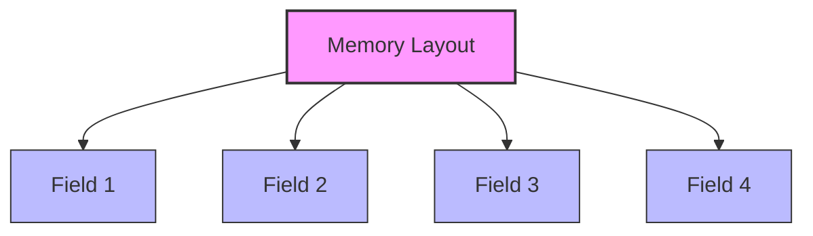

# Go Structs

## Introduction

In Go programming, a **struct** (short for structure) is a composite data type that groups together variables under a single name. Think of a struct as a lightweight class without methods - it's essentially a collection of fields, each with a name and a type. Structs are fundamental to organizing and managing related data in Go programs.

Unlike arrays or slices that group elements of the same type, structs allow you to create a single entity that can hold different types of data. This makes structs perfect for representing real-world entities like users, products, or any concept that has multiple attributes.

## Basic Struct Syntax

### Defining a Struct

Here's the basic syntax for defining a struct in Go:

```go
type StructName struct {
    field1 Type1
    field2 Type2
    field3 Type3
    // More fields...
}
```

Let's create a simple example - a `Person` struct:

```go
type Person struct {
    FirstName string
    LastName  string
    Age       int
    Email     string
}
```

This `Person` struct has four fields of different types that collectively represent information about a person.

### Creating Struct Instances

There are several ways to create instances of a struct in Go:

#### 1. Using the Struct Literal Syntax

```go
package main

import "fmt"

func main() {
    // Create a new Person
    person1 := Person{
        FirstName: "John",
        LastName:  "Doe",
        Age:       30,
        Email:     "john.doe@example.com",
    }
    
    fmt.Println(person1)
}
```

**Output:**
```
{John Doe 30 john.doe@example.com}
```

#### 2. Omitting Field Names (Order Matters!)

```go
person2 := Person{"Jane", "Smith", 28, "jane.smith@example.com"}
fmt.Println(person2)
```

**Output:**
```
{Jane Smith 28 jane.smith@example.com}
```

#### 3. Creating a Partial Struct

You can initialize only specific fields, and the rest will have their zero values:

```go
person3 := Person{
    FirstName: "Alex",
    LastName:  "Johnson",
    // Age and Email will have zero values (0 and "")
}

fmt.Println(person3)
```

**Output:**
```
{Alex Johnson 0 }
```

#### 4. Creating an Empty Struct

```go
var person4 Person
fmt.Println(person4)
```

**Output:**
```
{ 0 }
```

## Accessing and Modifying Struct Fields

You can access and modify struct fields using the dot notation:

```go
package main

import "fmt"

type Person struct {
    FirstName string
    LastName  string
    Age       int
    Email     string
}

func main() {
    person := Person{
        FirstName: "John",
        LastName:  "Doe",
        Age:       30,
        Email:     "john.doe@example.com",
    }
    
    // Accessing fields
    fmt.Println("First Name:", person.FirstName)
    fmt.Println("Last Name:", person.LastName)
    fmt.Println("Age:", person.Age)
    fmt.Println("Email:", person.Email)
    
    // Modifying fields
    person.Age = 31
    person.Email = "john.doe.updated@example.com"
    
    fmt.Println("
After modification:")
    fmt.Println("Age:", person.Age)
    fmt.Println("Email:", person.Email)
}
```

**Output:**
```
First Name: John
Last Name: Doe
Age: 30
Email: john.doe@example.com

After modification:
Age: 31
Email: john.doe.updated@example.com
```

## Nested Structs

Structs can contain other structs as fields, allowing you to create more complex data structures:

```go
package main

import "fmt"

type Address struct {
    Street  string
    City    string
    State   string
    Zipcode string
    Country string
}

type Person struct {
    FirstName string
    LastName  string
    Age       int
    Address   Address
    Email     string
}

func main() {
    person := Person{
        FirstName: "John",
        LastName:  "Doe",
        Age:       30,
        Address: Address{
            Street:  "123 Main St",
            City:    "Anytown",
            State:   "CA",
            Zipcode: "12345",
            Country: "USA",
        },
        Email: "john.doe@example.com",
    }
    
    // Accessing nested struct fields
    fmt.Println("Person:", person.FirstName, person.LastName)
    fmt.Println("Lives at:", person.Address.Street)
    fmt.Println("City:", person.Address.City)
}
```

**Output:**
```
Person: John Doe
Lives at: 123 Main St
City: Anytown
```

## Anonymous Structs

Go allows you to create structs without defining a new type. These are called anonymous structs:

```go
package main

import "fmt"

func main() {
    // Anonymous struct
    employee := struct {
        Name   string
        ID     int
        Role   string
        Active bool
    }{
        Name:   "Sarah Connor",
        ID:     12345,
        Role:   "Developer",
        Active: true,
    }
    
    fmt.Println("Employee:", employee.Name)
    fmt.Println("Role:", employee.Role)
}
```

**Output:**
```
Employee: Sarah Connor
Role: Developer
```

Anonymous structs are useful for one-time use cases where you don't need to reuse the struct type.

## Struct Methods

While structs themselves don't have methods, you can associate methods with struct types in Go using method receivers:

```go
package main

import "fmt"

type Rectangle struct {
    Width  float64
    Height float64
}

// Method with a receiver of type Rectangle
func (r Rectangle) Area() float64 {
    return r.Width * r.Height
}

// Method that modifies the receiver
func (r *Rectangle) Scale(factor float64) {
    r.Width *= factor
    r.Height *= factor
}

func main() {
    rect := Rectangle{Width: 10.0, Height: 5.0}
    
    fmt.Printf("Rectangle: %.2f x %.2f
", rect.Width, rect.Height)
    fmt.Printf("Area: %.2f
", rect.Area())
    
    // Calling a method that modifies the struct
    rect.Scale(2.0)
    
    fmt.Printf("After scaling: %.2f x %.2f
", rect.Width, rect.Height)
    fmt.Printf("New area: %.2f
", rect.Area())
}
```

**Output:**
```
Rectangle: 10.00 x 5.00
Area: 50.00
After scaling: 20.00 x 10.00
New area: 200.00
```

## Embedded Structs (Composition)

Go doesn't support inheritance like traditional object-oriented languages, but it provides a powerful feature called embedding that allows for composition:

```go
package main

import "fmt"

type Person struct {
    FirstName string
    LastName  string
    Age       int
}

type Employee struct {
    Person  // Embedded struct
    CompanyID int
    Position  string
    Salary    float64
}

func main() {
    emp := Employee{
        Person: Person{
            FirstName: "John",
            LastName:  "Doe",
            Age:       30,
        },
        CompanyID: 1001,
        Position:  "Software Engineer",
        Salary:    75000,
    }
    
    // Access fields from the embedded struct directly
    fmt.Println("Employee:", emp.FirstName, emp.LastName)
    fmt.Println("Position:", emp.Position)
    
    // You can also access fields through the embedded struct name
    fmt.Println("Age:", emp.Person.Age)
}
```

**Output:**
```
Employee: John Doe
Position: Software Engineer
Age: 30
```

This is known as composition in Go - the `Employee` struct has all the fields and methods of the `Person` struct, plus its own specific fields.

## Struct Tags

Go allows you to add metadata to struct fields using tags. These tags are string literals that provide additional information about fields:

```go
package main

import (
    "encoding/json"
    "fmt"
)

type User struct {
    Username string `json:"username"`
    Password string `json:"-"`              // Ignore this field when marshaling to JSON
    Email    string `json:"email,omitempty"` // Omit if empty
    Age      int    `json:"age,omitempty"`
}

func main() {
    user := User{
        Username: "johndoe",
        Password: "secret123",
        Email:    "john@example.com",
        Age:      0,  // Zero value will be omitted due to omitempty tag
    }
    
    // Convert struct to JSON
    userData, _ := json.Marshal(user)
    fmt.Println(string(userData))
}
```

**Output:**
```
{"username":"johndoe","email":"john@example.com"}
```

Notice how the `Password` field is completely omitted, and the `Age` field is omitted because it's empty.

Struct tags are commonly used with:
- JSON encoding/decoding
- XML processing
- Form handling
- Database operations (like GORM or SQLx)

## Memory Layout and Efficiency

Understanding how structs are laid out in memory can be important for performance-critical applications:



The Go compiler may add padding between fields to align them properly in memory. Field order can affect the size of your struct:

```go
package main

import (
    "fmt"
    "unsafe"
)

// Poorly ordered fields (causes padding)
type Inefficient struct {
    a bool    // 1 byte
    // 7 bytes padding here
    b int64   // 8 bytes
    c bool    // 1 byte
    // 7 bytes padding here
}

// Better ordered fields
type Efficient struct {
    b int64   // 8 bytes
    a bool    // 1 byte
    c bool    // 1 byte
    // 6 bytes padding here
}

func main() {
    fmt.Printf("Size of Inefficient: %d bytes
", unsafe.Sizeof(Inefficient{}))
    fmt.Printf("Size of Efficient: %d bytes
", unsafe.Sizeof(Efficient{}))
}
```

**Output:**
```
Size of Inefficient: 24 bytes
Size of Efficient: 16 bytes
```

For large applications with millions of struct instances, these optimizations can make a significant difference.

## Real-world Example: Building a Simple Inventory System

Let's put everything together and create a simple inventory system:

```go
package main

import (
    "fmt"
    "time"
)

type Product struct {
    ID          int
    Name        string
    Description string
    Price       float64
    Category    string
    CreatedAt   time.Time
}

type Inventory struct {
    Products []Product
}

// Add a product to inventory
func (inv *Inventory) AddProduct(p Product) {
    inv.Products = append(inv.Products, p)
}

// Find a product by ID
func (inv *Inventory) FindProductByID(id int) (Product, bool) {
    for _, product := range inv.Products {
        if product.ID == id {
            return product, true
        }
    }
    return Product{}, false
}

// Calculate total inventory value
func (inv *Inventory) TotalValue() float64 {
    total := 0.0
    for _, product := range inv.Products {
        total += product.Price
    }
    return total
}

func main() {
    // Create a new inventory
    inventory := Inventory{}
    
    // Add some products
    inventory.AddProduct(Product{
        ID:          1,
        Name:        "Laptop",
        Description: "High performance laptop",
        Price:       1299.99,
        Category:    "Electronics",
        CreatedAt:   time.Now(),
    })
    
    inventory.AddProduct(Product{
        ID:          2,
        Name:        "Desk Chair",
        Description: "Ergonomic office chair",
        Price:       249.99,
        Category:    "Furniture",
        CreatedAt:   time.Now(),
    })
    
    // Find a product
    if product, found := inventory.FindProductByID(1); found {
        fmt.Println("Product found:", product.Name)
        fmt.Printf("Price: $%.2f
", product.Price)
    }
    
    // Calculate total inventory value
    fmt.Printf("Total inventory value: $%.2f
", inventory.TotalValue())
}
```

**Output:**
```
Product found: Laptop
Price: $1299.99
Total inventory value: $1549.98
```

This example demonstrates how structs can be used to model real-world entities (products) and how methods attached to structs can provide operations on those entities.

## Summary

In this article, we explored Go structs, a fundamental building block for organizing and working with related data in Go:

- **Basics**: Learned how to define and create struct instances
- **Field Access**: Saw how to access and modify struct fields
- **Nested Structs**: Created more complex data structures with struct composition
- **Anonymous Structs**: Created one-time-use structs without type definitions
- **Methods**: Added behavior to structs through method receivers
- **Embedding**: Used composition to build more complex types
- **Struct Tags**: Added metadata to fields for various Go libraries
- **Memory Layout**: Learned about memory efficiency considerations
- **Real-world Example**: Built a simple inventory system using structs

Structs in Go provide a clean, simple way to organize related data and are the foundation for building more complex data types and designing efficient programs. They are used extensively in Go programming, from simple data storage to complex web servers and systems applications.

## Exercises

To reinforce your understanding of Go structs, try these exercises:

1. Create a `Book` struct with fields for title, author, publication year, and price. Create a library catalog that can add books and search by author.

2. Design a `BankAccount` struct with methods for deposit, withdrawal, and checking balance. Ensure that withdrawals cannot exceed the current balance.

3. Implement a simple student management system with `Student` and `Course` structs. Add methods to register students for courses and calculate GPA.

4. Create a `Shape` interface with an `Area()` method, then implement various struct types (Rectangle, Circle, Triangle) that satisfy this interface.

5. Build a simple blog system with `Post`, `Author`, and `Comment` structs, demonstrating nested structs and slices of structs.

## Additional Resources

- [Go Documentation on Structs](https://go.dev/tour/moretypes/2)
- [Effective Go: Structs](https://golang.org/doc/effective_go#structs)
- Book: "The Go Programming Language" by Alan A. A. Donovan and Brian W. Kernighan
- [Go by Example: Structs](https://gobyexample.com/structs)
- [50 Shades of Go: Traps, Gotchas, and Common Mistakes](http://devs.cloudimmunity.com/gotchas-and-common-mistakes-in-go-golang/)