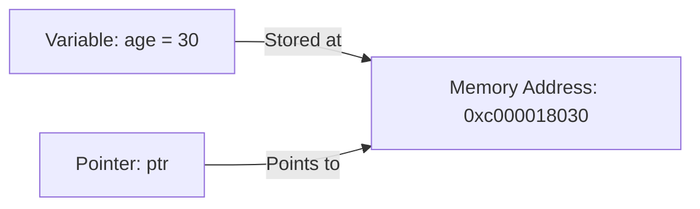

# Go Pointers

## Introduction

Pointers are one of the most powerful yet sometimes intimidating features in Go. At their core, pointers allow you to reference a memory location rather than the actual value stored there. This provides more efficient memory usage and enables you to modify variables across different scopes.

In this tutorial, we'll demystify Go pointers, explain how they work, when to use them, and walk through practical examples that showcase their benefits. By the end, you'll be comfortable using pointers in your Go programs.

## What is a Pointer?

In Go, every variable is stored somewhere in memory with a specific address. A pointer is simply a variable that holds the memory address of another variable instead of holding a concrete value itself.

Here's a visual representation:



Think of it like this: if a regular variable is a house with a value inside, a pointer is like having the address to that house. With that address, you can go to the house and change what's inside.

## Pointer Basics

### Declaring Pointers

To declare a pointer in Go, you use the asterisk (`*`) symbol followed by the data type:

```go
var ptr *int    // Declares a pointer to an integer
var strPtr *string  // Declares a pointer to a string
```

When you declare a pointer without initializing it, its default value is `nil`.

### Getting a Memory Address

To get the memory address of a variable, use the ampersand (`&`) operator:

```go
package main

import "fmt"

func main() {
    age := 30
    var agePtr *int = &age  // agePtr now holds the memory address of age
    
    fmt.Println("Value of age:", age)
    fmt.Println("Address of age:", &age)
    fmt.Println("Value of agePtr:", agePtr)
    
    // Output:
    // Value of age: 30
    // Address of age: 0xc000018030 (this address will vary)
    // Value of agePtr: 0xc000018030 (same as address of age)
}
```

### Dereferencing Pointers

To access or modify the value that a pointer points to, you use the dereference operator (`*`):

```go
package main

import "fmt"

func main() {
    count := 42
    countPtr := &count
    
    fmt.Println("count:", count)          // 42
    fmt.Println("countPtr:", countPtr)     // Memory address (e.g., 0xc000018038)
    fmt.Println("*countPtr:", *countPtr)   // 42 (value at that memory address)
    
    // Modifying the value using the pointer
    *countPtr = 100
    fmt.Println("After modification:")
    fmt.Println("count:", count)          // 100 (changed!)
    fmt.Println("*countPtr:", *countPtr)   // 100
}
```

## Common Pointer Operations

### Creating and Using Pointers

```go
package main

import "fmt"

func main() {
    // Creating a pointer using the address of a variable
    message := "Hello, world!"
    messagePtr := &message
    
    fmt.Println("Original message:", message)
    
    // Modifying the value through the pointer
    *messagePtr = "Hello, Go pointers!"
    
    fmt.Println("Modified message:", message)
    
    // Output:
    // Original message: Hello, world!
    // Modified message: Hello, Go pointers!
}
```

### The `new` Function

Go provides the `new` function to create a pointer to a zeroed value of the specified type:

```go
package main

import "fmt"

func main() {
    // Create a pointer to an integer with zero value (0)
    ptr := new(int)
    
    fmt.Println("Value of *ptr:", *ptr)  // 0
    
    // Modify the value
    *ptr = 42
    fmt.Println("After modification:", *ptr)  // 42
}
```

### Pointers to Structs

Pointers are commonly used with structs:

```go
package main

import "fmt"

type Person struct {
    Name string
    Age  int
}

func main() {
    // Creating a struct
    alex := Person{Name: "Alex", Age: 28}
    
    // Creating a pointer to the struct
    alexPtr := &alex
    
    // Accessing struct fields through pointer
    // Go allows both notations:
    fmt.Println("Name (using *alexPtr):", (*alexPtr).Name)  // Traditional way
    fmt.Println("Name (simplified):", alexPtr.Name)        // Go's shorthand
    
    // Modifying struct field through pointer
    alexPtr.Age = 29
    fmt.Println("Updated age:", alex.Age)  // 29
}
```

## When to Use Pointers

### 1. Modifying Function Parameters

One common use of pointers is to allow functions to modify their parameters:

```go
package main

import "fmt"

// This function doesn't modify the original variables
func doubleValues(a, b int) {
    a *= 2
    b *= 2
    fmt.Println("Inside function - a:", a, "b:", b)
}

// This function modifies the original variables
func doubleValuesWithPointers(a, b *int) {
    *a *= 2
    *b *= 2
    fmt.Println("Inside function - a:", *a, "b:", *b)
}

func main() {
    x, y := 5, 10
    
    // Call without pointers
    fmt.Println("Before calling doubleValues - x:", x, "y:", y)
    doubleValues(x, y)
    fmt.Println("After calling doubleValues - x:", x, "y:", y)
    
    // Call with pointers
    fmt.Println("
Before calling doubleValuesWithPointers - x:", x, "y:", y)
    doubleValuesWithPointers(&x, &y)
    fmt.Println("After calling doubleValuesWithPointers - x:", x, "y:", y)
    
    // Output:
    // Before calling doubleValues - x: 5 y: 10
    // Inside function - a: 10 b: 20
    // After calling doubleValues - x: 5 y: 10
    // 
    // Before calling doubleValuesWithPointers - x: 5 y: 10
    // Inside function - a: 10 b: 20
    // After calling doubleValuesWithPointers - x: 10 y: 20
}
```

### 2. Efficient Passing of Large Structures

For large data structures, passing a pointer is more efficient than copying the entire structure:

```go
package main

import "fmt"

type LargeStruct struct {
    Data [1000]int
    Name string
}

// Receives a pointer to avoid copying the large struct
func processLargeStruct(ls *LargeStruct) {
    ls.Name = "Processed"
    // Process data...
}

func main() {
    myData := LargeStruct{Name: "Original"}
    
    // Fill with sample data
    for i := range myData.Data {
        myData.Data[i] = i
    }
    
    fmt.Println("Name before processing:", myData.Name)
    
    // Pass pointer to the function
    processLargeStruct(&myData)
    
    fmt.Println("Name after processing:", myData.Name)
    
    // Output:
    // Name before processing: Original
    // Name after processing: Processed
}
```

### 3. Implementing Methods with Receiver Pointers

Go methods can use pointer receivers to modify the struct they're called on:

```go
package main

import "fmt"

type Counter struct {
    count int
}

// Value receiver - doesn't modify the original Counter
func (c Counter) Increment() {
    c.count++
    fmt.Println("Inside value method:", c.count)
}

// Pointer receiver - modifies the original Counter
func (c *Counter) IncrementWithPointer() {
    c.count++
    fmt.Println("Inside pointer method:", c.count)
}

func main() {
    counter := Counter{count: 0}
    
    fmt.Println("Initial counter:", counter.count)
    
    counter.Increment()
    fmt.Println("After Increment():", counter.count)
    
    counter.IncrementWithPointer()
    fmt.Println("After IncrementWithPointer():", counter.count)
    
    // Output:
    // Initial counter: 0
    // Inside value method: 1
    // After Increment(): 0
    // Inside pointer method: 1
    // After IncrementWithPointer(): 1
}
```

## Nil Pointers and Pointer Safety

A pointer that doesn't point to anything has the value `nil`. Attempting to dereference a `nil` pointer will cause your program to crash with a panic:

```go
package main

import "fmt"

func main() {
    var ptr *int  // Initialized as nil
    
    // Safe check before dereferencing
    if ptr != nil {
        fmt.Println("Value:", *ptr)
    } else {
        fmt.Println("Pointer is nil!")
    }
    
    // This would cause a panic if uncommented:
    // fmt.Println(*ptr)
    
    // Output:
    // Pointer is nil!
}
```

## Practical Example: Simple Linked List

Pointers are essential for implementing data structures like linked lists:

```go
package main

import "fmt"

// Node represents a node in a linked list
type Node struct {
    Value int
    Next  *Node  // Pointer to the next node
}

// LinkedList represents a linked list
type LinkedList struct {
    Head *Node
}

// AddFront adds a value to the front of the list
func (ll *LinkedList) AddFront(value int) {
    newNode := &Node{Value: value, Next: ll.Head}
    ll.Head = newNode
}

// Display prints all elements in the list
func (ll *LinkedList) Display() {
    current := ll.Head
    for current != nil {
        fmt.Printf("%d -> ", current.Value)
        current = current.Next
    }
    fmt.Println("nil")
}

func main() {
    list := LinkedList{}
    
    // Add values to the list
    list.AddFront(3)
    list.AddFront(2)
    list.AddFront(1)
    
    // Display the list
    list.Display()
    
    // Output:
    // 1 -> 2 -> 3 -> nil
}
```

## Common Pitfalls and Best Practices

### 1. Avoid Returning Pointers to Local Variables

```go
package main

import "fmt"

// BAD: Don't return pointers to local variables!
func createBadPointer() *int {
    x := 42
    return &x  // x will be deallocated when the function returns
    // In Go, this actually works due to "escape analysis", but it's bad practice
}

// GOOD: Use new() or return a pointer to a value that won't be deallocated
func createGoodPointer() *int {
    x := new(int)
    *x = 42
    return x
}

func main() {
    ptr := createGoodPointer()
    fmt.Println(*ptr)  // 42
}
```

### 2. Check for Nil Pointers

Always check if a pointer is `nil` before dereferencing it:

```go
func processValue(ptr *int) {
    if ptr == nil {
        fmt.Println("Warning: Received nil pointer")
        return
    }
    
    // Safe to dereference
    fmt.Println("Value:", *ptr)
}
```

### 3. Use Pointer Receivers When:

- You need to modify the receiver
- The struct is large and you want to avoid copying it
- You need consistency with other methods of the same type

## Summary

Pointers in Go are a powerful feature that allows you to work directly with memory addresses. They enable:

- More efficient memory usage by avoiding unnecessary copying
- Modifying variables across different scopes
- Implementation of complex data structures
- More control over how data is passed between functions

While pointers can seem challenging at first, understanding when and how to use them will make you a more effective Go programmer. As you practice, you'll develop an intuition for when pointers are the right tool for a particular job.

## Exercises

1. **Basic Pointer Manipulation**: Write a function that swaps two integers using pointers.
2. **Pointer to Structs**: Create a struct representing a `Book` with fields for title, author, and page count. Write a function that takes a pointer to a `Book` and increases its page count by 10%.
3. **Linked List Implementation**: Extend the linked list example to add methods for finding a value, removing a node, and adding a node at the end.
4. **Safe Pointer Usage**: Write a utility function that safely dereferences a pointer, returning a default value if the pointer is `nil`.

## Additional Resources

- [Go Tour: Pointers](https://tour.golang.org/moretypes/1)
- [Effective Go: Pointers vs. Values](https://golang.org/doc/effective_go.html#pointers_vs_values)
- [Go by Example: Pointers](https://gobyexample.com/pointers)
- [Understanding Pointers in Go](https://www.golang-book.com/books/intro/8)