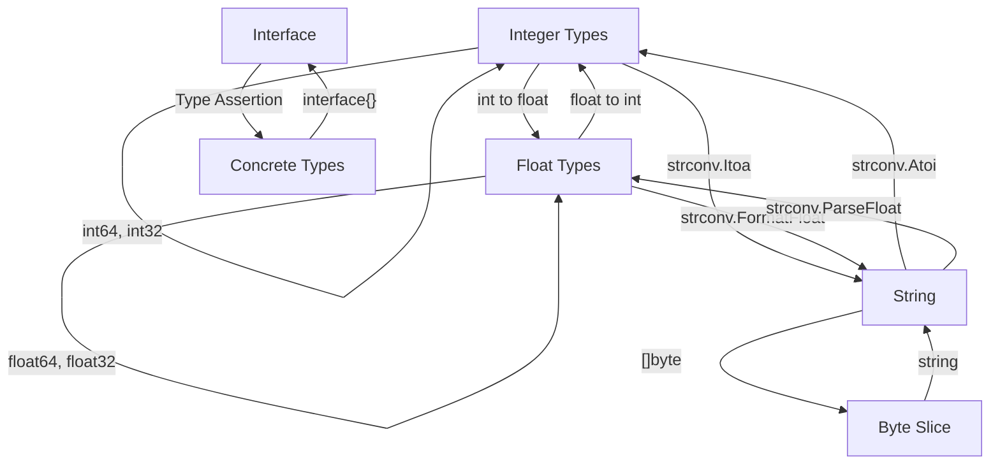

# Go Type Conversion

## Introduction

Type conversion is the process of changing a value from one data type to another. In Go, this is an essential skill as the language is statically typed, meaning you must be explicit about data types. Understanding how to properly convert between types helps you write flexible, error-free code and manipulate data effectively.

Unlike some other languages, Go doesn't support automatic or implicit type conversion between different types, even if they are closely related (like `int` and `float64`). This strict type system helps catch potential errors at compile time rather than at runtime.

## Basic Type Conversion Syntax

The basic syntax for type conversion in Go is:

```go
valueOfTypeB = TypeB(valueOfTypeA)
```

Where:
- `valueOfTypeA` is the original value
- `TypeB` is the target type you want to convert to
- `valueOfTypeB` will be the resulting value after conversion

## Numeric Type Conversions

### Converting Between Integer Types

Go has several integer types: `int`, `int8`, `int16`, `int32`, `int64`, `uint`, `uint8`, `uint16`, `uint32`, and `uint64`. Converting between them is straightforward:

```go
package main

import "fmt"

func main() {
    var num int = 42
    
    // Convert int to int64
    var bigNum int64 = int64(num)
    
    // Convert int to int8
    var smallNum int8 = int8(num)
    
    fmt.Printf("Original (int): %d
", num)
    fmt.Printf("As int64: %d
", bigNum)
    fmt.Printf("As int8: %d
", smallNum)
}
```

Output:
```
Original (int): 42
As int64: 42
As int8: 42
```

:::caution Overflow Risk
When converting to a smaller integer type, be careful about potential overflow. If the value exceeds the range of the target type, Go will truncate the value.
:::

Example of overflow:

```go
package main

import "fmt"

func main() {
    var largeNum int = 300
    
    // int8 can only hold values from -128 to 127
    var smallNum int8 = int8(largeNum)
    
    fmt.Printf("Original (int): %d
", largeNum)
    fmt.Printf("After conversion to int8: %d
", smallNum)
}
```

Output:
```
Original (int): 300
After conversion to int8: 44
```

The value `44` appears because `300` exceeds the maximum value for `int8` (127), so it overflows and wraps around.

### Converting Between Integers and Floating-Point Types

Go allows conversion between integers and floating-point numbers:

```go
package main

import "fmt"

func main() {
    // Integer to float
    var intNum int = 42
    var floatNum float64 = float64(intNum)
    
    // Float to integer (truncates decimal part)
    var piValue float64 = 3.14159
    var intPi int = int(piValue)
    
    fmt.Printf("Integer value: %d
", intNum)
    fmt.Printf("As float64: %f
", floatNum)
    fmt.Printf("Pi as float64: %f
", piValue)
    fmt.Printf("Pi converted to int: %d
", intPi)
}
```

Output:
```
Integer value: 42
As float64: 42.000000
Pi as float64: 3.141590
Pi converted to int: 3
```

:::note
When converting from floating-point to integer, Go truncates the decimal part rather than rounding. If you need rounding behavior, use the `math` package functions before conversion.
:::

## String Conversions

### Converting Numbers to Strings

To convert numbers to strings, Go provides the `strconv` package:

```go
package main

import (
    "fmt"
    "strconv"
)

func main() {
    var num int = 42
    var floatNum float64 = 3.14159
    
    // Integer to string
    numStr := strconv.Itoa(num)  // "Itoa" means "Integer to ASCII"
    
    // Alternative using FormatInt (allows specifying base)
    numStrBase10 := strconv.FormatInt(int64(num), 10)
    numStrBase16 := strconv.FormatInt(int64(num), 16)
    
    // Float to string
    floatStr := strconv.FormatFloat(floatNum, 'f', 2, 64)  // 2 decimal places
    
    fmt.Printf("Integer value: %d
", num)
    fmt.Printf("As string: %s
", numStr)
    fmt.Printf("As base-10 string: %s
", numStrBase10)
    fmt.Printf("As base-16 (hex) string: %s
", numStrBase16)
    fmt.Printf("Float value: %f
", floatNum)
    fmt.Printf("Float as string with 2 decimal places: %s
", floatStr)
}
```

Output:
```
Integer value: 42
As string: 42
As base-10 string: 42
As base-16 (hex) string: 2a
Float value: 3.141590
Float as string with 2 decimal places: 3.14
```

### Converting Strings to Numbers

To convert strings to numbers, the `strconv` package provides several functions:

```go
package main

import (
    "fmt"
    "strconv"
)

func main() {
    // String to integer
    numStr := "42"
    numInt, err := strconv.Atoi(numStr)
    
    if err != nil {
        fmt.Println("Error converting to integer:", err)
    } else {
        fmt.Printf("String: %s
", numStr)
        fmt.Printf("As integer: %d
", numInt)
    }
    
    // String to float
    floatStr := "3.14159"
    floatNum, err := strconv.ParseFloat(floatStr, 64)
    
    if err != nil {
        fmt.Println("Error converting to float:", err)
    } else {
        fmt.Printf("String: %s
", floatStr)
        fmt.Printf("As float64: %f
", floatNum)
    }
    
    // Handling errors with invalid input
    invalidStr := "not-a-number"
    _, err = strconv.Atoi(invalidStr)
    
    if err != nil {
        fmt.Printf("Error converting '%s' to integer: %v
", invalidStr, err)
    }
}
```

Output:
```
String: 42
As integer: 42
String: 3.14159
As float64: 3.141590
Error converting 'not-a-number' to integer: strconv.Atoi: parsing "not-a-number": invalid syntax
```

:::tip
Always check the error return value when converting strings to numbers, as the conversion may fail if the string doesn't represent a valid number.
:::

### Converting Between Strings and Bytes

In Go, strings and byte slices are closely related but distinct types. Converting between them is common:

```go
package main

import "fmt"

func main() {
    // String to byte slice
    str := "Hello, Go!"
    byteSlice := []byte(str)
    
    // Byte slice to string
    str2 := string(byteSlice)
    
    fmt.Printf("Original string: %s
", str)
    fmt.Printf("As byte slice: %v
", byteSlice)
    fmt.Printf("Converted back to string: %s
", str2)
}
```

Output:
```
Original string: Hello, Go!
As byte slice: [72 101 108 108 111 44 32 71 111 33]
Converted back to string: Hello, Go!
```

This conversion is useful for file I/O operations, network communications, and text processing.

## Type Assertions and Interface Conversions

### Type Assertions

Type assertions extract the underlying concrete value from an interface:

```go
package main

import "fmt"

func main() {
    var i interface{} = "hello"
    
    // Type assertion to extract the string
    s, ok := i.(string)
    if ok {
        fmt.Printf("String value: %s
", s)
    } else {
        fmt.Println("Value is not a string")
    }
    
    // Another example with a different type
    i = 42
    s, ok = i.(string)
    if ok {
        fmt.Printf("String value: %s
", s)
    } else {
        fmt.Println("Value is not a string")
    }
    
    // Type assertion without check (will panic if wrong)
    i = "hello again"
    s = i.(string)  // Safe because we know i contains a string
    fmt.Printf("String value: %s
", s)
}
```

Output:
```
String value: hello
Value is not a string
String value: hello again
```

### Type Switches

For checking multiple possible types, a type switch is more convenient:

```go
package main

import "fmt"

func printType(i interface{}) {
    fmt.Printf("Type checking value: %v
", i)
    
    switch v := i.(type) {
    case int:
        fmt.Printf("Integer value: %d
", v)
    case string:
        fmt.Printf("String value: %s
", v)
    case bool:
        fmt.Printf("Boolean value: %t
", v)
    case float64:
        fmt.Printf("Float value: %f
", v)
    default:
        fmt.Println("Unknown type")
    }
}

func main() {
    printType(42)
    printType("hello")
    printType(true)
    printType(3.14159)
    printType([]int{1, 2, 3})
}
```

Output:
```
Type checking value: 42
Integer value: 42
Type checking value: hello
String value: hello
Type checking value: true
Boolean value: true
Type checking value: 3.14159
Float value: 3.14159
Type checking value: [1 2 3]
Unknown type
```

## Practical Examples

### Example 1: Processing User Input

```go
package main

import (
    "fmt"
    "strconv"
)

func main() {
    // Simulate user input (in a real app, this would come from a form, stdin, etc.)
    userInput := "42"
    
    // Try to convert to integer
    age, err := strconv.Atoi(userInput)
    if err != nil {
        fmt.Println("Please enter a valid age")
        return
    }
    
    if age < 0 || age > 120 {
        fmt.Println("Age must be between 0 and 120")
        return
    }
    
    fmt.Printf("User is %d years old
", age)
    
    // Calculate some age-related values
    months := age * 12
    days := age * 365
    
    fmt.Printf("That's approximately %d months or %d days
", months, days)
}
```

Output:
```
User is 42 years old
That's approximately 504 months or 15330 days
```

### Example 2: Temperature Converter

```go
package main

import (
    "fmt"
    "strconv"
)

func celsiusToFahrenheit(celsius float64) float64 {
    return celsius*9/5 + 32
}

func fahrenheitToCelsius(fahrenheit float64) float64 {
    return (fahrenheit - 32) * 5 / 9
}

func main() {
    // Simulate user inputs
    celsiusInput := "25.0"
    fahrenheitInput := "98.6"
    
    // Convert Celsius to Fahrenheit
    celsius, err := strconv.ParseFloat(celsiusInput, 64)
    if err != nil {
        fmt.Println("Invalid Celsius temperature")
    } else {
        fahrenheit := celsiusToFahrenheit(celsius)
        fmt.Printf("%.1f°C = %.1f°F
", celsius, fahrenheit)
    }
    
    // Convert Fahrenheit to Celsius
    fahrenheit, err := strconv.ParseFloat(fahrenheitInput, 64)
    if err != nil {
        fmt.Println("Invalid Fahrenheit temperature")
    } else {
        celsius := fahrenheitToCelsius(fahrenheit)
        fmt.Printf("%.1f°F = %.1f°C
", fahrenheit, celsius)
    }
}
```

Output:
```
25.0°C = 77.0°F
98.6°F = 37.0°C
```

### Example 3: CSV Data Processing

```go
package main

import (
    "fmt"
    "strconv"
    "strings"
)

func main() {
    // Sample CSV data (normally would be read from a file)
    csvData := "Name,Age,Height
Alice,28,165.5
Bob,35,180.2
Charlie,42,175.0"
    
    // Parse the CSV data
    lines := strings.Split(csvData, "
")
    
    // Get the headers
    headers := strings.Split(lines[0], ",")
    
    // Process each data row
    for i := 1; i < len(lines); i++ {
        fields := strings.Split(lines[i], ",")
        
        // Extract and convert the data
        name := fields[0]
        
        age, err := strconv.Atoi(fields[1])
        if err != nil {
            fmt.Printf("Error parsing age for %s: %v
", name, err)
            continue
        }
        
        height, err := strconv.ParseFloat(fields[2], 64)
        if err != nil {
            fmt.Printf("Error parsing height for %s: %v
", name, err)
            continue
        }
        
        // Calculate some derived values
        heightInches := height / 2.54
        
        // Display the processed data
        fmt.Printf("%s is %d years old and %.1f cm tall (%.1f inches)
", 
                  name, age, height, heightInches)
    }
}
```

Output:
```
Alice is 28 years old and 165.5 cm tall (65.2 inches)
Bob is 35 years old and 180.2 cm tall (71.0 inches)
Charlie is 42 years old and 175.0 cm tall (68.9 inches)
```

## Type Conversion Flow Diagram

Here's a visual representation of common type conversions in Go:



## Common Pitfalls and Best Practices

### Pitfalls to Avoid

1. **Ignoring Conversion Errors**: Always check for errors when converting strings to numbers.

   ```go
   // Bad
   num, _ := strconv.Atoi(userInput)  // Ignores errors
   
   // Good
   num, err := strconv.Atoi(userInput)
   if err != nil {
       // Handle the error
   }
   ```

2. **Overflow When Converting Between Integer Types**: Be careful when converting from larger to smaller integer types.

3. **Precision Loss with Float to Integer Conversion**: Floating-point to integer conversion truncates the decimal part.

4. **Assuming Type Assertions Will Succeed**: Type assertions can panic if used incorrectly.

   ```go
   // Risky - will panic if i isn't a string
   s := i.(string)
   
   // Safe - uses the "comma ok" idiom
   s, ok := i.(string)
   if ok {
       // Use s safely
   }
   ```

### Best Practices

1. **Use the Correct Numeric Type for Your Needs**: Choose appropriate sizes and signed/unsigned types.

2. **Format Numbers Appropriately for Display**: Use the formatting functions in `strconv` or `fmt`.

3. **Validate Input Before Conversion**: Check that strings can be converted to the desired type.

4. **Use Type Switches for Multiple Type Checks**: Type switches are cleaner than sequences of type assertions.

5. **Be Explicit About Conversions**: Even when types are closely related, use explicit conversions to make your code clear.

## Summary

Type conversion in Go is a fundamental skill that allows you to work with different data types safely and effectively. Remember these key points:

- Go requires explicit type conversion between different types
- Use the appropriate conversion functions for each type
- Always check for errors when converting from strings to numbers
- Be aware of potential issues like overflow, truncation, and precision loss
- Interface type assertions provide a way to extract concrete types

By mastering type conversion, you'll be able to write more flexible, efficient, and error-resistant Go code.

## Additional Resources and Exercises

### Resources

- [Go Documentation on Types](https://golang.org/ref/spec#Types)
- [strconv Package Documentation](https://golang.org/pkg/strconv/)
- [fmt Package Documentation](https://golang.org/pkg/fmt/)

### Exercises

1. **Basic Type Conversion**: Write a program that converts between various numeric types and displays the results.

2. **Input Validation**: Create a function that takes a string input and tries to convert it to a float. It should handle all possible error cases gracefully.

3. **Command-Line Calculator**: Build a simple command-line calculator that reads string inputs, converts them to numbers, performs operations, and displays the results.

4. **Type Assertion Practice**: Create a function that takes an `interface{}` parameter and uses type assertions or a type switch to handle different types appropriately.

5. **Data Format Converter**: Write a program that reads a JSON or CSV file containing numeric data, converts the values as needed, and writes them out in a different format.