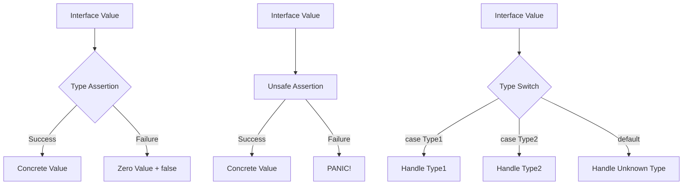

# Go Type Assertion

## Introduction

Type assertion is a powerful feature in Go that allows you to extract the underlying concrete value from an interface value. In Go, interfaces provide a way to specify behavior without dictating implementation. However, when working with interfaces, you often need to access the concrete value behind them - this is where type assertions come in.

Type assertions allow you to:
- Check if an interface value contains a specific type
- Extract the underlying value from an interface
- Convert between interface types

This concept is fundamental to working effectively with Go's type system, especially when dealing with functions that return or accept interface types like `interface{}` (or `any` in Go 1.18+).

## Understanding Type Assertions

### Basic Syntax

The basic syntax for a type assertion in Go is:

```go
value, ok := interfaceValue.(Type)
```

Where:
- `interfaceValue` is a variable of an interface type
- `Type` is the concrete type you're asserting
- `value` will contain the underlying value if the assertion succeeds
- `ok` is a boolean indicating whether the assertion was successful

### Simple Example

Let's start with a basic example:

```go
package main

import "fmt"

func main() {
    var i interface{} = "hello"
    
    // Type assertion
    s, ok := i.(string)
    fmt.Println(s, ok)  // Output: hello true
    
    // Failed type assertion
    n, ok := i.(int)
    fmt.Println(n, ok)  // Output: 0 false
}
```

In this example:
1. We declare a variable `i` of type `interface{}` and assign a string value to it
2. We use type assertion to check if `i` contains a string and extract its value
3. We attempt another assertion to check if `i` contains an int (which fails)

## Type Assertion Variants

### Simple Type Assertion (Unsafe)

You can perform a type assertion without checking the success:

```go
package main

import "fmt"

func main() {
    var i interface{} = "hello"
    
    // Direct type assertion without checking
    s := i.(string)
    fmt.Println(s)  // Output: hello
    
    // This will panic
    // n := i.(int)  // panic: interface conversion: interface {} is string, not int
}
```

**Warning**: This form is unsafe if you're not certain about the type. If the assertion fails, your program will panic.

### Type Assertion with Check (Safe)

The safer approach is to use the two-value form:

```go
package main

import "fmt"

func main() {
    var i interface{} = 42
    
    // Safe type assertion with check
    if v, ok := i.(int); ok {
        fmt.Printf("i contains an int: %d
", v)
    } else {
        fmt.Println("i does not contain an int")
    }
}
```

Output:
```
i contains an int: 42
```

## Type Switches

For checking multiple types, Go provides the type switch construct:

```go
package main

import "fmt"

func describe(i interface{}) {
    switch v := i.(type) {
    case int:
        fmt.Printf("Integer: %d
", v)
    case string:
        fmt.Printf("String: %s
", v)
    case bool:
        fmt.Printf("Boolean: %v
", v)
    default:
        fmt.Printf("Unknown type: %T
", v)
    }
}

func main() {
    describe(42)
    describe("hello")
    describe(true)
    describe(3.14)
}
```

Output:
```
Integer: 42
String: hello
Boolean: true
Unknown type: float64
```

The type switch offers a cleaner way to handle multiple possible types compared to a series of individual type assertions.

## Common Use Cases for Type Assertions

### Processing Items in a Collection

Type assertions are often used when working with collections of mixed types:

```go
package main

import "fmt"

func printValues(items []interface{}) {
    for _, item := range items {
        switch v := item.(type) {
        case int:
            fmt.Printf("Integer: %d
", v)
        case string:
            fmt.Printf("String: %s
", v)
        case float64:
            fmt.Printf("Float: %.2f
", v)
        default:
            fmt.Printf("Unknown type: %T
", v)
        }
    }
}

func main() {
    mixed := []interface{}{42, "hello", 3.14, true}
    printValues(mixed)
}
```

Output:
```
Integer: 42
String: hello
Float: 3.14
Unknown type: bool
```

### Working with JSON Data

Type assertions are valuable when dealing with dynamic data like JSON:

```go
package main

import (
    "encoding/json"
    "fmt"
)

func main() {
    // A JSON blob with mixed types
    jsonBlob := `{"name": "John", "age": 30, "isStudent": false, "scores": [90, 85, 95]}`
    
    var data map[string]interface{}
    
    if err := json.Unmarshal([]byte(jsonBlob), &data); err != nil {
        fmt.Println("Error:", err)
        return
    }
    
    // Access values using type assertions
    if name, ok := data["name"].(string); ok {
        fmt.Println("Name:", name)
    }
    
    if age, ok := data["age"].(float64); ok {
        fmt.Println("Age:", int(age))  // JSON numbers become float64
    }
    
    if isStudent, ok := data["isStudent"].(bool); ok {
        fmt.Println("Is Student:", isStudent)
    }
    
    // Working with nested slices
    if scores, ok := data["scores"].([]interface{}); ok {
        fmt.Print("Scores: ")
        for _, score := range scores {
            if s, ok := score.(float64); ok {
                fmt.Printf("%.0f ", s)
            }
        }
        fmt.Println()
    }
}
```

Output:
```
Name: John
Age: 30
Is Student: false
Scores: 90 85 95 
```

### Error Handling with Custom Error Types

Type assertions are useful for handling specific error types:

```go
package main

import (
    "errors"
    "fmt"
    "os"
)

// Custom error types
type NotFoundError struct {
    Item string
}

func (e NotFoundError) Error() string {
    return fmt.Sprintf("%s not found", e.Item)
}

// Function that might return different error types
func findItem(name string) error {
    if name == "file.txt" {
        return os.ErrNotExist
    } else if name == "config.json" {
        return NotFoundError{Item: name}
    } else if name == "" {
        return errors.New("empty name provided")
    }
    return nil
}

func main() {
    items := []string{"file.txt", "config.json", "", "data.csv"}
    
    for _, item := range items {
        err := findItem(item)
        if err != nil {
            switch e := err.(type) {
            case NotFoundError:
                fmt.Printf("Custom not found error: %v
", e)
            case *os.PathError:
                fmt.Printf("OS path error: %v
", e)
            default:
                if err == os.ErrNotExist {
                    fmt.Printf("Item doesn't exist: %v
", err)
                } else {
                    fmt.Printf("Other error: %v
", err)
                }
            }
        } else {
            fmt.Printf("Found item: %s
", item)
        }
    }
}
```

Output:
```
Item doesn't exist: file does not exist
Custom not found error: config.json not found
Other error: empty name provided
Found item: data.csv
```

## Type Assertion vs Type Conversion

It's important to understand the difference between type assertion and type conversion:

```go
package main

import "fmt"

func main() {
    // Type conversion (between compatible types)
    var i int = 42
    var f float64 = float64(i)
    fmt.Println(f)  // Output: 42
    
    // Type assertion (for interface types)
    var x interface{} = "hello"
    s := x.(string)
    fmt.Println(s)  // Output: hello
    
    // This won't compile - can't use type assertion on non-interface types
    // str := i.(string)  // Invalid: i is not an interface type
    
    // This won't compile - can't use type conversion with interfaces
    // str2 := string(x)  // Invalid: cannot convert x (type interface{}) to type string
}
```

Remember:
- **Type conversion** (`T(v)`) works between compatible concrete types
- **Type assertion** (`v.(T)`) works only on interface types to retrieve their underlying value

