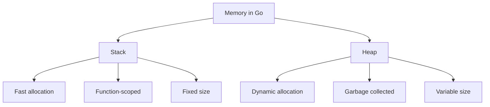
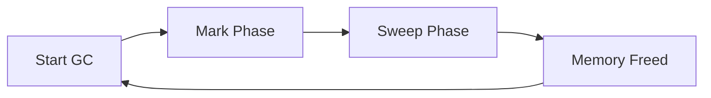

# Go Memory Management

## Introduction

Memory management is a critical aspect of programming that directly impacts your application's performance, efficiency, and reliability. In Go (or Golang), memory management is handled automatically through a garbage collector, making it easier for developers to focus on writing code rather than manually allocating and freeing memory.

This guide will walk you through how Go manages memory, including the key concepts of stack and heap allocation, garbage collection, and best practices for efficient memory usage. By understanding these concepts, you'll be better equipped to write performant Go applications.

## Memory Basics in Go

Before diving into Go's memory management, let's understand some fundamental concepts:

### Stack vs. Heap

In Go, memory allocation happens in two places:

1. **Stack**: A region of memory that stores local variables and function calls
2. **Heap**: A larger region of memory used for dynamic allocation



### Key Differences

| Stack | Heap |
|-------|------|
| Fast allocation | Slower allocation |
| Memory freed automatically when function returns | Requires garbage collection |
| Size limit (typically a few MB per goroutine) | Limited only by available memory |
| Values have fixed size known at compile time | Can store values of variable or unknown size |

## Memory Allocation in Go

Go makes memory allocation decisions for you based on the variable's size, lifetime, and usage. Let's see how this works:

### Stack Allocation

When Go can determine at compile time that a variable is safe to allocate on the stack, it will do so. This typically happens for:

- Local variables with known size
- Variables that don't "escape" the function scope

Here's an example of stack allocation:

```go
func stackExample() int {
    // 'x' is allocated on the stack
    x := 42
    
    // When this function returns, 'x' is automatically freed
    return x
}
```

### Heap Allocation

Variables get allocated on the heap when:

- Their size is not known at compile time
- They are too large for the stack
- They "escape" to the heap (continue to be referenced after the function returns)

Example of heap allocation:

```go
func heapExample() *int {
    // 'x' is initially created on the stack
    x := 42
    
    // By returning a pointer to 'x', Go "escapes" it to the heap
    // because it needs to live beyond this function call
    return &x
}
```

## Escape Analysis

Go's compiler performs **escape analysis** to determine whether a variable should be allocated on the stack or heap. This analysis checks if a variable's lifetime extends beyond its declaring function.

Let's look at examples:

```go
// Variables stay on the stack
func noEscape() int {
    x := 10
    y := 20
    return x + y  // Only the sum escapes, not the variables
}

// Variable escapes to the heap
func escape() *int {
    x := 10
    return &x  // x escapes because we return its address
}
```

You can see the escape analysis decisions with:

```bash
go build -gcflags="-m" your_program.go
```

Example output:

```
./example.go:10:2: moved to heap: x
```

## Garbage Collection in Go

Go uses a concurrent, tri-color mark-and-sweep garbage collector to manage heap memory. This means you don't need to manually free memory, as the garbage collector automatically reclaims memory that's no longer in use.

### How Go's Garbage Collector Works

1. **Marking Phase**: The GC identifies objects that are still in use
2. **Sweeping Phase**: It reclaims memory from objects that are no longer referenced



The garbage collector runs concurrently with your program, minimizing pause times. However, it does introduce some overhead.

### Garbage Collection Tuning

You can tune Go's garbage collector with environment variables:

```go
// Set the target percentage of heap memory to use
// Higher values = less GC overhead but more memory usage
// Default is GOGC=100 (100%)
import "runtime/debug"

func main() {
    // Increase memory usage in exchange for less frequent GC
    debug.SetGCPercent(150)
    
    // Or decrease it from command line:
    // GOGC=50 ./your_program
}
```

## Practical Memory Management Tips

### 1. Reuse objects when possible

```go
// Instead of creating new buffers
func inefficient(data []byte) []byte {
    buf := make([]byte, 100)
    // Use buf...
    return buf
}

// Use sync.Pool to reuse buffers
import "sync"

var bufferPool = sync.Pool{
    New: func() interface{} {
        return make([]byte, 100)
    },
}

func efficient(data []byte) []byte {
    buf := bufferPool.Get().([]byte)
    defer bufferPool.Put(buf)
    // Use buf...
    return append([]byte{}, buf...) // Return copy if needed
}
```

### 2. Avoid unnecessary pointers

Pointers cause variables to escape to the heap, which can increase pressure on the garbage collector.

```go
// Avoid this when possible
type User struct {
    Name *string
    Age  *int
}

// Prefer this
type User struct {
    Name string
    Age  int
}
```

### 3. Preallocate slices and maps when you know the size

```go
// Poor: will need to reallocate as items are added
data := []int{}
for i := 0; i < 1000; i++ {
    data = append(data, i)
}

// Better: preallocate with known capacity
data := make([]int, 0, 1000)
for i := 0; i < 1000; i++ {
    data = append(data, i)
}

// For maps
userMap := make(map[string]User, expectedUsers)
```

### 4. Use value types for small, immutable data

```go
// This creates a copy and doesn't allocate on heap
type Point struct {
    X, Y int
}

func distanceFromOrigin(p Point) float64 {
    return math.Sqrt(float64(p.X*p.X + p.Y*p.Y))
}

// Using Point
p := Point{X: 3, Y: 4}
d := distanceFromOrigin(p)
```

### 5. Understand when to use pointers and when to use values

```go
// Use pointers for:
// 1. When you need to modify the original value
// 2. For large structures to avoid copying
// 3. When implementing interfaces

// Use values for:
// 1. Small, immutable data
// 2. When you don't need to modify the original
// 3. When you want to avoid heap allocation
```

## Real-World Example: Memory Profiling

Let's look at a practical example of identifying and fixing a memory issue:

```go
package main

import (
	"fmt"
	"runtime"
	"runtime/debug"
)

func main() {
	// Force GC to get a clean baseline
	runtime.GC()
	
	// Print initial memory stats
	printMemStats("Initial")
	
	// Run our function with potential memory issues
	processData()
	
	// Force GC again
	runtime.GC()
	
	// Print final memory stats
	printMemStats("After processing")
}

func processData() {
	// Problem: creating many small allocations
	dataSlices := make([][]int, 1000)
	
	for i := 0; i < 1000; i++ {
		// Each of these allocates separately on the heap
		dataSlices[i] = make([]int, 100)
		for j := 0; j < 100; j++ {
			dataSlices[i][j] = i + j
		}
	}
	
	// Process the data...
	fmt.Println("Processed", len(dataSlices), "data slices")
}

func printMemStats(label string) {
	var stats runtime.MemStats
	runtime.ReadMemStats(&stats)
	
	fmt.Printf("
%s Memory Stats:
", label)
	fmt.Printf("Heap Alloc: %d MB
", stats.HeapAlloc/1024/1024)
	fmt.Printf("Total Alloc: %d MB
", stats.TotalAlloc/1024/1024)
	fmt.Printf("Garbage Collections: %d
", stats.NumGC)
}
```

### Improved version with better memory usage:

```go
func improvedProcessData() {
	// Solution: use a single allocation
	// Allocate one big 2D array
	data := make([]int, 1000*100)
	dataSlices := make([][]int, 1000)
	
	// Slice it up
	for i := 0; i < 1000; i++ {
		start := i * 100
		dataSlices[i] = data[start : start+100]
		
		for j := 0; j < 100; j++ {
			dataSlices[i][j] = i + j
		}
	}
	
	// Process the data...
	fmt.Println("Processed", len(dataSlices), "data slices more efficiently")
}
```

## Memory Profiling in Go

Go provides excellent tools for analyzing memory usage:

```go
import (
	"net/http"
	_ "net/http/pprof" // Import for side effects
	"os"
	"runtime/pprof"
)

func main() {
	// CPU profiling
	f, _ := os.Create("cpu.prof")
	pprof.StartCPUProfile(f)
	defer pprof.StopCPUProfile()
	
	// Memory profiling
	go func() {
		http.ListenAndServe("localhost:6060", nil)
	}()
	
	// Your program here
	
	// Heap profiling
	f2, _ := os.Create("heap.prof")
	pprof.WriteHeapProfile(f2)
	f2.Close()
}
```

View the profiles with:

```bash
go tool pprof -http=:8080 heap.prof
```

## Summary

Go's memory management system offers a great balance between developer productivity and performance. Here's what we've covered:

1. **Stack vs. Heap**: Understanding where variables get allocated
2. **Escape Analysis**: How Go decides where to allocate memory
3. **Garbage Collection**: How Go automatically reclaims unused memory
4. **Best Practices**: Tips for efficient memory usage
5. **Memory Profiling**: Tools for identifying memory issues

By understanding these concepts, you can write more efficient Go programs that make better use of memory resources.

## Additional Resources

- [Go Memory Management FAQ](https://golang.org/doc/faq#garbage_collection)
- [The Go Blog: Go GC Guide](https://blog.golang.org/ismmkeynote)
- [Go Documentation: pprof package](https://pkg.go.dev/runtime/pprof)

## Exercises

1. Use the `-gcflags="-m"` flag to analyze a small Go program and see which variables escape to the heap.
2. Create a program with a memory leak (hint: forgotten goroutines or growing maps) and use pprof to identify it.
3. Benchmark the performance difference between using sync.Pool for buffer reuse versus creating new buffers each time.
4. Try different GOGC values and measure how they affect your program's performance and memory usage.
5. Refactor a function that returns pointers to small structs to instead return values, and measure the performance impact.