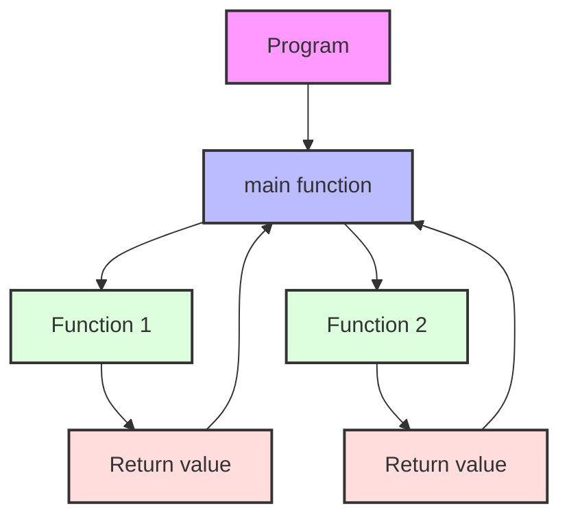

# Go Functions

Functions are one of the fundamental building blocks in Go programming. They allow you to organize your code into reusable, modular pieces that perform specific tasks. This guide will walk you through everything you need to know about functions in Go.

## Introduction to Functions

A function is a block of code designed to perform a particular task. In Go, functions help you break down complex problems into smaller, manageable parts. They also enable code reuse, making your programs more maintainable and easier to understand.

Here's a simple function that prints a greeting:

```go
package main

import "fmt"

func greet() {
    fmt.Println("Hello, Gopher!")
}

func main() {
    greet() // Calling the function
}
```

**Output:**
```
Hello, Gopher!
```

## Function Declaration Syntax

In Go, a function is declared using the `func` keyword, followed by the function name, parameters (if any), return type (if any), and the function body enclosed in curly braces.

```go
func functionName(parameter1 type1, parameter2 type2, ...) returnType {
    // Function body - code to be executed
    return value // if the function returns a value
}
```

Let's break down each component:

- `func`: Keyword to declare a function
- `functionName`: Name of the function (should be descriptive of what it does)
- `parameters`: Input values the function accepts (optional)
- `returnType`: Data type of the value the function returns (optional)
- `function body`: Code to be executed when the function is called
- `return statement`: Used to return a value from the function (required if returnType is specified)

## Parameters and Arguments

Functions can accept inputs, called parameters, which are defined in the function declaration. When you call a function with specific values, these values are called arguments.

```go
package main

import "fmt"

// Function with parameters
func greetPerson(name string, age int) {
    fmt.Printf("Hello, %s! You are %d years old.
", name, age)
}

func main() {
    // Calling the function with arguments
    greetPerson("Alice", 30)
    greetPerson("Bob", 25)
}
```

**Output:**
```
Hello, Alice! You are 30 years old.
Hello, Bob! You are 25 years old.
```

## Return Values

Functions can return values using the `return` statement. The return type must be specified in the function declaration.

```go
package main

import "fmt"

// Function with a return value
func add(a int, b int) int {
    return a + b
}

func main() {
    sum := add(5, 3)
    fmt.Println("Sum:", sum)
}
```

**Output:**
```
Sum: 8
```

### Multiple Return Values

One of Go's powerful features is that functions can return multiple values. This is particularly useful for returning both a result and an error status.

```go
package main

import (
    "fmt"
    "errors"
)

// Function with multiple return values
func divide(a, b float64) (float64, error) {
    if b == 0 {
        return 0, errors.New("cannot divide by zero")
    }
    return a / b, nil
}

func main() {
    result, err := divide(10, 2)
    if err != nil {
        fmt.Println("Error:", err)
    } else {
        fmt.Println("Result:", result)
    }
    
    result, err = divide(10, 0)
    if err != nil {
        fmt.Println("Error:", err)
    } else {
        fmt.Println("Result:", result)
    }
}
```

**Output:**
```
Result: 5
Error: cannot divide by zero
```

### Named Return Values

Go allows you to name the return values in the function declaration. Named return values are initialized to their zero values and can be returned using a "naked" return statement.

```go
package main

import "fmt"

// Function with named return values
func calculate(width, height float64) (area, perimeter float64) {
    area = width * height
    perimeter = 2 * (width + height)
    return // naked return - returns the named return values
}

func main() {
    a, p := calculate(5, 3)
    fmt.Printf("Area: %.2f, Perimeter: %.2f
", a, p)
}
```

**Output:**
```
Area: 15.00, Perimeter: 16.00
```

## Variadic Functions

Go supports variadic functions, which can accept a variable number of arguments. This is achieved by using an ellipsis (`...`) before the type of the last parameter.

```go
package main

import "fmt"

// Variadic function
func sum(numbers ...int) int {
    total := 0
    for _, num := range numbers {
        total += num
    }
    return total
}

func main() {
    fmt.Println("Sum of 1, 2:", sum(1, 2))
    fmt.Println("Sum of 1, 2, 3, 4, 5:", sum(1, 2, 3, 4, 5))
    
    // Passing a slice to a variadic function
    numbers := []int{10, 20, 30}
    fmt.Println("Sum of numbers slice:", sum(numbers...))
}
```

**Output:**
```
Sum of 1, 2: 3
Sum of 1, 2, 3, 4, 5: 15
Sum of numbers slice: 60
```

## Anonymous Functions and Closures

Go supports anonymous functions, which are functions without a name. Anonymous functions are often used when you need a small function for a short period of time.

```go
package main

import "fmt"

func main() {
    // Anonymous function
    func() {
        fmt.Println("I am an anonymous function!")
    }() // Immediately invoked
    
    // Anonymous function with parameters
    func(name string) {
        fmt.Println("Hello,", name)
    }("Gopher") // Passing arguments
    
    // Assigning anonymous function to a variable
    add := func(a, b int) int {
        return a + b
    }
    
    result := add(3, 4)
    fmt.Println("3 + 4 =", result)
}
```

**Output:**
```
I am an anonymous function!
Hello, Gopher
3 + 4 = 7
```

### Closures

A closure is a function that references variables from outside its body. The function may access and assign to the referenced variables.

```go
package main

import "fmt"

func createCounter() func() int {
    count := 0
    // Return a closure that has access to the count variable
    return func() int {
        count++
        return count
    }
}

func main() {
    counter := createCounter()
    
    fmt.Println(counter()) // 1
    fmt.Println(counter()) // 2
    fmt.Println(counter()) // 3
    
    // Each counter has its own count variable
    counter2 := createCounter()
    fmt.Println(counter2()) // 1
    fmt.Println(counter2()) // 2
}
```

**Output:**
```
1
2
3
1
2
```

## Function as a Type

In Go, functions are first-class citizens, meaning they can be assigned to variables, passed as arguments to other functions, and returned from other functions.

```go
package main

import (
    "fmt"
    "strings"
)

// Function type declaration
type StringModifier func(string) string

func toUpper(s string) string {
    return strings.ToUpper(s)
}

func toLower(s string) string {
    return strings.ToLower(s)
}

// Function taking another function as an argument
func modifyString(s string, modifier StringModifier) string {
    return modifier(s)
}

func main() {
    original := "Hello, Gopher!"
    
    // Passing functions as arguments
    fmt.Println(modifyString(original, toUpper))
    fmt.Println(modifyString(original, toLower))
    
    // Using anonymous function as an argument
    fmt.Println(modifyString(original, func(s string) string {
        return strings.ReplaceAll(s, "o", "*")
    }))
}
```

**Output:**
```
HELLO, GOPHER!
hello, gopher!
Hell*, G*pher!
```

## Methods

Methods are functions associated with a particular type. They have a special receiver argument that appears between the `func` keyword and the method name.

```go
package main

import "fmt"

// Define a new type
type Rectangle struct {
    width, height float64
}

// Method with receiver - makes this function a method of Rectangle type
func (r Rectangle) Area() float64 {
    return r.width * r.height
}

// Method with pointer receiver - can modify the struct
func (r *Rectangle) Scale(factor float64) {
    r.width *= factor
    r.height *= factor
}

func main() {
    rect := Rectangle{width: 5, height: 3}
    
    fmt.Printf("Original rectangle: %+v
", rect)
    fmt.Printf("Area: %.2f
", rect.Area())
    
    rect.Scale(2)
    fmt.Printf("After scaling: %+v
", rect)
    fmt.Printf("New area: %.2f
", rect.Area())
}
```

**Output:**
```
Original rectangle: {width:5 height:3}
Area: 15.00
After scaling: {width:10 height:6}
New area: 60.00
```

The difference between value receivers and pointer receivers:
- **Value receiver**: The method operates on a copy of the value
- **Pointer receiver**: The method operates on the actual value, allowing it to modify the value

## Defer Statement

The `defer` statement delays the execution of a function until the surrounding function returns. This is often used for cleanup actions such as closing files or network connections.

```go
package main

import "fmt"

func processOrder() {
    fmt.Println("Starting to process order...")
    
    // This will execute last, after the function finishes
    defer fmt.Println("Order processing complete!")
    
    // Business logic here
    fmt.Println("Validating order...")
    fmt.Println("Charging payment...")
    fmt.Println("Shipping items...")
}

func main() {
    processOrder()
}
```

**Output:**
```
Starting to process order...
Validating order...
Charging payment...
Shipping items...
Order processing complete!
```

Deferred statements are executed in LIFO (Last In, First Out) order:

```go
package main

import "fmt"

func main() {
    fmt.Println("Counting:")
    
    for i := 0; i < 5; i++ {
        defer fmt.Println(i)
    }
    
    fmt.Println("Done counting!")
}
```

**Output:**
```
Counting:
Done counting!
4
3
2
1
0
```

## Practical Examples

Let's look at some real-world applications of functions in Go:

### Example 1: Simple Calculator

```go
package main

import (
    "fmt"
    "errors"
)

// Calculator operations as functions
func add(a, b float64) float64 {
    return a + b
}

func subtract(a, b float64) float64 {
    return a - b
}

func multiply(a, b float64) float64 {
    return a * b
}

func divide(a, b float64) (float64, error) {
    if b == 0 {
        return 0, errors.New("division by zero")
    }
    return a / b, nil
}

// Function that takes an operation and performs it
func calculate(a, b float64, operation string) (float64, error) {
    switch operation {
    case "add":
        return add(a, b), nil
    case "subtract":
        return subtract(a, b), nil
    case "multiply":
        return multiply(a, b), nil
    case "divide":
        return divide(a, b)
    default:
        return 0, errors.New("unknown operation")
    }
}

func main() {
    // Example usage
    a, b := 10.0, 5.0
    
    result, err := calculate(a, b, "add")
    if err != nil {
        fmt.Println("Error:", err)
    } else {
        fmt.Printf("%.2f + %.2f = %.2f
", a, b, result)
    }
    
    result, err = calculate(a, b, "divide")
    if err != nil {
        fmt.Println("Error:", err)
    } else {
        fmt.Printf("%.2f / %.2f = %.2f
", a, b, result)
    }
    
    // Test with invalid operation
    result, err = calculate(a, b, "power")
    if err != nil {
        fmt.Println("Error:", err)
    }
    
    // Test division by zero
    result, err = calculate(a, 0, "divide")
    if err != nil {
        fmt.Println("Error:", err)
    }
}
```

**Output:**
```
10.00 + 5.00 = 15.00
10.00 / 5.00 = 2.00
Error: unknown operation
Error: division by zero
```

### Example 2: Task Manager with Closures

```go
package main

import (
    "fmt"
    "time"
)

// Task type
type Task struct {
    ID          int
    Description string
    Done        bool
    CreatedAt   time.Time
}

// Create a task manager that uses closures to maintain state
func createTaskManager() (
    addTask func(description string) int,
    markAsDone func(id int) bool,
    listTasks func() []Task,
) {
    var tasks []Task
    nextID := 1
    
    // Add a new task and return its ID
    addTask = func(description string) int {
        task := Task{
            ID:          nextID,
            Description: description,
            Done:        false,
            CreatedAt:   time.Now(),
        }
        tasks = append(tasks, task)
        nextID++
        return task.ID
    }
    
    // Mark a task as done by ID, return success status
    markAsDone = func(id int) bool {
        for i := range tasks {
            if tasks[i].ID == id {
                tasks[i].Done = true
                return true
            }
        }
        return false
    }
    
    // Return a copy of all tasks
    listTasks = func() []Task {
        tasksCopy := make([]Task, len(tasks))
        copy(tasksCopy, tasks)
        return tasksCopy
    }
    
    return addTask, markAsDone, listTasks
}

func main() {
    // Create a task manager
    addTask, markAsDone, listTasks := createTaskManager()
    
    // Add some tasks
    task1ID := addTask("Learn Go functions")
    task2ID := addTask("Write a blog post")
    addTask("Review code")
    
    // Mark some tasks as done
    markAsDone(task1ID)
    
    // List all tasks
    fmt.Println("Task List:")
    for _, task := range listTasks() {
        status := "Pending"
        if task.Done {
            status = "Completed"
        }
        fmt.Printf("%d: %s [%s] (Created: %s)
", 
            task.ID, task.Description, status, 
            task.CreatedAt.Format("2006-01-02 15:04:05"))
    }
    
    // Try to mark a non-existent task
    success := markAsDone(999)
    fmt.Printf("Marking task 999 as done: %v
", success)
    
    // Mark another task as done and list again
    markAsDone(task2ID)
    
    fmt.Println("
Updated Task List:")
    for _, task := range listTasks() {
        status := "Pending"
        if task.Done {
            status = "Completed"
        }
        fmt.Printf("%d: %s [%s]
", task.ID, task.Description, status)
    }
}
```

The output will show the tasks with their status (the timestamps will vary):

```
Task List:
1: Learn Go functions [Completed] (Created: 2023-05-15 10:30:45)
2: Write a blog post [Pending] (Created: 2023-05-15 10:30:45)
3: Review code [Pending] (Created: 2023-05-15 10:30:45)
Marking task 999 as done: false

Updated Task List:
1: Learn Go functions [Completed]
2: Write a blog post [Completed]
3: Review code [Pending]
```

## Function Visualization

Here's a visualization of how functions work in Go:



## Best Practices for Go Functions

1. **Keep functions focused**: Each function should do one thing and do it well.
2. **Choose descriptive names**: Function names should clearly indicate what the function does.
3. **Keep functions short**: Aim for functions that fit on a single screen (20-30 lines).
4. **Use error return values**: For functions that can fail, return an error as the last return value.
5. **Prefer value receivers for small structs**: Use pointer receivers only when needed.
6. **Document your functions**: Add comments that explain what the function does, its parameters, and return values.
7. **Use named return values when it improves clarity**: But don't overuse them.
8. **Avoid global state**: Pass dependencies as parameters rather than using global variables.

## Summary

Functions in Go are powerful and flexible constructs that allow you to organize your code, promote reuse, and build complex systems from simple components. In this guide, we covered:

- Basic function syntax and declaration
- Parameters and return values
- Multiple return values and named returns
- Variadic functions for handling variable numbers of arguments
- Anonymous functions and closures
- Functions as types and methods
- The defer statement for delayed execution
- Practical examples showing real-world applications

By mastering functions in Go, you'll be well on your way to writing idiomatic, efficient, and maintainable Go code.

## Exercises

1. Write a function that takes a slice of integers and returns the sum, average, minimum, and maximum values.
2. Create a function that takes a string and returns a new string with all vowels removed.
3. Implement a simple memoization function using closures that caches the results of expensive function calls.
4. Create a custom sort function for a slice of structs based on multiple fields.
5. Build a command-line calculator that uses function types to implement different operations.

## Additional Resources

- [Go Documentation - Functions](https://golang.org/doc/effective_go.html#functions)
- [A Tour of Go - Functions](https://tour.golang.org/basics/4)
- [Go by Example - Functions](https://gobyexample.com/functions)
- [Go by Example - Closures](https://gobyexample.com/closures)
- [Go by Example - Methods](https://gobyexample.com/methods)

Happy coding with Go functions!