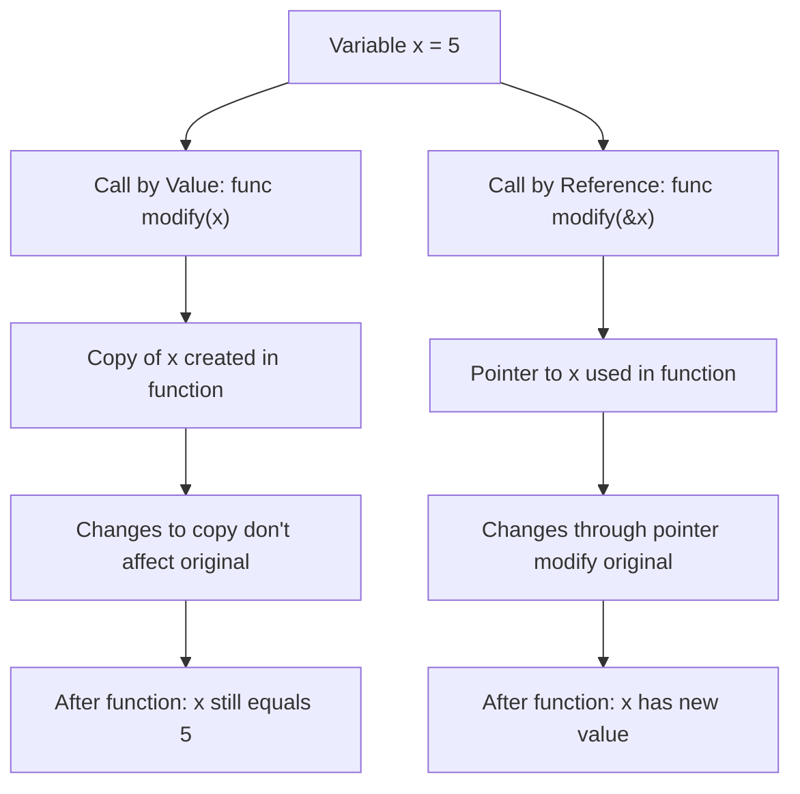

# Go Parameters

## Introduction

In Go programming, parameters are the means by which we pass data to functions. Understanding how parameters work is essential for writing effective and efficient Go programs. This guide will walk you through the various ways to work with function parameters in Go, from basic concepts to more advanced techniques.

Parameters allow functions to be flexible and reusable, as they can operate on different data each time they're called. Go's parameter system has some unique features that make it both powerful and straightforward to use.

## Basic Parameter Syntax

Let's start with the basic syntax for defining and using parameters in Go functions:

```go
func functionName(parameterName parameterType) returnType {
    // Function body
    return returnValue
}
```

Here's a simple example:

```go
func greet(name string) string {
    return "Hello, " + name + "!"
}

func main() {
    greeting := greet("Alice")
    fmt.Println(greeting) // Output: Hello, Alice!
}
```

In this example, `name` is a parameter of type `string` that the `greet` function uses to create a personalized greeting.

## Multiple Parameters

Go functions can accept multiple parameters:

```go
func add(a int, b int) int {
    return a + b
}

// You can also group parameters of the same type
func subtract(a, b int) int {
    return a - b
}

func main() {
    sum := add(5, 3)
    difference := subtract(10, 4)
    
    fmt.Println("Sum:", sum)         // Output: Sum: 8
    fmt.Println("Difference:", difference) // Output: Difference: 6
}
```

When parameters share the same type, you can use the shorthand notation as seen in the `subtract` function.

## Passing by Value

By default, Go passes arguments to function parameters **by value**. This means the function receives a copy of the original value, not the original value itself.

```go
func double(num int) {
    num = num * 2
    fmt.Println("Inside function:", num)
}

func main() {
    x := 5
    double(x)
    fmt.Println("In main:", x)
}
```

Output:
```
Inside function: 10
In main: 5
```

Notice that the value of `x` in the `main` function remains unchanged even though we modified `num` inside the `double` function. This is because `num` is a copy of `x`, not `x` itself.

## Passing by Reference (Using Pointers)

To modify the original value of a variable from within a function, we need to pass a pointer to that variable:

```go
func tripleByPointer(num *int) {
    *num = *num * 3
    fmt.Println("Inside function:", *num)
}

func main() {
    x := 5
    tripleByPointer(&x)
    fmt.Println("In main:", x)
}
```

Output:
```
Inside function: 15
In main: 15
```

Here's what's happening:
1. We use `&x` to get the memory address of `x`
2. The function receives this address through the `*int` parameter (a pointer to an integer)
3. Within the function, we use `*num` to access and modify the value stored at that address
4. Since we're modifying the value at the original memory location, the change is visible outside the function

## Variadic Parameters

Go supports **variadic parameters**, which allow a function to accept a variable number of arguments. Define these by prefixing the parameter type with three dots (`...`):

```go
func sum(numbers ...int) int {
    total := 0
    for _, num := range numbers {
        total += num
    }
    return total
}

func main() {
    fmt.Println(sum(1, 2))          // Output: 3
    fmt.Println(sum(1, 2, 3, 4, 5)) // Output: 15
    
    // You can also pass a slice to a variadic function using the ... operator
    nums := []int{10, 20, 30}
    fmt.Println(sum(nums...))       // Output: 60
}
```

Variadic parameters are useful when you don't know in advance how many arguments you'll need to pass to a function.

## Named Return Values

Go allows you to name the return values in a function declaration. This creates variables that you can assign values to anywhere in the function, and they'll automatically be returned when the function ends:

```go
func divide(a, b float64) (quotient float64, err error) {
    if b == 0 {
        err = errors.New("cannot divide by zero")
        return // Returns quotient=0, err=error
    }
    
    quotient = a / b
    return // Returns quotient=a/b, err=nil
}

func main() {
    result, err := divide(10, 2)
    if err != nil {
        fmt.Println("Error:", err)
    } else {
        fmt.Println("Result:", result) // Output: Result: 5
    }
    
    result, err = divide(10, 0)
    if err != nil {
        fmt.Println("Error:", err) // Output: Error: cannot divide by zero
    } else {
        fmt.Println("Result:", result)
    }
}
```

Named return values:
- Make your code more readable by documenting what each return value represents
- Are initialized to their zero values
- Can be returned using a "naked" return statement
- Are particularly useful for error handling

## Function Parameters with Complex Types

Go parameters can be of any type, including arrays, slices, maps, structs, and even other functions:

### Slices and Maps

```go
func updateSlice(numbers []int) {
    numbers[0] = 100 // This will affect the original slice
}

func updateMap(userData map[string]string) {
    userData["status"] = "active" // This will affect the original map
}

func main() {
    nums := []int{1, 2, 3}
    updateSlice(nums)
    fmt.Println(nums) // Output: [100 2 3]
    
    user := map[string]string{"name": "John", "role": "Admin"}
    updateMap(user)
    fmt.Println(user) // Output: map[name:John role:Admin status:active]
}
```

Even though Go uses pass-by-value semantics, slices and maps contain internal pointers to the underlying data. When you pass a slice or map to a function, the copy still points to the same underlying data, so modifications are visible outside the function.

### Function Parameters

You can pass functions as parameters to other functions:

```go
func applyOperation(a, b int, operation func(int, int) int) int {
    return operation(a, b)
}

func add(x, y int) int {
    return x + y
}

func multiply(x, y int) int {
    return x * y
}

func main() {
    fmt.Println(applyOperation(5, 3, add))      // Output: 8
    fmt.Println(applyOperation(5, 3, multiply)) // Output: 15
    
    // You can also use anonymous functions
    fmt.Println(applyOperation(5, 3, func(x, y int) int {
        return x - y
    })) // Output: 2
}
```

This pattern is powerful for implementing callbacks and strategy patterns in Go.

## Parameter Patterns and Best Practices

### Using Structs for Many Parameters

When a function needs many parameters, consider using a struct instead:

```go
// Instead of this:
func createUser(name, email, address string, age int, active bool) User {
    // ...
}

// Do this:
type UserParams struct {
    Name    string
    Email   string
    Address string
    Age     int
    Active  bool
}

func createUser(params UserParams) User {
    // ...
    return User{
        Name:    params.Name,
        Email:   params.Email,
        Address: params.Address,
        Age:     params.Age,
        Active:  params.Active,
    }
}

func main() {
    user := createUser(UserParams{
        Name:    "Alice",
        Email:   "alice@example.com",
        Address: "123 Main St",
        Age:     30,
        Active:  true,
    })
}
```

Benefits of this approach:
- Makes function calls more readable
- Makes it easier to add or remove parameters without breaking existing code
- Allows for optional parameters (by omitting fields when creating the struct)

### Immutability Best Practice

When receiving slices or maps that you don't intend to modify, consider documenting this intention:

```go
// ProcessData processes data without modifying the original
// slice. Any modifications are returned in a new slice.
func ProcessData(data []int) []int {
    result := make([]int, len(data))
    for i, v := range data {
        result[i] = v * 2
    }
    return result
}
```

## Visual Representation of Parameter Passing

Here's a diagram showing the difference between passing by value and passing by reference:



## Summary

In this guide, we've explored Go's parameter system:

- **Basic Parameters**: How to define and use function parameters
- **Pass by Value**: Go's default parameter passing mechanism
- **Pass by Reference**: Using pointers to modify original values
- **Variadic Parameters**: Accepting a variable number of arguments
- **Named Return Values**: Declaring return value variables
- **Complex Parameters**: Passing arrays, slices, maps, structs, and functions
- **Best Practices**: Structuring parameters for readability and maintainability

Understanding these concepts is crucial for writing effective Go code, as they allow you to control data flow between different parts of your program.

## Exercises

1. Write a function that takes a variadic parameter of strings and returns the longest string.
2. Create a function that takes a slice of integers and two function parameters: one that filters integers and another that transforms them.
3. Design a struct for configuring an HTTP client, then create a function that accepts this struct as a parameter.
4. Implement a function that takes a map and a key, returning two values: the value associated with the key and a boolean indicating whether the key was found.

## Additional Resources

- [The Go Tour: Functions](https://tour.golang.org/basics/4)
- [Effective Go: Functions](https://golang.org/doc/effective_go.html#functions)
- [Go by Example: Functions](https://gobyexample.com/functions)
- [Go by Example: Variadic Functions](https://gobyexample.com/variadic-functions)